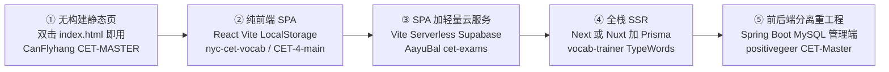
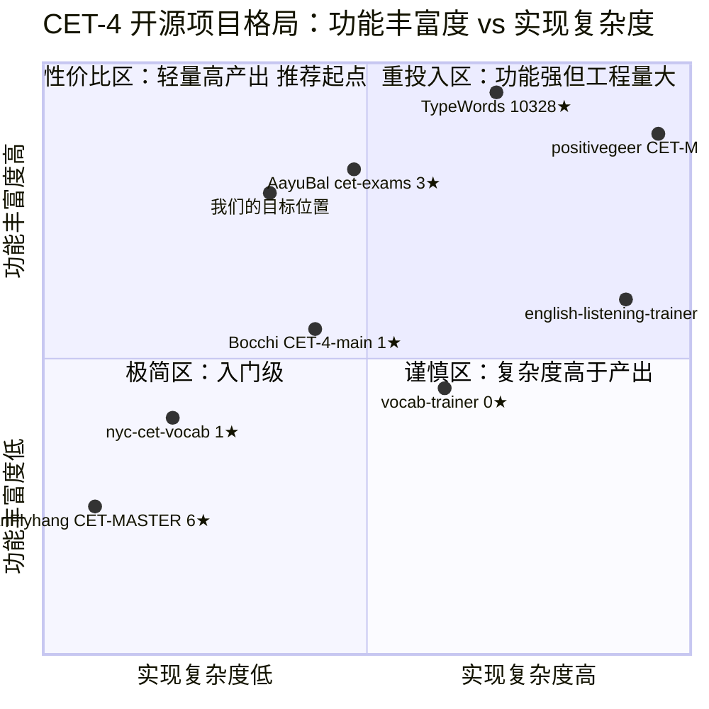
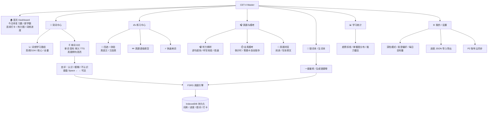

# 英语四级（CET-4）备考网站 — 竞品调研报告 & PRD

| 项目信息 | 内容 |
|---|---|
| 文档版本 | v1.0 |
| 调研/撰写日期 | 2026-09-30 |
| 撰写人 | 许清楚（产品经理） |
| 文档状态 | **待用户确认**，确认前不写任何业务代码 |
| 下一步 | Task #2 由架构师输出《实现方案》 |

---

## 0. 数据核实声明

本文档所有 **star 数、fork 数、License、创建/最后推送时间、仓库体积** 均取自 **GitHub REST API (`api.github.com/repos/*`) 真实返回**；所有**功能描述、技术栈、架构**均取自各仓库 **`README.md` 原始内容** 或 **`package.json` 真实依赖**。

> **核实结论与用户初步印象的偏差**：候选清单里除 TypeWords 外，绝大多数是**个位数 star 的个人练手/课程设计项目**，其中 **6 个仓库在首次提交后基本停更**。任何无法从 API 或 README 得到的信息，下文一律标注 **`未核实`**，未做任何推测性数字填充。

---

# 第一部分：竞品调研

## 1.1 速览总表（GitHub API 实测数据）

> 按 star 数降序。数据抓取时间 2026-09-30。

| # | 仓库 | Star | Fork | 主语言 | License（API 判定） | 创建时间 | 最后 push | 形态 |
|---|---|---:|---:|---|---|---|---|---|
| 1 | **zyronon/TypeWords** | **10,328** | 1,239 | Vue | GPL-3.0 | 2023-08-03 | 2026-09-29 | SSR 全栈 + 云同步 |
| 2 | YoYo-CheckNow/YoYo-CheckNow.github.io | 25 | 3 | JavaScript | 未识别 | 2022-11-08 | **2022-11-24** ⛔停更 | 静态页 |
| 3 | exam-data/CETVocabulary | 10 | 5 | JavaScript | NOASSERTION | 2025-07-25 | 2026-09-26 | **数据仓库**（非应用） |
| 4 | arthurlee116/english-listening-trainer | 9 | 0 | TypeScript | 未识别 | 2025-08-20 | 2026-05-21 | 全栈 SSR + AI |
| 5 | CanFlyhang/CET-MASTER | 6 | 0 | JavaScript | 未识别 | 2025-12-21 | **2025-12-21** ⛔单次提交 | 纯静态 HTML |
| 6 | AayuBal/cet-exams | 3 | 0 | JavaScript | 未识别 | 2026-03-30 | 2026-09-21 | SPA + Serverless |
| 7 | Barca0412/VocabMaster | 2 | 1 | Python | MIT | 2025-11-15 | **2025-11-15** ⛔单次提交 | **桌面应用** |
| 8 | nyc1013/nyc-cet-vocab | 1 | 0 | JavaScript | MIT | 2026-06-12 | 2026-08-16 | 纯前端 SPA |
| 9 | Bocchi-Hero/CET-4-main | 1 | 0 | TypeScript | 未识别 | 2025-12-18 | **2025-12-19** ⛔两天写完 | 纯前端 SPA |
| 10 | positivegeer-glitch/CET-Master | 0 | 0 | Java | 未识别 | 2026-04-02 | **2026-04-02** ⛔单次提交 | 前后端分离全栈 |
| 11 | mylinwu/vocab-trainer | 0 | 0 | TypeScript | MIT | 2026-04-30 | 2026-05-10 | 全栈 SSR |
| 12 | maemreyo/glean-readflow | 0 | 0 | TypeScript | 未识别 | 2026-01-09 | **2026-01-09** ⛔单次提交 | 全栈 SSR |

**一句话结论**：这个赛道**没有第二梯队**。TypeWords 以 10.3k star 形成绝对垄断，其余 11 个项目 star 总和仅 **57**。这既是坏消息（说明纯词汇工具已被充分满足），也是好消息（说明**差异化切入点没有对手占位**）。

---

## 1.2 逐项目深度分析

### ① TypeWords — 赛道唯一成熟产品

| 项 | 内容 |
|---|---|
| 定位 | 「**打字输入**」驱动的英语单词 + 文章练习工具（非认图选词） |
| 在线站 | https://typewords.cc |
| 核心功能 | 单词练习（跟读 / 听写 / 自测 / 默写 4 种模式）；智能模式（按记忆曲线自动计算学习词）+ 自由模式；**文章背诵**（内置经典教材，支持一键翻译、双语对照、句子级听写）；收藏 / 错词本 / 已掌握；自定义键盘音效与快捷键 |
| 架构形态 | **Nuxt 4 单体**（2026-08 由 Monorepo 重构为 Nuxt，历史曾含 `vscode-web` 子包，重构后是否保留 **未核实**） |
| 技术栈（`package.json` 实测） | Nuxt `^4.2.1` + Vue `^3.5.25` + Pinia `^3.0.3` + **UnoCSS** `^66.5.10` + `@nuxtjs/i18n` 10.2.1 + TypeScript `^5.9.3` + pnpm |
| **关键依赖** | **`ts-fsrs` `^5.2.3`（FSRS 间隔重复算法，已证实）**、**`@supabase/supabase-js` `^2.98.0`（云同步，已证实）**、`idb-keyval`（IndexedDB）、`compromise`（NLP）、`@rrweb/record`（**会话录制/回放**）、`mitt`、`dayjs`、`vxe-table` |
| 存储方案 | **本地 IndexedDB 优先 + 可选 Supabase 云同步** |
| 部署 | 静态生成 `pnpm generate`（Nuxt SSG）；仓库含 `Dockerfile`、`edgeone`（腾讯云 EdgeOne）、`ali-oss` |
| 词库 | 内置 CET-4/6、考研、GMAT、GRE、IELTS、SAT、TOEFL、专四、专八 |

**✅ 值得借鉴**
1. **交互差异化**：把「打字」做成核心动作，记忆留存远高于四选一；这是它从同类里杀出来的唯一原因。
2. **算法选型正确**：`ts-fsrs` 是成熟开源库，直接白嫖，不必手写 SM-2。
3. **i18n 极度完善**（14 种语言 README），说明结构上把文案抽离得很好。
4. **rrweb 会话录制**：Bug 复现神器，想法新颖（但也带来隐私与体积负担）。
5. 本地优先 + 可选云同步的**渐进式架构**，而不是一上来就逼用户注册。

**❌ 缺点 / 局限**
1. **GPL-3.0 传染性** ⚠️ —— **不能直接抄它的词库或代码到我们项目**，否则整个项目必须 GPL 开源。这是本次调研最重要的合规红线。
2. README 自述：「本项目可独立运行，数据保存在本地，**换设备需手动备份**」→ 说明云同步**并未真正成为默认体验**，只是可选。
3. 内容是**通用词库 + 通用教材文章**，**没有四级真题语境**，也没有四级听力与模考。
4. 「当前处于早期开发阶段」的自述与仓库 53 个 open issue，说明体验细节仍粗糙。
5. Vue/Nuxt 技术栈 —— 与团队默认的 React 栈不同，无法直接复用。

---

### ② positivegeer-glitch/CET-Master — 功能最全但完全停更

| 项 | 内容 |
|---|---|
| 定位 | 大学生四六级**在线学习与考试平台**（全栈） |
| 核心功能 | **学生端**：在线练习、全真模考（**倒计时 / 听力音频在线播放 / 答题卡自动保存**）、客观题自动批改 + 解析、**错题按错误频次自动生成「专项错题卷」**、雷达图 + 折线图能力成长曲线、备考笔记 **管理端**：题库管理（单选/多选/填空 + 批量导入）、从题库抽题组卷、**音频上传管理**、用户监控、**公告系统** |
| 架构形态 | **前后端分离全栈**（`backend/` + `frontend/` + `cet_platform.sql`） |
| 技术栈 | 后端 **Spring Boot 3.x + Java 17** + Spring Security + **JWT** + MySQL 8.0 + MyBatis-Plus + Lombok + HuTool + EasyExcel 前端 **Vue 3 Composition API** + Vite + Pinia + Element Plus + ECharts + 原生 HTML5 Audio |
| 部署 | 需 JDK 17 / MySQL 8.0 / Node 18+ / Maven 3.6+，手动 `mvn spring-boot:run` + `npm run dev` |

**✅ 值得借鉴**
1. **功能清单本身是最完整的一份四级备考需求字典** —— 管理端组卷、公告、错题专项卷等思路可直接抄。
2. **「错题按频次生成专项错题卷」** 是全清单里最有价值的单点创意：把错题从**列表**升级为**动作**。
3. **答题卡自动保存** —— 长时考试场景的必备容错设计。

**❌ 缺点 / 局限**
1. **0 star / 0 fork / 单次提交（2026-04-02 一天之内创建并推完）** —— 典型的**课程设计/毕设级产物**，代码未经验证。
2. **无 License** → 即使想借鉴也存在法律风险。
3. Java Spring Boot 全家桶对个人项目**工程量极大**，与快速迭代目标背道而驰。
4. 无 `在线演示地址`，数据库需本地 MySQL —— 用户根本无法体验。

---

### ③ AayuBal/cet-exams — 功能/复杂度性价比最高的参照

| 项 | 内容 |
|---|---|
| 定位 | 收录 **2019–2025 共 6 年** CET-4/CET-6 真题的在线练习平台 |
| 在线站 | https://cet-exams.vercel.app |
| 核心功能 | PDF 在线预览（缩放 + 阅读进度追踪）、**PDF 手写标注**（画笔/荧光笔/橡皮，6 色 3 粗细）、听力播放、在线答题、提交自动批改、**PDF 文本选中 → 联动加入生词本**（v1.1）、错题本（按试卷筛选 + 重做）、生词本、**SM-2 闪卡复习**、单词测验、**学习打卡 + 统计 Dashboard**、暗色模式、数据导入导出 |
| 架构形态 | **SPA + Vercel Serverless Functions**（仅访客统计走后端） |
| 技术栈 | React 19 + Vite 8 + Tailwind CSS 4 + React Router 7 + react-pdf/pdfjs-dist |
| 存储方案 | **全量 LocalStorage**（答题进度、错题、生词、标注）；访客计数用 Supabase；**大资源（PDF/MP3）放阿里云 OSS**，通过 `VITE_ASSET_BASE` 环境变量切换 |
| 仓库体积 | **约 1.4 GB**（资源已迁移至 OSS，代码本身不大） |

**✅ 值得借鉴**
1. **PDF 选中文本 → 联动生词本**：这是全清单里唯一真正做到「**真题语境 ↔ 单词本**」打通的实现，是我们最该抄的一点。
2. **重型资源外置 OSS + 环境变量切换 CDN**：解决了「真题 PDF 和音频塞进仓库会撑爆 Git」这个必踩的坑。
3. 「飞机稿 But honest」：**只用 LocalStorage 就把 12 项功能做出来了**，证明了 MVP 阶段不需要后端。
4. 阅读进度百分比 + 跨页面恢复，体验细节到位。

**❌ 缺点 / 局限**
1. **3 star，无人知晓**。
2. **无 License**。
3. **LocalStorage 存 17000 词 + 标注 + 答题记录 → 5MB 上限必爆**，是没有 IndexedDB 的直接后果，属于**架构级隐患**。
4. 换设备即失联，无账号。
5. 依赖阿里云 OSS + Supabase 两个外部服务，自部署门槛高。

---

### ④ CanFlyhang/CET-MASTER — 极致极简派代表

| 项 | 内容 |
|---|---|
| 定位 | 「Pure Focus. Ultimate Mastery.」极简主义四六级背词工具 |
| 在线站 | http://cet.zygcsxy.com/ |
| 核心功能 | 首页今日进度总览、**闪卡背词**（基于艾宾浩斯遗忘曲线的简易实现）、**测验**（英选汉/汉选英/混合）、收藏夹（可导出 txt）、最近 7 天学习趋势图、深色模式、字体调节、数据重置 |
| 架构形态 | **纯静态 HTML5，无框架无构建** —— 双击 `index.html` 即用，不需要 Node |
| 技术栈 | 原生 ES6 JavaScript + **Tailwind CSS CDN** + **Chart.js CDN** |
| 存储 | 全量 LocalStorage（`js/wordLib.js` 内置词库） |
| 键盘流 | `Space` 翻卡 / `←` 模糊 / `→` 掌握 / `↓` 收藏 —— **单手流，肌肉记忆友好** |

**✅ 值得借鉴**
1. **零门槛分发**：无需 npm install、无构建步骤，`index.html` 双击即开，这是最低获客摩擦的形态。
2. **纯键盘四键闭环**（翻/模糊/掌握/收藏）——背词是高频重复动作，键盘流体验远优于鼠标点击，建议直接采用。
3. 隐私优先（数据完全本地化）作为**卖点而非缺省**，文案包装得好。
4. 词库独立在 `js/wordLib.js`，方便社区贡献。

**❌ 缺点 / 局限**
1. **6 star，创建当天（2025-12-21）推完即不再更新**。
2. GitHub API 判定**无 License**（README 里有 MIT 徽章但仓库无 LICENSE 文件）→ 存在授权瑕疵。
3. 词库体积与质量**未核实**，从 `js/wordLib.js` 单文件看，大概率**只有词义没有例句/音标**。
4. 「艾宾浩斯遗忘曲线简易实现」= **固定间隔，非真正的 SM-2/FSRS**，复习调度科学性不足。
5. 收藏夹只能导出 txt，**无法换设备同步**。

---

### ⑤ nyc1013/nyc-cet-vocab — 与本项目形态最接近

| 项 | 内容 |
|---|---|
| 定位 | NYC乐园 · 四六级词汇闯关，**免费无广告** React 单页应用 |
| 在线站 | GitHub Pages: https://nyc1013.github.io/nyc-cet-vocab/ |
| 词库规模 | **17,106 词**（四级核心 2,252 / 四级全量 7,508 / 六级核心 1,695 / 六级全量 5,651），经 `scripts/prepare_data.py` 清洗 |
| 核心功能 | 🃏 **3D 翻转闪卡**（先回忆再翻面验证）；📝 **测验模式**（四选一）；⚡ **快速刷词**（点按即显示释义，适合首轮扫词）；📕 错题本（自动收录 + 一键清除）；⌨️ 键盘快捷键（`1/2/3/4` 选答案、`Space` 翻卡）；📊 实时进度统计；📱 响应式 + 移动端触屏 |
| 架构形态 | **纯前端 SPA** |
| 技术栈 | React 18 + Vite 5 + Tailwind CSS 3 + react-router-dom + **React Context** 状态管理 + localStorage 持久化 |
| 部署 | GitHub Actions 推 `main` 自动构建部署 GitHub Pages + MIT License |

**✅ 值得借鉴**
1. **「核心词 vs 全量词」双层词库分级**（四级核心 2,252 / 全量 7,508）——这是非常正确的产品直觉：**绝大多数用户永远背不到全量**，必须给一条核心捷径。
2. **「快速刷词」模式**区别于闪卡：定位首轮建立印象，模式不是越多越好而是**要对应不同学习阶段**。
3. 三种模式 + 错题本的**最小完整闭环**，是 MVP 的合格定义。
4. **`prepare_data.py` 词库清洗脚本**独立出来 —— 数据工程与前端解耦，值得借鉴。
5. MIT License，无借鉴风险。

**❌ 缺点 / 局限**
1. **1 star / 0 fork，创建于 2026-06-12**，几乎零用户、零验证。
2. **完全没有间隔重复算法** —— 没有 SM-2 也没有 FSRS，错题本只是静态列表，这是最大硬伤。
3. **17000 词 + 学习记录塞 localStorage**，同样有容量隐患（架构共产缺陷）。
4. 无音标、无发音音频、无例句 —— **只有单词和中文释义**，记忆效率存疑。
5. 无真题、无听力、无模考。

---

### ⑥ Bocchi-Hero/CET-4-main — 「真题语境」概念的提出者（但未做成）

| 项 | 内容 |
|---|---|
| 定位 | 「拒绝死记硬背，**在真题语境中掌握核心词汇**」 |
| 核心功能 | **SM-2 记忆曲线**；每个核心词配 **CET-4 真题例句**；实战测试（**语境填空**还原真题挖空 + 释义挑战）；**OCR 拍照识词**（Tesseract.js）加入生词本；**热力图**学习统计；（可选）**DeepSeek AI** 提供词源分析/助记故事/同根词 |
| 架构形态 | 纯前端 SPA，**Capacitor 可打包 Android** |
| 技术栈 | React 19 + TypeScript + Vite + Tailwind CSS + **IndexedDB**（本地 + 离线可用） |
| 规模示意 | 仓库体积仅 334 KB —— **创建到停更 2 天（2025-12-18 → 12-19）**，实际完成度有限 |

**✅ 值得借鉴**
1. **产品理念与我们的差异化方向完全一致**：真题语境 > 孤立词义。README 里那句「背了忘，忘了背，到了考场还是看不懂」是精准的用户痛点洞察。
2. **「语境填空」还原真题挖空模式** —— 比四选一更贴近真实考试，是很好的题型设计。
3. **用 IndexedDB 而非 LocalStorage** —— 存储选型正确（对比 ⑤ 的缺陷）。
4. **热力图**（GitHub 贡献图式）—— 打卡激励的可视化范式，视觉效果好且易实现。

**❌ 缺点 / 局限**
1. **1 star / 334 KB / 两天完成** —— 概念 > 实现，**真题例句的真实数据量与覆盖率高度存疑（未核实）**。
2. **无 License**。
3. OCR（Tesseract.js 模型数十 MB）+ Capacitor Android + AI 是典型的**「技术噱头三件套」**，与个人项目的维护能力严重不匹配。
4. 无音频发音、无听力、无模考。

---

### ⑦ mylinwu/vocab-trainer — 全栈工程范本文档写得最好

| 项 | 内容 |
|---|---|
| 定位 | 专注、无干扰的词汇记忆工具，**SM-2 间隔重复** |
| 在线站 | https://vocab-trainer-chi.vercel.app |
| 核心功能 | 多词库（内置 CET4、人教/外研社教材，支持 CSV/TXT 导入）；**有道 TTS 英音/美音切换**；选词 → 学习 → 复习三阶段闭环；Dashboard（进度/掌握分布/词库完成度）；**多用户隔离**；深浅色主题 |
| 架构形态 | 全栈 SSR（Next.js App Router） |
| 技术栈 | **Next.js 16 App Router** + React 19 + **SQLite + Prisma ORM** + **NextAuth 5 (JWT)** + Zustand + SWR + CSS Modules + Zod + Vitest |
| 存储 | 服务端 SQLite；数据模型 `User` / `UserBank` / `UserWordProgress`（含 SM-2 字段）/ `SessionEvent` 事件日志 |
| 端口/部署 | 本地 4010 端口，Vercel 在线；MIT License |

**✅ 值得借鉴**
1. **数据模型设计是全部竞品里最专业的**：`UserWordProgress` 显式包含 `interval` / `easeFactor` / `nextReviewDate`，`SessionEvent` 做事件留痕 —— **这套 schema 可直接作为我们 P2 阶段加服务端时的参考**。
2. **`lib/sm2.ts` + `sm2.test.ts` 单元测试** —— 算法必须有测试，这是唯一一个做到了的项目。
3. **SM-2 操作到质量分 q 的显式映射**（未查详情+记住=4 / 查详情+记住=3 / 没记住=0）—— **「偷看详情要扣分」**这个设计非常聪明，杜绝自欺欺人。
4. **有道词典免费 TTS 接口**（type=1 英音 / type=2 美音）—— **零成本发音方案**，必须在 P0 采用。
5. 内置 **Vitest** 测试链路（`pnpm test`）。

**❌ 缺点 / 局限**
1. **0 star / 0 fork**，无用户。
2. **SQLite + Prisma + NextAuth 三件套对一个四级背词站是过度工程**，且 SQLite 在 Vercel Serverless 上是**反模式**（无状态实例，文件库会丢）—— 这是它的致命架构缺陷，也印证了「不要为了工程美感选后端」。
3. 无真题、无听力、无模考，纯词汇。
4. TTS 依赖有道非公开接口，**长期可用性风险高**。

---

### ⑧ 补充：exam-data/CETVocabulary — 最有价值的**数据源**（不是应用）

| 项 | 内容 |
|---|---|
| 定位 | 四六级词汇**词频排序**数据仓库 |
| 数据方法 | 基于《全国大学英语四、六级考试大纲（2016 修订版）》**5,278 词**，统计自**约 200 套**四六级/考研/专四专八**试卷文本**的真实出现频次排序（使用词形还原策略） |
| **关键发现** | **前 2,104 个单词出现 40 次以上（平均每做 5 套试卷就能遇到一次）＝ 真正的高频词** |
| 数据格式 | `cet_full_list.json` / `cet_full_list.sql` / Release 提供 PDF |
| 字段 | `序号`、`词频`、`六级`（标识）、`单词`、`释义`、`其他拼写`、`分类`、`子分类` |
| License | **数据 CC BY-NC-SA 4.0；<｜hy_place▁holder▁no▁813｜>程序 MIT** |

> ⚠️ **合规红线 2**：CC BY-NC-SA 4.0 = **禁止商用 + 相同方式共享**。若本项目未来有任何商业化可能，**不能直接采用此词频数据**，需二次清洗/重排序或换源。若仅自用/学习则可放心使用（这是本次调研发现的**最大金矿**）。

---

### ⑨ 补充：其余三个（简要）

| 项目 | 结论 |
|---|---|
| **arthurlee116/english-listening-trainer** (9★) | Next.js 16 + Postgres(Neon) + Prisma 7 + Cerebras 生成文本 + **Together `hexgrad/Kokoro-82M` TTS** + Vercel Blob 存音频 + GitHub Actions 触发定时刷新。做得最"现代"，但**泛英语听力非四级**、依赖 5 个付费 API Key，自部署极难。**Kokoro-82M 是免费的开源 TTS，可作为四级听力合成的备选**。README 自述「自评分映射**不是**标准化考试」，诚实但说明**分数参考价值有限**。 |
| **YoYo-CheckNow** (25★) | 极简单页真题对答案，PDF + MP3 直接塞仓库。**最后 push 停在 2022-11-24，已停更约 4 年**。反面教材：资源入库 → 仓库膨胀 → 无法维护。 |
| **maemreyo/glean-readflow** (0★) | Next.js 14 + Supabase + Tailwind + shadcn/ui 的 teleprompter 阅读训练 + 社区。**单次提交即弃坑**，仅可作为「阅读模块」的形态参考，无实际参考价值。 |

---

## 1.3 横向对比总表

| 维度 | ① TypeWords | ② CET-Master(Java) | ③ cet-exams | ④ CET-MASTER(简) | ⑤ nyc-cet-vocab | ⑥ CET-4-main | ⑦ vocab-trainer |
|---|:--:|:--:|:--:|:--:|:--:|:--:|:--:|
| Star | **10,328** | 0 | 3 | 6 | 1 | 1 | 0 |
| 最后更新 | ✅ 活跃 | ⛔ 停更 | ✅ 活跃 | ⛔ 停更 | ⚠️ 低频 | ⛔ 停更 | ⚠️ 停更 |
| **License 安全** | ⚠️ **GPL-3.0** | ❌ 无 | ❌ 无 | ⚠️ 徽章/无文件 | ✅ MIT | ❌ 无 | ✅ MIT |
| 形态 | SSR 全栈 | 前后端分离 | SPA+Serverless | 纯静态 | SPA | SPA | SSR 全栈 |
| 前端框架 | Nuxt 4 / Vue 3 | Vue 3 | React 19 | 原生 JS | React 18 | React 19 | Next 16 / React 19 |
| 存储 | IndexedDB + Supabase | MySQL | LocalStorage | LocalStorage | LocalStorage | **IndexedDB** | SQLite + Prisma |
| 需注册账号 | 否（可选同步） | 是 | 否 | 否 | 否 | 否 | **是（NextAuth）** |
| **间隔重复算法** | ✅ **FSRS** | ❌ 无 | ✅ SM-2 | ❌ 简易遗忘曲线 | ❌ **无** | ✅ SM-2 | ✅ **SM-2** |
| 📖 真题试卷 | ❌ | ✅ | ✅ | ❌ | ❌ | ⚠️ 仅例句 | ❌ |
| 🎧 听力训练 | ❌ | ✅ | ✅ 播放 | ❌ | ❌ | ❌ | ❌ |
| ⏱️ 全真模考 | ❌ | ✅ | ❌ | ❌ | ❌ | ❌ | ❌ |
| 🔤 发音 TTS | ✅ | ❌ 未核实 | ❌ 未核实 | ❌ | ❌ | ❌ | ✅ 有道 TTS |
| 📝 写作/翻译 | ❌ | ❌ | ✅ 参考译文 | ❌ | ❌ | ❌ | ❌ |
| 🤖 AI 功能 | ❌ | ❌ | ❌ | ❌ | ❌ | ✅ DeepSeek | ❌ |
| 📊 统计可视化 | ✅ | ✅ 雷达图 | ✅ Dashboard | ✅ 7 日折线 | ⚠️ 简易计数 | ✅ 热力图 | ✅ 仪表盘 |
| 🌐 响应式/暗色 | ✅ | ✅ Element Plus | ✅ | ✅ | ✅ | ✅ | ✅ |
| 🔑 部署难度 | 中 | **极高** | 低 | **极低** | 极低 | 低 | 中高 |

### 图例
- ✅ 有且较完善　⚠️ 有但薄弱/存疑　❌ 无　⛔ 已停更

---

## 1.4 归类分析

### 1.4.1 形态光谱：轻量静态 ↔ 全栈重工程

**趋势判断**：
- **② ③ 区间是开源四级项目的密集区**（5/7 落在此处），因为门槛低、可白嫖 GitHub Pages / Vercel。
- **⑤ 区间是毕业设计重灾区**：功能清单华丽（管理端/公告/组卷），但无一例外**单次提交后停更**。
- **① TypeWords 成功的关键不是形态重，而是交互创新**（打字）。形态可以轻，核心价值必须重。

### 1.4.2 象限图：功能丰富度 vs 实现复杂度

**读图结论**：
- **左上「性价比区」几乎空白** —— 只有 star 3 和 1 的两个项目。**这是我们的机会窗口**。
- 「我们的目标位置」（复杂度 0.35、丰富度 0.78）= **纯前端 SPA + IndexedDB + 外部名词频数据源**，靠**数据质量**而非工程量取胜。
- TypeWords 在右上不可硬碰；但在左上做一个**四级垂直化**的产品，它没有还手之力（它是通用工具，不会为四级做真题语境和词频排序）。

### 1.4.3 共性必备功能（7 个竞品的交集）

抽取出「没有则不算四级学习站」的最小集合：

| # | 必备功能 | 覆盖度 | 说明 |
|---|---|---:|---|
| 1 | **背词主循环**（展示词 → 自评 → 下一词） | 7/7 | 唯一不可省的核心 |
| 2 | **间隔重复算法**（SM-2 或 FSRS） | 3/7 ⚠️ | 一半以上缺失，是普遍的「伪科学」痛点 |
| 3 | **测验 / 选择题模式** | 5/7 | 四选一最常见 |
| 4 | **错题本 / 生词本** | 6/7 | 但多为死列表 |
| 5 | **学习统计**（趋势图 / Dashboard） | 6/7 | Chart.js / ECharts / 热力图三种范式 |
| 6 | **深色模式 + 响应式** | 7/7 | 已成为默认礼貌，无差异化价值 |
| 7 | **键盘快捷键** | 4/7 | 高频重复场景下体验加分项 |

### 1.4.4 常见坑（务必规避）

| # | 坑 | 已踩的项目 | 规避方式 |
|---|---|---|---|
| 1 | **数据换设备即丢失** | ①②③④⑤⑥ 全部 | 本地 IndexedDB + **P1 阶段再引入可选云同步**；或至少支持 JSON 导入导出 |
| 2 | **LocalStorage 5MB 上限**被 17000 词撑爆 | ⑤ nyc-cet-vocab、③ cet-exams | 词库存 IndexedDB 或分册懒加载，**不要一次性全量载入内存** |
| 3 | **单次提交后永久停更** | ②④⑥⑨⑩⑪⑫ **共 6 个** | 先交付可用的 MVP，拒绝「功能大而全但跑不起来」 |
| 4 | **重型资源（PDF/MP3）入 Git** 导致仓库 1.4 GB／无法 clone | ③ cet-exams(1.4GB)、YoYo-CheckNow | 资源一律托管 OSS/OSS-like CDN + 环境变量切换 |
| 5 | **伪间隔重复**（只做固定间隔，敢标艾宾浩斯） | ④ CET-MASTER | 直接上 `ts-fsrs`（MIT/AGPL? 需核实）或自实现 SM-2，**并写单元测试** |
| 6 | **技术噱头堆叠** OCR + Capacitor + AI，与单人维护能力不匹配 | ⑥ CET-4-main | 每个技术上都必须回答「它服务于哪条用户故事」，否则砍掉 |
| 7 | ⚠️ **License 合规**：GPL-3.0 传染 / CC BY-NC-SA 禁商用 / 仓库无 License | ①②③④⑥⑨⑩⑪⑫ | **见下方红线清单** |
| 8 | **非标准化评分误导用户** | english-listening-trainer 自述 | 明确区分「自评」与「标准分」，或干脆不给出总分 |

#### 🔴 合规红线清单（必须让架构师和用户同时知晓）

| 源 | License | 能否借鉴 |
|---|---|---|
| TypeWords 代码/词库 | **GPL-3.0** | ❌ **具有强传染性，禁止复制代码或词库**；只能借鉴**产品思路** |
| exam-data/CETVocabulary 数据 | **CC BY-NC-SA 4.0** | ⚠️ 非商用可行；**若未来商业化必须换源或重新生成词频** |
| CanFlyhang/CET-MASTER | 无 LICENSE 文件（仅徽章） | ⚠️ 谨慎，README 有 MIT 徽章可争取，但 API 未识别 |
| ②③⑥⑨⑩⑪⑫ | **完全无 License** | ❌ 默认「保留所有权利」，**不可复制代码** |
| ⑤ nyc-cet-vocab、⑦ vocab-trainer | **MIT** | ✅ 可安全借鉴（含数据模型设计） |
| `ts-fsrs` / SM-2 算法库 | 需在使用前核实 | 使用前务必二次确认 |

### 1.4.5 市场空白与差异化机会

> 核心矛盾：**TypeWords 是「通用英语单词工具」，不是「四级提分工具」**。用户要的是 425 分，不是词汇量。

| # | 机会点 | 现状 | 我们的打法 |
|---|---|---|---|
| 🥇 **1** | **词频驱动的备考顺序** | exam-data 已证明「**前 2104 词 ≈ 每 5 套卷必现**」，但**没有任何一个 App 用它当默认学习路径**（全部按字母/随机/大纲顺序） | **默认学习路径 = 按真卷词频降序**。让用户第一周就背完覆盖率最高的词，把 ROI 摆在台面上 |
| 🥈 **2** | **真题语境 ↔ 单词双向打通** | 仅 ⑥ CET-4-main 提出理念（2 天写完，未落地）、③ cet-exams 做了半截（PDF 选词 → 生词本单向） | 单词详情页显示**真题原句 + 出处年份/题型**；句子中的目标词高亮；**支持从句子反查回真题**。做到**双向**才算打通 |
| 🥉 **3** | **听力精听**（逐句听写/听抄） | 听力是四级第一大分值，但开源侧几乎空白：仅 ② 做了「播放」，且该题已停更 | 「音频播放 + 句子级原文遮挡 + 逐句填空校验」的精听模式，比单纯"放音频 + 做题"有效得多 |
| 4 | **错题闭环** | 所有错题本都是静态列表；只有 ② 提出「按错误频次生成专项错题卷」但该 fork 数为 0 | **错题自动进 FSRS 复习队列**，并可一键生成「错题重练卷」 |
| 5 | **轻量化全真模考** | 只有 ② 做了（Java 全家桶，跑不起来） | 用前端 LocalStorage/IndexedDB 实现**倒计时 + 答题卡自动保存 + 断点续考**，零后端成本 |
| 6 | **有道免费 TTS** | 仅 ⑦ 用了，其余有 5 个项目**完全没发音** | P0 直接接入有道 TTS（type=1 英音 / type=2 美音），零成本补全单词 + 例句发音 |

**一句话差异化定位**：
> 别人做的是「英语单词本 + 四级词库」，我们做的是「**按真卷词频排序、每个词都在真题里出现过的四级提分工具**」。

---

# 第二部分：简单 PRD

## 2.1 项目信息

| 项 | 内容 |
|---|---|
| Language | 简体中文 |
| Programming Language | 建议 **Vite + React + TypeScript + Tailwind CSS**（待架构师在 Task #2 最终确认；团队默认模板含 MUI，可与 Tailwind 二选一） |
| Project Name | `cet4_master`（待定） |
| 原始需求复述 | 做一个面向**大学英语四级（CET-4）备考**的英语学习网站；**先不写代码**，先调研 GitHub 同类开源项目（功能 / 架构 / 技术栈 / 优缺点），产出**实现方案**，待用户确认后再动手 |
| 建议技术栈关键选型 | 状态管理 Zustand；**存储 IndexedDB**（via `idb-keyval`，非 LocalStorage）；**间隔重复 `ts-fsrs`**（使用前核实 License）；路由 React Router；图表 ECharts 或 Recharts |

## 2.2 产品定义

### 一句话目标
> 做一个**按四级真卷词频排序、每个单词都带真题语境例句**的 CET-4 备考 Web 应用，纯前端打开即用，帮用户在最短时间内把精力投放于考场出现率最高的词。

### 三条关键目标

| # | 目标 | 衡量指标 |
|---|---|---|
| G1 | **提分效率** —— 学习顺序严格按真卷词频降序 | 用户 7 日内完成的词中，高频词（Top 2104）占比 ≥ 80% |
| G2 | **语境记忆** —— 每个词至少 1 条真题原句，支持单词 ↔ 真题双向跳转 | 词库覆盖率：有真题例句的词 ≥ 90% |
| G3 | **零门槛** —— 免注册，30 秒内完成首次背词 | 首屏到第一次背词交互 ≤ 3 次点击，首屏加载 ≤ 3s |

### 非目标（本期明确不做）
- ❌ 不做通用英语词库（雅思/托福/GRE）—— 只做 CET-4
- ❌ 不做 OCR、移动端原生打包（Capacitor）
- ❌ 不做社区 / 社交 / 排行榜
- ❌ 不做管理后台

## 2.3 目标用户与核心场景

| 用户角色 | 描述 | 核心诉求 |
|---|---|---|
| **首次备考的大二学生** | 距考试 1–3 个月，词汇量薄弱，不知从哪开始 | 有人告诉我**先背哪些词**，别让我看着 7508 词发呆 |
| **刷分 / 二战考生** | 考过未过，差在听力和阅读 | 定位我的**薄弱项**，别让我重背已会的词 |
| **碎片时间学习者** | 通勤/课间 5–15 分钟 | **手机上一只手**就能刷，且**换设备不丢进度** |

**核心场景**：距四级考试 30 天，每天通勤 20 分钟。打开网站 → 首页显示「今天该复习 12 个已学词 + 新学 20 个高频词」→ 手机竖屏单手背完 → 自动记录，明天继续。

## 2.4 用户故事

| # | 用户故事 |
|---|---|
| US-1 | 作为一个**首次备考的学生**，我想要**打开网站无需注册就能背词**，以便我在 30 秒内开始学习而不用先注册账号 |
| US-2 | 作为一个**不知道从哪开始的学生**，我想要**按真卷出现频次从高到低背词**，以便我把有限时间花在考场最可能遇到的词上 |
| US-3 | 作为一个**背了就忘的学生**，我想要**系统按遗忘曲线自动安排复习**，以便我不需要自己记何时该复习 |
| US-4 | 作为一个**看不懂例句的学生**，我想要**看到单词在历年真题原文中的真实用法**，以便我理解它在考试中怎么用而非死记中文释义 |
| US-5 | 作为一个**发音不准的学生**，我想要**点击即听到单词和例句的美音/英音朗读**，以便我同步建立听觉记忆 |
| US-6 | 作为一个**通勤刷词的学生**，我想要**手机单手完成「认识/不认识」的全部操作**，以便我在地铁上一只手扶着也能刷 |
| US-7 | 作为一个**二战考生**，我想要**把已经掌握的词彻底排除**，以便我不浪费时间在已会的词上 |
| US-8 | 作为一个**换了手机的学生**，我想要**导出/导入我的学习进度**，以便我的百日打卡记录不会清零 |

## 2.5 需求池

> 优先级：**P0 = 必须有**（无则不成 MVP）／**P1 = 应该有**／**P2 = 可以有**

### P0（MVP 必需）

| # | 需求名 | 说明 | 优先级 | 参考来源 |
|---|---|---|---|---|
| R01 | **按词频排序的学习路径** | 默认学习队列严格按真卷出场频次降序；提供「高频 2104 / 四级核心 / 全量」三档切换 | P0 | exam-data 词频数据 + nyc-cet-vocab 的「核心/全量分级」思路 |
| R02 | **单词卡片主循环** | 展示单词 + 音标 + 释义 + 真题例句；支持「认识 / 模糊 / 不认识」三级自评 | P0 | 全部 7 个竞品的交集功能 |
| R03 | **FSRS 间隔重复算法** | 用 `ts-fsrs` 或自实现；必须先写单元测试再上线 | P0 | TypeWords 的 `ts-fsrs` ^5.2.3 选型；缺失 ④⑤⑥ 的教训 |
| R04 | **键盘优先操作** | 单手/键盘完成翻卡与评级（参考 `Space` 翻卡、`←` 模糊、`→` 掌握） | P0 | CanFlyhang CET-MASTER 的四键闭环 |
| R05 | **有道 TTS 发音** | 单词 + 例句可朗读，支持英音(type=1)/美音(type=2)切换 | P0 | mylinwu/vocab-trainer 的 `lib/tts.ts` 方案 |
| R06 | **真题语境例句** | 单词详情页显示「真题原句 + 出处」；目标词在句中高亮 | P0 | Bocchi-Hero/CET-4-main 的核心理念（它没做成） |
| R07 | **错词本 / 已掌握** | 不认识自动入错词本；手动标记已掌握后移出队列 | P0 | TypeWords 的「收藏/错词/已掌握」三态 |
| R08 | **免注册 + 本地存储** | 无需登录；**IndexedDB** 持久化（明确不用 LocalStorage 存词库） | P0 | TypeWords 的本地优先 + AayuBal 反面教训（撑爆 5MB） |
| R09 | **响应式 + 深色模式** | 移动端单手可达布局，深浅色切换 | P0 | 7/7 竞品共有，已成基线期待 |
| R10 | **学习统计基础版** | 今日进度、连续打卡天数、累计学习词数、掌握度分布 | P0 | CET-MASTER 的 7 日折线 / VocabMaster 的掌握分布 |
| R11 | **词库数据管线** | 独立的词库清洗脚本（类似 `prepare_data.py`），产出结构化 JSON，与前端解耦 | P0 | nyc-cet-vocab 的 `scripts/prepare_data.py` |

### P1（应该做）

| # | 需求名 | 说明 | 优先级 | 参考来源 |
|---|---|---|---|---|
| R12 | **测验模式** | 四选一（英选汉 / 汉选英）；错题自动回写错词本 | P1 | nyc-cet-vocab 测验模式、CET-MASTER 混合测验 |
| R13 | **快速刷词模式** | 点按即出释义，用于首轮快速建立印象 | P1 | nyc-cet-vocab 的「快速刷词」模式定位 |
| R14 | **听力精听（逐句听写）** | 音频播放 + 原文句子遮挡 + 逐句填空校验；支持倍速 | P1 | positivegeer CET-Master 的听力播放 + 市场空白机会 #3 |
| R15 | **错词自动进入复习队列** | 错词本不是死列表，而是接入 FSRS 的活跃复习源 | P1 | 所有竞品错题本的通病；② 的「专项错题卷」思路 |
| R16 | **真题语境填空** | 还原真题挖空的填空题题型 | P1 | Bocchi-Hero/CET-4-main 的「语境填空」题型设计 |
| R17 | **数据导入导出** | JSON 一键导出/导入全部学习进度 | P1 | CET-MASTER 的收藏夹导出 txt（升级版） |
| R18 | **轻量全真模考** | 倒计时 + 答题卡自动保存 + 断点续考 + 交卷自动批改 | P1 | positivegeer CET-Master 的模考/答题卡（本则为纯前端实现） |
| R19 | **热力图打卡** | GitHub 贡献图式年度学习日历热力图 | P1 | Bocchi-Hero/CET-4-main 热力图 |
| R20 | **「偷看详情扣分」机制** | 查过词典详情再答对，质量分降级（q=3）；未查直接答对 q=4 | P1 | mylinwu/vocab-trainer 的 SM-2 质量映射表 |

### P2（锦上添花）

| # | 需求名 | 说明 | 优先级 | 参考来源 |
|---|---|---|---|---|
| R21 | **账号 + 云端同步** | 可选注册，跨设备同步进度（Supabase 或类似 BaaS） | P2 | TypeWords 的 Supabase 可选同步模式 |
| R22 | **文章背诵（真题阅读原文）** | 整篇真题阅读素材，跟读 + 听写句子级输入 | P2 | TypeWords 的文章背诵（改为四级真题素材） |
| R23 | **AI 词源 / 助记生成** | LLM 生成助记故事、同根词拓展 | P2 | Bocchi-Hero 的 DeepSeek 集成；VocabMaster 的 LLM 例句 |
| R24 | **单词 ↔ 真题双向跳转** | 从单词跳到出处真题；从真题 PDF 选中词加入生词本 | P2 | AayuBal cet-exams 的「PDF 文本选择联动生词本」+ 我们的双向增强 |
| R25 | **写译模板库** | 作文模板 / 翻译常用句式 | P2 | AayuBal cet-exams 的写作范文与翻译参考译文 |
| R26 | **能力雷达图** | 听/读/写/译分项能力雷达图 | P2 | positivegeer CET-Master 的雷达图 |

## 2.6 核心页面 / 模块结构

### 页面清单

| 路由 | 页面 | 优先级 | 说明 |
|---|---|---|---|
| `/` | 首页 Dashboard | P0 | 「今天该做什么」的唯一入口，弱化导航感 |
| `/learn` | 背词主循环 | P0 | 全站最高频页面，键盘流转、离线可用 |
| `/word/:id` | 单词详情 | P0 | 真题例句 + 词根 + 发音，可悬浮/抽屉避免打断循环 |
| `/review` | 复习队列 | P0 | FSRS 到期词专项列表 |
| `/wrong` | 错词本 | P0 | 支持直接开练 |
| `/stats` | 学习统计 | P0 | 折线 + 掌握分布 + 打卡热力图 |
| `/practice/*` | 测验 / 填空 / 刷词 | P1 | 三个二级模式 |
| `/listening` | 听力精听 | P1 | 句子级精听界面 |
| `/mock` | 全真模考 | P1 | 倒计时 + 答题卡 |
| `/papers` | 真题浏览 | P2 | PDF/文本，资源走 CDN |
| `/settings` | 设置 | P1 | 主题 / 口音 / 每日量 / 导入导出 |

## 2.7 待确认问题清单

> ⚠️ 以下问题需要用户拍板后才能进入 Task #2（架构设计）。每个问题均给出**产品侧推荐**，供参考。

| # | 待确认问题 | 选项 | 产品侧推荐 | 影响面 |
|---|---|---|---|---|
| **Q1** | **是否需要账号体系与云端同步？** | A. 纯本地免注册（P0 即可交付） B. 本地优先 + **可选**云同步（TypeWords 模式） C. 强制注册后才能用 | **B**（先做 A，P2 阶段加 B） | 决定是否需要后端；B 方案可让 MVP 完全无后端 |
| **Q2** | **是否需要真题题库（试卷 PDF + 答案）？** | A. 不需要，只做词汇 + 例句 B. 只要**真题例句文本**（轻量） C. 完整试卷 PDF + 在线答题 | **B**（MVP 用文本例句即可吃到差异化的大部分红利，且规避资源与合规风险） | 决定 CDN/OSS 投入与仓库体积；C 会使工程量翻倍且涉及版权 |
| **Q3** | **是否需要听力音频？如何获得？** | A. 不需要 B. 仅 TTS 合成句子读音（零成本） C. 真题真实听力 MP3 D. 两者都要 | **B 先上，C 视资源可用性再定** | C 需要音频版权与 CDN 托管（YoYo-CheckNow 是把 MP3 塞仓库的典型反面教材） |
| **Q4** | **是否接入 AI 功能？** | A. 完全不接 B. 仅 AI 生成助记/例句（可选开关） C. AI 深度融入（真题解析、作文批改） | **A**（MVP 阶段 AI 是成本与不确定性来源，且 none 竞品靠 AI 成功） | 决定是否有 API Key 管理与费用；建议降至 P2 |
| **Q5** | **部署方式偏好？** | A. **纯静态托管**（GitHub Pages / Vercel 静态） B. Vercel + Serverless 函数 C. 自建服务器 | **A** | 与 Q1 联动：选 A 则 Q1 必须选 A 或 B（延迟同步） |
| **Q6** | **技术栈是否采用团队默认模板？** | A. Vite + React + TypeScript + Tailwind CSS B. Vite + React + TypeScript + **MUI**（团队默认） C. 由架构师在 Task #2 另行建议 | **A**（Tailwind 更适合做移动端单手背词的精细布局；若用户偏好 MUI 也可） | 影响 UI 开发效率与视觉风格 |
| **Q7** | **词库数据源选择？**（合规相关） | A. `exam-data/CETVocabulary` 词频数据（**CC BY-NC-SA，禁商用**） B. 自行从公开词表重建词频 C. 其他 MIT 源 | **取决于是否可能商业化**：纯自用/学习选 **A**（质量最高）；有任何商业化计划必须选 **B** | ⚠️ 合规红线，需用户明确 |
| **Q8** | **目标考试范围？** | A. 只做 CET-4 B. CET-4 + CET-6 C. CET-4/6 + 考研 | **A**（做深做透一个再做下一个；6 级可后续加同样的管线） | 决定词库与内容生产规模 |
| **Q9** | **是否需要 SMS/Mobile 原生 App？** | A. 只做响应式 Web B. PWA（可安装到桌面/主屏） C. Capacitor 打包 Android | **B**（PWA 成本极低且接近原生体验；Capacitor 是 CET-4-main 式的噱头陷阱） | 决定构建与发布流程复杂度 |
| **Q10** | **本次交付范围确认？** | 确认「只到 P0 + 少量 P1」作为第一个可跑版本吗？ | **建议首版 = P0 全量 + R12 测验 + R17 导入导出** | 决定 Task #2 实现方案的排期与迭代划分 |

---

## 附录 A：调研方法论

1. 以 GitHub REST API `GET /repos/{owner}/{repo}` 逐个获取 star / fork / 语言 / License / 创建时间 / 最后 push 时间 / 仓库体积，**不采用二手来源数字**。
2. 以 `raw.githubusercontent.com/{repo}/{branch}/README.md` 拉取原始 README 逐字提取功能与技术栈。
3. 对关键项目额外拉取 `package.json` 交叉验证依赖（例如据此**证实** TypeWords 确用 `ts-fsrs` 与 `@supabase/supabase-js`）。
4. 凡 README 与 API 均未提供的信息，一律标注 `未核实`，**不做推测性补充**。

## 附录 B：候选项目一览（含未采用的）

| 仓库 | 是否深入分析 | 原因 |
|---|---|---|
| zyronon/TypeWords | ✅ 深度 | 赛道标杆 |
| positivegeer-glitch/CET-Master | ✅ 深度 | 功能清单最全，作需求字典 |
| AayuBal/cet-exams | ✅ 深度 | 性价比区参照 + 真题联动实现 |
| CanFlyhang/CET-MASTER | ✅ 深度 | 极简派 + 键盘流参照 |
| nyc1013/nyc-cet-vocab | ✅ 深度 | 与本项目形态最接近 |
| Bocchi-Hero/CET-4-main | ✅ 深度 | 差异化理念同源 |
| mylinwu/vocab-trainer | ✅ 深度 | 数据模型最专业 |
| exam-data/CETVocabulary | ✅ 深度 | 核心数据源 + 合规风险 |
| arthurlee116/english-listening-trainer | ⚪ 简要 | 泛英语听力，非四级垂类 |
| YoYo-CheckNow/YoYo-CheckNow.github.io | ⚪ 简要 | 停更 4 年，反面教材 |
| maemreyo/glean-readflow | ⚪ 简要 | 单次提交弃坑，无参考价值 |
