| 项目信息 | 内容 |
|---|---|
| 文档版本 | **v1.6.2（听力停用 + M2 收敛 + 门禁冲突裁决 + 扫描范围不变量）** |
| 撰写人 | 高见远（架构师） |
| 上游输入 | `docs/01-竞品调研与PRD.md` v1.0（许清楚）；`docs/03-M2增量PRD.md` v1.0（许清楚）；用户拍板意见（team-lead 转达） |
| 文档状态 | **用户拍板：听力「停用·保留预留位」；M2 = 真题练习（写作+阅读+翻译）+ 测验 + 错题/生词闭环 + 导入导出。** `original` 路线与 R11 反对意见留档不变，转入执行。 |
| 下一步 | 按 `docs/04-M2增量设计.md` 第 8 章任务列表实施 M2 |
| 版本历史 | v1.0 → v1.1 → v1.2 → v1.3 → v1.4 → v1.5 → v1.6 → v1.6.1 → **v1.6.2（扫描范围不变量）** |

### 📌 v1.6 修订说明（相对 v1.5 的实质变更）

> **背景**：用户拍板真题听力「**停用·保留预留位**」——内置卷只出 **写作 / 阅读 / 翻译** 三板块，类型字段与 Dexie 两张表**保留但不产出内容**，**零 schema 迁移**。
> **增量设计落在 `docs/04-M2增量设计.md`；本版执行 `docs/03 §3.6` 的 18 条移交清单（作废/改写）。** 修订原则：**只加状态标注与改写，不删除任何正文**（保留预留位文档价值 + R11 留痕）。

| # | 变更点 | 涉及章节 | 性质 |
|---|---|---|---|
| 1 | 🔄 **Q-C 结论失效**：「真题 MP3 功能上必需」→「**已不适用（问题消解）**」——听力板块停用，音频不再是功能组成部分 | 第九部分 Q-C 详细说明 | 🔄 替换 |
| 2 | ⏸️ **§3.6.2 听力四态加停用标注**（不实现，降级为预留位文档） | §3.6.2 | ⏸️ 标注 |
| 3 | ⏸️ **§3.6.3 `ListeningCapabilityBar` 三态加停用标注** | §3.6.3 | ⏸️ 标注 |
| 4 | ⏸️ **§6.4.4 三级降级 / §6.4.3b 常态缺失加停用标注** | §6.4 | ⏸️ 标注 |
| 5 | 🔄 **M2 交付物 ③④⑤⑨ 改写**：删「听力四态 / `ListeningCapabilityBar` / `text-only` 不计分」；增 `<NoListeningNotice>`、`<ListeningDisabledCard>` | 第七部分 M2 | 🔄 改写 |
| 6 | 🔄 **M2 交付物 ⑧「4 板块分段」→「3 板块分段（`sectionMeta` 驱动）」** | 第七部分 M2 | 🔄 改写 |
| 7 | 🔄 **M2 验收**：「125 分钟模考」→「**100 分钟 / 3 板块**」；「听力四态逐一验证」**作废** | 第七部分 M2 | 🔄 改写 |
| 8 | ❌ **M3 交付物 ① 听力精听 + 验收「听写校验 ≥10 例」作废** | 第七部分 M3 | ❌ 作废 |
| 9 | 🔄 **M3 预缓存**：「已听音频 segment」→「**JS + 数据分片**」 | 第七部分 M3 | 🔄 改写 |
| 10 | 🔴 **附录 B-16 门禁修正**：补**扫描范围**（`src/`+`public/`+`README.md`，**排除 `docs/`**）+ 加**负向断言**放行「非官方发布」 | 附录 B-16、§3.6.4 | 🔴 修正 |
| 11 | 🔄 **M2 人天/文件数重估**（释放约 5.5 人天） | 里程碑表 | 🔄 重估 |
| 12 | 🔄 **甘特图移除 `m2c 听力四态与音频服务`** | 甘特图 | 🔄 移除 |
| 13 | 🔴 **新增铁律 A9**：板块渲染/分段计时/答题卡分组**必须由 `sectionMeta` 驱动，禁止三板块硬编码** | §2.1 | 🆕 新增 |
| 14 | 🔴 **【v1.6 附带修复】**：`docs/02` 原 CI 规则把 `docs/02-实现方案.md` 写进扫描路径 → **规则会红在其自身定义文件上**；且 `官方(真题\|答案\|发布\|版)` 会**误伤免责文案「非官方发布」**。两者均已在 B-16 修正 | 附录 B-16、§3.6.4 | 🔴 缺陷修复 |
| 15 | 🔴 **【v1.6.1 门禁冲突裁决】**（QA 回归 + PM §8）：正向正则**漏放** `预估总分 710` → 补**逆向检测**；但逆向会**命中原 T5**（`折算…710`）→ **裁决改写 T5 为无数字版 T5-v2**（修正内容而非削弱护栏），**门禁与文案同批交付**；门禁改为**单一真源**（`import` QA fixture） | §3.6.3 ③、§3.6.4、附录 B-16 | 🔴 裁决 |
| 16 | 🔴 **【v1.6.2 扫描范围不变量】**（PM PRD v1.2 §9.4.2 提请裁定）：门禁 fixture **天然含禁用串**，其路径**必须结构性排除**在扫描范围外。**扫描范围收敛为 `src/**` + `README.md` + `public/data/ATTRIBUTION.md`**；排除 `docs/**`（合法引用）、**`tests/**`（fixture 含禁用串）**、**`public/data/**` 语料**（第三方/生成内容含裸数字与词典释义，实测证据见 `docs/04 §5.7.1`）。新增**守卫/自证/关系式**三条断言；替换"复述字面量"断言（其默认修法即拆护栏，PM §9.4.2b） | §3.6.4、附录 B-16、`docs/04 §5.7` | 🔴 裁定 |

> **v1.6 未变更项（严格遵守）**：**3.6 节与 R11 全部留痕一字未改**（🔴🔴 评级、架构师反对意见原文、四条减损措施、止损预案）；`provenance` 三态；铁律 A1–A8 编号与内容；`src/domain/exam/types.ts` 与 `src/data/db/db.ts` **不改**（零迁移）；M0 验收标准。

### 📌 v1.5 修订说明（相对 v1.4 的实质变更）

> **背景**：v1.4 中架构师提出的保留意见（`Again === Hard === 6min` 丢一档区分度）**已由 team-lead 采纳并先于验收执行**。本版把该改进从"可选建议"正式落为"已实施"，并补齐连带修订。

| # | 变更点 | 涉及章节 | 性质 |
|---|---|---|---|
| 1 | 🔴 **5.6.2 实施修复**：代码由 `min(now + 10min, Hard.due)` 改为 **`min(nativeAgain, Hard.due)`**（保留 ts-fsrs 原生 Again 值再钳制）；补入"为什么保留原生值"的论证 | 5.6.2 | 🔴 已实施 |
| 2 | 🔴 **5.6.4 架构师评估意见**：由"改进建议（可选，不阻塞 M1）"改写为"**已采纳并实施**"；原代价分析（为何不能简单钳到 10min）保留为**决策依据留痕** | 5.6.4 | 🔴 改写 |
| 3 | 🔴 **M1 验收标准**：新卡场景改为 **严格不等** `dueAgain < dueHard`；**移除全部具体数值断言**，只留不变量与区间（实测值降级为"回归参照基线"） | 第七部分 M1、5.6.3 | 🔴 修订 |
| 4 | 🆕 **R12 新增第二个实例**：第一次修复（消除倒挂）**自身引入的次生语义弱化**（丢失 Again/Hard 区分度），且同样不被"只断言绝对值"的测试发现 | 8.1 缺陷③、R12 | 🆕 新增 |
| 5 | 🆕 **A8 写实**：补入工程师改动后的**正例**（不变量断言）与**反例**（硬编码 `toBe(6*60_000)`） | 2.1、5.6.5 | 🆕 补充 |
| 6 | 🆕 **5.6.6 残留风险与 M1 最小必要缓解措施**：空队列≠今日完成、连续 Again 计数幂等、队列幂等 | **5.6.6（新增）** | 🆕 新增 |
| 7 | **明确不引入** `settings.againStepMin` 可调项（认同 R7「不调参」精神，MVP 调参面越小越好）；列入 M3 调优项 | 5.6.4、5.6.6 | ✅ 决策记录 |
| 8 | **同步 5.2 时序图**：Again 分支的公式由 `min(now+10min, Hard)` 同步为 **`min(nativeAgain, Hard)`**，并补注"用 min 而不注入固定值以保留区分度" | 5.2 | 🔴 同步 |

> **v1.5 未变更项（严格遵守）**：**3.6 节与 R11 全部留痕一字未改**；铁律 A1–A7 编号与内容；`provenance` 三态；M0 验收标准；M2/M3/M4 交付物与验收标准。

### 📌 v1.4 修订说明（相对 v1.3 的实质变更）

> **背景**：M1 实施过程中发现本方案自身的一处**验收标准存在内部矛盾**，已由 team-lead 裁决修订。本版把该修订正式落到文档。

| # | 变更点 | 涉及章节 | 性质 |
|---|---|---|---|
| 1 | 🔴 **M1 验收标准「Again→10 分钟后重现」拆为两条**：新卡场景改为**顺序不变式**（Again ≤ Hard ≤ Good 且同日），成熟卡/Relearning 场景保留 Again = 10min（当日重现语义） | 第七部分 M1 | 🔴 验收标准修订 |
| 2 | 🔴 **5.2 时序图「强制 due = now + 10min」改为带顺序保护的 `min(now + 10min, Hard 的 due)`**，并注明**为什么**需要上界（防止评分倒挂） | 5.2 | 🔴 修订 |
| 3 | 🆕 **新增「M1 实施缺陷与修复记录」**：评分倒挂 + `suspended` 卡挤占，两条"注释与实现不一致"型缺陷 | 第八部分 8.1 | 🆕 新增 |
| 4 | 🆕 **新增铁律 A8**：领域层单测除断言绝对值外，**必须断言不变量**（顺序、单调性、边界关系） | 2.1 | 🆕 新增 |
| 5 | 🆕 **新增 5.6 节**：FSRS 评分顺序不变式与基线实测值 | **5.6（新增）** | 🆕 新增 |
| 6 | **架构师对修订的评估意见**（认同方向 + 一处改进建议） | 5.6.4 | 🆕 新增 |

> **v1.4 未变更项（严格遵守）**：**3.6 节与 R11 的全部留痕一字未改**（🔴🔴 风险评级、架构师反对意见原文、四条减损措施、止损预案）；`provenance` 三态；铁律 A1–A7 的编号与内容；M0 验收标准；M2/M3/M4 交付物与验收标准。

### 📌 v1.3 修订说明（相对 v1.2 的实质变更）

> **用户已最终拍板：坚持内置近三年真题原文（`original`）。架构师的反对意见、可得性调研结论、「风险与收益不成比例」论证均已完整转达，用户在知情前提下做出决定。本文档转入执行，四条减损措施由"建议"升级为"可执行设计"。**

| # | 变更点 | 涉及章节 | 性质 |
|---|---|---|---|
| 1 | 🔴 **减损①落地**：新增**铁律 A6「音频零入库」** + CI 门禁（禁 `.mp3/.m4a/.wav/.ogg/.flac`） | 2.1 铁律、附录 B | 🔴 新增 |
| 2 | 🔴 **模考听力在 `original` 下的四态设计**（`audio-ready` / `tts-synth` / `text-only` / `section-unavailable`），**正面回答无原声时如何工作**，并**如实写明备考价值折损** | **3.6.2（新增）**、5.3 | 🔴 核心 |
| 3 | 🔴 **音频缺失从「异常」改为「常态」**：v1.1 的三级降级路径相应重构为「常态降级」 | 6.4、5.3 | 🔴 重构 |
| 4 | 🟠 **减损②落地**：新增 `ConfidenceBanner` / `DoubtMarkButton` 组件，**模考前 / 答题中 / 成绩页三处文案原文写出**；新增 `ExamPaper.confidence` 与 `AnswerRecord.doubtful` 字段 | **3.6.3（新增）** | 🔴 新增 |
| 5 | 🟠 **存疑题不进 FSRS**：`doubtful` 题的错题 `enqueued=false`，避免用不可验证的答案污染复习调度；配套「存疑率熔断」 | 3.6.3、3.4 | 🔴 数据模型 |
| 6 | 🟠 **减损③落地**：禁用词清单（8 词）+ CI 正则检查规则 | **3.6.4（新增）**、附录 B | 🟠 新增 |
| 7 | 🟠 **减损④落地**：`killSwitch` 双保险机制（本地轻量 workflow <2min + 可选远程开关 + 前端硬编码兜底）、下线后降级到 `derived`、用户本机数据处置策略 | **3.6.5（新增）** | 🔴 新增 |
| 8 | **保留项确认**：用户导入通道、`PaperSource`(A4)、`provenance` **三态全保留**、`derived` 实现能力不删（作为 killSwitch 降级目标）、查重门禁**反转用途** | 3.0.5、3.2.4、3.6.6 | ✅ 明确保留 |
| 9 | **成本与里程碑更新**：`original` 数据工作 +6 人天（区间 5–7），killSwitch+存疑 +1 人天；**明确该产出无客观验收基准**并给出**替代性验收方案**（多源交叉比对 + 抽样人工核对 + 置信度标注 + 存疑率熔断） | 第七部分、**3.6.7（新增）** | 🔴 更新 |
| 10 | **R11 留痕**：保留 🔴🔴 评级、架构师反对意见原文、四条触发信号、完整止损预案、「无验收基准」事实 | 第八部分 R11 | ✅ 留痕（未弱化） |

> **v1.3 未变更项**：技术选型（含不用 MUI）、架构分层、铁律 A1–A5、词库与 FSRS 模型、derived 卷规范（3.2.4 完整保留）、断点续考、`scoreScaleNote:'objective-only'`、首屏预算、体积数字。

### 📌 v1.2 修订说明（相对 v1.1 的实质变更，已生效）

| # | 变更点 | 涉及章节 | 性质 |
|---|---|---|---|
| 1 | 🆕 **近三年真题数据可得性调研**：官方不公布真题（有实证）、第三方均为回忆版、音频无官方数字源、**越新越不全** | **3.0（新增）** | 🔴 新增决策依据 |
| 2 | 🆕 **`provenance: 'original' \| 'derived' \| 'user-imported'`** 来源谱系字段，替代 v1.1 的 `source: 'builtin-sample' \| 'user-import'` | 3.2.1、3.0.3 | 🔴 数据模型变更 |
| 3 | 🆕 **「真题同源模拟卷（derived）」方案**：以近三年真题为语料做考点结构化提取 + 自撰模拟卷，而非复制原文 | 3.0.4、3.2.4 | 🔴 折中方案 |
| 4 | **R11 重新评级为 🔴🔴 最高级**（用户选择 = 内置近三年真真题 = v1.1 方案 C 的最高风险子集），写明具体风险点、触发信号、止损预案、以及**架构侧的明确反对意见** | 第八部分 R11 | 🔴 重写 |
| 5 | **3.0.5 给出架构侧推荐的最终形态**：`derived` 为默认内置、`user-imported` 为兜底与真真题入口、`original` 不采用 | 3.0.5、Q-I | 🔴 结论 |
| 6 | 音频策略补充：**derived 卷用 TTS 原生合成**（自撰文本 → 合成音频完全合法，且可精确生成句级时间轴，反而优于第三方转录件） | 6.4、3.0.4 | 🟡 强化 |
| 7 | 目录结构与 scripts 相应调整（`build-derived-paper.ts` 取代 `build-sample-paper.ts`） | 第四部分 | 🟡 配套 |
| 8 | 附录 B 新增 3 条来源合规检查项 | 附录 B | 🟡 配套 |
| 9 | **体积与里程碑均不变**（derived 卷与真真题结构完全相同，单套仍 120 KB / 42 KB gzip） | 6.1、第七部分 | ✅ 无影响 |

> **未变更项**：技术选型（含不用 MUI）、架构分层与铁律 A1–A5、词库与 FSRS 模型、完整模考时序图、断点续考、三级降级、`scoreScaleNote:'objective-only'`、首屏预算。

### 📌 v1.1 修订说明（相对 v1.0 的实质变更，已生效）

| # | 变更点 | 涉及章节 | 性质 |
|---|---|---|---|
| 1 | **真题模块升级为「完整真题套卷模考」**：新增 `ExamSection` / `ExamQuestion` / `AnswerSheet` / `ExamAttempt` 数据模型，`ExamSentence` 降级为关联数据 | 第三部分 3.2、3.4、3.5 | 🔴 实质返工 |
| 2 | **真题流程时序图重写**：从"选套→答题→批改"升级为完整模考（含听力分段播放、答题卡、分项得分、错题入 FSRS + 生词入生词本） | 第五部分 5.3、5.4 | 🔴 实质返工 |
| 3 | **体积估算全部重算**：单套真题从 40KB 修正为 **≈115 KB 原始 / ≈40 KB gzip**（原估算严重偏低，已给出可验算的推导过程） | 第六部分 6.1、6.2 | 🔴 实质返工 |
| 4 | **新增音频策略专章**：外部 OSS/CDN 索引文件结构、懒加载时机、三级失败降级、离线场景 | 第六部分 **6.4（新增）** | 🔴 实质返工 |
| 5 | **里程碑重排**：模考由 M3 提前至 **M2**；首版范围 = M0–M2 | 第七部分 | 🔴 实质返工 |
| 6 | **新增 R11 真题版权风险（🔴 高于词频数据）** + 给出三档应对与架构侧建议 | 第八部分、第九部分 Q-I | 🆕 新增 |
| 7 | **Q-H 已解除**（用户确认非商用）；补充"未来若商业化"的换源成本量化估算 | 第八部分 R1 | ✅ 已确认 |
| 8 | **Q-C 重新判断**：模考含听力板块 → 真题 MP3 由"可选"变为"功能必需，但分发方式改为用户自备" | 第九部分 Q-C | 🔄 结论变更 |
| 9 | 目录结构补充 `domain/exam/*`、`services/audio/*`、`papers/audio-index.json` | 第四部分 | 🟡 配套 |

> **未变更项**（用户已确认，与 v1.0 一致）：技术选型（含**不用 MUI**）、架构分层与三条铁律、词库与 FSRS 数据模型、冷启动与背词主流程时序图、首屏预算结论。

---

## 0. 设计前提与硬约束（本方案的所有决策都由此推导）

| # | 约束 | 来源 | 对设计的直接后果 |
|---|---|---|---|
| C1 | **纯前端 + 本地存储，零后端、零账号** | 用户拍板 | 无 API 层、无鉴权、无 SSR；所有持久化在 IndexedDB；部署 = 静态文件托管 |
| C2 | **功能范围全都要**（背词/测验/真题/听力/统计/错题闭环） | 用户拍板 | 必须是"模块化可增量"的架构，不能一次性耦合；领域层必须与 UI 解耦，否则 M3 加听力时会推倒重来 |
| C3 | **AI 只留接口不实接** | 用户拍板 | `services/ai/` 提供 `AiProvider` 接口 + `NullAiProvider`，UI 用 feature flag 隐藏入口，MVP 不产生任何网络请求 |
| C4 | **TypeWords GPL-3.0 禁止复用代码与词库** | PRD 红线 | 不参考其实现，只认可其 `ts-fsrs` 选型结论 |
| C5 | **CETVocabulary 数据 CC BY-NC-SA 4.0，禁商用** | PRD 红线 | 词库必须走 `WordSource` 可替换抽象；每条词记录内置 `source` / `license` 字段留痕；站点页脚必须展示署名与非商用声明 |
| C6 | **真题做「完整套卷模考」**（非只存例句）：历年真题成套在线做，含倒计时、答题卡、自动批改、解析 | 用户拍板（v1.1 变更） | 真题以**结构化套卷 JSON** 入库（`ExamPaper`→`ExamSection`→`ExamQuestion` 三级），按套懒加载；**不存 PDF**（体积与渲染成本） |
| C7 | **仓库体积极小化** | PRD 常见坑 #4 | 词库/例句/真题走 `public/data` + 运行时 `fetch` 分片加载，**不进 JS bundle** |
| C8 | **音频绝不入库，且不由本项目分发** | 用户拍板 + 🔴 版权约束（v1.1 强化） | 仓库只存 `audio-index.json` 的 **URL 索引字符串**；真题 MP3 走外部 OSS/CDN 或**用户自备导入**；**默认分发走 TTS 合成降级**（见 6.4） |
| C9 | **词频数据仅自用 / 非商用** | 用户已确认（v1.1 解除阻塞） | 采用 CETVocabulary；`ATTRIBUTION.md` + 页脚声明完整保留；`WordSource` 抽象保留换源通道（成本 ≈0.5–1 人天，见 R1） |
| **C10** | **真题来源性质必须在数据模型中显式标注**（v1.2） | 用户选择"内置近三年真题" + 可得性调研 | `ExamPaper.provenance` **三态全保留**（`original` / `derived` / `user-imported`），**UI 必须按 provenance 显示来源标识**；`derived` 实现能力不得删除（它是 killSwitch 的降级目标） |
| **C11** | **用户最终拍板 `provenance='original'`（内置近三年真题原文）**（v1.3） | 用户已知情并裁决 | 架构师反对意见**永久留档**于 R11；同时**四条减损措施全部落地执行**（见 3.7）：① 音频零入库（铁律 A6）② UI 显著标注 + 存疑标记 ③ 禁用词清单 ④ killSwitch |
| **C12** | **音频缺失是常态，不是异常**（v1.3） | C11 + 铁律 A6 | 模考听力板块按**四态**工作（`audio-ready`/`tts-synth`/`text-only`/`section-unavailable`），见 3.6.2；v1.1 的"三级降级"重构为"常态降级" |

> **本方案的两个设计支点**：
> ① **真卷词频降序**（差异化机会 ①）—— `Word.freqRank` 贯穿数据层 → 领域层 → UI 层，是一等公民字段而非可切换的排序选项；
> ② **完整套卷模考**（v1.1 新增）—— `ExamPaper` 作为与词库**平行**的第二大数据域，并通过 `ExamSentence` 与词库双向打通（差异化机会 ②）。

---

# 第一部分：技术选型

## 1.1 选型总表

| 维度 | 选型 | 版本 | 为什么选它 | 为什么不选替代方案 |
|---|---|---|---|---|
| 构建工具 | **Vite** | ^7.x | 原生 ESM 冷启动、`build` 产出纯静态、GH Pages 一条 workflow 搞定、`public/` 目录天然适合放数据分片 | CRA 已废弃；Webpack 配置成本高；Turbopack 生态未稳 |
| 前端框架 | **React** | ^19.x | 团队默认栈；并发特性对"背词卡片列表"的渲染足够 | Vue 3 与团队栈不符（TypeWords 是 Vue，但我们不复用其代码，无迁移价值）；Svelte/Solid 生态与招人成本不划算 |
| 语言 | **TypeScript** | ^5.9.x | 本项目有 10+ 数据模型 + FSRS 状态机，类型即文档；`strict: true` 强制 | 纯 JS 在 5278 词 × 多档 tier × FSRS 状态的组合下极易出隐性 bug |
| 样式 | **Tailwind CSS v4 + 自研组件**（**不用 MUI**） | ^4.x | 见下方 1.2 专项说明 | 见 1.2 |
| 状态管理 | **Zustand** | ^5.x | 3KB、selector 级订阅（背词页高频更新不触发全局重渲染）、store 外可直接读写（便于服务层调用） | Redux Toolkit 样板代码 3 倍；Context + useReducer 在卡片流场景重渲染难控；Jotai 心智模型对新手不友好 |
| 路由 | **React Router** | ^7.x（declarative 模式） | 需要 `/word/:id`、`/paper/:paperId` 深链与浏览器前进后退 | 单页 tab 切换可用 state，但"单词详情可分享链接"是刚需（差异化机会 ②） |
| 本地存储 | **Dexie.js**（IndexedDB 封装） | ^4.x | 我们需要**按索引查询**：`cards.where('due').below(now)`、`wrongBook.where('nextDue')`、日志按日期聚合。KV 库做不到 | `idb-keyval`（PRD 建议）只做 KV，无法做"取今日到期卡片"的索引查询，会退化成全表扫描；原生 IndexedDB 回调地狱 + 事务易错 |
| 间隔重复 | **ts-fsrs** | **^5.4.2** | TypeWords 实证选型（`package.json` 已核实）；**License = MIT（已二次核实：npm/Snyk/jsDelivr 三方一致）**，唯一依赖 `seedrandom`；周下载 15 万，活跃维护 | 自实现 SM-2 需自写测试且效果弱于 FSRS；`v6.0.0-beta` 不用于 MVP（锁 5.4.2） |
| 图表 | **自研 SVG 组件**（`ui/charts/`） | — | 我们只需 3 类图：7/30 日折线、掌握度环形、年度热力图，合计约 250 行 SVG。零依赖 | ECharts ≈ 300KB gzip，是首屏预算的 2 倍；Recharts ≈ 50KB gzip + React 依赖，对折线/热力图属于杀鸡用牛刀。**仅当 M3+ 做能力雷达图（R26）时才引入 Recharts** |
| 发音 | **HTML5 Audio + 有道 TTS URL**，降级 Web Speech API | — | 零成本、零依赖（vocab-trainer 已验证） | Howler.js 体积与功能过剩 |
| 测试 | **Vitest**（+ @testing-library/react 少量） | ^3.x | 与 Vite 共用配置，零额外成本；**FSRS 调度、词频选词、评分映射必须有单测**（PRD 常见坑 #5 明确要求） | Jest 需独立配置 + babel/ts 转换，与 Vite 双份配置 |
| 体积监控 | **rollup-plugin-visualizer** | ^5.x | 体积是本项目第一工程风险（见第五部分），必须在 CI 产出产物构成报告 | — |
| PWA（M3） | **vite-plugin-pwa** | ^1.x | 可安装 → 提升 Safari ITP 的数据留存概率（见第八部分风险 R6） | — |
| 数据管线 | **Node + TypeScript**（复用 tsconfig） | — | 与前端同语言，无需 Python 环境；`scripts/` 独立目录，不参与前端构建 | PRD 提到 `prepare_data.py` 思路借鉴，但同语言可减少一套工具链 |

## 1.2 关于 MUI：明确建议**不采用**

| 评估项 | MUI | Tailwind + 自研组件 | 结论 |
|---|---|---|---|
| 首屏 JS 体积 | `@mui/material` + `@emotion/react` + `@emotion/styled` ≈ **120–150 KB gzip** | 自研 primitives ≈ **6 KB gzip**（含在业务 bundle 内） | 我们首屏 JS 预算约 145 KB gzip，MUI 会直接翻倍 → **突破 G3「首屏 ≤3s」** |
| 需要的组件数 | 提供 100+ 组件 | 我们只需 **约 14 个**（Button/Card/Sheet/Dialog/Progress/Switch/Tabs/Skeleton/Toast/Radio/RatingBar/Heatmap/LineChart/Donut） | 自研总量约 600 行，2 天内完成 |
| 视觉语言 | Material Design：阴影、涟漪、4dp 栅格 | 背词页需要**超大字号（48–64px）+ 底部单手热区 + 极简零装饰**，与 Material 语言冲突 | MUI 需要大量 `sx` / `!important` 覆盖，长期维护成本高于自研 |
| 与 Tailwind 并存 | 需 `important: true` 或 CssBaseline 顺序 hack | 原生 | 双样式系统并存是长期技术债 |
| MUI 真正更强的场景 | 复杂 DataGrid、DatePicker、Autocomplete | 本项目基本不涉及（错词本列表是自己写的虚拟滚动） | 优势用不上 |

> **结论**：采用 **Tailwind CSS v4 + 自研轻量组件**（`src/ui/primitives/`）。
> **若用户坚持要组件库**，唯一可接受的折中是 **MUI Base（`@mui/base`，无样式）+ Tailwind**，保留无头逻辑但去掉 emotion 与设计语言——不过这不解决体积问题的一半，仍不推荐。

---

# 第二部分：总体架构

## 2.1 分层架构图（含"纯前端下资源如何加载"）

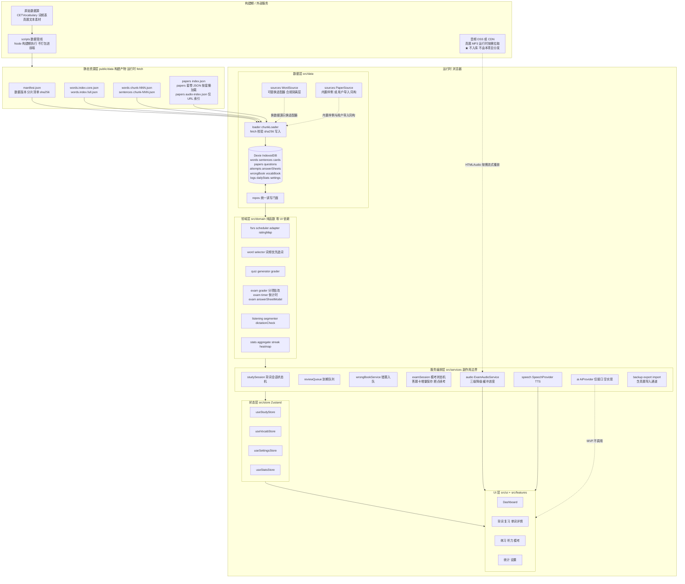

### 三条架构铁律（写入 CLAUDE.md / 贡献指南，Code Review 必查）

| # | 铁律 | 理由 |
|---|---|---|
| A1 | **`src/domain/` 不得 import React、不得触碰 IndexedDB、不得发网络请求** | 保证 FSRS 调度、词频选词、评分映射可 100% 单测（PRD 常见坑 #5） |
| A2 | **UI 层不得直接 `fetch()` 数据，只能经 `services/` → `data/repos/`** | 保证"分片加载 + IndexedDB 缓存 + 换源"三件事只在一处实现 |
| A3 | **词库读取一律经 `WordSource` 接口，禁止硬编码 JSON 结构** | C5 合规要求：换数据源（自建词频库）只需替换适配器，不动业务层 |
| **A4** | **v1.1：套卷读取一律经 `PaperSource` 接口，内置样例与用户导入必须同构** | R11 合规要求：把"真题从哪来"做成可配置，使我们默认不分发任何受保护内容；将来若获授权，只需加文件不改代码 |
| **A5** | **v1.1：音频 URL 只能来自 `audio-index.json` 或 `settings.audioBaseUrl`，代码中禁止硬编码任何真题音频地址** | R11 + C8：保证仓库内零真实音频引用，`defaultMissing: true` 时能干净降级 |
| **A6** | 🔴 **v1.3 铁律：音频零入库。仓库内禁止出现任何 `.mp3` / `.m4a` / `.wav` / `.ogg` / `.flac` / `.aac` 文件；`ExamPaper` 的 `original` 卷**不得携带任何 `audioUrl` 字段** | 用户拍板 `original` 后的**减损措施①**（R11）：音频邻接权风险高于文本，且官方从不发行数字音频（FM 广播实证）。CI 强制门禁，见附录 B-15 |
| **A7** | **v1.3：`provenance='original'` 的卷必须在 UI 三处展示来源与置信度标识，且每题必须可标记「存疑」** | 减损措施②：因无官方底本可对照，必须让用户始终知道"这份材料的可靠性边界" |
| **A8** | 🔴 **v1.4：领域层单测除断言绝对值，必须断言不变量（顺序、单调性、边界关系）；v1.5 补正例/反例（见 5.6.5）** | **M1 实证教训（经两轮修正双重验证）**：11 条 FSRS 单测全过，却漏掉 Again(10min) > Hard(6min) 的**评分倒挂**（缺陷①）；**修复倒挂后**又漏掉 `Again === Hard` 的区分度弱化（缺陷③）——两次都是因为测试只断言**非严格关系或各自绝对值**，没断言**严格顺序**。见 8.1｜正例：`expect(dueAgain).toBeLessThan(dueHard)`；反例：`expect(dueAgain - now).toBe(6*60_000)`（5.6.5） |
| **A9** | 🔴 **v1.6：板块渲染 / 分段倒计时 / 答题卡分组 / 结果页板块卡，一律由 `sectionMeta` 派生的 `SectionPlan` 驱动；禁止出现「三板块」硬编码与硬编码总时长** | **«保留预留位» 的可执行定义**（见 `docs/04 §2`）。反例：`['writing','reading','translation'].map(...)`、`const TOTAL = 100*60`。正例：`buildSectionPlan(paper).slots`。**验收凭据**：把听力加回 `sectionMeta` 并移出 `disabledKinds`，总时长自动由 100min 回到 125min，**零代码改动**（单测强制，见 `docs/04 §2.6`） |

## 2.2 纯前端"资源如何加载"—— 三段式策略

| 阶段 | 做什么 | 关键实现 |
|---|---|---|
| **① 启动自检** | 读 `manifest.json`（≈1KB），比对本地 `meta` 表里的 `dataVersion` | 版本一致 → 跳过下载；不一致 → 清旧词库（**不动用户进度表**），重下 |
| **② 首屏最小数据** | 并行 `fetch`：`words.index.core.json`（Top 2104）+ 首片 `words/chunk-001.json` + 首片 `sentences/chunk-001.json` | 全部写入 IndexedDB 后渲染，用户无感；进度条显示"正在准备词库" |
| **③ 后台预热** | 空闲时（`requestIdleCallback`）按词频顺序预取后续 3 片；Service Worker 在 M3 接管 | `loader/cacheWarmer.ts`；预取可被"省流量模式"设置关闭 |
| **④ 真题按套懒加载（v1.1 新增）** | `/papers` 只取 `papers/index.json`（目录元数据，≈8 KB）；进入某套才 `fetch` 该套完整 JSON（≈40 KB gzip）；**绝不预取全部套卷** | `data/sources/PaperSource.ts` + `repos/paperRepo.ts` |
| **⑤ 音频按需流式（v1.1 新增）** | 模考进入听力板块时才按 Section 拉取音频；精听页按单句 seek，不额外切片 | `services/audio/ExamAudioService.ts`，详见 6.4 |

> **第二次及以后访问**：① 命中 → **零数据请求**，首屏只剩 JS/CSS。这是本方案相对"全量塞进 localStorage"竞品的决定性优势。
>
> **⚠️ 关键结论（v1.1）**：真题模块升级为完整套卷模考后，**首屏预算完全不变**——因为 `/mock`、`/papers` 是路由级懒加载，套卷 JSON 按套按需 fetch。模考提前到 M2 不影响 G3「首屏 ≤3s」。

---

# 第三部分：数据模型

## 3.0 真题来源谱系与数据可得性调研（v1.2 前置决策）

> 用户选择「**内置近三年（2026/2025/2024）真题**」。本节先给出**实测的可得性结论**，再定义 `provenance` 谱系与折中方案。本节是 3.2 数据模型与 R11 风险评级的前提。

### 3.0.1 官方侧事实（决定性，均已核实）

| # | 事实 | 证据来源 | 后果 |
|---|---|---|---|
| 1 | **官方从不公布真题与标准答案**，考后仅发布成绩 | 中国教育考试网 `cet.neea.edu.cn`；辅导客：「官方仅发布成绩，不提供试题或标准答案」 | ❌ **无权威底本可对照** |
| 2 | **考委会规定试卷不公开，考点严禁复印或留存** | 厦门理工学院教务处《关于做好2019年12月CET考试工作的通知》原文：「根据考委会的规定，**考试试卷不公开，各分考点严禁复印或留存，一经发现，给予严肃处理**」 | ❌ 一切流传版本均为非授权流出 |
| 3 | 考前试题与听力磁带属**机密级国家秘密** | 《CET 安全保密及考风考纪责任书》原文 | ⚠️ 来源合法性本身存疑 |
| 4 | **试题版权归教育部教育考试院**（整体试卷作为**汇编作品**） | 公开法律咨询答复：「全国大学英语四、六级考试的试题版权属于国家教育部考试中心所有。未经官方授权，**任何机构或个人不得擅自复制、出版、发行含有完整考试试题的辅导材料**……直接盗用、翻印真题的行为属于侵权，将承担相应的民事乃至行政责任」 | 🔴 直接对应我们的行为 |
| 5 | 合理使用边界：**校内非营利少量使用**可视为合理，但「**不应公开大量、系统性地传播真题电子版**」 | 同上答复 | 🔴 公开网络内置分发明确越界 |

### 3.0.2 第三方渠道可得性实测

| 渠道 | 形态 | 覆盖范围 | **实测完整度** |
|---|---|---|---|
| 新东方 `cet4-6.xdf.cn` / `cet4.koolearn.com` | 考后当天发布**答案（A-D 选项文本）** + 部分原文 + `<audio>` 播放 | 2024.06 – 2026.06 | 答案**较全**；但 2026.06「听力原文真题」页实测显示「**待更新~~**」，且完整版需「添加联系方式免费领取」= 引流钩子，不公开 |
| `0609x/CET46-Resources`（GitHub） | 真题 PDF / Word / 答案解析 / 听力 MP3 汇总 | 四级 2014–2026（28 考次） | PDF 版**较全**；但 README 自述「**四级 2026.06 仍为真题-解析待补**」 |
| `ShepiTT/CET_practice_questions`（GitHub） | **PDF → 结构化管线**（`pdfplumber` + 正则 + `faster-whisper` ASR 转录 + 时间戳对齐） | 2023 – 2025 | 需要整套 OCR/ASR 管线；仓库含 `fix_disagreements.py`、`repair_db.py`（清理「**假记录**」）、`repair_reference_text.py` → **说明自动抽取质量不稳定，需大量人工校对**；**未见 License 文件** |
| `wamich/english-exem-md`（GitHub） | Markdown 真题库 | 2023 年为主 | 年份覆盖不足近三年 |
| `3056810551/cet-listening`（GitHub） | 句级 `transcript.json` + `timings.json` | 含 cet4 目录，覆盖有限 | 覆盖不足 |

**音频专项**：CET 听力在考点通过 **FM 调频广播**播放（中国地质大学 2026-06-08 通知实证：南望山校区 FM80.5MHz / 西区 FM81.5MHz / 北区 FM83.5MHz，考生自带收音机）。→ **官方从不发行真题音频的数字文件**。市面流传 MP3 均为机构转录/录制件，且 `0609x` 自述「部分考次音频较大（个别 >50MB）」。

### 3.0.3 ⚠️ 工程结论：内置近三年完整模考**在当下不成立**

必须直接说出的问题，按严重程度排序：

| # | 缺失项 | 后果 | 影响的功能 |
|---|---|---|---|
| 1 | **听力原文缺失/为 ASR 转录稿** | 2026.06 实测「待更新」，现有多为机构 ASR 转录 | **精听、听写校验、TTS 降级三项全部失去可靠数据源** |
| 2 | **音频无官方数字源** | 第三方转录件版权风险最高（邻接权）、体积大、无句级时间轴需 ASR 反推（误差大） | **模考听力板块无法保证「真实原声」** |
| 3 | **答案正确性无法验证** | 官方从不公布标准答案 → **我们无法证明任何一份「标准答案」是对的** | 自动批改会**直接误导用户**（正是 R9 要避免的）。实证脏数据：新东方 2026.06 答案文本中多处混入整理错误标记 `xxb`（如「7. B) Resume its electric bike incentive program xxb.」「24. C) Some disadvantages related to pet ownership xxb.」） |
| 4 | **越新的考次越不全** | 2026.06 四级「解析待补」；最新考次总是最后才补齐 | 🔴 **与用户「要最新」的诉求直接冲突** —— 用户要的恰恰是最缺数据的区间 |

> **一句话结论**：不是"要不要承担版权风险"的问题，而是**即便承担了风险，也拿不到能支撑完整模考的完整、准确数据**。越新的年份越是如此。

### 3.0.4 折中方案：真题同源模拟卷（`provenance: 'derived'`）

> 用户的核心诉求是「**最新、最贴近真实考试**」，而**不是**「必须逐字复制原文」。以下方案保住前者、规避后者。

**做法**：以近三年真题为**语料**做「考点结构化提取」，产出**自撰**模拟卷，而非复制真题原文入库。

| 层 | 内容 | 版权属性 | 说明 |
|---|---|---|---|
| ① 考试结构 | 板块构成、题量、分值权重、时长（写作 30min / 听力 25min / 阅读 40min / 翻译 30min，共 125min） | ✅ **不受著作权保护** | 考试结构属「思想—操作方法」范畴。这与 CETVocabulary 统计词频同理（事实性数据可用） |
| ② 考点分布 | 近三年各板块的题材分布、题型分布、考点类型统计 | ✅ 事实性统计数据 | 类似词频统计 |
| ③ 考点词与搭配 | 从近三年真题语料抽取的高频词、固定搭配、同义替换模式 | ✅ 事实性数据 + 本项目核心支点 | 可与 `Word.freqRank` 交叉，**刻意按词频排布考点词** |
| ④ 题目内容 | 篇章、题干、选项、解析 —— **全部自撰** | ✅ 原创，我方享有著作权 | 按①②③的规格撰写 |
| ⑤ 音频 | **TTS 原生合成**（自撰文本 → 合成语音） | ✅ 完全合法 | 且**可精确生成句级时间轴**（合成时已知每句时长），**反而优于**第三方转录件需要 ASR 反推的误差 |

**备考价值对比**（相对"内置真真题"）

| 维度 | derived 模拟卷 | 用户期望的内置真真题 | 差距 |
|---|---|---|---|
| 考试结构与时长熟悉度 | ✅ 100% | 100% | 无 |
| 题型与分值分布 | ✅ 100%（按近三年实测分布） | 100% | 无 |
| 考点词/搭配命中率 | ✅ **更高**（可刻意按 `freqRank` 排布） | 取决于该套偶然出现 | derived **更优** |
| 难度与题材贴合度 | ✅ 高（按近三年题材分布撰写） | 高 | 基本无 |
| 听力真实口音与语速 | ⚠️ TTS 合成（无真实口音/背景音） | 取决于能否拿到转录件 | **这是唯一实质损失** |
| 「我做过真考题」的心理熟悉感 | ❌ 无 | 有 | **但这项价值是幻觉** —— 见下 |

> **关键论证：回忆版真题的「真实性」是幻觉。**
> 既然官方从不公布真题与标准答案，市面流传版本的准确度**无法验证**（实证：新东方答案中混入 `xxb` 脏标记；2026.06 原文「待更新」）。那么"内置真真题"相比"按真实考点自撰"的**增量价值，远小于它的法律与工程成本**——你冒着侵权风险内置的分明是一份**自己都无法保证正确的**材料。

### 3.0.5 架构侧推荐的最终形态

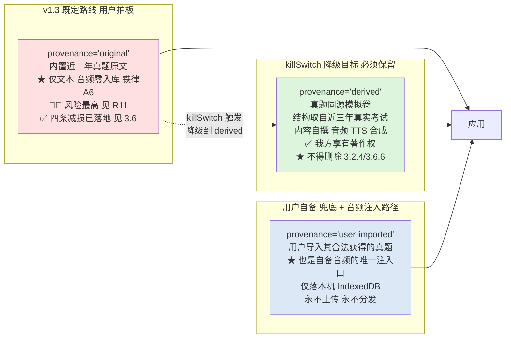

> **⚠️ v1.3 状态更新**：用户已最终拍板 `provenance='original'`，**架构侧建议未被采纳**。反对意见永久留档于 R11（🔴🔴 评级未下调）。
> **已转入执行**：四条减损措施全部落地为可执行设计（3.6）：① 音频零入库（铁律 A6）+ 听力四态设计 ② 三处 UI 标注 + 存疑标记不入 FSRS ③ 禁用词清单 + CI ④ killSwitch 三层机制。
> **`derived` 与 `user-imported` 全部保留**：前者是 killSwitch 的降级目标，后者是合规兜底与自备音频的唯一注入路径。真真题的入口、以及降级退路，两者都没有关闭。

---

## 3.1 词库域（`src/domain/word/types.ts`）

```ts
/** 词性枚举 */
export type Pos = 'n' | 'v' | 'adj' | 'adv' | 'prep' | 'conj' | 'pron' | 'num' | 'art' | 'int';

/** 单个义项 */
export interface WordSense {
  pos: Pos;
  zh: string;          // 中文释义
}

/** 词频档位：对应 PRD R01 的三档切换 */
export type Tier = 'core2104' | 'cet4' | 'extended';

/**
 * 词条（只读镜像，存在 IndexedDB.words，由 public/data 灌入）
 * 关键：id 是稳定主键，与 freqRank 解耦 —— 换数据源重排词频时用户进度不丢。
 */
export interface Word {
  id: string;              // "w_00001" 稳定主键，永不变更
  headword: string;        // "abandon"
  variants: string[];      // ["abandons","abandoned","abandoning"] 词形还原 / 例句匹配用
  phoneticUk?: string;     // "/əˈbændən/"
  phoneticUs?: string;
  senses: WordSense[];
  freqRank: number;        // 1..5278 真卷词频降序 —— 【本项目的核心字段】
  freqCount: number;       // 真卷实际出现次数（用于展示"每 5 套卷必现"）
  tier: Tier;              // freqRank <= 2104 → 'core2104'
  isCet6?: boolean;        // 数据源标注的六级词，用于后续扩展
  category?: string;       // 数据源「分类」字段
  subCategory?: string;    // 数据源「子分类」字段
  chunk: number;           // 所属分片序号 1..10，用于懒加载
  sentenceCount: number;   // 关联真题例句数（用于 UI 标记"有真题例句"）
  source: string;          // "exam-data/CETVocabulary@2026-09" 合规留痕
  license: string;         // "CC BY-NC-SA 4.0" 合规留痕
}

/** 轻量索引行：列式存储，用于首屏极速构建学习队列 */
export interface WordIndexRow {
  id: string;
  w: string;       // headword
  r: number;       // freqRank
  t: 0 | 1 | 2;    // tier 枚举压缩
  c: number;       // chunk
  f: number;       // freqCount
}
```

## 3.2 真题域（`src/domain/exam/types.ts`）—— v1.1 重写

> **v1.1 变更**：真题从"例句集合"升级为**完整套卷**。原来的 `ExamItem` 拆解为 `ExamSection`（板块）+ `ExamQuestion`（题目），并新增 `AnswerSheet`（答题卡）与 `ExamAttempt`（模考记录）。`ExamSentence` **降级为 `ExamQuestion` 的关联数据**，继续承载差异化机会 ②（单词 ↔ 真题语境双向反查）。

### 3.2.1 套卷结构（三级：Paper → Section → Question）

```ts
export type ExamSectionKind = 'writing' | 'listening' | 'reading' | 'translation';

/** 一套真题（完整套卷，纯 JSON，无 PDF / 无 MP3） */
export interface ExamPaper {
  id: string;                 // "2024-06-CET4-SET1"
  year: number;               // 2024
  month: 6 | 12;
  setNo: number;              // 1..3（同一考次的第几套卷）
  level: 'CET4';
  durationMin: number;        // 125（真实考试总时长）
  totalScore: number;         // 710
  /** 板块构成与分值分配，驱动答题卡分组与分项得分 */
  sectionMeta: ExamSectionMeta[];
  /** ★ v1.2：来源性质谱系（合规强制，见 3.0 与 R11） */
  provenance: 'original' | 'derived' | 'user-imported';
  /**
   * - 'original'      : 真题原文复制 —— 🔴 CI 门禁禁止入库，仅用户导入时可能出现
   * - 'derived'       : 真题同源模拟卷（结构/考点取自真题语料，内容自撰）—— ✅ 默认内置
   * - 'user-imported' : 用户自行导入 —— ✅ 仅落本机 IndexedDB，永不上传分发
   */
  license?: string;           // derived 标注自撰/CC0；user-imported 由用户自填
  importedAt?: number;        // provenance='user-imported' 时的导入时间戳
  /** derived 卷必须声明语料基准，例：'CET4 2024.06–2026.06 考点分布' */
  derivedFrom?: string;
  /** UI 必须展示的来源标识文案，例：'真题同源模拟卷（按近三年考点分布自撰，非真题原文）' */
  provenanceLabel: string;
  /** ★ v1.3：数据置信度 —— 因无官方底本可对照，必须显式建模并展示（见 3.6.3） */
  confidence: ExamConfidence;
}

/** v1.3：数据置信度（无官方底本可对照，只能做一致性验收） */
export interface ExamConfidence {
  level: 'high' | 'medium' | 'low';
  hasTranscript: boolean;
  hasAudio: boolean;              // provenance='original' 时恒为 false（铁律 A6）
  hasExplanation: boolean;
  /** 答案是否经 ≥2 个独立来源交叉比对一致 */
  answerCrossChecked: boolean;
  /** 人工抽样核对比例 0–1，见 3.6.7 */
  spotCheckRatio: number;
  /** 用户累计标记存疑次数，达阈值触发整卷熔断 */
  doubtCount: number;
  note?: string;                  // 例："2026.06 听力原文缺失，答案仅单来源"
}

export interface ExamSectionMeta {
  id: string;                 // "2024-06-CET4-SET1:L"
  kind: ExamSectionKind;
  order: number;              // 1=写作 2=听力 3=阅读 4=翻译（真实考试顺序）
  partLabel: string;          // "Part I Writing" / "Part II Listening"
  questionFrom: number;       // 起讫题号，用于答题卡分组
  questionTo: number;
  durationHintSec?: number;   // 建议用时（写作 30min / 听力 25min / 阅读 40min / 翻译 30min）
  rawScore: number;           // 该板块原始分（用于分项得分展示）
  /** 听力板块专属 */
  audioTrackId?: string;      // 指向 audio-index.json 的 track id
}

/** 板块内的子分组（听力的 Section A/B/C、阅读的 Section A/B/C） */
export interface ExamSection {
  id: string;                 // "...:L-A"
  paperId: string;
  kind: ExamSectionKind;
  subPart: string;            // "Section A / News Report"
  order: number;              // 板块内顺序
  /** 该子分组的音频片段定位（在整轨 audio track 内的相对时间） */
  audioRange?: { startSec: number; endSec: number };
  /** 听力原文，按句切分 —— 精听、听写校验、TTS 降级合成的三合一数据源 */
  transcript?: TranscriptLine[];
  /** 阅读/完形的篇章材料（选词填空的备选词池也放这里） */
  passage?: {
    title?: string;
    paragraphs: string[];
    /** 选词填空（Section A）的 15 个备选词 */
    wordBank?: string[];
  };
  questions: ExamQuestion[];
}

export interface TranscriptLine {
  idx: number;                // 句序号
  text: string;               // 单句原文
  zh?: string;                // 句级译文（精听揭示用）
  /** 可选：句级时间轴，用于「点句跳转」；无数据时按文本长度比例估算 */
  startSec?: number;
  endSec?: number;
}

export type QuestionKind =
  | 'choice'        // 四选一（听力/阅读主流）
  | 'banked-cloze'  // 选词填空（阅读 Section A）
  | 'matching'      // 长篇阅读匹配（阅读 Section B）
  | 'blank'         // 填空（听力 Section C 部分）
  | 'translation'   // 汉译英段落
  | 'essay';        // 短文写作

/** 一道题 */
export interface ExamQuestion {
  id: string;                 // "2024-06-CET4-SET1:Q23"
  paperId: string;
  sectionId: string;
  kind: QuestionKind;
  no: number;                 // 全局题号 1..57，答题卡排序依据
  /** 分值：听力/阅读客观题按 CET 权重表，写译为区间主观分 */
  score: number;
  /** 客观题标准答案；主观题（写作/翻译）无 */
  answer?: string;            // "B" | "D" | "banked:E3" | "matching:I"
  /** 主观题评分参考（写作/翻译），用于自评对照而非自动判分 */
  rubric?: string;
  stem?: string;              // 题干（选择题）
  options?: string[];         // A-D 选项文本
  /** 该题依赖的材料指针：指向 section.passage 或 transcript 的区间 */
  materialRef?: {
    type: 'passage' | 'transcript';
    /** 在 paragraphs / transcript 中的索引或区间 */
    range: [number, number];
  };
  explanation?: string;       // 解析（中文）
  /** 该题覆盖的真题例句 id → 支撑「单词 ↔ 真题」双向跳转（差异化 ②） */
  sentenceIds?: string[];
  /** 关键词提示：交卷后用于「把本题生词加入生词本」的一键入口 */
  keyWordHints?: string[];
}
```

### 3.2.2 真题例句（差异化机会 ② 的载体，保留）

```ts
/**
 * 真题例句 —— 从 ExamQuestion / TranscriptLine 中抽取的「词级」切片。
 * v1.1 定位调整：不再是真题模块的主体，而是服务于「单词 ↔ 真题」反查的关联表。
 */
export interface ExamSentence {
  id: string;                 // "s_000001"
  wordId: string;             // 关联词
  paperId: string;            // "2024-06-CET4-SET1"
  questionId: string;         // 反查到具体题目（v1.1 新增，强化双向跳转）
  sectionKind: ExamSectionKind;
  questionNo?: number;        // 23（v1.1：改为 number，与 ExamQuestion.no 对齐）
  en: string;                 // 完整英文原句
  zh?: string;                // 参考译文
  targetForm: string;         // 句中实际出现的词形（可能是 variants 之一）
  span: [number, number];     // targetForm 在 en 中的字符区间 → 精确高亮（不用正则，避免误伤）
  gap?: [number, number];     // 语境填空（R16）的挖空区间，复用 span 坐标系
}
```

### 3.2.3 答题卡与模考记录（v1.1 新增）

```ts
export type AttemptMode = 'mock' | 'practice';
export type AttemptStatus = 'ongoing' | 'submitted' | 'abandoned';
export type QuestionFlag = 'unanswered' | 'answered' | 'marked' | 'skipped';

/** 单题作答记录 */
export interface AnswerRecord {
  questionId: string;
  /** 客观题：选项字母；选词填空：词；匹配：段落号；主观题：全文文本 */
  value: string | null;
  flag: QuestionFlag;         // 支持「标记待定」——长时考试必备
  answeredAt?: number;
  /** 主观题自评档位（写作/翻译），用于分项得分估算 */
  selfScore?: number;
  /** 修改次数，用于统计"改答案"行为（可选） */
  revisions?: number;
  /** ★ v1.3：用户认为该题答案可疑 → 该题错题不进 FSRS（见 3.6.3） */
  doubtful?: boolean;
  doubtReason?: 'answer-wrong' | 'stem-unclear' | 'option-truncated' | 'other';
}

/** 答题卡 —— 一次模考的完整作答状态，★ 增量持久化，支撑断点续考 */
export interface AnswerSheet {
  id: string;                 // attemptId（一对一）
  attemptId: string;
  paperId: string;
  answers: Record<string, AnswerRecord>;  // key = questionId
  /** 当前停留位置，恢复时直接滚动定位 */
  cursorQuestionId?: string;
  /** ★ 已用时（秒），由 ticks 累加，不用 Date 差值（防止切后台误差） */
  elapsedSec: number;
  startedAt: number;
  lastSavedAt: number;        // 增量保存时间戳（1s 节流 / 切页时强制）
  /** 模考剩余时间；practice 模式为 null（不限时） */
  remainingSec: number | null;
  /** 听力音频加载状态，驱动 UI 降级（见 6.4） */
  audioState: 'idle' | 'loading' | 'ready' | 'failed' | 'tts-fallback';
}

/** 一次模考记录 —— 交卷后生成，供历史对比与统计 */
export interface ExamAttempt {
  id: string;
  paperId: string;
  mode: AttemptMode;
  status: AttemptStatus;
  startedAt: number;
  submittedAt?: number;
  elapsedSec: number;
  /** 客观题得分（自动批改，唯一可信数字） */
  objectiveScore: number;
  objectiveTotal: number;
  /** 分项得分：写作/听力/阅读/翻译 */
  sectionScores: Array<{
    kind: ExamSectionKind;
    correct: number;
    total: number;
    score: number;
    rawTotal: number;
  }>;
  /** 主观题只给自评档位，不做自动判分（风险 R9） */
  subjectiveSelfScore?: { writing?: number; translation?: number };
  /** ★ 明确不做 710 分制换算，避免误导 */
  scoreScaleNote: 'objective-only';
  wrongQuestionIds: string[]; // → 错题入 FSRS 队列
  newWordIds: string[];       // → 生词入生词本
}
```

> **设计要点**：
> 1. `AnswerSheet` 与 `ExamAttempt` **分离**：答题卡是「进行时」的高频写入对象（1s 节流），attempt 是「完成时」的结果快照。避免高频写入污染历史表。
> 2. `elapsedSec` 用**累加 ticks** 而非 `Date.now() - startedAt`：切后台/锁屏时 `Date` 差值会虚增，累加更准确。
> 3. `ExamAttempt.scoreScaleNote = 'objective-only'` 是**类型层面的强制约束**：从数据模型上杜绝"预估 425 分"这种误导性数字（风险 R9）。

### 3.2.4 `derived` 卷生成规范（v1.2 新增）

> 把 3.0.4 的折中方案落到可执行的数据规格上，使 `scripts/build-derived-paper.ts` 可直接照此实现。

```ts
/** derived 卷的「语料基准」——从近三年真题提取的事实性规格，不复制任何原文 */
export interface DerivedSpec {
  /** 语料基准考次，例：['2024.06','2024.12','2025.06','2025.12','2026.06'] */
  sourceSessions: string[];
  /** 板块与分值结构（事实性，取自真实考试） */
  structure: {
    writing:     { questions: 1;  durationSec: 1800; rawScore: 106.5 };
    listening:   { questions: 25; durationSec: 1500; rawScore: 248.5 };
    reading:     { questions: 30; durationSec: 2400; rawScore: 248.5 };
    translation: { questions: 1;  durationSec: 1800; rawScore: 106.5 };
    totalDurationSec: 7500;
  };
  /** 听力子结构：Section A 新闻 7 题 / B 长对话 8 题 / C 短文 10 题 */
  listeningParts: Array<{ subPart: string; questions: number; wordsPerMin: number }>;
  /** 阅读子结构：A 选词填空 10 / B 长篇匹配 10 / C 仔细阅读 10 */
  readingParts: Array<{ subPart: string; questions: number; passageWords: number }>;
  /** 题材分布（从近三年语料统计得出的事实性比例） */
  topicDistribution: Array<{ kind: ExamSectionKind; topic: string; weight: number }>;
  /** ★ 考点词取样：从 Word 表按 freqRank 区间抽取，保证考点词是真高频词 */
  targetWordPolicy: {
    rankRange: [number, number];   // 例：[1, 2104] 优先取 Top2104
    perPaper: number;              // 每卷覆盖考点词数，例：120
    /** 与 ExamQuestion.keyWordHints 对齐，用于「一键加入生词本」 */
    emitWordHints: true;
  };
  /** 自撰内容的创作约束，供人工/AI 撰写时遵守（AI 仅留接口，MVP 不实接） */
  writingGuidelines: {
    passageWords: { min: number; max: number };  // 阅读篇章自撰长度
    optionDistractors: 3;                        // 每题干扰项数
    /** 禁止：复制任何真题原句、原文段落、原题干 */
    forbidVerbatimCopy: true;
  };
}
```

**生成流程**

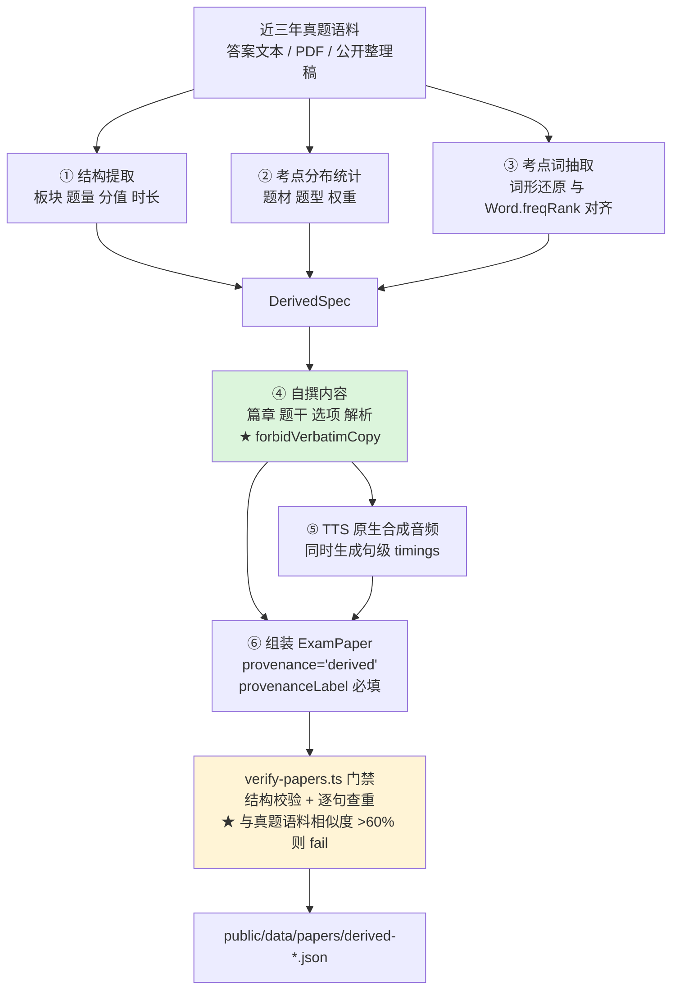

> **查重门禁是关键**：`verify-papers.ts` 需对自撰内容与真题语料做句子级相似度比对，超过阈值（建议 60%）直接 fail，从工程上杜绝"改写沦为抄袭"。

## 3.3 SRS / 复习域（`src/domain/fsrs/types.ts`）

```ts
/** ts-fsrs Rating: 1=Again 2=Hard 3=Good 4=Easy */
export type FsrsRating = 1 | 2 | 3 | 4;
/** ts-fsrs State: 0=New 1=Learning 2=Review 3=Relearning */
export type FsrsState = 0 | 1 | 2 | 3 | 4;

/**
 * 复习卡片 —— 用户进度的核心表。
 * 字段名刻意与 ts-fsrs 的 Card 对齐，但把 Date 换成 number(epoch ms)，
 * 由 domain/fsrs/adapter.ts 做双向映射（Date 无法直接存 IndexedDB 做索引排序）。
 */
export interface ReviewCard {
  wordId: string;             // 【主键】
  due: number;                // epoch ms —— 主查询索引
  stability: number;
  difficulty: number;
  elapsedDays: number;
  scheduledDays: number;
  reps: number;
  lapses: number;
  state: FsrsState;
  lastReview?: number;        // epoch ms
  suspended: boolean;         // 已掌握 / 手动移出队列（R07）
  createdAt: number;
  introsRank: number;         // 引入时的 freqRank，用于「高频词覆盖率」统计（G1）
}

/** MPV 三级自评 → FSRS 四分评级的映射表（含 R20「偷看详情扣分」） */
export interface RatingInput {
  self: 'known' | 'fuzzy' | 'unknown';   // R02 三级自评
  peeked: boolean;                        // 是否查看过详情（释义/例句）
  elapsedMs: number;                      // 作答耗时
}

export const RATING_MAP: Record<string, FsrsRating> = {
  // key = `${self}-${peeked ? 'peek' : 'clean'}`
  'known-clean':   4,   // Easy
  'known-peek':    3,   // Good   ← 偷看扣分
  'fuzzy-clean':   3,   // Good
  'fuzzy-peek':    2,   // Hard
  'unknown-clean': 1,   // Again
  'unknown-peek':  1,   // Again
  // 附加规则：elapsedMs > 8000 且 self='known' → 降级为 3（犹豫即不会）
};
```

## 3.4 错题 / 统计 / 设置域

```ts
/** v1.1：'mock' 明确区分真题模考来源；原 ExamItem 错题改用 questionId */
export type WrongSource = 'card' | 'quiz' | 'cloze' | 'listening' | 'mock' | 'practice';

/** 错题条目 —— 差异化机会 ④：不是死列表，而是 FSRS 队列的活跃来源 */
export interface WrongBookEntry {
  id?: number;                 // auto-increment
  wordId?: string;             // 单词类错题（背词/测验来源）
  questionId?: string;         // 真题小题类错题（v1.1：原 itemId → questionId）
  paperId?: string;            // 错题所属套卷，支持「按卷筛选重做」
  source: WrongSource;
  wrongCount: number;          // 错误频次 → 「专项错题卷」排序依据
  firstWrongAt: number;
  lastWrongAt: number;
  enqueued: boolean;           // 是否已注入 FSRS 队列（防止重复入队）
  nextDue: number;             // 【索引】
  resolved: boolean;           // 连续答对 N 次后自动归档
}

/** ★ v1.1 新增：生词本 —— 与错题本分离的「主动收藏」语义 */
export interface VocabBookEntry {
  id?: number;                 // auto-increment
  wordId: string;              // 【索引】
  /** 来源：真题里遇到的生词可回溯出处，这是差异化机会 ② 的落点 */
  origin?: {
    paperId: string;
    questionId: string;
    sentenceId?: string;
  };
  addedAt: number;
  /** 是否已转入正式学习队列（生词本 → FSRS 卡片） */
  promoted: boolean;
  note?: string;               // 用户自填笔记
}

export type StudyAction = 'learn' | 'review' | 'quiz' | 'wrong' | 'master';

/** 事件级学习日志 —— 热力图 / 趋势图的数据源 */
export interface StudyLog {
  id?: number;
  ts: number;
  date: string;                // "YYYY-MM-DD" 本地时区，便于按日聚合
  wordId: string;
  action: StudyAction;
  rating?: FsrsRating;
  peeked?: boolean;
  elapsedMs?: number;
}

/** 预聚合日统计（避免每次打开统计页扫全表日志） */
export interface DailyStat {
  date: string;                // 【主键】
  newLearned: number;
  reviewed: number;
  correct: number;
  wrong: number;
  minutes: number;
  goalDone: boolean;
}

export interface UserSettings {
  schemaVersion: number;
  dailyGoal: number;           // 每日新词量，默认 20
  reviewLimit: number;         // 每日复习上限，默认 200（防雪崩）
  tier: Tier;                  // 'core2104' | 'cet4' | 'all'
  accent: 'uk' | 'us';
  theme: 'light' | 'dark' | 'system';
  autoPlay: boolean;           // 自动发音（受浏览器手势解锁限制）
  ttsProvider: 'youdao' | 'webspeech' | 'off';
  peekPenalty: boolean;        // R20 偷看扣分开关
  freqOrdering: boolean;       // true=词频降序(默认) / false=随机
  aiEnabled: boolean;          // 【MVP 恒为 false】C3 约束
  prefetchEnabled: boolean;    // 后台预取后续分片

  // —— v1.1 新增：真题与音频 ——
  /** 用户自备音频源地址；为空则 audio-index.defaultMissing 生效 → TTS 降级 */
  audioBaseUrl?: string;
  /** 模考模式：严格 125 分钟 / 练习模式不限时可跳板块 */
  mockStrictTiming: boolean;   // 默认 true
  /** 套卷来源偏好：内置样例 / 用户导入 */
  paperSourcePreference: 'builtin' | 'user-import';
}
```

> **为什么生词本要与错题本分离**：错题本 = **被动记录**（答错了才进来，带 `wrongCount` 与 FSRS 调度）；生词本 = **主动收藏**（阅读真题时遇到不认识的词手动加入，带 `origin` 出处）。二者语义、字段、UI 都不同，合并会互相污染（例如"我手动收藏的词"不该显示"错误 3 次"）。交卷流程中对两者分别写入（见 5.3）。

## 3.5 IndexedDB 表设计（Dexie v4，`src/data/db/db.ts`）

```ts
// db name: 'cet4-master'，version 1
// 设计原则：只读「词库镜像」与可写「用户进度」严格分离，
//           使词库升级 / 换数据源时，用户进度零损伤。

export const DB_SCHEMA = {
  // —— 只读镜像区（由 public/data 灌入，可整体重建）——
  words:     'id, freqRank, tier, chunk, headword, *variants',
  sentences: 'id, wordId, paperId, questionId, [wordId+paperId]',
  papers:    'id, year, [year+month], level, source',

  // —— v1.1 新增：真题套卷镜像区（按套懒加载，用过的才入库）——
  sections:  'id, paperId, kind, [paperId+order]',
  questions: 'id, paperId, sectionId, no, kind, [paperId+no]',

  // —— 用户进度区（永不被数据管线触碰）——
  cards:     'wordId, due, state, lastReview, [state+due], suspended',
  wrongBook: '++id, wordId, questionId, paperId, source, nextDue, wrongCount, resolved',
  vocabBook: '++id, wordId, addedAt, promoted',          // ★ v1.1 生词本
  studyLogs: '++id, date, ts, wordId, action',
  dailyStats:'date',
  quizSessions:    '++id, startedAt, type',
  listeningProgress:'sectionId, updatedAt',

  // —— v1.1 新增：模考区（答题卡高频写入，与 attempts 分离）——
  answerSheets: 'id, attemptId, paperId, lastSavedAt',   // ★ 增量保存
  attempts:     'id, paperId, startedAt, status, mode',  // 结果快照

  // —— 系统区 ——
  meta:      'key',            // dataVersion / manifestHash / lastBackupAt / migration
  audioCache:'url, cachedAt',  // TTS 音频 blob 缓存（可选，默认关闭）
} as const;
```

| Store | 预估条数 | 预估体积 | 说明 |
|---|---:|---:|---|
| `words` | 5,278 | ~1.4 MB | 全量灌入后约 1.4MB（未压缩的对象存储开销） |
| `sentences` | ~7,400 | ~1.8 MB | 按需增长，用到才缓存 |
| `papers` + `sections` + `questions` | 20 套 × 57 题 | **~2.4 MB** | **v1.1 新增**。按套懒加载，用户通常只缓存 3–5 套 → 实际 0.4–0.6 MB |
| `cards` | ≤ 5,278 | ~0.8 MB | 一词一卡 |
| `studyLogs` | 100 天 × 60 条 = 6,000 | ~0.6 MB | 建议保留最近 180 天，超出自动裁剪 |
| `wrongBook` + `vocabBook` | ~1,200 | ~0.15 MB | |
| `answerSheets` + `attempts` | ~30 次模考 | ~0.1 MB | 已提交的 attempt 保留，ongoing 只留最新 |
| **合计（全部加载的最坏情况）** | | **≈ 7.3 MB** | 远低于 IndexedDB 配额（见风险 R5） |

> **配额结论**：即便用户做完 20 套真题且全量缓存，IndexedDB 占用约 **7 MB**，对浏览器配额（Chrome 约为磁盘剩余空间的 60%，通常数 GB）仍有 2 个数量级余量。风险 R5 等级不变。

---

## 3.6 `original` 路线执行规范（v1.3 核心：四条减损措施落地）

> **背景**：用户在知情前提下最终拍板 `provenance='original'`。架构师反对意见永久留档于 R11（未弱化、未删除）。
> **本节性质**：v1.2 中提出的四条减损措施，由"建议"升级为**可执行设计**。本节是 M2 编码的直接依据。

### 3.6.1 减损①：铁律 A6 —— 音频零入库

| 项 | 规定 |
|---|---|
| **铁律** | 仓库内**禁止出现任何音频文件**：`.mp3` `.m4a` `.wav` `.ogg` `.flac` `.aac` `.wma` |
| **数据约束** | `ExamPaper`、`ExamSection`、`ExamSectionMeta` 中所有 `audioUrl` / `audioTrackId` 字段，在 `provenance='original'` 的卷中**必须为 `undefined`**（类型层用 `Omit` 强制，见下） |
| **CI 门禁** | ① `git ls-files` 扫描扩展名；② JSON schema 校验：`provenance==='original'` 的卷不得含任何以 `audio` 开头的字段。任一命中即 fail |
| **理由（重申）** | 音频**邻接权**风险高于文本；且官方从不发行数字音频（FM 广播实证），任何流传 MP3 均为第三方转录件，我们无法主张来源合法 |

```ts
/** 类型层面强制：original 卷不得携带音频字段 */
export type OriginalExamPaper = Omit<
  ExamPaper,
  'sectionMeta'
> & {
  provenance: 'original';
  sectionMeta: Array<Omit<ExamSectionMeta, 'audioTrackId'>>;
};
/** 构建期断言：若 original 卷出现 audio* 字段，verify-papers.ts 直接 fail */
```

### 3.6.2 ★ 模考听力板块在 `original` 下的工作方式（正面回答）

> ⏸️ **v1.6 状态：本章四态设计已停用（不实现）。** 因用户拍板**听力板块停用（保留预留位）**，内置卷只出 写作/阅读/翻译 三板块，四态**无触发场景**。本章**保留作为预留位文档**，供将来恢复听力时复用（恢复时的完整工作项见 `docs/03 §1.3` 可恢复性契约）。`resolveListeningCapability()` 与 `ListeningCapabilityBar` **本期不实现**。

> **必须如实说明的前提**：采用 `original` 且音频零入库后，**模考的听力板块没有真题原声**。这不是可优化的细节，而是该路线的固有结果。以下是它在工程上如何工作。

**四态设计**（按数据可得性自动判定，逐卷不同）

```ts
export type ListeningCapability =
  | 'audio-ready'          // 用户通过导入通道注入了自备音频
  | 'tts-synth'            // 无音频，但有 transcript → TTS 合成朗读
  | 'text-only'            // 无音频、无 transcript，仅有题干+选项
  | 'section-unavailable'; // 连题干都不全 → 整个板块不可用

/** 由 ExamPaper.confidence 推导，纯函数，可单测 */
export function resolveListeningCapability(
  paper: ExamPaper,
  userAudioBound: boolean,
): ListeningCapability {
  if (paper.confidence.hasAudio && userAudioBound) return 'audio-ready';
  if (paper.confidence.hasTranscript) return 'tts-synth';
  const listeningQs = /* … */;
  return listeningQs.length >= 20 ? 'text-only' : 'section-unavailable';
}
```

| 态 | 触发条件 | 听力板块呈现 | 答题卡行为 |
|---|---|---|---|
| **① `audio-ready`** | 用户自备并绑定了音频 | 正常播放；**无官方 timings**，按 transcript 文本长度比例估算分段 | 正常作答、正常计分 |
| **② `tts-synth`** | 有 transcript，无音频 | **TTS 合成逐句朗读** transcript，语速可调；板块顶部常驻黄条：「合成语音，非真题原声」 | 正常作答；**该板块得分标记 `syntheticAudio: true`** |
| **③ `text-only`** | 无音频、无 transcript，题干+选项齐全 | 🔴 **降级为「选项推理」模式**：直接显示听力题干与选项，按阅读理解方式作答。板块顶部红条：「**听力材料缺失，本题只能依据选项推理，不反映真实听力水平**」 | 🔴 **该板块不计入分项得分**；🔴 **答错不自动进错题本/FSRS**（避免用数据缺陷惩罚用户） |
| **④ `section-unavailable`** | 听力题目本身残缺（实测 2026.06 即属此类） | 听力板块整块置灰，显示：「该套卷听力材料不完整，已跳过此板块」 | 该题区间**禁用**，答题卡标灰，不计入总分与完成度 |

**⚠️ 备考价值折损（如实写明，不粉饰）**

| 项 | 说明 |
|---|---|
| 听力分值占比 | **248.5 / 710 ≈ 35%**，是占比最高的客观板块 |
| `text-only` 模式的训练价值 | **≈ 0，且可能为负**。用户练的是"读四个选项猜答案"，这会**强化错误的应试习惯**（真实听力考的是"听→理解→匹配"，不是"读→推理"） |
| `tts-synth` 模式的训练价值 | **约 40–50%**。能练"听懂句子 + 抓关键词"，但**缺失真实口音、连读弱读、语速变化、背景音**——而这恰恰是四级听力的主要难点 |
| `audio-ready`（用户自备） | 接近 100%，**但完全取决于用户自己能否搞到音频**，我们无法保证 |
| **结论** | 在 `original` + 音频零入库的组合下，**模考的听力板块大概率退化为 `text-only` 或 `tts-synth`**。也就是说：**整套模考中占比 35% 的听力板块，其训练价值大概率显著低于真实模考**。这是该路线的实质代价，必须在产品文案中如实告知用户，不得暗示"这是完整全真模考"。 |

> **因此产品命名必须调整**：`original` 路线下，该功能**不得称为"全真模考"**，应称为「**真题模考（听力材料受限）**」或「**真题练习**」。这与 R9（不误导用户）一致。

### 3.6.3 减损②：UI 显著标注 + 存疑标记

> ⏸️ **v1.6 状态部分停用**：本条中**与听力相关的**部分（§3.6.3 三处文案表的「**② 答题中听力板块顶部**」`<ListeningCapabilityBar>` 一行）**本期不实现**（无听力板块）。其余全部保留：`<ConfidenceBanner variant="pre">`（模考前，改挂 T1+来源说明）、`<DoubtMarkButton>`（每题存疑）、`<ResultDisclaimer>`（成绩页）**继续实现**；成绩页「听力板块」改为 **T11 停用占位卡**（`<ListeningDisabledCard>`）。**存疑题不入 FSRS + 存疑率熔断**的设计**原样保留、更重要**（答案不可验证）。

**数据模型新增字段**

```ts
/** v1.3：因无官方底本可对照，置信度必须显式建模 */
export interface ExamConfidence {
  level: 'high' | 'medium' | 'low';
  hasTranscript: boolean;
  hasAudio: boolean;              // original 卷恒为 false（铁律 A6）
  hasExplanation: boolean;
  /** 答案是否经过 ≥2 个独立来源交叉比对 */
  answerCrossChecked: boolean;
  /** 人工抽样核对比例 0–1（见 3.6.7 替代性验收） */
  spotCheckRatio: number;
  /** 该卷被用户标记存疑的累计次数，用于熔断 */
  doubtCount: number;
  note?: string;                  // 例："2026.06 听力原文缺失，答案仅单来源"
}

/** AnswerRecord 新增 */
export interface AnswerRecord {
  // …v1.1 既有字段…
  /** ★ v1.3：用户认为该题答案可疑 */
  doubtful?: boolean;
  doubtReason?: 'answer-wrong' | 'stem-unclear' | 'option-truncated' | 'other';
}
```

**三处文案（原文，直接用于编码）**

| 位置 | 组件 | 文案原文 |
|---|---|---|
| **① 模考前**（套卷选择页 / 开始弹窗） | `<ConfidenceBanner variant="pre">` | **标题**：`内容来源说明`<br>**正文**：`本套试卷为第三方公开整理版，非官方发布。由于官方不公布真题与标准答案，本卷的题目、选项与答案**未经官方核对，可能存在缺漏或误差**；本套卷**不含听力音频**。<br>**勾选框**：`我已了解：本卷答案仅供参考，不作为评分依据` （**必须勾选才能开始**） |
| **② 答题中**（听力板块顶部常驻） | `<ListeningCapabilityBar>` | `tts-synth`：⚠️ `合成语音，非真题原声`<br>`text-only`：🔴 `听力材料缺失，本题只能依据选项推理，不反映真实听力水平`<br>`section-unavailable`：🔴 `该套卷听力材料不完整，已跳过此板块` |
| **② 答题中**（每题悬浮） | `<DoubtMarkButton>` | 按钮：`标记存疑`；点击后弹出原因选择：`答案有误` / `题干不完整` / `选项缺失` / `其他` |
| **③ 成绩页** | `<ResultDisclaimer>` | 🔴 **顶部红条**（**v1.6.1 改写为 T5-v2，去 425/710 数字**，理由见 §3.6.4 与 `docs/04 §5.6`）：`本卷为第三方整理版，答案未经官方核对。成绩仅供练习参考，不代表真实四级水平，也不与任何官方计分口径对应。`<br>若有题目你认为是错的，请点击「标记存疑」——**存疑题不会进入你的复习计划**。<br>~~`text-only` 卷追加~~ **（v1.6：听力停用，无此场景）** |

**★ 存疑标记如何影响 FSRS（关键设计）**

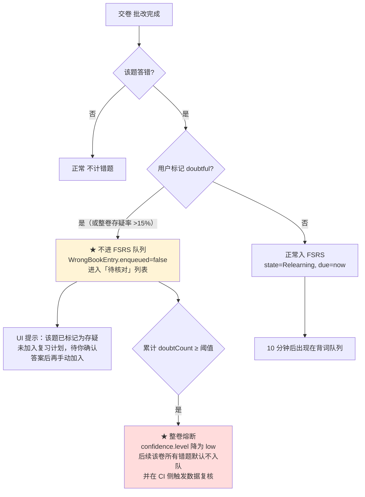

> **为什么这条重要**（team-lead 特别指出）：数据源本身不可验证（无官方底本）。如果一份**错误的**标准答案进入 FSRS，用户会反复被"错题"折磨，且**永久污染复习调度**——这比答案错误本身危害更大。存疑题不自动入队，把决策权交还给用户。

### 3.6.4 减损③：禁用词清单与 CI 检查

**禁用词清单（8 词，仓库全局禁止）**

| # | 禁用词 | 禁止原因 |
|---|---|---|
| 1 | `官方真题` | 暗示官方来源，且不实 |
| 2 | `官方答案` / `官方标准答案` | 官方从不公布，属虚假陈述 |
| 3 | `官方发布` / `官方版` | 同上 |
| 4 | `教育部考试院认证` / `考试中心授权` | 我们从未获得任何授权 |
| 5 | `真题原卷` | 强化"完整官方卷"的误导 |
| 6 | `权威真题` | 同上 |
| 7 | `全真模考` | v1.3 起听力板块材料受限，此表述不实（见 3.6.2） |
| 8 | `425 分预估` / `710 分换算` | 与 `scoreScaleNote:'objective-only'` 冲突（R9） |

**CI 检查规则**

> 🔴 **门禁唯一实现 = `scripts/check-forbidden-words.ts`**（**v1.6.1**：改为 `import` QA 的 `tests/fixtures/forbidden-words.ts` 的 `GATE_PATTERNS`，**不在 CI 里手写第二份正则**，杜绝漂移）。

```yaml
# .github/workflows/ci.yml — step（★ v1.6.2：单一真源 + 正向/逆向并行 + 扫描范围不变量）
# 扫描范围：src/** + README.md + public/data/ATTRIBUTION.md（自撰对外文案）
# 排除 docs/（合法引用禁用词）、tests/（fixture 必含禁用串）、public/data/** 语料（第三方/生成）
# 范围真源 = tests/fixtures/forbidden-words.ts 的 SCAN_ROOTS，脚本 import 之，拒绝双写
- name: 禁用词检查（fixture 自测 + 自撰文案扫描）
  run: pnpm tsx scripts/forbidden-words.ts
```

**等价 shell（仅供审阅；真源是 fixture）**：

```bash
grep -rniP \
  -e '(?<![非未不])官方(真题|答案|发布|版)' \
  -e '(?<![非未])考试(院|中心)(认证|授权)' \
  -e '真题原卷' -e '权威真题' -e '全真模考' \
  -e '(425|710)\s*分?\s*(预估|换算|折算)' \
  -e '(预估|换算|折算)[^。；，]{0,6}(425|710)' \
  --include='*.ts' --include='*.tsx' --include='*.html' \
  --include='*.json' --include='*.md' \
  --exclude-dir=node_modules \
  src/ README.md public/data/ATTRIBUTION.md
```

> ⚠️ **范围为"自撰对外文案"，不是"整个 public/"**：`public/data/**` 是第三方语料与生成产物（实测含 `"freqRank": 425/710`、`"zh": "官方的"` 等**非文案**内容），**不纳入全文扫描**；其中唯一自撰且对用户展示的 `ATTRIBUTION.md` 单独纳入。数据侧自撰字段（`provenanceLabel` 等）改由 `verify-papers.ts` **白名单断言**守住（见 `docs/04 §5.7.3`）。

> 🔴 **v1.6 / v1.6.1 修正说明（四处，全部实测发现）**：
> 1. **原规则会红在自身定义文件上**：原扫描路径含 `docs/02-实现方案.md`，而本文件的**禁用词清单表**与 **CI 规则示例**本身即含这些词 → 规则按原文实现必然失败。→ **扫描范围收敛为 `src/**` + `README.md` + `public/data/ATTRIBUTION.md`，排除 `docs/**`**；**v1.6.2 再排除 `tests/**`（fixture 必含禁用串）与 `public/data/**` 语料**（见 `docs/04 §5.7`）。
> 2. **原正则会误伤免责文案**：`官方(真题|答案|发布|版)` **命中 `非官方发布`**——而它是 T2 / `<ConfidenceBanner>` / 页脚**必须出现**的合规文案。→ 加负向断言 `(?<![非未不])`。
> 3. **正向正则有假阴性**：抓不到语序反转 `预估总分 710` → **补逆向检测**（`scoreReverse`）；正向同时补 `折算`。
> 4. 🔴 **逆向检测会命中原 T5**（`折算…710`），与「放行 710 分制」**不可兼得** → **裁决：改写 T5 为无数字版 T5-v2**（见 §3.6.3 ③），并令 **门禁与文案同批交付（同一 PR）**。详见 `docs/04 §5.6`。

**允许的表述（正面清单，供编码与文案参考）**

| 场景 | 允许表述 |
|---|---|
| 套卷标题 | `2026年6月 四级真题（第三方整理版）` |
| 功能名 | **`真题练习`**（**v1.6**：弱化命名，弃用「模考」——无听力时「模考」构成完整性误导） |
| 答案标注 | `参考答案（未经官方核对）` |
| **🔴 否定式表述（v1.6 明确允许）** | **`非官方发布`** / `非官方版` / `未经官方核对`——**免责声明必需**，负向断言 `(?<![非未不])` 放行；**不得**因此判定违规 |
| 全局页脚 | `本站试题内容来源于第三方公开整理，非官方发布，仅供个人学习使用` |

### 3.6.5 减损④：killSwitch 设计

**配置结构**

```jsonc
// public/data/papers/index.json —— 构建产物，但可由轻量 workflow 单独更新
{
  "version": "2026.10.05",
  "killSwitch": {
    "disabled": false,                    // true = 全站下线 original 卷
    "reason": "",                         // 下线原因，展示给用户
    "effectiveAt": null                   // 生效时间戳
  },
  "papers": [ /* … */ ]
}
```

**三层生效机制（双保险 + 兜底）**

| 层 | 机制 | 生效时长 | 说明 |
|---|---|---|---|
| **L1 本地轻量开关** | 专用 workflow `killswitch.yml`：**只**修改 `index.json` 的 `killSwitch` 字段并触发 Pages 部署，**不跑完整 build** | **< 2 分钟** | 主路径。满足"不重新构建即可下线" |
| **L2 远程开关（可选，默认关闭）** | `settings.killSwitchUrl` 指向一个远程 JSON，App 启动时带 5s 超时 fetch；命中 `disabled:true` 立即生效 | 即时 | 用于极端情况（连 push 都来不及）。**默认关闭**，避免引入不必要的外部依赖 |
| **L3 前端硬编码兜底** | 常量 `EMERGENCY_DISABLE_ORIGINAL: boolean`，发布 hotfix 版本时置 `true` | 需发版（约 10 分钟） | 最后兜底 |

**下线后的用户端形态**

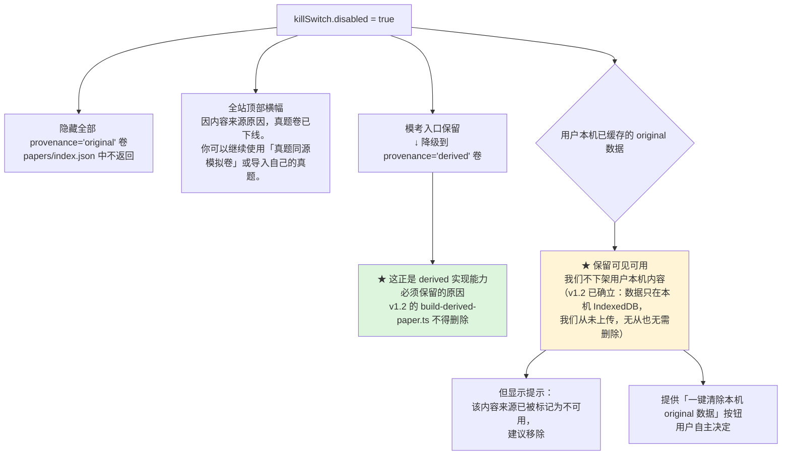

> **注意**：L1 只能阻止**后续分发**，无法回收已 clone/fork 的副本——这正是 R11 中"不可逆"风险的体现，也解释了为什么必须预留 L3 与止损预案。

### 3.6.6 保留项确认清单（不得因改走 `original` 而删除）

| # | 保留项 | 状态 | 理由 |
|---|---|---|---|
| 1 | **用户导入通道** | ✅ **不可砍** | 合规兜底 + 将来获授权后切换入口 + 用户自备音频的唯一注入路径（3.6.2 状态①依赖它） |
| 2 | **`PaperSource` 接口（A4）** | ✅ 保留 | 切换来源代码零改动，是 killSwitch 能生效的前提 |
| 3 | **`provenance` 三态** | ✅ **全保留** | `original`=当前默认、`derived`=killSwitch 降级目标、`user-imported`=兜底 |
| 4 | **`derived` 实现能力** | ✅ **不得删除** | 它是 killSwitch 触发后的唯一降级目标；且 `build-derived-paper.ts` 已设计完成（3.2.4） |
| 5 | **查重门禁 `check-plagiarism.ts`** | ✅ 保留并**反转用途** | v1.2 用于"防止自撰沦为抄袭"；v1.3 增用途：**检测我们收录的 `original` 内容是否与第三方整理件高度雷同**（相似度 >95% → 提示来源存疑，需人工复核），作为**来源审查与质量辅助手段** |
| 6 | **三级降级 / 断点续考 / `scoreScaleNote`** | ✅ 保留 | 断点续考与 `objective-only` 在 `original` 下**更重要**（答案不可信时，更不能给换算分） |
| 7 | **音频 `ExamAudioService`** | ✅ 保留 | 状态①（用户自备）与②（TTS 合成）都要用 |

### 3.6.7 🔴 数据工作的替代性验收方案

> **前提事实**：官方从不公布真题与标准答案 → **`original` 卷的数据工作没有客观验收基准**。我们不能声称"数据已核对正确"，只能说明"数据达到了某种一致性水平"。

**建议的人天与验收**

| 工作项 | 人天 | 传统验收 | **替代性验收（建议）** |
|---|---:|---|---|
| PDF/Word 抽取与结构化 | 2.0 | ❌ 无底本 | ✅ **结构完整性**：题号 1–57 连续、每题答案非空、选项数 = 4、分值合计 = 710 |
| **多来源交叉比对** | 1.5 | ❌ | ✅ **一致性验收**：同一题在 ≥2 个独立来源（如新东方 + koolearn + 0609x）答案一致 → `answerCrossChecked=true`；不一致 → 标 `low` 并在 UI 提示"该题答案存在分歧" |
| 脏数据清洗 | 1.0 | ❌ | ✅ **格式验收**：正则扫描残留整理标记（如实证发现的 `xxb`）、OCR 断行、选项错位；清洗前后各跑一次，差异率为 0 才通过 |
| 听力 transcript 补全 | 1.5 | ❌ | ✅ **存在性验收**：只判"有无"，不判"对错"。缺失则 `hasTranscript=false`，由 3.6.2 四态兜底 |
| 解析撰写/校对 | 1.0 | ❌ | ✅ **抽样人工核对 + 置信度标注**：每卷抽 20% 题目人工核对，记录一致率写入 `spotCheckRatio` |
| **合计** | **≈ 7.0**（区间 5–7） | — | — |
| killSwitch + 存疑标记 | +1.0 | ✅ 有 | 常规功能验收（演练一次即可） |

**四条验收原则（替代"正确性验收"）**

1. **只做一致性验收，不做正确性验收** —— 明确承认我们无法验证正确性，改为验证"多个来源是否一致"。
2. **置信度必须显式暴露给用户** —— `ExamConfidence` 落库并展示，用户有权知道可靠性边界。
3. **存疑率熔断** —— 用户标记存疑累计达阈值 → `confidence.level` 降为 `low` → 该卷错题默认不进 FSRS → CI 侧触发数据复核。这是**用真实使用数据反向校正数据质量**的闭环。
4. **不验收的部分必须降级呈现而非静默展示** —— 听力缺 transcript 就走 `text-only`，不假装是完整听力题。

---

# 第四部分：目录结构

```
cet4-master/
├── docs/                                   # 文档（已有 01 / 02）
├── public/
│   ├── data/                               # ★ 构建产物，不进 JS bundle，运行时 fetch
│   │   ├── manifest.json                   # 数据版本 + 分片清单 + sha256 + 生成时间
│   │   ├── words.index.core.json           # Top2104 轻量索引（首屏必取，列式）
│   │   ├── words.index.full.json           # 全量索引（后台预取）
│   │   ├── words/chunk-001.json … chunk-010.json
│   │   ├── sentences/chunk-001.json … chunk-010.json
│   │   ├── papers/index.json               # ★ 真题目录（年份/套次/题量/是否有音频）
│   │   ├── papers/audio-index.json         # ★ 音频 URL 索引（仅字符串，无二进制）
│   │   ├── papers/derived-cet4-001.json …  # ★ v1.2 内置「真题同源模拟卷」provenance='derived'
│   │   ├── papers/<paperId>.json           # 用户导入的套卷 provenance='user-imported'（按套懒加载）
│   │   ├── papers/original-*.json          # 🔴 CI 门禁禁止入库（仅列此说明，实际不得存在）
│   │   └── ATTRIBUTION.md                  # ★ 数据来源署名 + License 声明（C5 强制）
│   ├── icons/                              # PWA 图标
│   └── _headers                            # Cloudflare Pages 缓存头（可选）
│
├── scripts/                                # 数据管线（Node + TS，构建期执行）
│   ├── data/raw/                           # 原始数据源（.gitignore，绝不入库）
│   ├── data/generated/                     # 管线中间产物
│   ├── build-wordbank.ts                   # 清洗 → 词频排序 → tier 分档 → 分片
│   ├── build-sentences.ts                  # 真题例句抽取 → 词形定位(span) → 分片
│   ├── build-papers.ts                     # ★ 套卷 → ExamPaper/Section/Question 结构化（通用）
│   ├── build-derived-paper.ts              # ★ v1.2 生成「真题同源模拟卷」：结构/考点取自近三年语料 + 内容自撰 + TTS 合成音频
│   ├── build-derived-spec.ts               # ★ 从近三年语料提取 DerivedSpec（结构/分布/考点词，事实性数据）
│   ├── check-plagiarism.ts                 # ★ 自撰内容与真题语料的句级相似度查重门禁（>60% fail）
│   ├── verify-papers.ts                    # ★ 套卷体检：题号连续/答案非空/分值合计 → CI 门禁
│   ├── verify-data.ts                      # ★ 词库体检：覆盖率/重复/缺字段 → CI 门禁
│   └── LICENSE-NOTICE.ts                   # 生成 ATTRIBUTION.md
│
├── src/
│   ├── main.tsx                            # 入口：挂载 Providers + Router
│   ├── App.tsx
│   ├── router.tsx                          # 路由表（含懒加载边界）
│   │
│   ├── app/                                # 应用外壳
│   │   ├── providers/ThemeProvider.tsx     # 深浅色（R09）
│   │   ├── providers/DbProvider.tsx        # Dexie 打开 + 版本迁移 + 启动自检
│   │   ├── providers/BootstrapGate.tsx     # ★ 首次数据加载进度门（含失败重试）
│   │   ├── ErrorBoundary.tsx
│   │   └── layout/AppShell.tsx / BottomTabBar.tsx / TopBar.tsx
│   │
│   ├── domain/                             # ★ 纯函数层，零 React / 零 IO（铁律 A1）
│   │   ├── fsrs/
│   │   │   ├── scheduler.ts                # ts-fsrs 封装：next(card, rating, now)
│   │   │   ├── adapter.ts                  # ReviewCard ⇄ ts-fsrs Card（Date ⇄ epoch）
│   │   │   ├── rating-map.ts               # RATING_MAP + 犹豫降级规则
│   │   │   └── __tests__/*.test.ts         # ★ 必须有单测（PRD 坑 #5）
│   │   ├── word/
│   │   │   ├── selector.ts                 # ★ 词频优先选词（差异化①的核心算法）
│   │   │   ├── tier.ts                     # freqRank → tier 映射
│   │   │   └── types.ts
│   │   ├── exam/types.ts                   # ★ v1.1 套卷/答题卡/attempt 全部类型
│   │   ├── exam/grader.ts                  # ★ 客观题自动批改 + 分项得分
│   │   ├── exam/sectionPlan.ts             # ★ v1.6 板块计划（sectionMeta 驱动，铁律 A9；见 docs/04 §2）
│   │   ├── exam/result.ts                  # ★ v1.6 结果视图（三层表达，零 425/710）
│   │   ├── exam/timer.ts                   # ★ 倒计时（ticks 累加，防切后台误差）
│   │   ├── exam/answerSheetModel.ts        # ★ 答题卡纯函数：标记/跳题/完成度统计
│   │   ├── exam/__tests__/*.test.ts        # ★ 批改与分项错误注入单测
│   │   ├── quiz/generator.ts               # 四选一 / 语境填空出题（含干扰项采样）
│   │   ├── quiz/grader.ts                  # 批改 + 错题提取
│   │   ├── listening/segmenter.ts          # ⏸️ v1.6 不实现（听力精听停用，保留位）
│   │   ├── listening/dictation-check.ts    # ⏸️ v1.6 不实现（听力精听停用，保留位）
│   │   └── stats/aggregate.ts / streak.ts / heatmap.ts
│   │
│   ├── data/                               # 数据访问层
│   │   ├── db/db.ts                        # Dexie schema（见 3.5）
│   │   ├── db/migrations.ts
│   │   ├── sources/WordSource.ts           # ★ 接口定义（C5 合规隔离）
│   │   ├── sources/StaticJsonWordSource.ts # 默认实现：读 public/data
│   │   ├── sources/RemoteWordSource.ts     # P2 预留：读自建 CDN
│   │   ├── sources/PaperSource.ts          # ★ v1.1 套卷源接口（内置样例 / 用户导入 同构）
│   │   ├── sources/BuiltinPaperSource.ts   # 读 public/data/papers/*.json
│   │   ├── sources/UserImportPaperSource.ts# ★ 读用户导入的 JSON（仅落本机 IndexedDB）
│   │   ├── loader/paperLoader.ts           # ★ 按 paperId 懒加载套卷 + 写入 sections/questions
│   │   ├── loader/manifest.ts              # 版本比对 + sha256 校验
│   │   ├── loader/chunkLoader.ts           # fetch + 解析 + 批量入库
│   │   ├── loader/cacheWarmer.ts           # requestIdleCallback 后台预取
│   │   ├── repos/wordRepo.ts / cardRepo.ts / wrongRepo.ts
│   │   ├── repos/logRepo.ts / paperRepo.ts / settingsRepo.ts
│   │   └── WordSourceProvider.tsx          # 依赖注入容器
│   │
│   ├── services/                           # 编排层（副作用边界，铁律 A2）
│   │   ├── studySession.ts                 # ★ 背词会话状态机（选词/评级的唯一入口）
│   │   ├── reviewQueue.ts                  # 到期队列构建 + 上限裁剪
│   │   ├── wrongBookService.ts             # ★ 错题 → FSRS 入队（差异化④）
│   │   ├── examSession.ts                  # ★ 模考状态机（倒计时 + 答题卡 + 断点续考）
│   │   ├── audio/ExamAudioService.ts       # ★ v1.1 真题音频：分段加载 + 三级降级 + 缓冲进度
│   │   ├── audio/audioIndex.ts             # 读 audio-index.json + mirrors 轮换
│   │   ├── speech/SpeechProvider.ts        # 接口（C3 同理，可替换）
│   │   ├── speech/YoudaoProvider.ts        # 有道 TTS type=1/type=2
│   │   ├── speech/WebSpeechProvider.ts     # 降级方案
│   │   ├── speech/unlock.ts                # ★ 浏览器自动播放手势解锁
│   │   ├── ai/AiProvider.ts                # ★ 仅接口，MVP 不实接（C3）
│   │   ├── ai/NullAiProvider.ts            # 恒返回 null
│   │   └── backup/export.ts / import.ts    # R17 进度 JSON 导入导出
│   │
│   ├── store/                              # Zustand（薄壳，只做 UI 状态镜像）
│   │   ├── useStudyStore.ts / useVocabStore.ts
│   │   └── useSettingsStore.ts / useStatsStore.ts / useExamStore.ts
│   │
│   ├── ui/
│   │   ├── primitives/                     # 自研 14 个基础组件（Tailwind）
│   │   ├── charts/LineChart.tsx / DonutChart.tsx / HeatmapCalendar.tsx
│   │   └── word/WordCard.tsx / Phonetic.tsx / SenseList.tsx
│   │         / ExamSentenceList.tsx / RatingBar.tsx
│   │
│   ├── features/                           # 页面级组装（路由对应）
│   │   ├── dashboard/DashboardPage.tsx
│   │   ├── learn/LearnPage.tsx             # ★ 最高频页面
│   │   ├── learn/ReviewPage.tsx
│   │   ├── word-detail/WordDetailPage.tsx  # 真题例句 + 双向跳转
│   │   ├── wrong-book/WrongBookPage.tsx
│   │   ├── practice/QuizPage.tsx / ClozePage.tsx / RapidPage.tsx
│   │   ├── listening/ListeningPage.tsx     # ⏸️ v1.6 作废（听力精听停用）
│   │   ├── mock/MockExamPage.tsx           # ★ v1.6 真题练习主界面（3 板块；原 v1.1「完整模考」）
│   │   ├── mock/AnswerSheetPanel.tsx       # ★ 答题卡（分组 / 标记待定 / 跳题）
│   │   ├── mock/AudioPlayerBar.tsx         # ⏸️ v1.6 不实现（无听力音频；保留位）
│   │   ├── mock/ResultPage.tsx             # ★ 结果页（T1–T14 三层表达，零 425/710）
│   │   └── mock/NoListeningNotice.tsx      # ★ v1.6 T1 开始前声明（须勾选）
│   │   ├── papers/PapersPage.tsx           # 套卷列表 + 导入入口
│   │   ├── stats/StatsPage.tsx
│   │   └── settings/SettingsPage.tsx       # 含导入导出
│   │
│   ├── hooks/
│   │   ├── useKeyboard.ts                  # ★ R04 单手键盘流 Space/←/→
│   │   ├── useDueCards.ts / useTts.ts / useDailyGoal.ts
│   │   └── useStoragePressure.ts           # 配额监控（风险 R5）
│   │
│   └── lib/date.ts / id.ts / invariant.ts / result.ts / cn.ts
│
├── tests/e2e/                              # Playwright，M3 引入
├── .github/workflows/
│   ├── ci.yml                              # lint + typecheck + vitest + verify-data
│   └── deploy.yml                          # 构建 → GH Pages（含 .nojekyll）
├── vite.config.ts / tsconfig.json / tsconfig.node.json
├── tailwind.config.ts / postcss.config.js
├── vitest.config.ts / eslint.config.js / package.json
└── CLAUDE.md                               # 写入三条架构铁律，供 AI 编码时遵守
```

**目录职责一句话说明**

| 目录 | 职责 | 能否依赖 UI |
|---|---|---|
| `scripts/` | 数据清洗与分片，**构建期**执行，产物落 `public/data` | — |
| `public/data/` | 静态数据分片，运行时 `fetch`，**不进 bundle** | — |
| `src/domain/` | 纯算法：FSRS、词频选词、出题、批改、统计 | ❌ 禁止 |
| `src/data/` | 存储与加载：Dexie schema、WordSource、分片 loader、repos | ❌ 禁止 |
| `src/services/` | 编排：会话状态机、队列、TTS、导入导出 | ❌ 禁止（只被 UI 调用） |
| `src/store/` | Zustand 状态镜像 | ✅ |
| `src/ui/` | 无业务的纯展示组件 | ✅ |
| `src/features/` | 页面组装，唯一允许拼装 service + store + ui 的地方 | ✅ |

---

# 第五部分：关键流程时序图

## 5.1 冷启动与数据加载流程

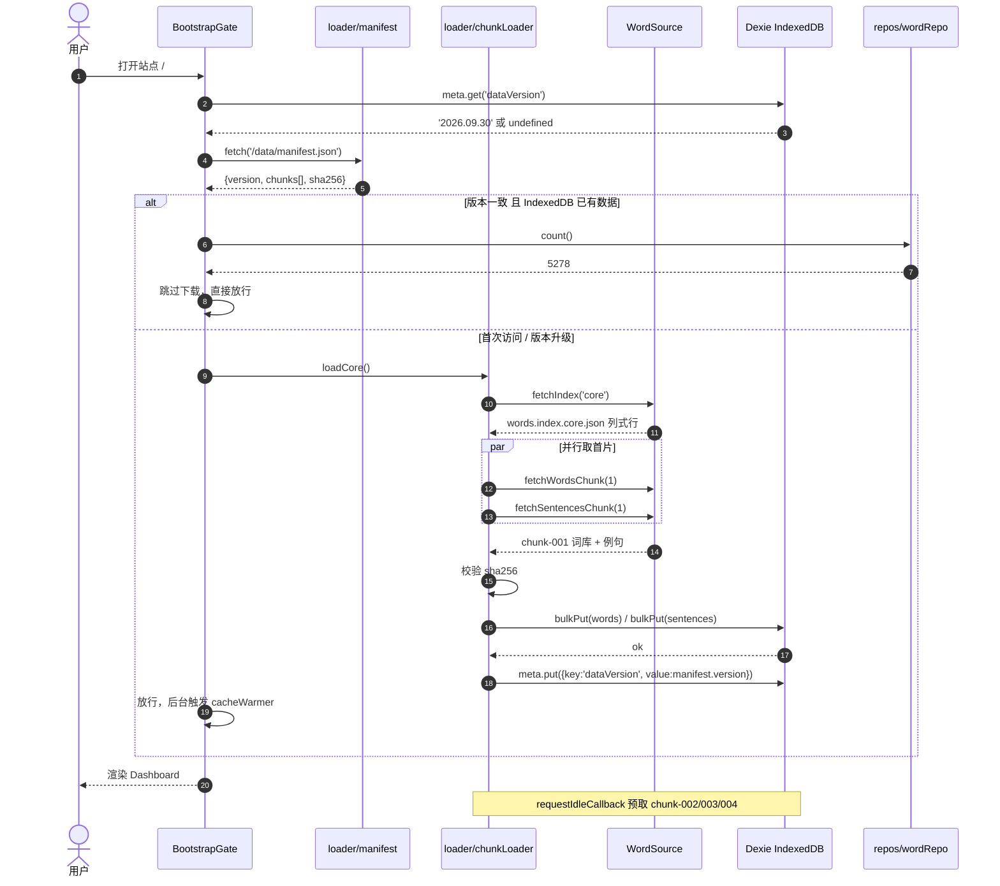

## 5.2 背词主流程（选词 → 学习 → 评分 → FSRS 排期）

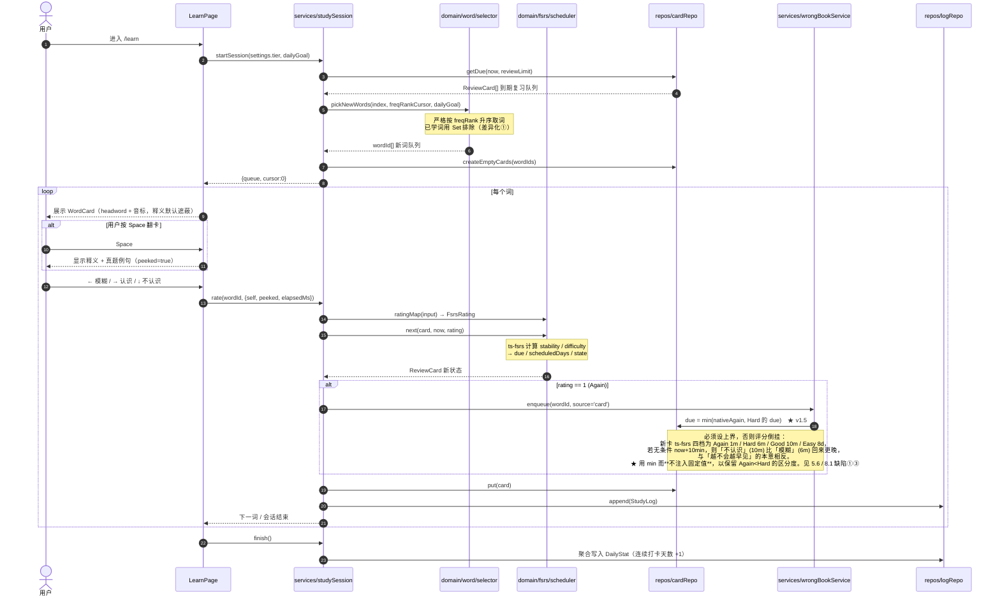

## 5.3 完整真题套卷模考流程（v1.1 重写）

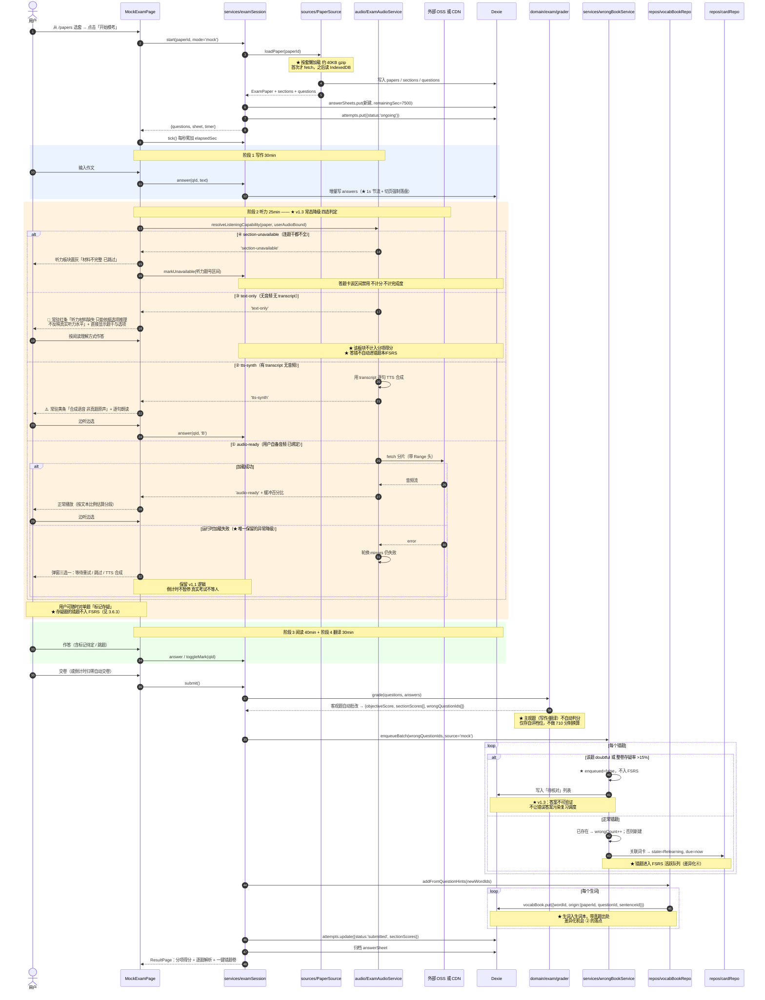

### 5.3.1 断点续考（模考中途刷新 / 误关页面）

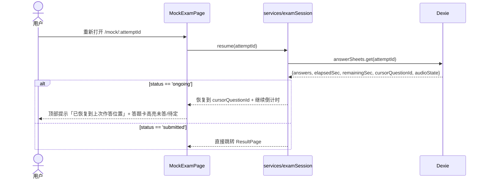

## 5.4 听力精听流程（基于 `ExamSection.transcript`）

> ⏸️ **v1.6 状态：本流程作废（不实现）。** 听力板块停用 → 无 `transcript` 数据源 → 精听/听写无对象。本节保留为预留位文档。

> **与模考听力的关系（v1.1）**：模考里的听力是「一次性、限时、不可回放」的**考试态**；精听是「反复、可回放、逐句」的**训练态**。二者**复用同一份 `TranscriptLine[]` 与同一段音频 track**，只是交互与音频控制粒度不同——这是 v1.1 数据模型统一带来的直接收益（v1.0 里两者是割裂的）。

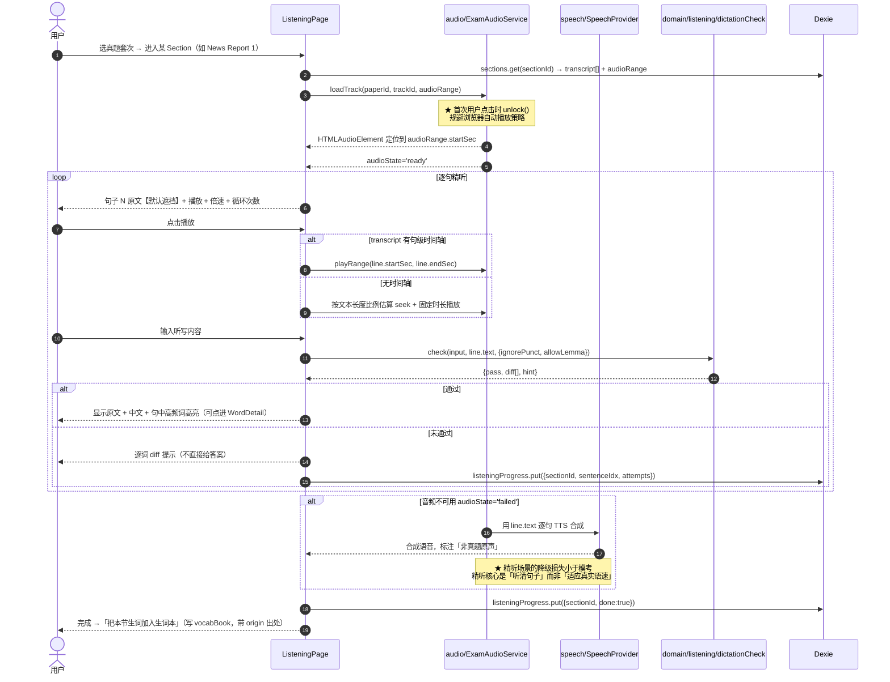

## 5.5 补充：单词 ↔ 真题双向跳转（差异化机会 ②）

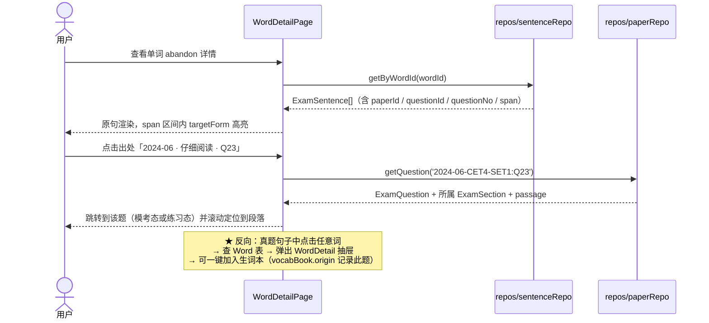

---

## 5.6 FSRS 评分顺序不变式与基线实测值（v1.4 新增）

> **本节由 M1 实施缺陷驱动**：原设计只约束了「Again = 10 分钟」这一**绝对值**，未约束四档之间的**相对顺序**，导致实现产生评分倒挂。本节把顺序本身上升为**必须被测试断言的不变量**。

### 5.6.1 为什么需要顺序不变式

间隔重复的第一性原理是：**用户越不会的词，应当越早再见**。因此对同一次评分，四档的 `due` 必须满足：

```
due(Again) <= due(Hard) <= due(Good) <= due(Easy)
```

这**不是建议，而是算法正确性的定义**。原实现无条件写 `due = now + 10min`（Again），而 ts-fsrs 新卡 Hard 算出 6min → `10min > 6min` → **「不认识」比「模糊」回来更晚**，语义完全颠倒。

### 5.6.2 实施修复（v1.5 定稿：保留原生值 + 上界钳制）

**两次迭代的完整历程**（保留过程，因为"为什么不能简单钳到 10min"本身就是设计依据）：

| 迭代 | 写法 | 结果 | 问题 |
|---|---|---|---|
| ❌ 原始 | `due = now + 10min`（无条件） | 新卡：Again 10m / Hard 6m | **评分倒挂**：Again > Hard |
| ⚠️ v1.4 首次修复（commit `556e30b`） | `min(now + 10min, Hard.due)` | 新卡：Again 6m / Hard 6m | 倒挂消除 ✅，但 **`Again === Hard`，丢一档区分度** ❌ |
| ✅ **v1.5 定稿** | **`min(nativeAgain, Hard.due)`** | 新卡：Again ≈1m / Hard 6m | **严格 `Again < Hard < Good`，区分度恢复** ✅ |

```ts
/** services/wrongBookService.ts — requeueSameDay() —— ★ v1.5 定稿 */
// 设计要点：Again 保有自己的「原生早度」，只用 min 做上界保护，不注入固定值。
//
// 【为什么必须有上界】
//   新卡 ts-fsrs 四档（learning_steps = ["1m","10m"]）生成为
//   Again 1m / Hard 6m / Good 10m / Easy 8d。
//   若像原始实现那样无条件写 now + 10min，Again(10m) 会晚于 Hard(6m)
//   → 评分倒挂，与「越不会越早见」的本意相反。见 8.1 缺陷①。
//
// 【为什么是 min(nativeAgain, hardDue) 而不是 min(now + 10min, hardDue)】
//   注入固定 10min 再钳制，会得到 Again === Hard === 6m：
//   倒挂虽消除，但「完全不认识」与「有点模糊」用同一间隔回来，丢失一档区分度
//   （v1.4 首次修复的次生损失，见 8.1 缺陷③）。
//   改为保留原生值后：
//     · 新卡   → Again ≈ 1m（原生 learning step 1）< Hard 6m  ← 严格区分
//     · 成熟卡 → Again = 10m（relearning_steps = ["10m"]）    ← 当日重现语义不变
//   即：min 只负责「不倒挂」这一件事，间隔阶梯仍由 ts-fsrs 决定。
const nativeAgainDue = scheduler.next(card, 1 /* Again */, now).due.getTime();
const hardDue        = scheduler.next(card, 2 /* Hard */,  now).due.getTime();
due = Math.min(nativeAgainDue, hardDue);
```

> **一句话概括设计原则**：**用 `min` 只做"不倒挂"的保险，不用它做"改间隔"的手段。** 间隔阶梯的所有权归 ts-fsrs。

### 5.6.3 回归参照基线（⚠️ 仅用于人工复核与趋势观察，**不写入断言**）

| 场景 | Again | Hard | Good | Easy | 不变式 |
|---|---:|---:|---:|---:|:--:|
| **新卡**（state = New） | **≈1 min** | **≈6 min** | ≈10 min | ≈11520 min（8d） | ✅ 1 < 6 < 10（**严格**） |
| **成熟卡**（state = Review） | **10 min** | ≈364 d | ≈498 d | — | ✅ 10min ≤ 364d ≤ 498d |

> ⚠️ **两条重要说明**
> 1. 上表数值是**参照区间**，用于人工复核与回归趋势观察。**验收标准本身只写不变量与区间，不写具体数值**（见 7. M1 验收标准）。原因见 5.6.5：写死数值会造成"优化反而让测试挂掉"。
> 2. v1.4 首次修复后的基线是 Again **6.0 min**（= Hard）。v1.5 后变为 **≈1 min**，**这是预期的、正确的变化**——若某次改动让 Again 又回到 6min，说明 `nativeAgain` 被误改成注入值，属回归。

### 5.6.4 架构师评估意见与采纳记录（v1.5：已采纳并实施）

**结论：认同修复方向与裁决结果。不建议回退为「全卡 10 分钟并接受倒挂」。**

> ✅ **v1.5 状态更新**：架构师在 v1.4 提出的保留意见（`Again === Hard` 丢区分度）**已由 team-lead 采纳，并先于 M1 验收执行**。5.6.4 的 (3) 由「可选建议」升级为「**正式实现**」；(2) 的代价分析**保留为决策依据留痕**——它解释了**为什么不能简单地把 Again 钳到 10min**，是本次定稿的原始论据，不因问题已解决而删除。

**(1) 认同的部分**

| 项 | 我的评估 |
|---|---|
| 倒挂是真缺陷 | ✅ 认同。`due(Again) > due(Hard)` 使算法语义颠倒，这不是「参数调优」，而是**正确性错误** |
| 修复方向正确 | ✅ 认同。引入顺序上界（`min`）是消除倒挂的最直接手段，且保留了「当日重现」的业务意图 |
| **不可回退到全卡 10min** | ✅ **强烈认同**。接受倒挂 = 承认「越不会的词越晚复习」，会从根上破坏 FSRS 的价值主张，也与 PRD 常见坑 #5（伪间隔重复）踩同一个坑。**该回退方案应明确否决。** |

**(2) 代价分析（**保留为决策依据留痕**）** —— v1.4 首次修复的副作用：

`min(now + 10min, Hard.due)` 在新卡场景把 Again 从**原生 1min 推迟到 6min**：

- **好处**：消除倒挂 ✅
- **代价**：`Again === Hard`（同为 6min），**「完全不认识」与「有点模糊」在同日重现中不再区分** ❌

严格说，不变量是 `<=`（非严格），所以 `Again == Hard` **不违约**。但从产品语义看，「完全不认识」与「有点印象」用同样的间隔回来，**丢失了一档区分度**。

> 📌 **这段分析的价值**：它解释了**为什么不能简单地"把 Again 钳到 10min"或"统一取 Hard 的值"**。若要消除倒挂，"钳制"是最直觉的解法；但直觉解法的代价是**把两档压成一档**。真正的解法是**让 `min` 只做保险、不改间隔**。此论证是 v1.5 定稿的原始依据，故保留。

**(3) 改进方案 —— ✅ v1.5 已采纳并实施（不再是"可选建议"）**

`min(now + 10min, Hard.due)` → **`min(nativeAgain, Hard.due)`**：

```ts
const nativeAgainDue = scheduler.next(card, 1 /* Again */, now).due.getTime();
const hardDue        = scheduler.next(card, 2 /* Hard */,  now).due.getTime();
due = Math.min(nativeAgainDue, hardDue);
```

| 项 | 状态 |
|---|---|
| **收益** | 新卡 Again ≈1min < Hard 6min，**恢复「越不会越早见」的严格区分**；成熟卡语义完全不变（仍 10min） |
| **风险** | 1min 重现会让卡片在当前会话中很快再次出现。对 `dailyGoal = 20` 的会话约每 1–2 张卡复现一次 |
| **风险评估** | **可接受**。「完全不认识」的词早复现恰恰是期望行为（Anki 的 1min learning step 即如此）。**连点 Again 也不会加速**——ts-fsrs 保持 step，最坏是每 1min 一次，不会"越刷越快" |
| **附加决策** | ❌ **不引入** `settings.againStepMin` 可调项。理由：MVP 调参面越小越好（与 R7「不调参」精神一致）；该可调项列入 **M3 调优项** |
| **残留风险与缓解** | 见 **5.6.6**（空队列语义、计数幂等、队列幂等） |

**(4) 关于验收标准措辞的建议 —— ✅ v1.5 已采纳**

**不要把「Again = 6.0min」写死为期望值**。原因：采纳 (3) 后 Again 变成 ≈1min，写死的基线会产生「**改进反而让测试挂掉**」的反效果。

**改为只断言不变量 + 区间**（正式写入 M1 验收标准与 5.6.5）。

### 5.6.5 A8 写实：正例与反例（v1.5 补充）

> 铁律 A8 经**本次两轮修正双重验证**，此处给出可直接照抄的写法。

```ts
// ✅ 正例：断言「关系」，不写死「数值」——改进 Again 间隔时不会被误伤
expect(dueAgain).toBeLessThan(dueHard);                        // ★ 严格小于：保证区分度
expect(dueHard).toBeLessThanOrEqual(dueGood);
expect(dueGood).toBeLessThanOrEqual(dueEasy);
expect(sameDay(dueAgain, now)).toBe(true);                     // 同日重现语义
expect(dueAgain - now).toBeLessThanOrEqual(10 * 60_000);       // 不超过当日重现上限

// ❌ 反例：硬编码魔法数字——把 Again 从 6min 优化到 1min 时会误报失败
// expect(dueAgain - now).toBe(6 * 60_000);

// ❌ 反例：只断言各自绝对值（这正是漏掉评分倒挂的原因）
// expect(dueAgain - now).toBe(10 * 60_000);
// expect(dueHard  - now).toBe(6 * 60_000);   // ← 两条都"对"，但 Again > Hard 没人发现
```

**A8 检查清单（Code Review 用）**

| # | 检查项 |
|---|---|
| 1 | 测试文件里是否只有 `toBe(<数值>)` 而**没有任何关系断言**（`toBeLessThan` / `toBeLessThanOrEqual` / 单调性 / 守恒）？→ 若算法有多个输出，必须补关系断言 |
| 2 | 多档位/多分支输出，是否断言了**档位之间的顺序**？ |
| 3 | 数据筛选/分页方法，是否断言了**边界关系**（全被过滤时返回什么）？ |
| 4 | 修复一个缺陷后，是否补了**"这类语义错误不会再发生"的不变量测试**，而不只是"这个数值现在对了"？ |

### 5.6.6 🆕 残留风险与 M1 最小必要缓解措施（v1.5 新增）

> **问题**：在「Again 用原生 1 分钟」方案下，是否还有残留的语义风险？
> **结论：有 3 处，其中 1 处必须在 M1 内缓解。**

**残留风险 R-A1：空队列被误判为「今日完成」** 🔴 **必须在 M1 缓解** → ✅ **已缓解（本 commit）**

| 项 | 内容 |
|---|---|
| **场景** | `dailyGoal = 20`，用户第 1 张卡点 Again（due = now+1min），随后以约 3 秒/张的速度刷完剩余 19 张 → **约 1 分钟刷完**。此时第 1 张卡恰好到期或即将到期 |
| **问题** | 若 `studySession` 在队列空时直接显示「今日完成 🎉」，而**未检查"是否还有卡片在 60 秒内到期"**，那张 Again 的卡会被**静默丢弃**——用户以为完成了，实际有未复习的卡 |
| **为什么 1min 方案放大了它** | 10min 方案下，用户刷完 20 张时 Again 的卡远未到期，会话自然结束，不会暴露这个问题；**1min 方案让"队列暂空但仍有到期卡"成为高频路径** |
| **最小缓解** | 队列空时**区分两种状态**：<br>① 无任何 `due <= now + 60s` 的卡 → 显示「今日完成」<br>② 存在 `due <= now + 60s` 的卡 → 显示「还有 N 张卡片将在 ~X 秒后到期」+ 倒计时 + 两个按钮：`稍等片刻` / `结束本次`<br>**不得**把 ② 静默呈现为 ① |
| **验收** | 单测：构造"队列已空但存在 1 张 `due = now + 30s` 的卡"，断言会话状态为 `waiting` 而非 `completed` |

**残留风险 R-A2：连续 Again 导致计数虚高** 🟠 **建议在 M1 缓解（成本低）** → ✅ **已缓解（本 commit）**

| 项 | 内容 |
|---|---|
| **场景** | 同一 session 内同一张卡被评 Again 2–4 次（1min 复现使之成为可能；10min 方案下用户通常已结束会话） |
| **问题** | ① `wrongBookService.enqueue()` 可能被调用多次 → 一次"不认识"事件被记成 4 次 `wrongCount`；② `studyLogs` / `DailyStat` 的 `newLearned`、`reviewed` 计数虚高 → **影响 G1 指标与打卡统计的真实性** |
| **最小缓解** | ① `enqueue()` 在**同一 session 内对同一 `wordId` 幂等**：`wrongCount` 只累加一次，后续仅更新 `lastWrongAt`；② `StudyAction` 明确区分**首次引入**（`learn`）与**当日重现**（`review`），`DailyStat.newLearned` 不重复计入同一词 |
| **验收** | 单测：同一 session 对同一 `wordId` 连评 3 次 Again，断言 `wrongCount === 1` 且 `newLearned` 只 +1 |

**残留风险 R-A3：队列内同一张卡出现多份** 🟠 **建议在 M1 缓解（正确性要求）** → ✅ **已缓解（本 commit）**

| 项 | 内容 |
|---|---|
| **场景** | `rate()` 每次都把卡重新入队；若实现未清理原待办项，同一张卡可能在队列中存在两份 → 用户连续看到同一张卡两次 |
| **最小缓解** | `studySession` 队列按 `wordId` **去重 + 按 `due` 排序**（优先队列）；补回归测试 |
| **验收** | 单测：对同一 `wordId` 连续 `rate()` 两次，断言队列中该 `wordId` 只出现一次 |

**明确「无需缓解」的部分**

| 项 | 结论 |
|---|---|
| 连点 Again 制造无限循环 / 越刷越快 | ✅ **无需缓解**。ts-fsrs 对 Learning 态再次 Again 保持同一 step，间隔不会递减，最坏为每 1min 一次 |
| 「卡住了」体感（仅 1 张卡时反复出现） | ✅ **无需缓解**。这是队列基数问题：`dailyGoal` 默认 20，实际队列远大于 1；且 R-A1 的倒计时 UI 已把"等待"变成可见的、可控的状态，而非"卡住" |
| 需要给 Again 加最短间隔/节流设置项 | ✅ **无需引入**。MVP 不引入可调项（R7 精神），列入 M3 调优项 |
| `elapsedMs` 评分启发式与 1min 复现冲突 | ✅ **无冲突**。复现时应答更快属正常，不触发"犹豫降级"反而更准确 |

---

# 第六部分：静态资源与体积策略（最大工程风险）

## 6.1 体积估算（按 gzip 保守口径，不依赖 brotli）

> GitHub Pages 对静态资源自动启用 gzip；brotli 支持未公开承诺，**不纳入预算**，若命中属意外收益。

### 词库（全量 5,278 词）

| 文件 | 条数 | 单条估算 | 原始体积 | **gzip 后** |
|---|---:|---:|---:|---:|
| `words.index.core.json`（列式） | 2,104 | ~45 B | ~95 KB | **≈ 22 KB** |
| `words.index.full.json`（列式） | 5,278 | ~45 B | ~237 KB | **≈ 55 KB** |
| `words/chunk-NNN.json` × 10（完整字段） | 528/片 | ~260 B | 137 KB/片 | **≈ 42 KB/片** |
| 词库小计（全量） | — | — | ~1.6 MB | **≈ 0.5 MB** |

### 真题例句（目标覆盖率 ≥ 90%）

| 文件 | 条数 | 单条估算 | 原始体积 | **gzip 后** |
|---|---:|---:|---:|---:|
| `sentences/chunk-NNN.json` × 10 | ~740/片 | ~240 B（英文句 120 + 译文 80 + 元数据 40） | 178 KB/片 | **≈ 55 KB/片** |
| 例句小计 | ~7,400 | — | ~1.78 MB | **≈ 0.55 MB** |

### 真题套卷文本（v1.1 重算 ⚠️ 原估算严重偏低）

> **v1.0 的 40 KB/套 是错的**——它只算了"题干+选项+答案+解析"，漏掉了**听力原文 transcript（约 16,000 字符）**和**阅读篇章全文（约 11,000 字符）**，而这两项在完整套卷里占大头。以下为可验算的推导：

**单套完整试卷的字符量构成**

| 板块 | 题量 | 构成明细 | 字符数 |
|---|---:|---|---:|
| 写作 Writing | 1 | 题目说明 300 + 参考范文 250 词≈1,500 | ~1,800 |
| **听力 Listening** | 25 | 25 题 ×(题干 80 + 4 选项×40 + 解析 100)=8,500<br/>**+ 听力原文 transcript ~16,000** | **~24,500** |
| **阅读 Reading** | 30 | **3 篇篇章 1,950 词 ≈ 11,000**<br/>+ 30 题 ×(题干 80 + 选项 160 + 解析 100)=10,200<br/>+ 选词填空词池 15×10=150 | **~21,350** |
| 翻译 Translation | 1 | 中文段 140 字 + 参考译文 180 词≈1,000 | ~1,300 |
| 元数据 / 分值表 / 答案键 | — | — | ~1,000 |
| **合计** | **57** | | **≈ 49,950 字符** |

**字符 → 字节 → 文件体积**

```
① 字节换算：英文约 70%(1B/字符) + 中文约 30%(3B/字符) → 加权 1.6 B/字符
   49,950 × 1.6 ≈ 79,920 B ≈ 78 KB
② JSON 结构化开销（key 名 / 引号 / 逗号 / 嵌套）+30%：
   78 KB × 1.3 ≈ 101 KB
③ 预留长尾（部分年份篇章更长、解析更详）：×1.2 ≈ 122 KB
   → 单套原始 ≈ 120 KB（取整，便于后续验算）
④ gzip（混合中英文，同类 JSON 通常压缩到原大小的 30–40%，取 35%）：
   120 KB × 0.35 ≈ 42 KB gzip
```

| 项目 | 原始 | **gzip** |
|---|---:|---:|
| 单套完整试卷 JSON | **≈ 120 KB** | **≈ 42 KB** |
| 10 套小计 | ≈ 1.2 MB | ≈ 0.42 MB |
| **20 套小计** | **≈ 2.4 MB** | **≈ 0.84 MB** |
| 20 套 × 4 个考次（若做多套卷） | ≈ 9.6 MB | ≈ 3.4 MB |

> **结论**：即使 20 套全量入库，也仅 **2.4 MB 原始**，仍在安全区。单文件 120 KB，远低于 Git 的 100 MB 摩擦阈值。
>
> **v1.2 复核**：`derived` 卷与真真题的**结构完全相同**（同样的板块、题量、解析字段），因此**体积数字不变**，单套仍为 120 KB / 42 KB gzip。唯一差异是 `derived` 卷额外携带 TTS 合成音频（不入仓库，运行时合成或走 `audio-index`），**对仓库体积无影响**。

### 仓库总数据量（v1.1）

| 类别 | 原始 | 是否入 Git |
|---|---:|---|
| 词库 ~1.6 MB + 例句 ~1.78 MB + 真题套卷 ~2.4 MB | **≈ 5.8 MB** | ✅ 入（远低于 GitHub Pages 1 GB 与 Git 舒适区） |
| 真题 MP3（20 套 × ~11.7 MB @64kbps） | **≈ 234 MB** | ❌ **绝不入库**（v1.1：不仅是体积，更是**版权**，见 R11） |
| 源码 + 依赖 | ~30 MB（node_modules 已 gitignore） | ✅ |

> **结论（v1.1）**：站点总量由 v1.0 的 ≈5 MB 上升到 **≈6.0 MB**，对 GitHub Pages（1 GB 站点 / 100 GB 月带宽软限制）仍有 **160 倍余量**，体积**不是**真题模考的瓶颈。
>
> **真正的瓶颈是版权**（R11），不是体积——这也是为什么音频策略与"用户自备导入"必须进方案。

## 6.2 分片方案

| 决策 | 方案 | 理由 |
|---|---|---|
| 词库分片维度 | **按 `freqRank` 升序切 10 片**（片 1 = Top 528 高频词） | 学习天然从第 1 片开始向后推进，预取命中率最高 |
| 索引策略 | `words.index.core.json`（Top 2104）**首屏必取**；`full` 后台预取 | 首屏少等 33 KB gzip |
| 随机访问 | 通过 `words.index.full.json` 建 `wordId → chunk` 内存 Map | 复习队列可能命中任意词，需要 O(1) 定位分片 |
| 是否全量预加载 | ❌ 否。默认后台预取 3 片，可在设置关闭 | 移动端省流量；用户 90% 时间只在前 3–4 片 |
| **真题分片（v1.1）** | **按「套」为最小单位**，一套一个 JSON；`papers/index.json`（≈8 KB）是唯一常驻文件 | 套卷天然是原子使用单元，无需再细分；单套 42 KB gzip 对 4G 约 0.3s |
| **套卷预取（v1.1）** | ❌ 不预取。用户点开哪套才加载哪套，加载后写 IndexedDB | 20 套 2.4 MB 虽小，但预取浪费且**加剧版权暴露面** |
| 缓存持久化 | 已加载分片写入 IndexedDB，**二次访问零数据请求** | 决定性的体验优势 |

## 6.3 首屏加载预算与优化

| 阶段 | 项目 | gzip 体积 |
|---|---|---:|
| **首次访问** | HTML + 入口 JS（React 19 ≈45 + Router ≈12 + Zustand 3 + ts-fsrs ≈10 + Dexie ≈25 + 业务 ≈40） | ~135 KB |
| | Tailwind CSS（purge 后） | ~8 KB |
| | `manifest.json` + `words.index.core.json` | ~23 KB |
| | `words/chunk-001.json` + `sentences/chunk-001.json` | ~97 KB |
| | **首屏合计** | **≈ 263 KB** |
| **二次访问** | JS + CSS（IndexedDB 命中，Service Worker 缓存 JS） | **≈ 143 KB → 命中后 ~0** |

**4G（1.5 MB/s）首屏 ≈ 1.8 s；WiFi ≈ 0.6 s** → 满足 G3「首屏 ≤ 3s」。

> **✅ v1.1 复核结论：首屏预算完全不变**。真题套卷（120 KB/套）与音频都不在首屏路径上——`/papers`、`/mock` 是路由级 `React.lazy`，套卷按套 `fetch`。模考提前到 M2 不增加任何首屏负担。
>
> **进入模考的增量成本**：`papers/index.json` 8 KB gzip + 单套 42 KB gzip ≈ **50 KB** → 4G 约 0.4 s，在套卷加载页显示确定进度即可。

### 首屏优化清单

| # | 手段 | 落点 |
|---|---|---|
| 1 | 路由级 `React.lazy` 拆分：`/stats`、`/mock`、`/listening`、`/papers` 全部异步 | `src/router.tsx` |
| 2 | `<link rel="modulepreload">` 主 chunk；`<link rel="prefetch">` 数据分片 | `index.html` / Vite 插件 |
| 3 | `manifest.json` 内联进 HTML（<1KB），省一个 RTT | 构建期注入 |
| 4 | JSON 短字段名 + 列式存储（`"w"` 而非 `"headword"`） | `scripts/build-wordbank.ts` |
| 5 | 首屏渲染 Skeleton，`BootstrapGate` 显示确定进度（"正在准备词库 1/3"） | `app/providers/BootstrapGate.tsx` |
| 6 | 图片：全站零位图，图标用内联 SVG | — |
| 7 | CI 每次构建产出 `bundle-visualizer.html`，体积回归即报警 | `.github/workflows/ci.yml` |
| 8 | `.nojekyll`（GH Pages 必须，否则 `_` 开头路径被吞） | `public/.nojekyll` |
| 9 | **v1.1**：`/mock`、`/papers`、`/listening` 全部路由级 lazy，套卷与音频 0 字节进首屏 | `src/router.tsx` |

---

## 6.4 真题音频策略（v1.1 新增专章）

> **结论先说**：「MP3 不入库」的结论**仍然成立**，但理由从"体积"升级为"**体积 + 版权双重**"。而且本项目**不由团队分发真题音频**——只提供加载能力与降级链路，音频来源交给用户自备（详见 R11 方案 A）。

### 6.4.1 为什么必须走外部存储（三条硬理由）

| # | 理由 | 量化 |
|---|---|---|
| 1 | **体积** | 单套听力约 25 分钟 @64kbps mono MP3 = 25×60×8 KB ≈ **11.7 MB**；20 套 ≈ **234 MB**。入库会直接吃掉 GitHub Pages 1 GB 额度的 23%，且单个 MP3 接近 Git 的 100 MB 摩擦阈值 |
| 2 | **版权（决定性）** | 真题听力录音受**邻接权（录音制作者权）**保护，风险**高于**文本。入库 = 我们公开分发侵权复制件，无法用"非商用/开源"抗辩（见 R11） |
| 3 | **可撤销性** | 放在外部 OSS/CDN 上，一旦收到权利方通知可**单文件下线**；若已进 Git 历史则永久留存，无法彻底删除 |
| 4 | **v1.2：官方根本没有数字音频** | CET 听力在考点用 **FM 调频广播**播放（考点通知实证），官方**从不发行**真题 MP3 → 我们无论如何都拿不到"官方原声"，只能拿到第三方转录/录制件，其合法性无法主张 |

### 6.4.2 URL 索引文件结构（`public/data/papers/audio-index.json`）

仓库内**只有这一个音频相关文件**，内容全是字符串，无二进制。

```jsonc
{
  "version": "2026.09.30",
  "base": "https://<user-configured>/cet4-audio/",   // 可由 settings.audioBaseUrl 覆盖
  "mirrors": [                                        // 失败时依次轮换
    "https://<mirror-2>/cet4-audio/"
  ],
  "defaultMissing": true,                             // ★ 默认无音频源 → 走 TTS 降级
  "tracks": {
    "2024-06-CET4-SET1:L": {
      "file": "2024-06-S1/listening.mp3",
      "bytes": 11796480,
      "durationSec": 1500,
      "mime": "audio/mpeg",
      "sha256": "e3b0c442…",
      "segments": [                                   // 分段懒加载的切片定义
        { "id": "L-A", "part": "Section A", "startSec": 0,   "endSec": 300, "byteRange": "0-2457599" },
        { "id": "L-B", "part": "Section B", "startSec": 300, "endSec": 720, "byteRange": "2457600-5898239" },
        { "id": "L-C", "part": "Section C", "startSec": 720, "endSec": 1500, "byteRange": "5898240-11796479" }
      ]
    }
  }
}
```

| 字段 | 用途 |
|---|---|
| `defaultMissing: true` | 🔴 **v1.3：这是恒定值，不是默认状态**。铁律 A6 规定 `original` 卷永不携带音频 → 开箱即用**必然**无音频，必须走 3.6.2 四态兜底 |
| `mirrors[]` | 主源失败后依次尝试；全部失败才降级 |
| `segments[].byteRange` | 支持 HTTP Range 请求，做到**按听力 Section 分片拉取**，不整轨下载 |
| `sha256` | 校验完整性（可选；用户自备源时允许为空） |
| `base` 可被 `settings.audioBaseUrl` 覆盖 | 用户填入自己的 OSS/CDN 地址即完成接入，代码零改动 |

### 6.4.3 懒加载时机

| **derived 卷（v1.2 默认）** | **不拉取任何外部音频** —— 直接用构建期生成的 TTS 合成轨，本地即可播放，零网络、零版权风险、句级时间轴精确 | 构建期产物，或运行时合成缓存 |
| 模考 · 写作阶段 | **不加载**（此时用不到） | — |
| 模考 · 进入听力板块 | 立即拉 `L-A` 分片 | 单个 segment（≈2.4 MB），显示缓冲百分比 |
| 模考 · 答完 Section A 推进到 B | 拉 `L-B` | 下一 segment；此时 `L-A` 已在内存可回放 |
| 模考 · 阅读/翻译阶段 | 停止拉取 | — |
| 精听页 | 进入时拉该 Section 的 segment | 单 segment；句级 seek 用 `audio.currentTime`，**不额外切片** |
| 离线 | Service Worker 缓存已听过的 segment（M3） | 命中缓存则零流量 |

> **关键**：用户做完一套模考实际下载 ≈ 11.7 MB（而非 20 套 234 MB）。且若选择 TTS 降级，流量为 0。

### 6.4.3b ⚠️ v1.3 重构：音频缺失从「异常」改为「常态」

> ⏸️ **v1.6 状态：本节停用（不实现）。** 听力板块停用后**根本不存在"缺音频的听力板块"**，故"常态缺失"的处理逻辑**无对象**。本节保留为预留位文档。**连带结论**：`docs/02` 曾把 `defaultMissing: true` 称为"恒定值"——现值不变，但其语义退化为「**本期无任何音频消费方**」。

> **变更原因**：v1.1 设计的是"音频可能加载失败 → 三级降级"（异常路径）。用户拍板 `original` + 铁律 A6 之后，**音频缺失是 100% 发生的常态**，不再是异常。因此降级路径必须重构。

| 维度 | v1.1（异常降级） | **v1.3（常态降级）** |
|---|---|---|
| 触发条件 | 网络失败 / 超时 | **必然**（无音频源） |
| 判定时机 | 运行时（进入听力板块时） | **构建期即可判定**（`confidence.hasAudio === false`） |
| UI 呈现 | 错误弹窗，用户临时决策 | **板块顶部常驻状态条**，用户进入前已知晓 |
| 用户决策 | 弹窗三选一（等待/跳过/TTS） | **无需临时决策**：按 3.6.2 四态自动呈现；用户若自备音频则走导入通道一次性绑定 |
| 倒计时 | 不暂停 | 同样不暂停；但 `text-only` / `section-unavailable` 态下该板块**不计分**，故时间压力无意义 |
| 弹窗是否保留 | 保留 | ✅ **保留**——仍用于"用户自备了音频但网络加载失败"这一种真实异常场景 |

**降级路径决策表（v1.3 最终版）**

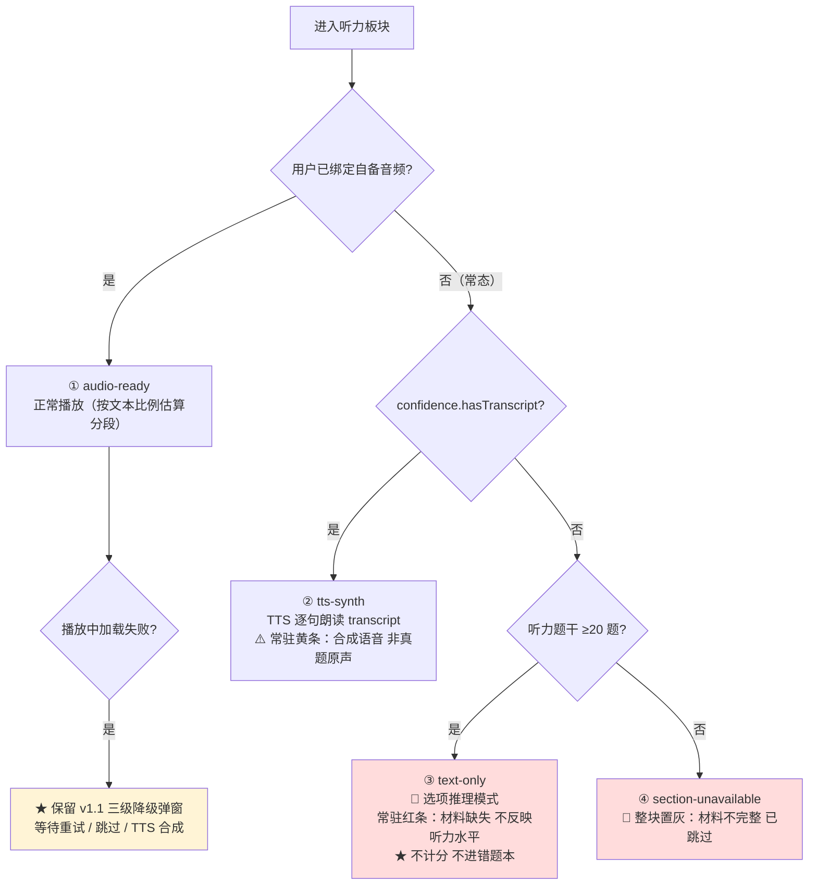

> **关键差异**：v1.3 下**①②③④ 都是预先确定的常态**，用户进入板块前就在套卷页看到过 `ConfidenceBanner` 的说明，不再有"考试中途突然弹出错误"的糟糕体验。真正的运行时异常只剩"自备音频加载失败"一种，v1.1 的弹窗逻辑原样保留即可。

### 6.4.4 三级失败降级（含模考中途未就绪的交互）

> ⏸️ **v1.6 状态：本节停用（不实现）。** 无音频加载行为 → 无"加载失败" → 无降级路径。本节保留为预留位文档。**保留项**：`ExamAudioService` 的**接口与类型**不删（可恢复性契约），但**运行时实现本期不做**。

> **v1.3 定位调整**：本节的三级降级**仍然有效**，但适用范围收窄为「**用户已自备音频但运行时加载失败**」这一种真实异常场景。常态缺失场景请见 6.4.3b。

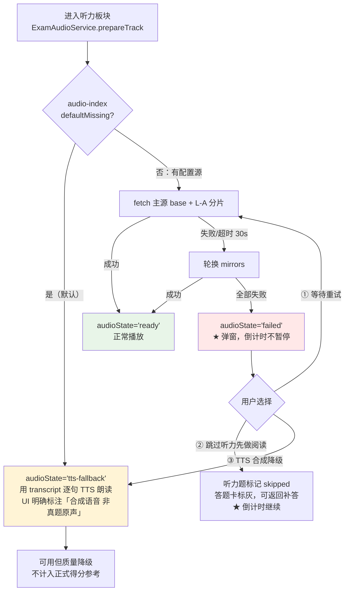

**降级设计要点**

| # | 要点 | 说明 |
|---|---|---|
| 1 | **倒计时绝不暂停** | 真实考试不会等音频缓冲。用弹窗让用户决策，而不是替用户暂停——暂停会让"模考时长"失真 |
| 2 | **允许跳过 + 可返回补答** | 听力题标记 `skipped`，答题卡标灰；用户做完阅读后可返回补答，真正避免"卡死" |
| 3 | **TTS 降级明确标注** | 用 `transcript` 逐句合成，语速调慢、无真实口音与背景音。UI 必须标注"合成语音，非真题原声"，且该次成绩页标注"含 TTS 降级，仅供参考" |
| 4 | **答案永不丢失** | 无论哪条降级路径，`AnswerSheet` 的增量保存（1s 节流 + 切页强制）始终生效 |
| 5 | **离线场景** | M3 的 Service Worker 缓存已听 segment；未缓存时走上述降级。离线做模考是可行的（只是无原声） |

---

# 第七部分：分期实施路线

> 每个里程碑 **可独立部署、可独立验收**；不满足验收标准不进入下一期（防止 PRD 常见坑 #3「大而全但跑不起来」）。

## M0 · 骨架 + 数据管线（地基）

| 项 | 内容 |
|---|---|
| **交付物** | ① `scripts/build-wordbank.ts` 产出 `words.index.*.json` + `words/chunk-*.json`<br/>② `scripts/verify-data.ts` 数据体检（CI 门禁）<br/>③ Vite + React + TS + Tailwind + Vitest + ESLint 全链路配置<br/>④ Dexie schema + migrations + `repos/` 骨架（**含 v1.1 的 `papers`/`sections`/`questions`/`answerSheets`/`attempts`/`vocabBook` 表**）<br/>⑤ `WordSource` 接口 + `StaticJsonWordSource` + `chunkLoader` + `BootstrapGate`<br/>⑥ `PaperSource` 接口 + `paperLoader` 骨架（v1.1）<br/>⑦ AppShell / 路由骨架（含 `/mock`、`/papers` 路由占位）/ 深浅色主题<br/>⑧ CI + GH Pages 部署 workflow |
| **验收标准** | - `pnpm build && pnpm preview` 可打开首页<br/>- `verify-data` 报告：词数 5278、Top2104 边界正确、无重复 id、例句覆盖率 ≥ 90%（例句可延到 M1 补）<br/>- Dexie schema version 1 建表成功，10+ store 全部可读写<br/>- 首次加载进度条走完，第二次刷新**零数据请求**（DevTools Network 验证）<br/>- GH Pages 部署成功，`.nojekyll` 生效 |
| **源文件数** | 约 **30** |

## M1 · 背词闭环（P0 全量，产品可用）

| 项 | 内容 |
|---|---|
| **交付物** | ① `domain/fsrs/*` + 单测（覆盖率 ≥ 85%）<br/>② `domain/word/selector` 词频优先选词 + 单测<br/>③ `services/studySession` + `reviewQueue` + `wrongBookService`<br/>④ LearnPage / ReviewPage / WordDetailPage / DashboardPage<br/>⑤ `ui/word/*`（WordCard 含真题例句高亮 + span 定位）<br/>⑥ `useKeyboard` 单手键盘流（Space/←/→/↓）<br/>⑦ TTS：YoudaoProvider + WebSpeechProvider + 手势解锁<br/>⑧ 统计基础版（今日进度 / 连续打卡 / 掌握度分布）+ 自研 3 图表 |
| **验收标准** | - 新用户 30 秒内完成首次背词（US-1）<br/>- 学习队列严格按 `freqRank` 升序，Top2104 覆盖率可查（G1）<br/>- **FSRS 单测通过（v1.5 定稿）** —— ⚠️ **只断言不变量与区间，不写死具体数值**（铁律 A8，见 5.6.5）：<br/>　① **新卡场景**：**`dueAgain < dueHard`（严格小于 —— 保证"完全不认识"与"有点模糊"的区分度）**，且 `dueAgain <= dueHard <= dueGood`、三者同日、`dueAgain - now <= 10min`<br/>　② **成熟卡 / Relearning 场景**：Again = 10 分钟（`relearning_steps` 语义，当日重现原样保留）<br/>　③ Good → 间隔严格递增<br/>　④ **顺序不变式回归测试**：新卡 + 成熟卡两套场景（见 5.6）<br/>　⑤ 🔴 **空队列语义**（5.6.6 R-A1）：队列空但存在 `due <= now + 60s` 的卡时，会话状态须为 `waiting` 而非 `completed`<br/>　⑥ 🔴 **连续 Again 计数幂等**（5.6.6 R-A2）：同一 session 内同一 `wordId` 连评 3 次 Again → `wrongCount === 1` 且 `newLearned` 只 +1<br/>　⑦ 🔴 **队列幂等**（5.6.6 R-A3）：同一 `wordId` 在队列中只出现一份<br/>- 断网后可继续背词（离线可用）<br/>- 移动端单手可完成全部操作；Lighthouse Mobile Performance ≥ 90<br/>- 首屏 ≤ 3s（4G 模拟） |
| **源文件数** | 约 **36** |

## M2 · 真题练习（写作/阅读/翻译）+ 测验 + 错题/生词闭环 + 导入导出 ★ v1.6 范围收敛

> **这是「首版」的最后一期**（与用户确认的"P0 全量 + 测验 + 导入导出"一致）。
> **v1.6 收敛**：模考降级为「**真题练习**」——**听力板块停用（保留预留位）**，卷面 = **写作 + 阅读 + 翻译** 三板块，其余（测验、错题/生词闭环、导入导出、killSwitch、存疑标记）不变。增量设计见 `docs/04-M2增量设计.md`。

| 项 | 内容 |
|---|---|
| **交付物** | ① **完整真题模考**：`ExamPaper/Section/Question` 模型 + `build-papers.ts` + `verify-papers.ts`<br/>② 🔴 **`original` 卷数据管线**（用户拍板路线）：PDF/Word 抽取 → 结构化 → **多源交叉比对** → 脏数据清洗 → 抽样人工核对，产出 `confidence` 标注（**7 人天数据工作，无客观验收基准，见 3.6.7**）<br/>③ 🔴 **铁律 A6 落地**：`original` 卷零音频字段；`audio-index.json` `defaultMissing:true` 恒定。**⏸️ v1.6：模考听力四态（3.6.2）不实现**——听力板块已停用，四态无触发场景；类型层 `Omit<...,'audioTrackId'>` 约束**保留**<br/>④ 🔴 **UI 显著标注**：`ConfidenceBanner`（模考前，须勾选才可用）+ `ResultDisclaimer`（成绩页）+ `DoubtMarkButton`（每题）+ **`<NoListeningNotice>`（T1 开始前）** + **`<ListeningDisabledCard>`（T11 结果页占位）**。**⏸️ v1.6：`ListeningCapabilityBar` 不实现**<br/>⑤ 🔴 **存疑题不入 FSRS** + 存疑率熔断（>15% → 整卷 `confidence` 降 `low`）→ 单测覆盖<br/>⑥ 🔴 **killSwitch 三层机制** + `killswitch.yml` 轻量 workflow + **演练一次**<br/>⑦ 🔴 **禁用词 CI**（8 词）+ 音频文件 CI + 查重门禁（反转用途）<br/>⑧ 真题练习主界面：**3 板块分段**（v1.6，倒计时由启用板块 `durationHintSec` 求和推导，**禁止硬编码 100**，铁律 A9）+ 答题卡（分组/标记待定/跳题）+ 断点续考<br/>⑨ `domain/exam/grader` 客观题自动批改（阅读 30 题）+ 分项得分。**⏸️ v1.6：删除「`text-only` 板块不计分」**（无此场景）<br/>⑩ ★ **真题导入通道（不可砍）**：用户自备 JSON + `settings.audioBaseUrl` —— **合规兜底 + 自备音频唯一注入口**<br/>⑪ **`derived` 管线能力保留**（不得删除）：`build-derived-spec.ts` / `build-derived-paper.ts` —— **killSwitch 降级目标**<br/>⑫ 四选一测验（R12）、错题进 FSRS + 生词本（R15）、导入导出（R17）、`WrongBookPage`/`VocabBookPage`/`SettingsPage` |
| **验收标准** | - 用 `original` 卷**完整走通一次 100 分钟 / 3 板块真题练习**（调试模式加速，**v1.6**：原为 125 分钟模考）<br/>- **练习中途刷新 → 已答答案、剩余时间、游标、当前板块全部恢复**（**v1.6**：听力状态无恢复义务）<br/>- 🔴 **⏸️ v1.6 作废「听力四态逐一验证」**（听力板块已停用）；**改为 `buildSectionPlan` 可恢复性往返测试**：4 板块卷 → 停用听力得 100min、恢复听力得 125min，**零代码改动**（见 `docs/04 §2.6`）<br/>- 🔴 **铁律 A9 生效**：源码中不存在三板块硬编码与硬编码总时长（`grep` review，见 `docs/04 附录 B-Q6`）<br/>- 🔴 **存疑题不入 FSRS**（单测断言 `enqueued === false`）；存疑率 >15% 触发整卷熔断<br/>- 🔴 **UI 文案按 3.6.3 + T1/T11 呈现**；未勾选"我已了解"无法开始<br/>- 🔴 **killSwitch 演练**：改 `index.json` → 走 `killswitch.yml` → **<2 分钟**内 `original` 卷全部下线并降级到 `derived`<br/>- 🔴 **CI 三项门禁生效**：音频文件、禁用词（**v1.6 修正扫描范围与正则**，见附录 B-16）、`original` 卷无 `audio*` 字段。**音频门禁标注"永不触发"**（无音频文件，A6 仍有效）<br/>- 交卷后客观题分项得分正确（单测覆盖错/空/待定/存疑四类）<br/>- 用户导入一套 JSON → 可正常模考，且**未离开本机**（Network 面板零上传）<br/>- 导出 JSON → 清空 IndexedDB → 导入 → 进度、FSRS 状态、模考历史**完全一致** |
| **源文件数** | 约 **45**（**v1.6**：原 50，−5 = 听力四态 UI 2 + `ExamAudioService` 运行时 3，均不实现）<br/>**代码 14 人天 + 数据 6.5 人天 + 例句语料 3.0 人天**（**v1.6 重估**：原 代码 18 + 数据 8；释放约 **5.5** 人天，其中 3.0 投入 M2 例句语料，见 `docs/04 §7`） |

## M3 · 练习增强 + PWA（v1.6：听力精听作废）

> **因模考前移而后移的内容**：真题浏览页、单词↔真题双向跳转、能力雷达图、写译模板（原 M3 部分内容）→ 顺延至 M4。

| 项 | 内容 |
|---|---|
| **交付物** | ① ❌ **⏸️ v1.6 作废：听力精听页**（听力板块停用，无 `transcript` 数据源）<br/>② 语境填空（R16）+ 快速刷词（R13）<br/>③ 「偷看详情扣分」开关（R20）+ 热力图打卡（R19）<br/>④ `vite-plugin-pwa` + Service Worker（**v1.6：仅预缓存 JS 与数据分片**，不再含"已听音频 segment"）+ `storage.persist()`<br/>⑤ 真题浏览 + 单词↔真题双向跳转（R24）<br/>⑥ Playwright 冒烟 E2E（背词 / **真题练习** 两条主流程，**v1.6**：原为三条含精听） |
| **验收标准** | - ❌ **⏸️ v1.6 作废：「听写校验判定正确（单测 ≥ 10 例）」**（听力精听停用）<br/>- PWA 可安装；断网可打开首页与**已缓存数据分片**（**v1.6**：不再含"已听音频"）<br/>- 站点总体积 ≤ 12 MB（CI 校验）<br/>- E2E **两条**主流程通过 |
| **源文件数** | 约 **34** |

## M4 · 增强（可选，视数据可得性与 Q-I 结论决定）

| 项 | 内容 |
|---|---|
| **交付物** | ① 更多真题套卷（取决于 Q-I 版权结论与用户自备素材）<br/>② 写译模板库（R25）<br/>③ 能力雷达图（R26，此时才引入 Recharts）<br/>④ 「专项错题卷」按错误频次自动组卷 |
| **源文件数** | 约 **20**（可选） |

### 里程碑总览

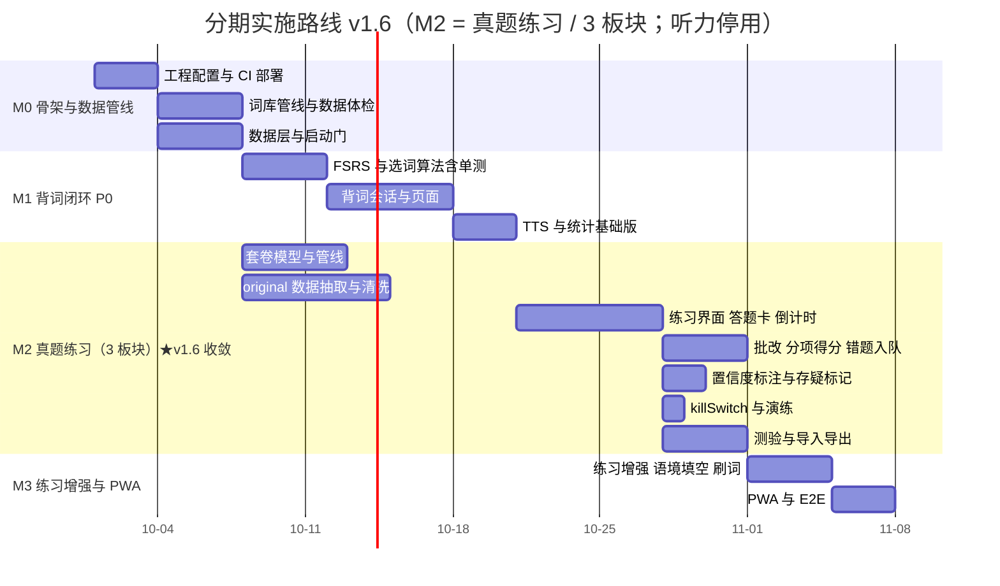

> **v1.6 甘特图变更**：移除 `听力四态与音频服务 :m2c`（不实现）与 `听力精听 :m3a`（作废）；「模考界面」改名「练习界面」。

| 里程碑 | 新增源文件 | 累计 | 累计依赖包 | 相对 v1.0 变化 |
|---|---:|---:|---:|---|
| 里程碑 | 新增源文件 | 累计 | 累计依赖包 | **代码人天** | **数据人天** | v1.6 变化 |
|---|---:|---:|---:|---:|---:|---|
| M0 骨架 + 数据管线 | 30 | 30 | ~12 | 9 | 2 | 不变 |
| M1 背词闭环 P0 | 36 | 66 | ~18 | 13 | 1 | 不变 |
| **M2 真题练习（3 板块）+ 测验 + 闭环 + 导入导出** | **45** | **111** | ~18 | **14** | **6.5（+ 例句语料 3.0）** | **−5 文件、−4 代码、−1.5 数据**；释放 5.5 人天，3.0 投入例句语料 |
| M3 练习增强 + PWA | 34 | 145 | ~21 | 12 + 2.5 | 0 | 听力精听作废 |
| M4 增强（可选） | 20 | 165 | ~22 | 8 | — | 🆕 可选 |
| **首版合计（M0–M2）** | | **111** | ~18 | **36** | **12.5** | **总计 ≈48.5 人天** |

> **首版 = M0 → M2，约 111 个源文件 / 约 48.5 人天**（v1.5 为 116 文件 / 约 51 人天，**v1.6 净减约 2.5 人天**）。详见 `docs/04-M2增量设计.md §7`。

**v1.3 增量明细**

| 增量项 | 类型 | 人天 | 说明 |
|---|---|---:|---|
| `original` 卷数据管线（PDF/Word 抽取 + 结构化） | 数据 | 2.0 | 见 3.6.7 |
| **多来源交叉比对** | 数据 | 1.5 | 一致性验收，非正确性验收 |
| 脏数据清洗（含实证发现的 `xxb` 类残留） | 数据 | 1.0 | |
| 听力 transcript 补全 | 数据 | 1.5 | 只判有无，不判对错 |
| 解析撰写与抽样人工核对 | 数据 | 1.0 | 记录 `spotCheckRatio` |
| **数据工作小计** | | **7.0** | 区间 5–7 |
| killSwitch 三层机制 + 演练 | 代码 | 0.5 | |
| `ConfidenceBanner` / `DoubtMarkButton` / 四态听力 UI | 代码 | 1.5 | |
| 存疑 → 不入 FSRS + 存疑率熔断 | 代码 | 1.0 | |
| **代码工作小计** | | **3.0** | + 原 M2 15 → 18 |
| **v1.3 总增量** | | **≈ 10 人天** | |

> 🔴 **必须写明：这 7 人天的数据工作没有客观验收基准。**
> 官方从不公布真题与标准答案 → **我们无法验证任何一道题的答案是否正确**。这 7 人天买的是"可用性"而非"正确性"。
> **替代性验收方案见 3.6.7**：① 多源交叉比对（≥2 来源一致）② 抽样人工核对（每卷 20%，记录 `spotCheckRatio`）③ 置信度显式标注（`ExamConfidence`）④ 存疑率熔断（用真实使用数据反向校正）。
> **核心原则：只做一致性验收，不做正确性验收；不验收的部分必须降级呈现，而非静默展示。**

> **不可砍项（v1.3 重申；v1.6 更新）**：① 音频零入库（铁律 A6）；② ~~三级降级（收窄为自备音频异常场景）＋四态常态降级~~ → **⏸️ v1.6 不实现**（听力板块停用，无触发场景；**类型与接口保留**）；③ **真题导入通道**（**不可砍**）；④ `derived` 实现能力（killSwitch 降级目标）；⑤ 存疑标记与不入 FSRS（**听力停用后更重要**——答案不可验证）。

> 🔄 **v1.6 增量注记**（听力停用后的人天变化，明细见 `docs/04-M2增量设计.md §7`）：
> - 上表 **「听力 transcript 补全 1.5」** 与 **「四态听力 UI」** 两项**不再实施** → **释放约 5.5 人天**（含音频服务运行时 4.0 + 数据 1.5）。
> - 释放的人天按 `docs/03 Q8` 分配：**3.0 投入 M2 例句语料工作**（补 `coreCoverage`），**2.5 并入 M3**。
> - 新增工作：`buildSectionPlan` 契约（铁律 A9）+ 结果页三层表达（T1–T14）+ 门禁修正。

---

# 第八部分：风险清单与应对

| # | 风险 | 等级 | 具体表现 | 应对措施 | 触发信号 / 兜底 |
|---|---|:--:|---|---|---|
| **R1** | **词频数据版权合规**（CC BY-NC-SA 4.0 禁商用） | 🟠 中（**v1.1 降级**：用户已确认仅自用/非商用） | 用户已确认非商用，侵权风险解除；残留风险为"未来若商业化" | ① 每条 `Word` 内置 `source` + `license` 字段；② `public/data/ATTRIBUTION.md` + 页脚署名 + 非商用声明（**完整性保留，不因确认非商用而削弱**）；③ 词库走 `WordSource` 抽象，换源零业务改动 | **未来商业化换源成本已量化**：见下方「R1 补充」，约 **0.5–1 人天** |
| **R11** | 🆕 **真题（文本 + 音频）版权** | 🔴🔴 **最高（v1.2 升级）** | 用户已选择内置近三年真题原文 = v1.1 方案 C 的最高风险子集。① 试题文本著作权归教育部考试院，擅自复制/发行 = 侵权（民事乃至行政责任）；② 音频邻接权风险更高且无官方数字源；③ 公开分发不属于合理使用；④ **且数据本身不全不准，风险与收益不成比例** | 见 R11 详述：架构侧**明确反对**，建议改用 `derived`；若坚持则执行 4 条减损措施；已备止损预案 | 触发信号：DMCA/律师函/上游仓库关停。止损：T+1h 下架降级、T+24h `git filter-repo` 清史 |
| **R2** | **数据源质量** | 🟠 中 | 例句覆盖率达不到 G2（≥90%）；`span` 定位错误导致高亮错位 | ① `verify-data.ts` 做 CI 门禁，覆盖率 <90% 直接 fail；② `span` 由管线用**词形还原 + 精确字符匹配**生成，并对每条做回验（`en.slice(span) === targetForm`），不通过则剔除 | 覆盖率不足时降级为「词频 + 释义」先上线，例句作为增量补充，不阻塞 M1 |
| **R3** | **资源体积** | 🟠 中 | 词库膨胀、bundle 失控 | ① 数据永不进 bundle（放 `public/data`）；② 分片 + 后台预取；③ CI 产出 visualizer 报告；④ 路由级 lazy | 首屏 JS > 200 KB gzip → CI 报警；已按 6.3 预留 2 倍余量 |
| **R4** | **浏览器音频自动播放策略** | 🟠 中 | 无用户手势时 `play()` 抛 `NotAllowedError`；有道 TTS 可能限流/失效 | ① `speech/unlock.ts`：首次任意点击时静音播放一次解锁，`unlocked` 前置条件；② 双 Provider：有道失败自动降级 Web Speech API；③ 失败时 UI 降级为"点击发音"而非静默失败 | 有道接口 403/限流 → 设置页自动提示切换到 Web Speech；`ttsProvider='off'` 可完全关闭 |
| **R5** | **IndexedDB 配额 / 数据被驱逐** | 🟠 中 | Safari ITP 7 天未访问清除 IndexedDB；`QuotaExceededError` | ① M3 调用 `navigator.storage.persist()` 申请持久化；② `useStoragePressure` 用 `navigator.storage.estimate()` 监控，>80% 时提示清理日志；③ 日志保留 180 天自动裁剪；④ PWA 安装提升留存概率 | 检测到被驱逐 → 首次启动引导"导入上次备份 JSON" |
| **R6** | **无账号下的数据丢失** | 🔴 高 | 换设备 / 清缓存 / 换浏览器 → 百日进度清零（PRD 常见坑 #1，6/7 竞品未解决） | ① R17 一键导出 JSON（M2 交付）；② 首页「距上次备份 N 天」常驻提醒；③ 每次会话结束自动写 `meta.lastBackupAt`；④ 导出文件含 `schemaVersion`，向前兼容 | 这是 C1（零账号）的固有代价，产品层面必须**主动提醒**而非默认用户会记得备份 |
| **R7** | **伪间隔重复** | 🟡 低 | 参数魔改导致调度失效 | 直接用 `ts-fsrs@5.4.2` 默认参数（`request_retention=0.9`），**M1 不调参**；FSRS 单测锁定行为 | 先跑通默认参数，M3 后按真实留存数据再决定是否优化 |
| **R8** | **功能蔓延导致停更** | 🟠 中 | PRD 常见坑 #3：6/12 竞品单次提交即弃坑 | 严格执行 M0→M3 分期，每期独立验收；AI/OCR/P2 一律不进 MVP；`aiEnabled` 恒 false | 任一里程碑超期 50% → 砍该期 P1 项，保 P0 |
| **R9** | **非标准化评分误导** | 🟡 低 | 模考给"预估 425 分"缺乏依据 | 模考只给**正确率 + 分项正确率**，不做总分换算；UI 明确标注"练习评分，非官方估分" | 参考 english-listening-trainer 的自述教训 |
| **R10** | **词频数据过时** | 🟡 低 | 数据源停在 2016 版大纲 | `manifest.json` 携带 `sourceVersion`；管线支持增量重跑；换源只需替换 `WordSource` 实现 | 大纲更新 → 重跑 `scripts/` 即可，用户进度因 `id` 稳定而不丢 |
| **R12** | 🆕 **「测试全绿但语义错」**（v1.4 新增，v1.5 补第二实例） | 🔴 高 | 领域层单测只逐条断言各自绝对值 → **单测全过却漏掉整体语义错误**。<br/>**实例①**：11 条 FSRS 单测全绿，仍未发现 Again > Hard 的**评分倒挂**（见 8.1 缺陷①）。<br/>**实例②（v1.5）**：倒挂的**第一次修复**（`min(now+10min, Hard.due)`）消除了倒挂，却把 Again 从原生 1min 抬到 6min，**制造了 `Again === Hard` 的次生语义弱化（丢一档区分度）**——同样未被测试发现，因为测试只断言"Again 是否 ≤ Hard"，没断言"Again 是否 < Hard"（见 8.1 缺陷③） | ① **铁律 A8**：单测必须断言不变量（顺序、单调性、边界关系），不得只断言魔法数字；② **修复一个语义缺陷时，必须同时补"这类语义错误不会再发生"的不变量测试**，而不只是"这个数值现在对了"；③ 关键算法（FSRS 调度、词频选词、批改）的不变量单独成组回归测试；④ Code Review 检查清单增加"这组测试断言了什么关系？" | 新增/修改领域层算法时，若测试文件只出现 `toBe(<具体数值>)` 而无 `toBeLessThan` / `toBeLessThanOrEqual` / 单调性断言 → Review 打回；修复缺陷的 PR 若未同步补不变量测试 → 打回 |
| **R13** | 🆕 **「注释与实现不一致」**（v1.4 新增） | 🟠 中 | 注释描述了未实现的行为，形成**虚假安全感**。实证：`countDue()` 注释写"排除 suspended"但实现未排除；`listDue()` 先 `limit` 后 `filter` 导致 active 卡被 suspended 卡挤空 | ① 涉及数据筛选的方法，注释与实现必须在同一 PR 内同时修改；② `limit`/`filter` 的**顺序**属语义敏感操作，需注释说明并加边界单测（"全部更早到期的都被 suspended 时返回什么"）；③ 见 8.1 缺陷② | 出现"注释承诺 X 但代码做 Y"的 review 意见 → 视为 blocking |

### 8.1 M1 实施缺陷与修复记录（v1.4 新增，v1.5 扩充）

> 本节记录 M1 实施过程中暴露的**三个真实缺陷**。
> **缺陷①、②** 属于「**注释与实现不一致**」型——**代码看起来是对的，注释也是对的，但两者说的不是一回事**。
> **缺陷③（v1.5 新增）** 属于「**修复引入次生损失**」型——**修掉一个语义错误，同时弱化了另一个语义维度**。它比①②更隐蔽：修复后的不变量 `Again <= Hard` 是成立的，测试不会报错，但产品的区分度已静默丢失。
> 三者记录价值都高，故正式归档。**共同的教训：领域层的正确性来自"断言关系"，而不是"断言数值"**（铁律 A8）。

#### 缺陷①：FSRS 评分倒挂（`services/wrongBookService.ts` → `requeueSameDay()`）

| 项 | 内容 |
|---|---|
| **现象** | 「不认识」(Again) 的卡片被排到 **10 分钟后**，而「模糊」(Hard) 是 **6 分钟后**。即 `due(Again) > due(Hard)` —— **越不会的词回来得越晚**，与间隔重复的第一性原理相反 |
| **根因** | `requeueSameDay()` 无条件把 Again 的 `due` 覆写为 `now + 10min`，未考虑 ts-fsrs 新卡阶段 Hard 的实际值为 6min（`learning_steps = ["1m","10m"]`） |
| **发现方式** | ⚠️ **lead 独立复算 `preview()` 四档时暴露** —— 而 **11 条 FSRS 单测全部通过** |
| **为什么单测没兜住** | 🔴 **单测只逐条断言各自的绝对值，没有任何一条断言四档之间的相对顺序**。每条测试都在问"Again 是不是 10 分钟"，却没有一条问"Again 是不是不晚于 Hard"。→ 这正是新铁律 **A8** 与风险 **R12** 的来源 |
| **修复** | commit `556e30b`：`due = min(now + 10min, next(card, 2, now).due)`，以 Hard 的 due 作为上界 |
| **回归测试** | 新增**顺序不变式**测试：`dueAgain <= dueHard <= dueGood`（新卡 + 成熟卡两套场景） |
| **架构师意见** | 见 **5.6.4**：认同修复方向，明确否决"回退为全卡 10min 并接受倒挂"；对 `Again === Hard` 的区分度损失提出可选改进（保留原生 Again 值再钳制） |

#### 缺陷②：`reviewQueue` / `cardRepo` 的 suspended 卡挤占

| 项 | 内容 |
|---|---|
| **现象 A** | `totalDue = 2`，但实际应为 **1** —— suspended 卡被计入 |
| **现象 B** | 🔴 **更严重**：`listDue()` **先 `limit` 后 `filter`**，当 **3 张 suspended 卡更早到期**时，`limit(N)` 先把位置占满，`filter` 再剔除 → **真正到期的 active 卡被全部挤掉，返回空数组**。用户打开复习页看到"今日无待复习"，而实际有卡片到期 |
| **根因** | 一是 `countDue()` 注释写了「排除 suspended」但**实现未排除**（注释与实现不一致）；二是 `limit` / `filter` 的**顺序**错误 —— `limit` 必须在过滤之后 |
| **发现方式** | QA 第一轮测试发现 |
| **修复** | ① `countDue()` 真正排除 suspended；② `listDue()` 改为**先 `filter` 后 `limit`** |
| **回归测试** | 新增边界单测：**"更早到期的卡全部为 suspended 时，`listDue(N)` 必须返回真正到期的 active 卡，而非空数组"** |
| **经验规则** | ① `limit` / `filter` / `sort` 的顺序是**语义敏感**操作，必须有注释说明并配边界测试；② 涉及数据筛选的方法，**注释与实现必须在同一 PR 内同时修改** |

#### 缺陷③：修复倒挂的**第一次修复**自身引入的次生语义弱化（v1.5 新增）

| 项 | 内容 |
|---|---|
| **背景** | 缺陷① 的**第一次修复**：`due = min(now + 10min, Hard.due)`。该式**确实消除了倒挂**（`Again ≤ Hard` 成立），M1 当时已判定通过 |
| **现象** | 在新卡场景，Again 被 **`now + 10min` 上界钳制后等于 Hard（同为 6min）** → 不变量从「Again **<** Hard」弱化为「Again **=** Hard」。**"完全不认识"与"有点模糊"用相同的间隔回来，丢了一档区分度** |
| **根因** | 修复只关注"消除倒挂"这一个目标，**无条件把 Again 注入固定 10min**，而没有意识到"注入固定值"会顺带**抹平 Again 与 Hard 的原生差异**（ts-fsrs 原生新卡 Again = 1min） |
| **为什么单测没兜住** | 🔴 与缺陷① 同源：**测试断言的是 `Again <= Hard`（非严格）**，`Again == Hard` 依然通过。**没有任何一条测试问"Again 是否严格早于 Hard"**。→ 这正是 **R12 的第二个实例** |
| **发现方式** | **架构师复核**（非自动化）：在确认第一次修复时提出保留意见——"代价是 `Again === Hard`，丢失了一档区分度"，并给出改进方案 |
| **修复（v1.5 定稿）** | `due = min(nativeAgain, Hard.due)` —— **保留 ts-fsrs 原生 Again 值（1min）再钳制**。新卡：Again ≈1min < Hard 6min，**严格区分度恢复**；成熟卡：Again = 10min（`relearning_steps` 语义不变）。见 5.6.2 |
| **回归测试** | 断言改为**严格不等** `dueAgain < dueHard`（不再是 `<=`），并保留 `dueHard <= dueGood <= dueEasy` 与同日约束。见 5.6.5 |
| **架构师意见** | 见 **5.6.4**：确认改进已采纳并实施；明确**不引入** `settings.againStepMin`（认同 R7"不调参"精神），可调项列入 M3 调优 |
| **模式价值** | 🔴 **修复一个语义错误时，可能引入另一个语义弱化，且它同样不会被"只断言绝对值 / 非严格关系"的测试发现。** 修复 PR 必须自问："我这次修复，是否让某个**严格**关系退化成了**非严格**关系？" |

#### 由本轮 M1 沉淀的三条团队级经验规则

| # | 规则 | 落点 |
|---|---|---|
| 1 | **领域层的正确性 = 不变量，不是绝对值。** 单测除断言绝对值外，**必须**断言不变量（顺序、单调性、边界关系、守恒）。否则会出现「每条都对、整体语义错」。 | **铁律 A8**（2.1）；风险 R12 实例① |
| 2 | **注释是承诺，不是装饰。** 数据筛选/排序方法的注释与实现必须在同一 PR 内同步修改；`limit`/`filter`/`sort` 的顺序变更视为语义变更，需补边界单测。 | 风险 R13；8.1 缺陷② |
| 3 | 🆕 **修复必须补"防复发"的不变量测试，并重查相邻语义。** 修一个缺陷时，除补"这个数值现在对了"，还要补"这类语义错误不会再发生"的断言；同时重查本次修复是否把某个**严格**关系退化成**非严格**关系（如 `Again < Hard` → `Again ≤ Hard`）。 | 风险 R12 实例②；8.1 缺陷③ |

### R1 补充：未来商业化时的换源成本量化

> 用户已确认**仅自用/非商用**，因此**不追加** v1.0 里提到的 3 天自建词频工作。但若将来转向商用，以下是已锁定的返工路径与成本：

| 步骤 | 工作量 | 说明 |
|---|---:|---|
| ① 新增 `SelfBuiltWordSource.ts` 适配器 | ~120 行 / **0.5 人天** | 实现 `WordSource` 接口，读自建词频 JSON |
| ② 改 `build-wordbank.ts` 的数据源读取部分 | ~80 行 / **0.3 人天** | 从公开词表 + 真题文本重新统计频次并重排 `freqRank` |
| ③ 数据体检 + 回归 | **0.2 人天**（`verify-data.ts` 已存在） | 校验词数、去重、覆盖率 |
| ④ **业务层 / UI 层改动** | **0 人天** | ✅ 因 `Word.id` 与 `freqRank` 解耦，换源只改变 rank 数值，**用户进度不丢失** |
| **合计** | **≈ 1 人天** | |

> **对比**：若无 `WordSource` 抽象层，换源需改动 `data/` + `domain/` + 部分 UI（tier 计算会散落各处），约 **3–5 人天**。**抽象层已提前省下 2–4 人天**，这是 C5 合规约束带来的正向架构收益。

---

### 🔴🔴 R11 详述：真题（文本 + 音频）版权风险 —— v1.3 定稿留痕

> **🔴🔴 风险评级：最高级（维持 v1.2 评级，未弱化、未下调）**
>
> **当前状态：用户已在知情前提下最终拍板 `provenance='original'`（内置近三年 2026/2025/2024 真题原文）** = v1.1 三档方案中的 **C 类（内置分发）**，且是其**风险最高的子集**（年份越新，权利方维权意愿越强，且官方明确不公开）。
> **架构侧反对意见完整保留于下方，标注为「架构师专业建议（用户已知情并选择不采纳）」。已转入执行，四条减损措施见 3.6。**

#### 具体风险点（对应用户的实际选择）

| # | 风险点 | 法律依据 / 实证 | 严重度 |
|---|---|---|:--:|
| 1 | **试题文本著作权** | 试题版权归**教育部教育考试院**（整体试卷为**汇编作品**）；公开法律答复明确：「未经官方授权，任何机构或个人**不得擅自复制、出版、发行**含有完整考试试题的辅导材料……将承担相应的**民事乃至行政责任**」 | 🔴 |
| 2 | **音频邻接权（高于文本）** | 录音制作者权，权利链更清晰。且 CET 听力在考点用 **FM 调频广播**播放，官方**从不发行数字音频** → 任何流传 MP3 都是第三方转录/录制件，我们连"来源合法"都无法主张 | 🔴🔴 |
| 3 | **公开分发不属于合理使用** | 《著作权法》第 24 条个人学习/课堂教学的**少量复制**，不包含向不特定公众公开网络分发。公开答复亦明确：「**不应公开大量、系统性地传播真题电子版**」 | 🔴 |
| 4 | **"非商用/开源"不构成抗辩** | 合理使用不看是否盈利，看使用方式与数量。GPL/非商用声明**不能**使未经授权的复制变合法 | 🔴 |
| 5 | **来源本身不合法** | 考委会规定试卷不公开、考点**严禁复印或留存** → 我们获取的数据，其源头即为非授权流出 | 🟠 |
| 6 | **⚠️ 数据不全且无法验证正确性** | 见 3.0.3：听力原文缺失、音频无官方源、答案无官方底本（实证脏数据 `xxb`）、越新越不全 | 🔴 **工程层面同样致命** |

#### 触发信号

| 信号 | 含义 |
|---|---|
| 收到 GitHub DMCA Takedown / 律师函 / 平台下架通知 | 已进入法律程序，须立即执行止损 |
| 仓库被标记为 `DMCA` 或搜索引擎移除 | 同上 |
| 出现"官方真题"字样被媒体/社群点名 | 舆情前置信号 |
| 数据源上游仓库（如 `0609x/CET46-Resources`、`ShepiTT/...`）被关停 | 上游已承压，我们大概率是下一批 |

#### 止损预案（必须预先写好，不能事到临头再想）

| 阶段 | 动作 | 时长目标 |
|---|---|---|
| T+0h | 删除 `public/data/papers/` 下所有 `provenance='original'` 文件；`audio-index.json` 置 `defaultMissing:true` 并清空所有 URL；`papers/index.json` 移除对应条目 | ≤ 1h |
| T+0h | 发布 `v1.2.x-hotfix`，前端降级为「仅 derived 卷 + 用户导入」，UI 顶部挂公告 | ≤ 2h |
| T+24h | **Git 历史清理**：`git filter-repo` 重写历史彻底删除真题文件（注意：已 fork / 已 clone 的副本无法回收，这是入库即不可逆的根本原因） | ≤ 1d |
| T+24h | 若部署在 GH Pages，同步删除 Release / Actions 产物缓存 | ≤ 1d |
| **用户已导入数据如何处理** | 用户导入的数据**只存在于其本机 IndexedDB，我们从未上传、无从删除、也无义务删除**。导出文件同样在用户本地。→ **这正是 `user-imported` 必须保留的又一理由：它天然不落入我们的责任范围** |
| 预防性设计 | `PaperSource` 接口（铁律 A4）保证切换来源**代码零改动**；所有套卷带 `provenance` 字段，可一次性批量筛选出全部 `original` 卷并移除 | — |

#### 🎯 架构师专业建议（用户已知情并选择不采纳 —— 永久留档）

> 以下意见由架构师高见远提出，已完整转达用户。用户在了解全部事实后最终选择 `original` 路线。**本段保留原文，不做任何弱化或删除，供后续决策者与维护者查阅。**

**结论：反对内置近三年真题原文。**

**四条理由：**

0. **（v1.3 补充说明）该模块无验收基准**：官方从不公布真题与标准答案 → 我们**无法验证任何一道题的答案是否正确**。这意味着该模块**从工程角度看没有客观验收标准**（见 3.6.7）。一个无法验收的模块进入生产，本身就是工程风险。用户已知悉此点。

1. **法律上**：这是把未经授权的复制件放进公开仓库并主动分发，是**可以明确归责**的行为——不同于"灰色使用"，这一点公开法律答复写得非常清楚（擅自复制、发行含完整试题的材料 = 侵权，民事乃至行政责任）。
2. **工程上（更重要）**：**即便我们接受这个风险，也拿不到能支撑完整模考的数据**。听力原文缺失、音频无官方源、答案无官方底本且实测含脏数据、**越新越不全**。也就是说：我们承担了 100% 的风险，换来的却是一份**自己都无法保证正确**、且**最新考次反而最残缺**的材料。这是**风险与收益完全不成比例**的交易。
3. **不可逆**：一旦进 Git 历史，即便删除，已 fork / 已 clone 的副本**无法回收**。这是本方案里唯一一个"做错了无法悔改"的决策。
4. **有更好的替代**：`derived` 方案（3.0.4）能**100% 保住用户真实诉求**（最新的考试结构、题型分布、考点词），且数据完整度与准确度**由我们自己保证**，音频还能做到句级时间轴精确对齐——在**可验证的正确性**上反而**优于**回忆版真题。

**建议的最终形态**（已写入 3.0.5 与 Q-I）：

> 默认内置 `derived`（真题同源模拟卷）｜始终保留 `user-imported`（真真题入口不关闭）｜`original` **不采用**，且由 CI 门禁强制禁止入库。

> ⚠️ **用户未采纳此建议，已选择 `original`。** 但 `derived` 的实现能力**完整保留**（3.2.4 / 3.6.6），作为 killSwitch 触发后的降级目标。

---

#### ✅ v1.3 执行状态：四条减损措施已全部落地

> 用户坚持 `original`，架构师照做。以下四条已由 v1.2 的"建议"升级为**可执行设计**：

| # | 减损措施 | 落地情况 | 章节 |
|---|---|---|---|
| 1 | **只收文本，音频一律不内置** | ✅ 升级为**铁律 A6** + CI 门禁（禁 `.mp3/.m4a/.wav/.ogg/.flac/.aac/.wma`）；`original` 卷在类型层用 `Omit` 禁止 `audio*` 字段；模考听力按**四态**工作，**备考价值折损如实写明** | 2.1、3.6.1、3.6.2、附录 B-15 |
| 2 | **UI 显著标注 + 存疑标记** | ✅ 新增 `ExamConfidence` 与 `AnswerRecord.doubtful`；**模考前 / 答题中 / 成绩页三处文案原文已写出**；**存疑题不进 FSRS** + 存疑率熔断 | 3.6.3 |
| 3 | **仓库不出现"官方真题"字样** | ✅ 8 词禁用清单 + CI 正则 + 允许表述正面清单 | 3.6.4、附录 B-16 |
| 4 | **killSwitch** | ✅ 三层机制（本地轻量 workflow <2 分钟 / 可选远程开关 / 前端硬编码兜底）+ 下线后降级到 `derived` + 用户本机数据处置策略 | 3.6.5 |
| — | **保留项** | ✅ 用户导入通道、`PaperSource`(A4)、`provenance` 三态、`derived` 实现能力、查重门禁（**反转用途**）全部保留 | 3.6.6 |

**⚠️ 两条必须随本模块永久携带的事实**

1. **无官方底本可对照 → 该模块无客观验收基准**。替代性验收方案见 3.6.7：**只做一致性验收，不做正确性验收**。
2. **进 Git 历史后不可逆**。已 fork / 已 clone 的副本无法回收——这正是 killSwitch 只能阻止**后续分发**、无法回收**已扩散副本**的原因，也是本方案唯一"做错无法悔改"的决策点。

---

# 第九部分：待明确事项

> 以下内容需要用户或 team-lead 拍板。**v1.1 状态：Q-H 已解除，Q-C 结论已变更，Q-I 为新增的唯一硬阻塞点。** 其余各项已给出**架构侧推荐**，若 48 小时内无回复，按推荐值执行并在代码中用常量隔离。

| # | 问题 | 选项 | **架构侧推荐** | 不确认的后果 |
|---|---|---|---|---|
| **Q-A** 🔄 | **真题例句的来源与规模**：M1 就要 90% 覆盖率，还是可以「先上线、后补齐」？ | A. 必须 ≥90% 才发 M1<br>B. M1 先上 ≥50%，M2 补齐 | **B**（避免数据工作阻塞主线；`verify-data` 阈值设为 0.5）。<br/>**🔄 v1.6 修订（C-5 连带）**：听力停用后例句语料**只剩阅读篇章 + 题干**，语料池缩小。**「M2 提到 0.9」不适用于 `fullCoverage`** → 改为**拆分指标**：硬门槛只加在 **`coreCoverage`（Top2104）≥ 0.80**，`fullCoverage` **不设门槛、如实展示**（见 `docs/04 §6`）| 阻塞 M1 排期，且例句质量风险后置；**v1.6：低频词覆盖率不再设门槛，避免凑数** |
| **Q-B** 🔄 | **真题文本覆盖范围**：多少套？哪些年份？ | A. 近 5 年 10 套<br>B. 近 10 年 20 套<br>C. **内置 1 套原创样例 + 用户自备导入（数量不限）** | **C（v1.1 变更，与 Q-I 方案 A 一致）**。先做 **1 套原创样例卷**验证管线、体积模型与模考全流程，真实真题由用户导入 | 若按 A/B 定了数字，一是素材未必可得，二是直接踩 R11 版权红线 |
| **Q-C** ✅⏸️ | **听力音频：模考含听力板块后，真题 MP3 怎么办？**（v1.1 结论变更；**v1.6 问题消解**） | ~~A. 团队内置分发<br>B. 用户自备<br>C. 纯 TTS~~ | **v1.6：已不适用（问题消解）**。用户拍板听力板块**停用（保留预留位）** → **不存在「缺音频的听力板块」** → 音频与产品完整性不再互斥。音频回归为「将来恢复听力时的可选资源」（见下方详细说明）| ✅ 不再阻塞 |
| **Q-D** | **是否需要 PWA（可安装）**？ | A. 要（M3）<br>B. 不要 | **A**（成本 <0.5 天，且显著提升 R5/R6 的数据留存概率） | 不做则 iOS Safari 7 天未访问即丢数据，R6 风险等级上升 |
| **Q-E** | **部署目标**：GitHub Pages 还是 Vercel/Cloudflare Pages？ | A. GitHub Pages<br>B. Vercel<br>C. Cloudflare Pages | **A**（与开源定位一致，免费额度足够；已按 GH Pages 限制做体积设计）。**注意 GH Pages 明确禁止商业用途**，与 C5 的非商用约束一致 | 影响 `base` 路径配置与 workflow；三者切换成本很低 |
| **Q-F** | **仓库与项目命名** | `cet4-master` / `cet4-lab` / 其他 | `cet4-master`（PRD 暂定；建议保留，`.github/workflows` 已按此写） | 影响 `base` 路径与 README |
| **Q-G** | **是否接受「M1 上线时无真题例句高亮」的最坏情况** | — | 架构上已用 `ExamSentence.span` 字段预留，**UI 层对空例句数组安全降级**（不渲染例句区块） | 无阻塞，UI 已做空态 |
| **Q-H** ✅ | **词频数据是否确认仅自用/非商用**？ | A. 确认非商用<br>B. 未来可能商业化 | **已确认：A（用户拍板）**。→ 采用 CETVocabulary，**不追加** v1.0 提到的 3 天自建词频工作。R1 等级由 🔴 降为 🟠，换源成本已量化为 ≈1 人天（见 R1 补充） | ✅ 阻塞已解除 |
| **Q-I** ✅🔴 | **真题（文本 + 音频）版权处置方式** | A. 用户自备导入<br>B. 仅收 2016 改革前真题<br>C. 内置近三年真题原文（`original`）<br>D. 内置 `derived` 真题同源模拟卷 | ✅ **用户已最终拍板：C（`original`）。** 架构侧反对意见（法律可归责 / 风险收益不成比例 / 不可逆 / 有更好替代）已完整转达并**永久留档于 R11**。<br>**已转入执行**：四条减损措施全部落地为可执行设计，见 3.6。<br>**`derived` 能力完整保留**为 killSwitch 降级目标（3.2.4 / 3.6.6） | 🔴 **风险维持 🔴🔴 最高级，未下调。** 该模块**无客观验收基准**（无官方底本），替代性验收见 3.6.7。止损预案见 R11。 |

---

### 🔴 Q-C 详细说明（v1.1 结论变更）

**v1.0 推荐 A（MVP 只用 TTS 合成，真题 MP3 可选）——该结论在「完整模考」前提下已不成立。**

> ⏸️ **v1.6 状态：本节的 v1.1 结论已失效，问题**消解**（非"被解决"）。**
> 用户拍板**听力板块停用（保留预留位）**，内置卷只出 写作/阅读/翻译 三板块。
> **听力不再是本功能的组成部分，因此「音频是否必需」这一问题不再存在。**
> 音频回归为「**将来恢复听力时才需要的可选资源**」，与 M2 范围无关。下方 v1.0→v1.1 的分析**保留为决策留痕**。

| 维度 | v1.0 判断 | v1.1 判断 | ~~v1.6 判断~~（本节结论） | 变化原因 |
|---|---|---|---|---|
| 真题 MP3 是否必需 | 可选（可放 M3 之后或不做） | 功能上必需 | **已不适用（问题消解）** | 听力板块停用 → 「缺音频的听力板块」这个对象**不存在** → 音频与产品完整性**不再互斥**。矛盾被**移出范围**，而非被解决 |
| 由谁分发 | （未明确） | **不由团队分发，由用户自备** | **无分发行为** | 无听力板块 → 无音频分发 → 邻接权风险敞口为 0 |
| 缺省状态 | — | `audio-index.json` 的 `defaultMissing: true` | **本期无任何音频消费方** | 字段保留（预留位），但无读取方 |

**架构侧推荐 = 选项 B**，一句话概括：

> **「真题音频的能力我们全做（分段加载、缓冲进度、断点、三级降级、精听 seek），但音频的**来源**交给用户自己配置和导入。」**

这样做的结果是：
- ✅ 用户自备了音频 → 体验完整，等同商业 App
- ✅ 用户没备音频 → TTS 合成降级，功能可用（标注"非真题原声"）
- ✅ 团队零版权风险、零 CDN 成本、零带宽账单
- ✅ 若用户自己有合法获得的音频（买的真题书配套、学校资源），产品对他就是完整的

---

## 附录 A：Package 依赖清单（M0 基线，供 M0 建 `package.json`）

```
# 运行时依赖
react@^19.1.0
react-dom@^19.1.0
react-router-dom@^7.6.0
zustand@^5.0.3
dexie@^4.0.11
dexie-react-hooks@^1.1.7
ts-fsrs@5.4.2            # 精确锁定，非 ^ —— MVP 不跟随 v6 beta
clsx@^2.1.1

# 开发依赖
vite@^7.0.0
@vitejs/plugin-react@^4.6.0
typescript@^5.9.0
tailwindcss@^4.1.0
@tailwindcss/vite@^4.1.0
vitest@^3.2.0
@testing-library/react@^16.3.0
jsdom@^26.0.0
eslint@^9.0.0
typescript-eslint@^8.0.0
rollup-plugin-visualizer@^5.14.0
tsx@^4.20.0              # scripts/ 数据管线执行

# M3 追加
vite-plugin-pwa@^1.0.0
@playwright/test@^1.53.0
```

## 附录 B：合规检查清单（每个里程碑结束必查）

| # | 检查项 | 检查方式 | v1.1 |
|---|---|---|---|
| 1 | 未复制任何 GPL-3.0 / 无 License 仓库的代码 | 人工 + 新增文件逐条 review | — |
| 2 | `Word.source` / `Word.license` 字段非空 | `scripts/verify-data.ts` 自动校验 | — |
| 3 | `public/data/ATTRIBUTION.md` 存在且含数据源、License、署名 | CI 文件存在性检查 | — |
| 4 | 站点页脚展示"数据来源 + 非商用声明" | M1 UI 验收 | — |
| 5 | 仓库内无 PDF / MP3 / 大二进制 | CI: `git ls-files` 中无 `.pdf/.mp3/.zip`，单文件 < 1 MB | — |
| 6 | `ts-fsrs` License = MIT | 已核实（npm / Snyk / jsDelivr 三方一致），写入 `docs/依赖许可记录.md` | — |
| 7 | 无账号、无云同步、无后端 API 调用 | MVP 代码里禁止出现 `fetch(` 指向非 `public/data` 与用户配置音频源的地址（ESLint 规则 + review） | — |
| **8** | 🆕 **每套卷 `provenance` 字段必填，且 UI 必须展示 `provenanceLabel`** | 类型约束（`provenanceLabel` 为非可选字段）+ M2 UI 验收 | v1.2 |
| **9** | 🆕 **`audio-index.json` 默认 `defaultMissing: true`**，且不含任何真题音频 URL | CI: JSON 断言 + review | v1.1 |
| **10** | 🆕 **真题导入通道有明确的权利提示文案**，且数据只写本机 IndexedDB | M2 UI 验收 + 代码 review（禁止任何 upload 调用） | v1.1 |
| **11** | 🆕 **模考成绩页不含 710 分制换算 / 425 分预估** | `ExamAttempt.scoreScaleNote === 'objective-only'` 类型约束 + UI 验收 | v1.1 |
| ~~12~~ | ~~禁止 `original-*` 前缀~~ | 🔄 **v1.3 反转**：用户已拍板 `original`，该门禁撤销 | ~~v1.2~~ |
| **13** | 🆕 **查重门禁 `check-plagiarism.ts`（保留，用途扩展）** | v1.2 用途：自撰内容与真题语料 >60% 相似 → fail（防 derived 沦为抄袭）<br>**v1.3 新增用途**：`original` 内容与第三方整理件 >95% 相似 → **提示来源存疑，转人工复核**（作为来源审查与质量辅助手段） | v1.2 / v1.3 |
| **14** | 🆕 **`papers/index.json` 含 `killSwitch`**，可不重新构建即下线全部 `original` 卷 | M2 实现 + **必须演练一次**（`killswitch.yml` <2 分钟生效） | v1.2 / v1.3 |
| **15** | 🆕 🔴 **铁律 A6：仓库零音频文件** | CI：`git ls-files` 中不得含 `.mp3/.m4a/.wav/.ogg/.flac/.aac/.wma`；且 JSON schema 校验 `provenance==='original'` 的卷不得含任何 `audio*` 字段。**v1.6：门禁保留但"永不触发"**（无听力板块、无音频文件；A6 仍有效） | **v1.3 / v1.6** |
| **16** | 🆕 **禁用词检查（8 词）** | **真源 = `tests/fixtures/forbidden-words.ts`；CI 执行 `scripts/check-forbidden-words.ts`**（`import` fixture，拒绝正则双写，**v1.6.1**）。<br/>正则：`(?<![非未不])官方(真题\|答案\|发布\|版)` / `(?<![非未])考试(院\|中心)(认证\|授权)` / `真题原卷` / `权威真题` / `全真模考` / **正向** `(425\|710)\s*分?\s*(预估\|换算\|折算)` / **逆向** `(预估\|换算\|折算)[^。；，]{0,6}(425\|710)`。<br/>**扫描范围：`src/**` + `README.md` + `public/data/ATTRIBUTION.md`**（真源 = fixture 的 `SCAN_ROOTS`），**排除 `docs/**`（否则门禁自我违规）、`tests/**`（fixture 必含禁用串）、`public/data/**` 语料**（第三方/生成内容含裸数字与词典释义；数据侧自撰字段改由 `verify-papers.ts` 白名单断言）。<br/>**不变量断言（v1.6.2）**：① **守卫** —— fixture 路径不在任何 `SCAN_ROOTS` 之下；② **自证** —— 扫描 `tests/fixtures/` **必然命中**；③ **关系式** —— 禁止在测试里复述 `SCAN_ROOTS` 字面量（其默认修法即拆护栏）。<br/>**自测用例**：`非官方发布` 放行 / `官方真题` 拦截 / `预估总分 710` 拦截 / `不与任何官方计分口径对应`(T5-v2) 放行 / `docs/02` 放行（范围外）。<br/>🔴 **前置条件：门禁与 T5-v2 文案同批交付**（见 §3.6.4） | **v1.3 / v1.6 / v1.6.1 / v1.6.2** |
| **17** | 🆕 **`original` 卷的 `confidence` 字段必填且 `hasAudio === false`** | JSON schema 校验 + UI 展示 `provenanceLabel` 与置信度 | **v1.3** |
| **18** | 🆕 **存疑题不得进入 FSRS** | 单测：构造 `doubtful:true` 的错题，断言 `WrongBookEntry.enqueued === false` | **v1.3** |
