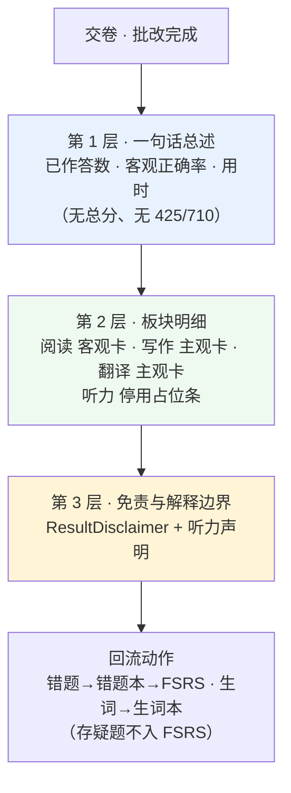
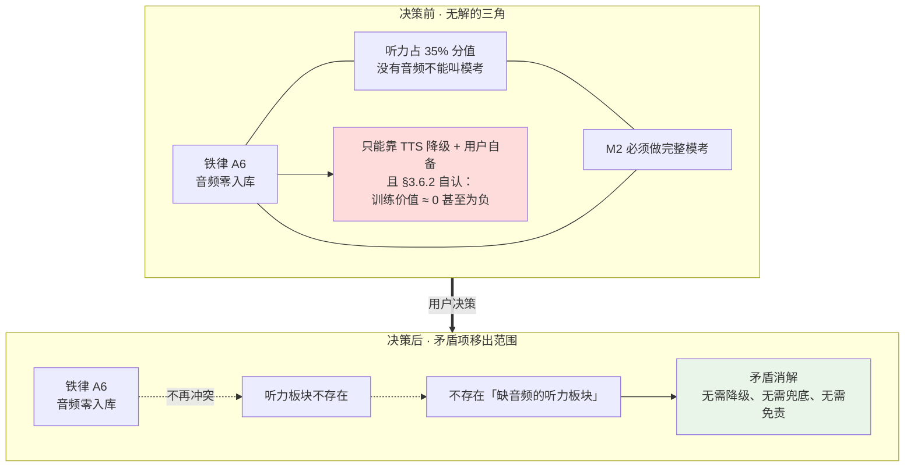
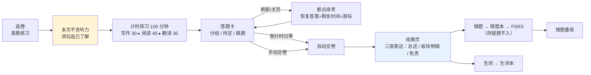

# M2 增量 PRD —— 听力「停用·保留预留位」+ 真题练习评分口径

| 项目信息 | 内容 |
|---|---|
| 文档版本 | v1.0（增量） |
| 撰写日期 | 2026-09-30 |
| 撰写人 | 许清楚（产品经理） |
| 文档性质 | **增量文档** —— 仅描述本次变更，**不重写全量 PRD** |
| 基线 | `docs/01-竞品调研与PRD.md`、`docs/02-实现方案.md`（v1.5）、M1 冻结于 `a9f4bab` |
| 上游决策 | 用户拍板：真题听力**先删掉**，口径为「**停用 · 保留预留位**」 |
| 下游 | 架构师据此出 M2 增量设计（不改本文件） |

> **本文件不改动 `docs/01` 与 `docs/02`。** 凡涉及 `docs/02` 需要改写之处，统一收敛在第 3.6 节的「移交清单」里，由架构师执行。

---

## 第 0 章 决策输入（硬约束，不得更改或"优化"）

| # | 用户决策原文 | 转写为可执行口径 |
|---|---|---|
| C1 | 真题听力「先删掉」，采用**停用 · 保留预留位** | M2/M3 **砍掉「听力板块」与「听力专项（精听）」**；内置卷**只出 写作 / 阅读 / 翻译** 三板块 |
| C2 | 类型字段与 Dexie 表**保留但不产出内容**，**零 schema 迁移** | **禁止**要求删除 `'listening'`、`audioTrackId`、`audioRange`、`audioState`、`listeningParts`、听力分值字段；**禁止**删除 `listeningProgress` / `audioCache` 两张表 |
| C3 | `src/services/speech/*` 是**单词发音**（M1 在用） | **属 M1 范围，完全不在本次决策内，不得触碰** |
| C4 | M2 范围 = 真题练习（写作+阅读+翻译）+ 测验 + 错题/生词闭环 + 导入导出 | 见第 5 章需求池 |
| C5 | 不得出现「425 / 710 预估」 | 结果页**零换算**，详见第 2 章 |
| C6 | 产品名保持「真题练习」 | 术语口径见 2.5 |

---

## 第 1 章 「停用 · 保留预留位」口径规范

### 1.1 停用 / 保留 一览

| 对象 | 处置 | 说明 |
|---|---|---|
| 听力**板块内容**（题干/选项/transcript） | ❌ **停用** | 内置卷 `sectionMeta` 只含 `writing` / `reading` / `translation` |
| 听力**精听页**（原 M3 ①） | ❌ **停用** | M3 整项作废 |
| 听力**四态服务与 UI**（原 M2 ⑨、`ListeningCapabilityBar`） | ❌ **停用（不实现）** | 详见 3.3 收益① |
| `ExamSectionKind` 的 `'listening'` 字面量 | ✅ **保留** | 类型联合不删 |
| `ExamSectionMeta.audioTrackId` | ✅ **保留** | 字段不删，恒不赋值 |
| `ExamSection.audioRange` | ✅ **保留** | 字段不删，恒不赋值 |
| `ExamSection.transcript` / `TranscriptLine` | ✅ **保留** | 类型不删；三板块不再产出该数据 |
| `AnswerSheet.audioState` | ✅ **保留** | 类型不删；M2 无写入方 |
| `DerivedSpec.listeningParts` / 听力分值 | ✅ **保留** | 规格文档属性，保留但不消费 |
| `OriginalExamPaper` 的 `Omit<..., 'audioTrackId'>` | ✅ **保留** | 铁律 A6 的类型层体现，继续有效 |
| Dexie `listeningProgress` | ✅ **保留** | 表不删、不写入。仍在 `PROGRESS_STORES` |
| Dexie `audioCache` | ✅ **保留** | 表不删、不写入。仍在 `SYSTEM_STORES` |
| `speech/*`（有道 TTS + 手势解锁） | ✅ **保留并继续使用** | **M1 单词发音，勿动**（C3） |

### 1.2 零 schema 迁移声明

- `src/data/db/db.ts` 的 `DB_SCHEMA` / `DB_VERSION` / 三区常量（`MIRROR_STORES` / `PROGRESS_STORES` / `SYSTEM_STORES`）**本次一律不改**。
- 即：**`DB_VERSION` 不递增，不新增 migration**。这是「保留预留位」口径的最直接收益——将来恢复听力**不需要数据库升级**。
- M1 既有数据（`cards` / `wrongBook` / `vocabBook` / `studyLogs` / `dailyStats`）**零影响**。

### 1.3 「可恢复性契约」（保留位到底保留了什么）

保留位的价值必须可被将来验证，故约定：

| 将来要恢复听力，需要做的工作 | 是否被本次保留 | 备注 |
|---|---|---|
| 数据库表结构 | ✅ 已保留 | 无需 migration |
| 域类型字段 | ✅ 已保留 | 无需改类型 |
| 卷结构（`sectionMeta` 可容纳第 4 板块） | ✅ 已保留 | 结构上已支持 |
| 分段计时框架（按 `sectionMeta` 驱动） | ✅ 需按此实现 | **对本次的约束：分段计时与板块渲染必须由 `sectionMeta` 数据驱动，禁止硬编码三板块** |
| 音频加载能力 | ❌ 未实现 | 属将来工作 |
| 听力内容数据 | ❌ 不产出 | 属将来数据工作 |

> 🔴 **对 M2 实现的关键约束（产品侧要求）**
> 板块渲染、分段倒计时、答题卡分组**必须由 `sectionMeta` 数组驱动**，不得出现「三板块」的硬编码假设。这样将来插入听力板块时**零代码改动**。
> 否则「保留预留位」只是保留了字段，实际恢复成本依旧很高——那就失去了这次决策的意义。

### 1.4 复用地板：本次决策**释放**的既有设计

以下 `docs/02` 既有设计**不再是 M2 的实现义务**，且**不删除文档**（降级为预留位说明）：

| docs/02 位置 | 内容 | 新状态 |
|---|---|---|
| §3.6.2 | 听力四态 `audio-ready/tts-synth/text-only/section-unavailable` + `resolveListeningCapability()` | ⏸️ **不实现**（无触发场景） |
| §3.6.3 | `ListeningCapabilityBar` 三态文案 | ⏸️ **不实现** |
| §6.4.4 | 三级失败降级（自备音频加载失败） | ⏸️ **不实现** |
| §6.4.3b | 常态缺失场景处理 | ⏸️ **不实现** |
| M2 ⑨ | 模考「4 板块分段」 | 🔄 改为 **3 板块分段** |
| M2 验收 | 「听力四态逐一验证」「音频文件 CI 门禁」 | 🔄 见 3.6 移交清单 |

---

## 第 2 章 ★ 真题练习「评分 / 结果」口径（核心）

### 2.1 分母的现实：删掉听力后还剩多少

| 板块 | 原始分 | 占 710 | 题型 | 题量 | 能否自动判分 |
|---|---:|---:|---|---:|---|
| 写作 | 106.5 | 15.0% | 主观 | 1 | ❌ 仅自评 |
| ~~听力~~ | ~~248.5~~ | ~~35.0%~~ | ~~客观~~ | ~~25~~ | ⏸️ **停用** |
| 阅读 | 248.5 | 35.0% | 客观 | 30 | ✅ **唯一可自动判分** |
| 翻译 | 106.5 | 15.0% | 主观 | 1 | ❌ 仅自评 |
| **本次可作答合计** | **461.5** | **≈ 65.0%** | | **32** | 其中客观仅 30 题 |

> 🔴 **必须先承认两个事实，否则结果页一定误导用户**：
> 1. **听力占 35% 分值，本次完全没有。** 所以「结果」天然只覆盖约 65% 的原始分。
> 2. **可自动判分的只有阅读理解 30 题。** 因此结果页上那个「正确率」，**实质就是阅读理解正确率**，不能包装成「你的四级水平」。

### 2.2 表达原则（不换算）

| # | 原则 | 具体约束 |
|---|---|---|
| P1 | **零换算** | 结果页**不出现总分**；**不出现 425 / 710 的任何预估或换算**；不做及格判定 |
| P2 | **只给可解释的量** | 只表达：`已作答题数`、`客观题正确题数 / 正确率`、`用时`、`各板块正确率` |
| P3 | **分母显式** | 任何「正确率」旁必须写明分子分母（如 `22 / 30`），杜绝孤立百分比 |
| P4 | **缺失显式声明** | 听力板块必须**显式说明「本次未启用」**，而不是默默不存在 |
| P5 | **主观题不判分** | 写作 / 翻译只给**自评档位 + 参考范文/译文对照**，不产出任何数字分数 |
| P6 | **继承既有约束** | 复用 `ExamAttempt.scoreScaleNote: 'objective-only'`（类型层已存在，无需新增字段） |

### 2.3 结果页三层表达结构



**ASCII 设计稿（结果页）**

```
┌──────────────────────────────────────────────────────────┐
│ 🔴 本卷为第三方整理版，答案未经官方核对。成绩仅供练习       │
│    参考，不代表真实四级水平，也不能折算为 710 分制。       │
├──────────────────────────────────────────────────────────┤
│  本次练习不含听力板块                                      │
│  听力在四级中约占 35% 分值，因此本次结果不能代表你的四级整体水平。│
├──────────────────────────────────────────────────────────┤
│  已作答 28 / 32 题     客观题正确 22 题（73.3%）  用时 1 小时 38 分 │
│  客观题仅含阅读理解 30 题；写作与翻译为主观题，不自动评分。  │
├──────────────────────────────────────────────────────────┤
│ ┌─ 阅读理解 ──────────────┐ ┌─ 写作 ────────────────────┐ │
│ │ 正确 22 / 30            │ │ 主观题，本站不自动评分     │ │
│ │ 正确率 73.3%            │ │ 自评：[优秀│良好│合格│待提高]│ │
│ │ 用时 41 分              │ │ 参考范文 ▸                │ │
│ └─────────────────────────┘ └───────────────────────────┘ │
│ ┌─ 翻译 ──────────────────┐ ┌─ 🎧 听力板块 ─────────────┐ │
│ │ 主观题，本站不自动评分   │ │ 本次未启用                │ │
│ │ 自评：[优秀│良好│合格│待提高]│ │ 该板块的功能与数据位保留， │ │
│ │ 参考译文 ▸              │ │ 将来可开启。              │ │
│ └─────────────────────────┘ └───────────────────────────┘ │
├──────────────────────────────────────────────────────────┤
│  错题 6 题已加入错题本        生词 4 个已加入生词本          │
│  「查看解析」  「生成错题重练」  「返回真题练习」            │
└──────────────────────────────────────────────────────────┘
```

### 2.4 文案原文（可直接用于编码）

| # | 位置 | 组件 | **文案原文** |
|---|---|---|---|
| T1 | 开始前（套卷页 / 开始弹窗） | `<NoListeningNotice>` | **标题**：`本次练习不含听力板块`<br>**正文**：`按你的要求，本站已停用听力板块，本次只包含写作、阅读、翻译三个板块。听力在四级中约占 35% 分值，因此本次结果不能代表你的四级整体水平。` |
| T2 | 开始前（沿用既有） | `<ConfidenceBanner variant="pre">` | 沿用 `docs/02 §3.6.3` 原文，其中「本套卷**不含听力音频**」一句**保留**（与 T1 不冲突，二者互补）。<br>🔴 **v1.2 措辞加固**：原句「**非官方发布**」会被 8 词门禁 `官方(真题\|答案\|发布\|版)` 命中，改「**并非官方渠道发布**」——语义不变，且在**全部三条规则下均安全**（实测见 §9.1）。见 §9.1 |
| T3 | 答题中 · 计时区 | `<TimerBar>` | `限时 100 分钟`　副标：`写作 30 · 阅读 40 · 翻译 30` |
| T4 | 答题中 · 板块进度 | `<SectionStepper>` | `写作 ▸ 阅读 ▸ 翻译`（**由 sectionMeta 生成，不得硬编码**） |
| T5 | 结果页 · 顶部红条 | `<ResultDisclaimer>` | `本卷为第三方整理版，答案未经官方核对。成绩仅供练习参考，不代表真实四级水平，也不与任何官方计分口径对应。`<br>（**替换**原 `text-only` 追加句 →）`本次练习不含听力板块。`<br>🔴 **v1.1 已改写**：原「也不能折算为 710 分制」含 **数字 + 关键词邻接**，在禁用词门禁加入双向检测后**必然被误伤**（实测见表 §8.1）。故**去除 425/710 数字**。见 §8.1 |
| T6 | 结果页 · 总述 | `<ResultOverview>` | `已作答 {answered} / {total} 题`　`客观题正确 {correct} 题（{rate}%）`　`用时 {h} 小时 {m} 分` |
| T7 | 结果页 · 总述小字 | `<ResultOverview sub>` | `客观题仅含阅读理解 30 题；写作与翻译为主观题，不自动评分。` |
| T8 | 结果页 · 阅读卡 | `<SectionScoreCard>` | `阅读理解`　`正确 {c} / {t}`　`正确率 {rate}%`　`用时 {m} 分` |
| T9 | 结果页 · 写作卡 | `<SectionScoreCard variant="subjective">` | `写作`　`主观题，本站不自动评分`　`自评：[优秀 / 良好 / 合格 / 待提高]`　`参考范文 ▸` |
| T10 | 结果页 · 翻译卡 | 同 T9 | `翻译`　`主观题，本站不自动评分`　`自评：[…]`　`参考译文 ▸` |
| T11 | 结果页 · 听力占位 | `<ListeningDisabledCard>` | `🎧 听力板块`　`本次未启用`　`该板块的功能与数据位保留，将来可开启。` |
| T12 | 结果页 · 回流提示 | `<RecycleHint>` | `错题 {n} 题已加入错题本`　`生词 {m} 个已加入生词本` |
| T13 | 结果页 · 空态 | `<ResultOverview empty>` | `本次未作答任何题目，没有可统计的结果。` |
| T14 | 超时自动交卷 | `<AutoSubmitToast>` | `时间到，已自动交卷。未作答的 {n} 题按未作答处理。` |

**⚠️ 文案三级禁用复核（与 `docs/02` 附录 B-16 的 8 词门禁对齐）**
以上 14 条文案**均不含**：`官方真题` / `官方答案` / `官方发布` / `官方版` / `考试院认证(授权)` / `真题原卷` / `权威真题` / `全真模考` / `(425\|710)分?(预估\|换算)`。
> 🔴 但 T5 含「**710 分制**」——这是**否定式表述**。需验证门禁正则 `(425|710)分?(预估|换算)` 不会误伤（"710 分制" 中 `710` 与 `分制` 之间不构成 `预估|换算`）。**列为待确认 Q2。**

### 2.5 术语口径：还叫「模考」吗？

**结论：弱化。** 对外统一改为「**真题练习**」，内部标识符不动。

| 位置 | 现状 | **新口径** | 理由 |
|---|---|---|---|
| 导航入口 | 模考 | **真题练习** | 删掉占 35% 分值的听力后，称「模考」构成完整性误导 |
| 页面标题（`MockExamPage.tsx` 现有 H1「完整模考」） | 完整模考 | **真题练习** | 同上 |
| 开始按钮 | 开始模考 | **开始练习** | 同上 |
| 计时模式名 | — | **计时练习** | 保留"限时可计时"的形态信息，但不暗示"全真" |
| 内部标识符 `AttemptMode = 'mock'` | `'mock'` | ✅ **不变** | C2 零迁移；仅 UI 文案层做映射 |
| 里程碑名 | M2 完整真题模考 | **M2 真题练习 + 测验 + 闭环 + 导入导出** | 与范围一致 |
| 「全真模考」 | — | ⛔ **禁用** | 本就在 8 词门禁清单内；**本次决策恰好让命名与既有门禁自洽** |

> 说明：CI 门禁只禁 `全真模考`，**并不禁「模考」二字**。因此弱化命名是**产品侧主动选择**，而非门禁强制——理由是 R9「不误导用户」。若用户希望保留「模考」称法，属可回退项（见待确认 Q1）。

### 2.6 时长口径

| 项 | 值 | 说明 |
|---|---|---|
| 原考试总时长 | 125 分钟 | `ExamPaper.durationMin = 125`（**考试规格常量，不改**） |
| 原分段 | 写作 30 + 听力 25 + 阅读 40 + 翻译 30 | `DerivedSpec.structure` 已定义 |
| **本次实际时长** | **100 分钟** | = 启用板块 `durationHintSec` 之和（30 + 40 + 30） |
| 兜底算法 | `125 − 25 = 100` | 若 `durationHintSec` 缺失时使用 |
| 倒计时精度 | 秒级，基于 ticks 累加 | 沿用 `AnswerSheet.elapsedSec` 既有设计（不用 `Date` 差值） |

> 🔴 **产品口径要求**：**实际总时长必须由「启用板块的 `durationHintSec` 求和」推导，禁止硬编码 100**。
> 否则将来插回听力板块时，总时长不会自动变回 125 分钟——这与 1.3 的「可恢复性契约」矛盾。
> `ExamPaper.durationMin = 125` 保留为「考试规格」，仅作参考展示（如「真实考试 125 分钟，本次 100 分钟」）。

### 2.7 边界情况定义

| # | 场景 | 口径 |
|---|---|---|
| B1 | 倒计时归零 | **自动交卷**；未作答按 `unanswered` 处理；覆盖 T14 提示 |
| B2 | 只做了部分板块（如只做阅读） | 结果页**只渲染已触及板块**的明细；未触及板块显示 `本次未作答`，**不填充 0% 以免误导** |
| B3 | 全部未作答 | 走 T13 空态；**不产出 0% 正确率**（分母为 0 时显示「无样本」） |
| B4 | 标记待定未处理 | 交卷前二次确认：`还有 {n} 题标记为待定，确认交卷？` |
| B5 | 未选自评档位 | 主观题卡显示 `未自评`，不视为 0 分，不影响任何统计 |
| B6 | 存疑题答错 | **不进 FSRS**（沿用 `docs/02 §3.6.3` 既有设计）；该题仍计入「客观题正确率」分母 |
| B7 | 写作结束后是否强制收卷 | **默认不强制**（宽松模式）：允许回改写作。严格模式（写作 30 分钟后锁死）列为 P1，见待确认 Q4 |
| B8 | 断点续考恢复 | 恢复 `answers` + `remainingSec` + `cursorQuestionId` + 当前板块；**听力相关状态无恢复义务**（无数据） |

---

## 第 3 章 收敛 `docs/02` 第 2328 行开放问题

### 3.1 原表述（`docs/02` 第 2328 行，Q-C 详细说明表内）

> | 真题 MP3 是否必需 | 可选（可放 M3 之后或不做） | **功能上必需** | 完整模考必须含听力板块（占 35% 分值）。没有真实音频的"模考"不能叫模考——这是本需求的题中应有之义 |

该行同时与 §3.6.2 的结论互为因果：因为「听力必须存在」，才推导出「无音频 → 听力退化为 `text-only`，**训练价值 ≈ 0 甚至为负**」，进而只能靠 TTS 降级与用户自备音频勉强兜底。

### 3.2 新结论表述（建议架构师以此替换第 2328 行）

> | 真题 MP3 是否必需 | 可选（可放 M3 之后或不做） | **已不适用（问题消解）** | 听力板块已按用户决策**停用（保留预留位）**，内置卷只出 写作 / 阅读 / 翻译 三板块。**听力不再是本功能的组成部分，因此"音频是否必需"这一问题不存在。**音频回归为「将来恢复听力时才需要的可选资源」，与 M2 范围无关。 |

同时建议在 §3.6.2 标题处追加一行状态标注（不删除正文）：

> ⏸️ **v1.6 状态：本章四态设计已停用（不实现）。** 因听力板块停用，四态无触发场景。本章保留作为**预留位文档**，供将来恢复听力时复用。

### 3.3 矛盾消解论证：最大收益是「矛盾被移除」而非「被解决」



**论证**：原方案的死结不是「音频不够好」，而是**「必须做一个我们无法做好的板块」**。
用户决策把**矛盾项本身移出范围**，于是：A6 与产品完整性不再互斥 —— 因为**不再存在**「音频缺失的听力板块」这个对象。

### 3.4 收益（按价值排序）

| # | 收益 | 说明 |
|---|---|---|
| **G-1** | **「无音频不能叫模考」的矛盾被消解** | 本次决策的**最大收益**。产品不再自相矛盾：不叫模考了，也就不缺听力了 |
| **G-2** | **消除「用数据缺陷惩罚用户」** | `text-only` 模式下用户练的是"读选项猜答案"，会**强化错误应试习惯**。原方案明知价值为负仍需交付，且要在多处 UI 反复免责。现在该场景不存在 |
| **G-3** | **M2 实现量下降** | 听力四态服务 + `ListeningCapabilityBar` + 音频加载/缓冲/断点/三级降级 + 无数据 → 全部不实现。对应 `docs/02` M2 的 `m2c 听力四态与音频服务`（4 人天）与数据侧「听力 transcript 补全」（1.5 人天），**预计释放约 5.5 人天**（**具体以架构师重排为准**） |
| **G-4** | **风险等级下降** | R4（浏览器音频自动播放策略）、音频相关合规与 CDN 成本风险**整体降级** |
| **G-5** | **验收项简化** | 原 M2 验收中「听力四态逐一验证」「音频文件 CI 门禁」不再需要人工验证（门禁保留但永不触发） |
| **G-6** | **命名与门禁自洽** | 弃用「全真模考」后，命名口径与既有 CI 禁用词清单一致 |
| **G-7** | **零迁移的可逆性** | 类型与 Dexie 表全保留 → 将来恢复听力**无 schema 迁移、无数据迁移** |

### 3.5 代价与新增影响（如实写明，不粉饰）

| # | 代价 | 量化 | 说明 |
|---|---|---|---|
| **C-1** | **功能覆盖度下降** | 从名义 710 分降到 **461.5 / 710 ≈ 65%** | 且其中仅 **248.5 / 710 ≈ 35%** 可自动判分 |
| **C-2** | **「正确率」语义收窄** | 客观题 = 阅读 30 题 | 结果页必须显式说明（T7），否则用户会误把它当整体水平 |
| **C-3** | **M3 失去听力精听** | M3 ① 整项作废 | M3 剩余：语境填空、快速刷词、偷看扣分、热力图、PWA、真题浏览、双向跳转、E2E |
| **C-4** | **`docs/02` 多条条款需作废/改写** | 见 3.6 移交清单 | 其中 4 条 M2 验收标准直接失效 |
| **C-5** | 🔴 **M2 的「真题例句」语料池缩小**（**本次新发现的连带影响**） | 待架构师评估 | 见下方说明 |
| **C-6** | 听力恢复需重新做数据工作 | — | 保留位只解决工程成本，不解决内容成本 |

> 🔴 **C-5 详述（值得架构师与 QA 特别注意）**
> `ExamSentence` 的来源原本包含**听力原文**（`TranscriptLine`，`docs/02 §3.6` 指出听力原文是「精听、听写校验、TTS 降级合成的三合一数据源」）。
> 删掉听力后，M2 的例句语料**只剩阅读篇章 + 题干**，**例句供给量下降**。
> 现状实测：`public/data/manifest.json` 中 `sentences.available = false, coverage = 0`（M1 的例句管线是**安全 no-op**，语料本身属 M2 数据工作，见 `scripts/build-sentences.ts` 头注释）。
> **影响**：`docs/02` Q-A 曾约定「M2 把例句覆盖率提到 **0.9**」。语料池缩小后，**0.9 这个阈值是否需要重估，请架构师明确**。
> **产品侧建议**：宁可**下调阈值并如实标注覆盖率**，也不要用低质量例句凑数——与 M1「绝不为了凑覆盖率而伪造例句」的既有原则一致。

### 3.6 移交清单：`docs/02` 需作废 / 改写的条款（交架构师执行）

> 我**不修改** `docs/02`，仅列出清单。

| # | docs/02 位置 | 原文要点 | 建议动作 |
|---|---|---|---|
| 1 | **第 2328 行** | 「真题 MP3 功能上必需」 | 🔄 **替换**为 3.2 的新表述 |
| 2 | §3.6.2 标题与正文 | 听力四态设计 | ⏸️ **加状态标注**（不实现、降级为预留位文档） |
| 3 | §3.6.3 文案表「② 答题中听力板块顶部」 | `ListeningCapabilityBar` 三态 | ⏸️ **标注不实现** |
| 4 | §6.4.4 / §6.4.3b | 三级降级与常态缺失 | ⏸️ **标注不实现** |
| 5 | M2 交付物 ③④⑤ | 铁律 A6 落地 + 听力四态 + `ListeningCapabilityBar` | 🔄 **改写为**：A6 与类型层约束保留；听力四态不实现；新增 `<NoListeningNotice>` 与 `<ListeningDisabledCard>` |
| 6 | M2 交付物 ⑧ | 倒计时「4 板块分段」 | 🔄 改为 **3 板块分段（由 sectionMeta 驱动）** |
| 7 | M2 交付物 ⑨ | 「`text-only` 板块不计分」 | 🔄 **删除该条**（无此场景） |
| 8 | M2 验收：「完整走通一次 125 分钟模考」 | — | 🔄 改为 **100 分钟 / 3 板块** |
| 9 | M2 验收：「听力四态逐一验证」 | — | ❌ **作废** |
| 10 | M2 验收：「三处 UI 文案按 3.6.3 原文呈现」 | 含听力条 | 🔄 保留前/后两处，中间听力处改为 T1 / T11 |
| 11 | M2 验收：「音频文件 CI 门禁生效」 | — | 🔄 保留门禁但**标注为"永不触发"**（A6 仍有效） |
| 12 | M2 验收：「导出导入后模考历史一致」 | — | ✅ **不变** |
| 13 | M3 交付物 ① | 听力精听页 | ❌ **作废** |
| 14 | M3 验收：「听写校验判定正确（单测 ≥ 10 例）」 | — | ❌ **作废** |
| 15 | M3 验收：「已听音频 segment 预缓存」 | — | 🔄 改为**仅预缓存 JS 与数据分片** |
| 16 | 附录 B-16 禁用词门禁 | 8 词 | ⚠️ **补一条**：明确门禁**扫描范围**（是否含 `docs/`）。`docs/02` 自身在术语表中含禁用词原文，若全仓库扫描会自我违规 |
| 17 | M2 人天与源文件数 | 代码 18 / 数据 8 | 🔄 **重新估算**（预计释放 ~5.5 人天，见 G-3） |
| 18 | 里程碑甘特图 | 含「听力四态与音频服务」`m2c` | 🔄 **移除该条** |

---

## 第 4 章 用户故事（本次变更相关）

| # | 用户故事 | 对应变更 |
|---|---|---|
| US-M2-1 | 作为一个**四级备考学生**，我想要**开始练习前就明确知道这次不含听力**，以便我不会误以为这是一次完整水平检验 | T1 |
| US-M2-2 | 作为一个**时间紧张的学生**，我想要**写作、阅读、翻译分板块计时**，以便我按真实考试的节奏分配时间 | T3 / T4 / 2.6 |
| US-M2-3 | 作为一个**做到一半要上课的学生**，我想要**刷新或关掉页面后回来继续答题**，以便我不必一次坐满 100 分钟 | B8 |
| US-M2-4 | 作为一个**关心结果的用户**，我想要**看到各板块的正确率、已作答题数和用时，而不是一个来路不明的总分**，以便我判断哪些板块该补 | T6 / T7 / T8 |
| US-M2-5 | 作为一个**写作和翻译没把握的用户**，我想要**对照参考范文与译文自评档位**，以便我知道自己差在哪一档 | T9 / T10 |
| US-M2-6 | 作为一个**答错题的用户**，我想要**错题自动进入复习队列、不认识的词进生词本**，以便我下次练习时被重点照顾 | T12 / B6 |
| US-M2-7 | 作为一个**发现某题答案可疑的用户**，我想要**标记存疑且让该题不进复习队列**，以便不被错误答案反复折磨 | B6 |
| US-M2-8 | 作为一个**换了设备的用户**，我想要**导出并导入我的全部进度与练习历史**，以便我的记录不丢 | R17 |
| US-M2-9 | 作为一个**想知道听力去哪了的用户**，我想要**看到听力板块被明确标注为"未启用、将来可开启"**，以便我知道这是主动取舍而非缺陷 | T11 |

---

## 第 5 章 需求池（M2 增量）

### P0 —— M2 必须交付

| # | 需求名 | 说明 | 优先级 | 参考来源 |
|---|---|---|---|---|
| M2-01 | **三板块套卷管线** | `build-papers.ts` 产出仅含 writing / reading / translation 的卷；`sectionMeta` 驱动一切 | P0 | docs/02 M2 ① |
| M2-02 | **分板块计时（100 分钟）** | 时长由启用板块 `durationHintSec` 求和推导，禁止硬编码 | P0 | 2.6 / T3 |
| M2-03 | **答题卡** | 分组、标记待定、跳题、未作答态、**禁用不可用区间** | P0 | docs/02 M2 ⑧ |
| M2-04 | **断点续考** | 刷新恢复答案 / 剩余时间 / 游标 / 当前板块 | P0 | docs/02 M2 ⑧ / B8 |
| M2-05 | **客观题自动批改** | 仅阅读理解 30 题；错 / 空 / 待定 / 存疑四类正确归类 | P0 | docs/02 M2 ⑨ |
| M2-06 | ★ **结果页新口径** | **零总分、零 425/710**；三层表达；文案 T5–T13 | P0 | 第 2 章 |
| M2-07 | ★ **听力停用呈现** | T1 开始前声明 + T11 结果页占位卡 + 板块数=3 | P0 | 第 1 章 / C1 |
| M2-08 | **错题回流** | 阅读错题 → 错题本 → FSRS；**存疑题不进**（`enqueued=false`） | P0 | docs/02 §3.6.3 / B6 |
| M2-09 | **生词回流** | `keyWordHints` 一键加入生词本 | P0 | docs/02 M2 ⑫ |
| M2-10 | **导入导出** | JSON + `schemaVersion`；导入后 FSRS 状态与练习历史完全一致 | P0 | R17 |
| M2-11 | **真题导入通道** | 用户自备 JSON，**仅落本机 IndexedDB，零上传** | P0 | docs/02 M2 ⑩ |
| M2-12 | **四选一测验** | 复用阅读题型 | P0 | R12 |
| M2-13 | **来源与免责标注** | 复用 `ConfidenceBanner` + 新 `ResultDisclaimer` 文案 | P0 | docs/02 §3.6.3 / T5 |
| M2-14 | **sectionMeta 驱动的渲染契约** | 板块渲染 / 计时 / 答题卡分组一律数据驱动，**禁止三板块硬编码** | P0 | 1.3 关键约束 |

### P1 —— 应该交付

| # | 需求名 | 说明 | 优先级 | 参考来源 |
|---|---|---|---|---|
| M2-15 | **主观题自评档位** | 写作 / 翻译 四档自评 + 参考范文/译文对照 | P1 | T9 / T10 / US-M2-5 |
| M2-16 | **板块级用时统计** | 各板块实际用时 vs 建议用时对比 | P1 | 2.6 / T8 |
| M2-17 | **历史成绩趋势** | 多次练习的**阅读正确率**曲线（明确不画"总分"曲线） | P1 | R10 统计延伸 |
| M2-18 | **错题重练卷** | 按错题频次自动组卷 | P1 | docs/02 M4 ④ 提前 |
| M2-19 | **逐题解析** | 客观题解析展示（有 `explanation` 时） | P1 | docs/02 M2 ⑨ |
| M2-20 | **严格收卷模式** | 写作板块结束后锁死不可回改（可选开关） | P1 | B7 / 待确认 Q4 |

### P2 —— 可以有

| # | 需求名 | 说明 | 优先级 | 参考来源 |
|---|---|---|---|---|
| M2-21 | **听力板块恢复开关（UI）** | 当将来有内容时一键启用 | P2 | 1.3 / C1 |
| M2-22 | **写译模板库** | 作文模板与翻译常用句式 | P2 | docs/02 M4 ② |
| M2-23 | ⚠️ **能力雷达图** | **删听力后仅剩 写/读/译 三维，且听力是最大分值项 → 雷达图会严重误导**。**建议不做**；若坚持，必须在图上显式标注"不含听力"且不给"能力综合分" | P2 | docs/02 M4 ③ / R9 |

---

## 第 6 章 UI 设计稿

### 6.1 主流程



### 6.2 开始前弹窗（文字稿）

```
┌────────────────────────────────────────────────┐
│  开始真题练习                                   │
├────────────────────────────────────────────────┤
│  ⚠️ 本次练习不含听力板块                         │
│  按你的要求，本站已停用听力板块，本次只包含       │
│  写作、阅读、翻译三个板块。听力在四级中约占       │
│  35% 分值，因此本次结果不能代表你的四级整体水平。 │
├────────────────────────────────────────────────┤
│  写作 30 分 · 阅读 40 分 · 翻译 30 分            │
│  限时合计 100 分钟（真实考试为 125 分钟）         │
├────────────────────────────────────────────────┤
│  内容来源说明                                    │
│  本套试卷为第三方公开整理版，非官方发布。由于官方  │
│  不公布真题与标准答案，本卷的题目、选项与答案      │
│  未经官方核对，可能存在缺漏或误差；本套卷不含      │
│  听力音频。                                      │
├────────────────────────────────────────────────┤
│  ☐ 我已了解：本卷答案仅供参考，不作为评分依据     │
│                                                  │
│              [ 取消 ]        [ 开始练习 ]        │
└────────────────────────────────────────────────┘
```

### 6.3 答题中（顶栏 + 答题卡）

```
┌─────────────────────────────────────────────────────────────┐
│ 真题练习 · 2024-06 SET1        剩余 01:12:38 / 01:40:00     │
│ 写作 ✓ ▸ 阅读 ● ▸ 翻译 ○                                     │
├──────────────────────────────────────┬──────────────────────┤
│  阅读理解 Section B  Passage 1        │  答题卡               │
│  36  37  38  39  40                  │  写作  [1]✓           │
│  …                                   │  阅读  [36][37][38]… │
│                                      │        [41][42][43]… │
│  (A) …  (B) …  (C) …  (D) …          │  翻译  [57]○          │
│                                      │  ───────────────     │
│  [◀ 上一题] [标记存疑] [标记待定] [下一题 ▶]│  待定 3 · 未答 8   │
│                                      │  [交卷]              │
└──────────────────────────────────────┴──────────────────────┘
```

### 6.4 结果页

见 §2.3 的 ASCII 稿与 T5–T13 文案。要点复述：**无总分、无 425/710、分母显式、听力显式标注未启用**。

---

## 第 7 章 待确认问题清单

| # | 问题 | 选项 | **产品侧推荐** | 影响面 |
|---|---|---|---|---|
| **Q1** | **是否接受把「模考」弱化为「真题练习」？** | A. 弱化（入口/标题/按钮全改「真题练习」，内部 `AttemptMode='mock'` 不动）<br/>B. 保留「模考」称法 | **A**（R9 不误导；「模考」在无听力时构成完整性误导） | UI 文案、里程碑名；影响很小，可回退 |
| **Q2** | 🔴 **禁用词门禁是否会误伤否定式表述？** | A. 不会误伤<br/>B. 会误伤，需调整正则或加白名单 | ✅ **已实测（QA 回归 + PM 复现），共发现两处自指冲突**：<br>① `(425\|710)分?(预估\|换算)` 加**双向检测**后 → 拦下原 T5（已去除 425/710，§8.1）；<br>② `官方(真题\|答案\|发布\|版)` → **命中 T2 与页脚的「非官方发布」**（架构师发现，PM 复现确认）。<br>架构师加负向断言 `(?<![非未不])` 放行；PM 另建议 T2/页脚改用**无邻接措辞**作纵深防御（§9.1） | 门禁与免责文案必须**同批交付**，否则会互相打架 |
| **Q3** | **门禁扫描范围是否包含 `docs/`？** | A. 仅扫 `src/` + `public/` + `README.md`<br/>B. 全仓库扫描 | ✅ **已由架构师裁定并实测：A**。范围 = **`src/` + `public/` + `README.md`，排除 `docs/`**。原规则把 `docs/02-实现方案.md` 写进扫描路径 → 会红在自身定义文件上；另实测 `docs/02` 含「预估 425 分」（L2205，会被**逆向检测**命中）。结论：`docs/` 排除是**必需**而非偏好 | 已收敛 |
| **Q1b** | 🆕 **页脚「非官方发布」措辞是否加固？** | A. 保持原措辞，依赖负向断言<br/>B. 改为「并非官方渠道发布」 | **B**（纵深防御：负向断言 `(?<![非未不])` 仅覆盖"非/未/不"**紧邻**官方的形态，仍有残余缺口，见 §9.1） | 页脚为用户可见常驻文案，稳妥优先 |
| **Q4** | **写作板块是否「严格收卷」？** | A. 宽松（默认，可回改）<br/>B. 严格（写作 30 分钟后锁死） | **A**（默认宽松；B 做成 P1 开关） | 影响答题卡与计时逻辑 |
| **Q5** | **结果页是否保留「听力未启用」占位卡（T11）？** | A. 保留（显式告知，与"保留预留位"口径一致）<br/>B. 完全不提听力 | **A**（用户明确选了"保留预留位"而非"彻底移除"，UI 应体现；也避免用户以为功能坏了） | 结果页布局 |
| **Q6** | 🔴 **M2 例句覆盖率阈值是否重估？**（因听力原文语料池消失） | A. 维持单指标 0.9<br/>B. 拆分为 `coreCoverage`（Top2104，硬门槛 ≥ 0.80）+ `fullCoverage`（5278，**不设门槛**，如实展示） | ✅ **已由架构师细化并采纳：B**。理由：低频词本就不该期待例句，对它们设门槛只会**逼出凑数**——正是 M1 明令禁止的。产品侧**完全同意**，此方案优于我原提的"简单下调阈值" | 已收敛；影响 M2 数据工作量与验收 |
| **Q7** | **「实际时长由板块求和推导」是否确认为硬要求？** | A. 是（禁止硬编码 100）<br/>B. 直接写死 100 | **A**（否则将来恢复听力需改代码，违背 1.3 可恢复性契约） | 影响计时实现 |
| **Q8** | **释放的 ~5.5 人天如何处置？** | A. 并入 M3（补齐 PWA / 增强项）<br/>B. 压缩首版范围，提前收尾<br/>C. 投入 M2 例句数据工作 | **C 优先，剩余并入 A**（M2 质量是首版成败关键；例句覆盖是差异化核心） | 排期 |
| **Q9** | **仅部分板块作答时，结果页如何呈现？** | A. 只渲染已触及板块（未触及显示"本次未作答"）<br/>B. 全部渲染，未作答显示 0% | **A**（0% 会误导为"全错"） | 见 B2 |
| **Q10** | **听力恢复的时间预期是否要写进文档？** | A. 不写（保留位即可）<br/>B. 写明"将来某里程碑恢复" | **A**（避免做出无法兑现的排期承诺；仅保留可恢复性契约） | 文档口径 |

---

## 附录：与既有文档的引用关系

| 文档 | 关系 |
|---|---|
| `docs/01-竞品调研与PRD.md` | 上游产品定位与需求池来源；**本次不改动** |
| `docs/02-实现方案.md`（v1.5） | 上游技术方案；**本次不改动**，改动点收敛于 §3.6 移交清单 |
| `scripts/build-sentences.ts` | 已核实：M1 例句管线为**安全 no-op**（`sentences.available=false`），故删听力**不影响 M1 已冻结范围**，仅影响 M2 数据工作 |
| `src/domain/exam/types.ts` | 已核实：无 schema 迁移所需改动 |
| `src/data/db/db.ts` | 已核实：`DB_SCHEMA` / `DB_VERSION` 本次**不改** |
| `src/features/mock/MockExamPage.tsx` | M0 占位页；M2 需按其现有 H1「完整模考」改为「真题练习」 |

> **本文件第 2.4 节的 14 条文案可直接用于编码。** 任何对文案的修改都须回到本文件同步更新。

---

# 第 8 章 v1.1 增量修订（依据禁用词门禁实测回归）

> **修订触发**：QA 用真实脚本对禁用词正则做了回归，暴露了「门禁放宽后会拦下我们自己的免责文案」这一冲突。本章为唯一的口径变更章节；**除 T5 外，T1–T14 其余 13 条与第 1–6 章全部口径不变**。

## 8.1 T5 改写（门禁互操作性）——本轮唯一的文案变更

**实测数据（脚本复现，非推演）**

| 测试串 | 现行正则<br/>`(425\|710)分?(预估\|换算)` | 放宽正则<br/>`(425\|710)\s*分?\s*(预估\|换算\|折算)` | 逆向补充<br/>`(预估\|换算\|折算)[^。；，]{0,6}(425\|710)` |
|---|:--:|:--:|:--:|
| `425分换算` | ✅ 命中 | ✅ 命中 | 漏检 |
| `710 分预估`（有空格） | ❌ **漏检** | ✅ 命中 | 漏检 |
| `预估总分 710`（语序反转） | ❌ **漏检** | ❌ **漏检** | ✅ 命中 |
| **原 T5**「…也不能折算为 710 分制。」 | 安全 | 安全 | 🔴 **命中 → 会被拦下** |
| **新 T5-v2**（无数字） | 安全 | 安全 | ✅ 安全 |
| **备选 T5-v3**（保留 710） | 安全 | 安全 | ✅ 安全 |

**结论（三条）**

1. QA 判断正确：现行正则确有**假阴性**——`710 分预估`、`预估总分 710` 均**漏放行**；单靠放宽版仍治不好语序反转，**必须补逆向检测**。
2. 🔴 **但逆向检测一旦上线，原 T5 必被拦下**（"折算…710" 即关键词在数字左侧）。而 T5 **正是要写进 `src/` 的 UI 文案，在门禁扫描范围内** → **门禁会拦下自己的免责声明**。
3. 正则匹配的是**词元邻接**，不是语义——**它无法识别否定句**。因此凡把 `折算/预估/换算` 放在 `425/710` 附近的句子，**无论是否定还是肯定都会被命中**。唯一稳妥的解法是**文案侧避免邻接**。

**✅ 处置：改写 T5（去除 425/710 数字）**

- **采用（T5-v2）**：`本卷为第三方整理版，答案未经官方核对。成绩仅供练习参考，不代表真实四级水平，也不与任何官方计分口径对应。`
- 备选（T5-v3，保留 710 字样且双向安全）：`…不代表真实四级水平；本页不显示 710 分制评分。`

**代价与补偿**

| 项 | 内容 |
|---|---|
| 代价 | T5 不再显式点名「710」，对"我不会被算成分数"的暗示**略弱** |
| 补偿① | §2.2 P1「零换算」由**测试层强制**：结果页 DOM 中不得出现 425/710 的预估或换算（断言比文案更硬） |
| 补偿② | `ExamAttempt.scoreScaleNote === 'objective-only'` 类型约束保留（`docs/02` 附录 B-11） |
| 补偿③ | T7「客观题仅含阅读理解 30 题」已承担"防止误读为整体水平"的职责，与 T5 分工不重叠 |

> **产品判断**：宁可在文案层去掉数字，也不让**免责声明本身**成为 CI 的敌人。
> 理由：若门禁拦下免责文案，团队最可能的反应是去**放宽门禁**以保住文案——这会让唯一一道防"预估分"的闸门失效。**保门禁的严肃性，比保住一个数字更重要。**

## 8.2 门禁口径建议（产品侧立场，供架构师采纳）

| 项 | 建议 |
|---|---|
| 正则 | 采用**放宽版 + 逆向检测**两条并行：`(425\|710)\s*分?\s*(预估\|换算\|折算)` **以及** `(预估\|换算\|折算)[^。；，]{0,6}(425\|710)` |
| **前置条件** | 🔴 **必须先落地 §8.1 的 T5 改写再启用逆向检测**，否则会拦下自己的 UI 文案 |
| 扫描范围 | `src/` + `public/data/`（`docs/` 不扫，避免文档术语表与 §8.1 的对照串被卷入） |
| 应拦（正例） | `425分换算`、`710 分预估`、`预估总分 710` |
| 应放行（反例） | `本页不显示 710 分制评分`、`不与任何官方计分口径对应` |
| 交付要求 | **门禁与文案必须同批交付**（同一 PR），否则中间态必然互斥 |

## 8.3 M0 占位页文案替换清单（M2 执行）

QA 实测 `src/features/mock/MockExamPage.tsx` 现为 M0 占位页，含 4 处与本次口径冲突的旧文案。M2 按下表替换：

| 位置 | 现有文案 | **替换为** |
|---|---|---|
| H1 标题 | `完整模考` | `真题练习` |
| 卡片标题 | `这里将是 125 分钟完整模考` | `这里将是 100 分钟真题练习（写作 + 阅读 + 翻译）` |
| 能力第 1 条 | `写作 / 听力 / 阅读 / 翻译四板块分段倒计时` | `写作 / 阅读 / 翻译三板块分段倒计时（板块由数据驱动，听力为预留位）` |
| 能力第 3 条 | `客观题自动批改 + 分项得分（不做 710 分制换算）` | `客观题自动批改 + 分板块正确率（不显示总分，不做分数换算）` |
| 能力第 4 条 | `听力四态与 TTS 降级（受铁律 A6「音频零入库」约束）` | **删除**，替换为：`听力板块本次未启用（功能与数据位保留，将来可开启）` |

> ⚠️ 替换后该页**不得再出现** `听力四态` / `125 分钟` / `710` 任一表述。

## 8.4 未变更声明

| 项 | 状态 |
|---|---|
| T1、T3–T14（13 条文案） | ✅ 不变 |
| 第 1–6 章全部口径（停用/保留清单、评分三层表达、时长推导、用户故事、需求池、UI 稿） | ✅ 不变 |
| §7 待确认 Q1、Q4–Q5、Q7–Q10 | ✅ 不变 |
| `docs/01` | ✅ **PM 未改动** |
| `docs/02` | ✅ **PM 未改动**；已由**架构师**升至 v1.6 并执行 §3.6 移交清单 18 条（见 `docs/02` 版本说明） |

---

# 第 9 章 v1.2 增量修订（依据架构师 `docs/04` 回信 + PM 复现实测）

> **触发**：架构师完成 M2 增量设计（`docs/04-M2增量设计.md`）并回复了 Q2/Q3/Q6/Q7/Q8，其中**新发现一处 PM 未提及的门禁自指冲突**（「非官方发布」）。本章为 PM 侧的口径收口。

## 9.1 门禁自指冲突第二例：`非官方发布`（架构师发现，PM 复现确认）

架构师实测 `官方(真题|答案|发布|版)` **命中「非官方发布」**——而它正是 T2 / `<ConfidenceBanner>` / 全局页脚**必须出现**的合规免责文案。PM 用脚本复现并扩展，证据如下：

| 候选串 | 原 6 条规则 | 架构师负向断言版 `(?<![非未不])` | 逆向检测 |
|---|:--:|:--:|:--:|
| `T2 原文`「…第三方公开整理版，**非官方发布**。…」 | 🔴 **命中** | ✅ 放行 | 安全 |
| 页脚原文「…第三方公开整理，**非官方发布**，仅供个人学习使用」 | 🔴 **命中** | ✅ 放行 | 安全 |
| **T2 加固版**「…**并非官方渠道发布**。…」 | ✅ 安全 | ✅ 安全 | ✅ 安全 |
| **页脚加固版**「…**并非官方渠道发布**，…」 | ✅ 安全 | ✅ 安全 | ✅ 安全 |

**并实测出负向断言的残余缺口**（PM 补充，架构师 `docs/04 §5.2` 未覆盖）：

| 否定式表述 | 负向断言版 `(?<![非未不])` 结果 |
|---|---|
| `非官方发布` / `非官方版` / `未官方发布` | ✅ 放行 |
| `未经官方发布` | 🔴 **仍被拦** |
| `不属于官方发布` | 🔴 **仍被拦** |
| `并非出自官方发布的材料` | 🔴 **仍被拦** |
| `算不上官方版本` | 🔴 **仍被拦** |

> **缺口根因**：`(?<![非未不])` 只豁免**紧邻**官方的单个"非/未/不"字。凡是否定词与"官方"之间**隔了别的字**（"未经""不属于""并非出自"），断言即失效。
> **PM 立场**：架构师的负向断言**方向正确、应予保留**（它让 `非官方发布` 这类自然表述可用）；但**不建议让免责文案依赖它**。按 §8.1 已确立的一贯原则——**文案侧避免邻接最稳**。

**✅ PM 侧处置（建议采纳，属纵深防御）**

| 位置 | 原措辞 | **加固为** |
|---|---|---|
| T2 `<ConfidenceBanner>` | `本套试卷为第三方公开整理版，非官方发布。` | `本套试卷为第三方公开整理版，并非官方渠道发布。` |
| 全局页脚（`docs/02` L1097） | `本站试题内容来源于第三方公开整理，非官方发布，仅供个人学习使用` | `本站试题内容来源于第三方公开整理，并非官方渠道发布，仅供个人学习使用` |

- 语义**完全不变**（仍是"非官方来源"），可读性不降；
- 在**原规则、负向断言版、逆向检测三条规则下均安全**（实测）；
- 与 `docs/02` L1096「允许表述」表的意图一致，仅换一种**不依赖否定语义识别**的写法。

> 附带一处文档精度提示（不影响实现）：`docs/02` L1096 把「`未经官方核对`」列在"负向断言放行"项下。实测它无需负向断言即可通过——因为 `官方核对` 后接的**本就不是**被禁名词（禁的是 真题/答案/发布/版），整条模式压根不匹配。归因略偏，结论无误。

## 9.2 🔴 `public/data/ATTRIBUTION.md` 对外口径矛盾（本轮优先级最高）

**问题**（架构师提出，PM 确认属实且**会随站点发布**）：

`public/data/ATTRIBUTION.md` §二 现写：

> 本站**默认不分发任何受著作权保护的真题原文**（`provenance` 谱系见代码）；
> 内置套卷为「真题同源模拟卷」（`derived`）……

这与已拍板的 **`original` 路线直接矛盾**——我们**确实**内置分发第三方整理的历年试题文本。**这是自查就能发现的对外口径不一致**，且出现在**用户可见的合规声明**里。

**⚠️ 实现位置要点（PM 实测发现，避免踩空）**

`ATTRIBUTION.md` 文件尾部标注「**本文件由 `scripts/LICENSE-NOTICE.ts` 自动生成，请勿手改**」。
→ **必须改生成器 `scripts/LICENSE-NOTICE.ts`（约 L116–L121），手改 `.md` 会在下次生成时被覆盖。**

**建议新文案（§二 全书，已实测三条规则下均安全）**

```markdown
## 二、真题材料

本站真题内容分三类，均**不含音频**（架构铁律 A6）：

| 类型 | `provenance` | 说明 |
|---|---|---|
| 第三方整理卷 | `original` | 由第三方公开渠道整理的历年试题文本，**并非官方渠道发布**，未经本站核对，可能存在缺漏或误差 |
| 同源模拟卷 | `derived` | 结构与考点取自公开考纲与真题语料统计，**内容自撰**，不复制任何原文 |
| 用户自备卷 | `user-imported` | 由使用者自行导入，仅落本机 IndexedDB，**永不上传** |

- 试题文本的相关权利归原权利人所有，本站不主张任何权利；
- **本站不提供标准答案，也不保证答案正确性** —— 页面上的答案与解析均标注来源与置信度，仅供参考；
- 用户可自行导入 JSON 套卷，仅落本机 IndexedDB，永不上传；
- 若权利人提出异议，本站将依 **killSwitch** 流程在 2 分钟内下架相关系列卷（见「四、反馈与下架」）。
```

**该文案同时满足 4 个约束**：① 与 `original` 路线**不矛盾**；② 保留非商用 / 署名 / killSwitch 姿态；③ 三条门禁规则下**均安全**（逐行实测）；④ 与 §2.2 的"不误导"原则一致（明确"不保证答案正确"）。

> **注意**：原文「🔴 音频零入库（铁律 A6）」一句**必须保留**（`docs/02` 附录 B-15 要求），上述新文案中已内含。

**✅ 已核实的生成器链路（QA 独立复现）**：执行 `pnpm data:attribution` 后产出的 `.md` 与仓库内文件 **sha256 完全一致**（`a200707c…`）→ 确认当前文件确由生成器产出、非手改。

**建议追加幂等门禁（QA 提议，PM 采纳）**：

```
pnpm data:attribution && git diff --exit-code public/data/ATTRIBUTION.md
```

| 项 | 说明 |
|---|---|
| 作用 | 若有人**手改 `.md`** 或改了生成器**却忘记重新生成**，CI 立即失败 |
| 价值 | 把"请勿手改"从**注释里的请求**变成**CI 里的约束**——注释挡不住人，门禁才挡得住 |
| 配套 | §9.2 的 §二 改文案必须落在 `scripts/LICENSE-NOTICE.ts`（L116–L121），**不是** `.md` |

## 9.3 架构师回复的其余各项：PM 确认

| 项 | 架构师结论 | PM 确认 |
|---|---|---|
| **Q7** 时长/板块驱动 | 升级为**铁律 A9**（进 `CLAUDE.md`），并给出 `docs/04 §2.6` **可恢复性往返单测**（停用听力→100min，恢复→125min，零代码改动） | ✅ **完全认可**。这把我 §1.3 的"可恢复性契约"从**口号**变成了**会变红的测试**——这正是我在 §1.3 想要但没能给出的验收凭据 |
| **C-5** 例句覆盖率 | 拆 `coreCoverage`（Top2104，硬门槛 ≥0.80）+ `fullCoverage`（不设门槛，如实展示） | ✅ 采纳，**优于**我原提的简单下调（见 §7 Q6） |
| **Q8** 人天处置 | 释放 5.5 人天 → 3.0 给 M2 例句语料、2.5 并入 M3；首版净减 ≈2.5 人天（116→111 文件） | ✅ 与我"C 优先、剩余并入 A"一致 |
| **Q4** 严格收卷 | 不进 M2，列 P1（`M2-20`） | ✅ 与我 §5 P1 一致 |
| 14 条文案 T1–T14 | `docs/04 §4.2` 映射表原样采纳、无改动 | ✅ 已确认（唯 T2 因 §9.1 需加固措辞） |

## 9.4 门禁回归 fixture 的两处修正（PM 复核 QA 产物时发现）

QA 已落地 fixture（`_qa_v2.mjs`，含本 PRD §9.1 要求的 4 条边界负例 + 2 条放行例）。PM 逐条复核，**其中 8 条符合预期，1 条期望值有误**，另有 1 条结构性约束需要架构师裁定。

### 9.4.1 🔴 fixture 中存在一条与架构设计相矛盾的断言

实测输出（原样）：

| 期望 | 实际 | 用例 |
|---|---|---|
| BLOCK | block ✅ | `未经官方发布` |
| BLOCK | block ✅ | `不属于官方发布` |
| BLOCK | block ✅ | `并非出自官方发布的材料` |
| BLOCK | block ✅ | `算不上官方版本` |
| PASS | pass ✅ | `并非官方渠道发布` |
| PASS | pass ✅ | `本站不提供标准答案，也不保证答案正确性` |
| PASS | pass ✅ | T2 加固版全文 |
| PASS | pass ✅ | 页脚加固版全文 |
| **BLOCK** | **pass 🔴** | **`非官方发布`**（fixture 注释：「旧文案（应被拦，证明必须改）」） |

**判定：错的是期望值，不是规则。** `docs/02` v1.6 L1096 已明确把 **`非官方发布` 列为「允许表述」**——负向断言 `(?<![非未不])` 的**存在意义就是放行它**。因此"期望 BLOCK"与架构裁定直接冲突。

**两个后果（第二个更严重）**
1. **该期望若被固化进 CI，门禁将永久红灯** → 团队大概率去禁用或绕过门禁，唯一这道防线失效。（与 §8.1「保门禁严肃性」的原则直接相关）
2. 🔴 **它背后的因果判断也需要更正**：fixture 注释认为"旧文案应被拦，故必须改"。实际上**在架构师的负向断言下，旧文案 `非官方发布` 并不会被拦**。
   → **正确的修改理由**：不是"旧文案被拦"，而是**否定式识别本身有残余缺口**（§9.1 那 4 条仍被拦），所以**换一种不依赖否定语义识别的措辞**更稳。T2 措辞加固属**纵深防御（robustness）**，**不是门禁的硬性阻塞项**。

**建议修正**：把该用例改为 `['PASS', '非官方发布']`，并注明"负向断言放行；T2 改措辞系**稳健性**考量，非门禁强制"。

> ✅ **v1.2+ 已修正**：QA 已将该样例归入**应放行组**（fixture 编号 `P3`），并在文件头注释中写明负向断言的残余缺口与「门禁与 T2/页脚文案须同批交付」。PM 已复核 fixture 全文确认。

### 9.4.2 🔴 结构性约束：门禁 fixture 必然含禁用词，必须排除在扫描范围外

**这是一个由门禁自身逻辑决定、无法回避的矛盾**：

- 门禁的**回归 fixture 必须包含被禁字符串本身**（否则无法验证拦截是否生效）——例如 `官方真题`、`全真模考`、`非官方发布`；
- 而门禁的**扫描范围**若把 fixture 所在路径纳入，就会**命中 fixture 自己** → **门禁在构造上自我否定**。

**当前状态（v1.2+ 已落地）**：QA 已把 fixture 落到 **`tests/fixtures/forbidden-words.ts`**（并配 `tests/compliance/forbidden-words.regression.test.ts`），该路径**不在**扫描范围内 → **今日不报错**。
🔴 **但这是巧合，不是设计**：它之所以安全，仅仅因为"扫描范围恰好没包含 `tests/`"。这与你已修掉的「规则把 `docs/` 写进扫描路径 → 红在自身定义文件上」是**同一类缺陷**，只是换了个位置——下次有人把范围放宽到 `tests/` 或改成 `**/*.ts`，门禁立刻红在自己的测试用例上。

**产品侧建议（已升级为"可执行的不变量"，需架构师裁定）**

| # | 建议 | 说明 |
|---|---|---|
| 1 | ✅ **单一真相源** | fixture 已导出 `SCAN_ROOTS` / `SCAN_EXTENSIONS`。门禁脚本**必须 import 它**，不得在脚本里重复写一份范围——否则两处必然漂移 |
| 2 | ✅ **加一条守卫测试（关键）** | 断言 **fixture 自身路径不在任何 `SCAN_ROOTS` 之下**，并在失败信息里写明"fixture 含禁用词属预期，扩大范围前必须先排除它" |
| 3 | ⚠️ 不推荐 | fixture 内禁用串**拆字拼接**（`'官' + '方真题'`）——可行但削弱可读性与可审计性 |
| 4 | ✅ 必须 | 门禁脚本内**写明排除原因**，否则下一位维护者会以为这是漏配置而"修好"它，把红灯重新引进来 |

> **要点**：第 2 条把"隐式巧合"变成**显式的、会变红的不变量**——这与铁律 A9 用往返单测把"可恢复性契约"变成测试是同一种做法：**约定只有被测试固化，才算真的存在。**

#### 9.4.2b 现有回归测试的一个隐性陷阱（PM 复核 `tests/compliance/forbidden-words.regression.test.ts` 后发现）

现测试第 79–81 行是：

```ts
it('扫描范围不含 docs/（…）', () => {
  expect([...SCAN_ROOTS]).toEqual(['src', 'public', 'README.md']);
});
```

**它把范围字面量又写了一遍**（而 fixture 明明已经导出了 `SCAN_ROOTS`）。后果是一个**很隐蔽的陷阱**：

| 环节 | 会发生什么 |
|---|---|
| 有人把 `tests` 加进 `SCAN_ROOTS` | 该断言失败 → 门禁范围变化**确实可见** ✅ |
| 但**失败信息是** `expected [...] to equal [...]` | 看起来只是"字面量没同步" |
| **最自然的修法** | **把测试里的字面量也改成含 `tests`** → 测试立刻全绿 ✅ |
| **真实后果** | 🔴 **fixture 从此落入扫描范围，门禁开始红在自己身上**；而**所有测试都是绿的**，没人会察觉 |

**即：这道"护栏"的默认修法，恰好就是拆掉护栏。** 这属于 M1 已记录的同类风险——「测试全绿但语义错」（`docs/02` R12）。

**建议改为关系式断言（含守卫 + 自证）**：

| 断言 | 目的 |
|---|---|
| `expect(SCAN_ROOTS.some(r => FIXTURE_PATH.startsWith(r))).toBe(false)` | 把"fixture 必须在范围外"作为**不变量**，而非字面量巧合；失败信息写明原因 |
| **对 fixture 所在目录跑一次扫描，断言"必然命中"** | **自证**fixture 确实含禁用串 → 与上一条合起来证明"含禁用词 + 在范围外"是**有意设计**，不是碰巧 |

> 两条断言合起来，才把这件事从"今天恰好没红"变成"**结构上不可能红，且有人故意破坏时会明确报警**"。

### 9.4.3 顺带：仓库根目录不应留临时校验脚本

> ✅ **v1.2+ 已收口**：QA 已将 fixture 迁至 `tests/fixtures/forbidden-words.ts` + `tests/compliance/forbidden-words.regression.test.ts`，仓库根目录的 `_qa_v2.mjs` / `_qa_v2_out.txt` **已删除**（PM 已核实仓库根无残留）。PM 本轮自用的临时脚本同样已删除。

原问题记录（供参考）：一次性校验脚本与运行产物置于仓库根目录，虽不在扫描范围内，但会被误提交进版本库。

## 9.5 v1.2 变更范围小结（含 §9.4）

| 项 | 状态 |
|---|---|
| T2 措辞 | 🔄 **加固为「并非官方渠道发布」**（§9.1）—— ⚠️ 属**稳健性**改进，**非门禁硬性阻塞**（负向断言已放行旧措辞，见 §9.4.1） |
| 全局页脚措辞 | 🔄 **同上加固**（§9.1） |
| `ATTRIBUTION.md` §二 | 🔴 **必须重写**（改生成器 `scripts/LICENSE-NOTICE.ts`，§9.2）；建议同时加**幂等门禁**（§9.2） |
| 门禁 fixture | ✅ 期望值已修正（§9.4.1）+ 已落位 `tests/fixtures/`、根目录临时脚本已清（§9.4.3）；⏳ **仍待架构师裁定**：把"fixture 不在扫描范围内"从隐式巧合升级为**显式不变量 + 守卫测试**（§9.4.2） |
| T5 措辞 | ✅ 维持 §8.1 的 v1.1 改写（无 425/710） |
| T1、T3–T14 其余 | ✅ 不变 |
| 第 1–6 章全部口径 | ✅ 不变 |
| Q2 / Q3 / Q6 / Q7 / Q8 / Q4 | ✅ 全部收敛（§7、§9.3） |
| 其余待确认（Q1、Q5、Q9、Q10） | ⏳ 仍待用户拍板 |
