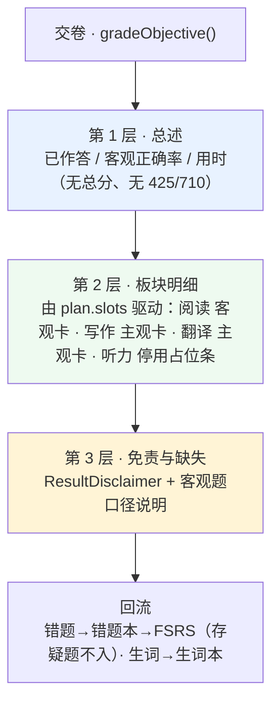
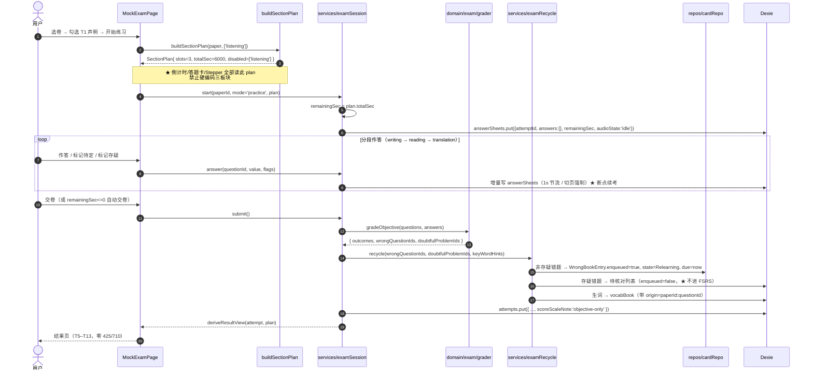
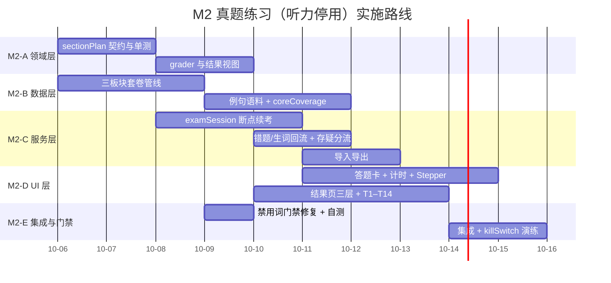

# M2 增量设计 —— 真题练习（听力停用·保留预留位）+ 测验 + 错题/生词闭环 + 导入导出

| 项目信息 | 内容 |
|---|---|
| 文档版本 | **v1.2**（含门禁冲突裁决 §5.6 + 扫描范围不变量 §5.7） |
| 撰写人 | 高见远（架构师） |
| 上游输入 | `docs/03-M2增量PRD.md` v1.0/§8（许清楚）；`docs/02-实现方案.md` v1.5；QA 门禁回归上报（`tests/fixtures/forbidden-words.ts`）；用户拍板口径（team-lead 转达） |
| 文档性质 | **增量设计** —— 仅描述 M2 的架构增量，**不重写 `docs/02`**；`docs/02` 的作废/改写收敛于本文**附录 A** |
| 基线 | M1 冻结于 `a9f4bab`；`DB_VERSION = 1` |
| 下游 | 工程师按第 8 章任务列表实施；QA 按第 4/5/6 章验收 |

### 📌 v1.1 增补（相对 v1.0）
> **触发**：QA 用真实脚本回归，暴露 ① 正向正则**漏放** `预估总分 710`（假阴性）；② 补逆向检测后会**命中我们自己的免责文案**（原 T5）。**架构侧已独立复现并裁决**，口径见 **§5.6**：
> - 🔄 **T5 改写为 T5-v2**（去 425/710 数字）——修正内容而非削弱护栏；
> - 🔄 **门禁 = 正向 + 逆向并行**（§5.4），`scoreForward` 补 `折算`；
> - 🔄 **G-3 期望由"放行"改为"拦截"**（新增 G-7 冲突锚点）；
> - 🔴 **门禁与文案必须同批交付（同一 PR）**；
> - 门禁改为**单一真源**（`import` QA fixture，拒绝正则双写）。
> **未变更**：§1–§4、§6–§11、附录 A/B 全部保持 v1.0。

### 📌 v1.2 增补（相对 v1.1）
> **触发**：PM 在 PRD v1.2 §9.4.2 提请架构侧裁定——「门禁 fixture **天然必须含禁用串**，故其路径必须被**结构性**排除在扫描范围外，而非依赖『恰好没扫到 `tests/`』的巧合」。**架构侧采纳，并升级为会变红的不变量**，口径见 **§5.7**：
> - 🔄 **扫描范围收敛为「自撰对外文案」**：`src/**` + `README.md` + `public/data/ATTRIBUTION.md`；**显式排除** `docs/**`、`tests/**`、**`public/data/**` 语料**（实时证据见 §5.7.1）；
> - 🔴 **新增守卫测试 G-A + 自证测试 G-B**：把「fixture 在范围外」从隐式巧合变成**结构上不可能红**的不变量；
> - 🔴 **替换字面量断言**（PM §9.4.2b 指出的"默认修法即拆护栏"陷阱）为**关系式断言 G-C**；
> - ✅ **单一真源不变**：`SCAN_ROOTS` 仍由 fixture 导出、门禁脚本 `import` 之；
> - + **ATTRIBUTION §二生成器修正**（PM §9.2，见 §5.8）。
> **未变更**：§1–§4、§6、§5.1–§5.6 结论、附录 A 全部保持 v1.1。

> **一句话**：M2 把「完整真题模考」改为「**真题练习（写作+阅读+翻译）**」，听力**停用但保留预留位**；架构上的核心交付是**把「三板块」从代码里的假设变成 `sectionMeta` 数据驱动的结果**——这样将来恢复听力**零代码改动**。

---

## 第 0 章 决策输入与范围冻结

### 0.1 硬约束（采信 `docs/03` 第 0 章，不得"优化"）

| # | 口径 | 架构含义 |
|---|---|---|
| C1 | 听力**停用·保留预留位** | 内置卷 `sectionMeta` 仅 `writing / reading / translation` |
| C2 | 类型字段与 Dexie 表**保留但不产出内容，零 schema 迁移** | **不递增 `DB_VERSION`、不新增 migration** |
| C3 | `src/services/speech/*` 属 M1 单词发音 | **本次不触碰** |
| C4 | M2 范围 = 真题练习（写/读/译）+ 测验 + 错题/生词闭环 + 导入导出 | 见第 8 章任务列表 |
| C5 | 不得出现「425 / 710 预估」 | 结果页零换算（第 4 章） |
| C6 | 产品名保持「真题练习」 | 术语映射见 §2.7 |

### 0.2 本期**明确不做**（防蔓延）

| 不做 | 依据 |
|---|---|
| 听力四态 `resolveListeningCapability()` + `ListeningCapabilityBar` | 无触发场景（`docs/02 §3.6.2/3.6.3` 降级为预留位文档） |
| `ExamAudioService` 运行时（加载/缓冲/断点/三级降级） | 无音频源；**接口与类型保留**（可恢复性） |
| 听力精听页（原 M3 ①） | `docs/03 §3.6` 移交清单 #13 |
| 能力雷达图 | `docs/03 §5 M2-23`：删听力后仅剩三维且听力是最大分值项，**会严重误导**，不做 |
| 任何云同步 / 账号 / 上传 | C1 + 铁律 A2 |

### 0.3 零 schema 迁移声明（已实地核实）

| 文件 | 现状核实 | 本期动作 |
|---|---|---|
| `src/domain/exam/types.ts` | `'listening'` 字面量、`ExamSectionMeta.audioTrackId`、`ExamSection.audioRange`、`ExamSection.transcript`、`AnswerSheet.audioState`、`DerivedSpec.listeningParts`、`OriginalExamPaper = Omit<..., 'audioTrackId'>` **全部在位** | ✅ **不改** |
| `src/data/db/db.ts` | `DB_VERSION = 1`；`listeningProgress ∈ PROGRESS_STORES`；`audioCache ∈ SYSTEM_STORES`；`DB_SCHEMA` 含两表 | ✅ **不改** |
| `src/services/speech/*` | M1 单词发音 | ✅ **不改** |
| `scripts/build-sentences.ts` | **安全 no-op**（无原始语料时不改 `manifest.sentences`，保持 `available=false / coverage=0`） | ✅ 不改（属 M2 数据工作输入） |
| `public/data/manifest.json` | `sentences.available=false, coverage=0` | M2 由数据管线改写（见第 6 章） |

> **结论**：本次决策在数据层是**纯增量**。`git diff` 应**不出现** `types.ts` / `db.ts` / `migrations.ts` / `speech/*` 的任何改动——这是 QA 的一条可核查断言（附录 B-Q3）。

---

## 第 1 章 技术选型增量

**结论：零新增运行时依赖。** M2 全部能力由 M0 已定的栈覆盖。

| 能力 | 采用 | 为什么现有栈够用 | 为什么不引新依赖 |
|---|---|---|---|
| 板块计划 / 计时 | 纯 TS（`domain/exam/sectionPlan.ts`） | 只是数组推导与求和，无需库 | dayjs/date-fns 会引入时区语义，而计时用 **ticks 累加**（`AnswerSheet.elapsedSec`），根本不需要日期库 |
| 客观题批改 | 纯 TS（`domain/exam/grader.ts`） | 字符串比较 + 分类 | — |
| 结果页图表 | **不自研图表**，用纯 CSS 条形 + 文本 | 结果页只表达"正确率 / 用时"，条形即可 | Recharts 约 +90 KB gzip，与 M2 首屏预算不成比例；雷达图已决定不做 |
| 断点续考 | Dexie 增量写 | `answerSheets` 表已存在（M0） | — |
| 导入导出 | 原生 `Blob` + `URL.createObjectURL` | 无后端 | JSZip 会让"可审计的纯文本 JSON"变成二进制黑盒，且更易触发体积门禁 |

> ⚠️ **与 `docs/02` 的一处口径差**：`docs/02` 曾在 M4 提到"能力雷达图此时才引入 Recharts"。本增量**维持不做雷达图**（M2-23 理由），因此 **M2/M3/M4 均不引入 Recharts**，`docs/02` 附录 A 的依赖清单**不变**。

---

## 第 2 章 ★ 架构核心：「`sectionMeta` 驱动的可恢复性契约」

> 本章是本次决策**唯一有长期架构价值**的部分。若只保留字段而不落实本章，则「保留预留位」退化为"字段没删"，恢复听力的成本依旧很高——**那就失去了这次决策的意义**。

### 2.1 契约（三条硬约束，写进 Code Review）

| # | 约束 | 反例（禁止） |
|---|---|---|
| **K1** | **板块渲染**只能遍历 `plan.slots`（源自 `sectionMeta`） | `['writing','reading','translation'].map(...)` 字面量数组 |
| **K2** | **分段倒计时**与**总时长**只能由启用板块的 `durationHintSec` **求和推导** | `const TOTAL = 100 * 60` 硬编码 |
| **K3** | **答题卡分组、题号区间、SectionStepper** 只能读 `slot.questionFrom/To` | `if (kind === 'reading') from = 36` 之类题号硬编码 |

> **可验证性**：K1–K3 落实后，**把听力加回 `sectionMeta` 并移出 `disabledKinds`，应当零代码改动、总时长自动回到 125 分钟**。这一点由 §2.6 的往返单测强制。

### 2.2 唯一真源：`buildSectionPlan()`（纯函数，可单测）

```ts
// src/domain/exam/sectionPlan.ts —— 铁律 A1：纯类型，零 React、零 IO
import type { ExamPaper, ExamSectionKind, ExamSectionMeta } from './types';

/** 一个启用板块的渲染/计时槽位 */
export interface SectionSlot {
  meta: ExamSectionMeta;
  /** 建议用时（秒）——直接取自 meta.durationHintSec */
  durationSec: number;
  /** 该槽位占用的题号区间（答题卡分组用） */
  questionFrom: number;
  questionTo: number;
  /** 该槽位内的题数（= questionTo - questionFrom + 1），用于进度显示 */
  questionCount: number;
}

/** 一次练习的完整板块计划 —— 所有 UI 的唯一数据源 */
export interface SectionPlan {
  /** 仅启用板块，按 meta.order 升序 */
  slots: SectionSlot[];
  /** ★ 实际总时长（秒）= Σ slot.durationSec —— 禁止在别处再算一次 */
  totalSec: number;
  /** 考试规格时长（秒）= paper.durationMin * 60，仅用于「真实考试 125 分钟」对照展示 */
  specSec: number;
  /** 本期停用的板块（含 'listening'），用于 UI 显式占位（T1 / T11） */
  disabledKinds: ExamSectionKind[];
}

/** 本期停用清单 —— 唯一"知道听力被停用"的地方，集中可查 */
export const DEFAULT_DISABLED_SECTIONS: ExamSectionKind[] = ['listening'];

/**
 * 由 sectionMeta 推导板块计划。★ K1–K3 的唯一实现处，其余地方一律消费它的产物。
 * 纯函数：无 IO、无 React、无 Date。
 */
export function buildSectionPlan(
  paper: ExamPaper,
  disabled: ExamSectionKind[] = DEFAULT_DISABLED_SECTIONS,
): SectionPlan {
  const disabledSet = new Set(disabled);
  const slots: SectionSlot[] = paper.sectionMeta
    .filter((m) => !disabledSet.has(m.kind))
    .sort((a, b) => a.order - b.order)
    .map((m) => ({
      meta: m,
      durationSec: m.durationHintSec ?? 0,
      questionFrom: m.questionFrom,
      questionTo: m.questionTo,
      questionCount: m.questionTo - m.questionFrom + 1,
    }));

  // 兜底：某板块缺 durationHintSec 时，用「规格时长 − 已停用板块时长」补齐差额（见 §2.5）
  const totalSec = slots.reduce((sum, s) => sum + s.durationSec, 0);

  return {
    slots,
    totalSec,
    specSec: paper.durationMin * 60,
    disabledKinds: paper.sectionMeta
      .filter((m) => disabledSet.has(m.kind))
      .map((m) => m.kind),
  };
}
```

### 2.3 消费契约：谁读 `plan`，谁不再自己算

| 消费点 | 读取字段 | 禁止 |
|---|---|---|
| `<SectionStepper>`（T4） | `plan.slots.map(s => s.meta.partLabel)` | 硬编码「写作 ▸ 阅读 ▸ 翻译」 |
| `<TimerBar>`（T3） | `plan.totalSec` 与各 `slot.durationSec` | 硬编码 `100` / `6000` |
| `<AnswerSheetPanel>` 分组 | `plan.slots` → `slot.questionFrom/To` | 按 kind 硬编码题号 |
| `<ResultPage>` 板块明细卡 | `plan.slots` 遍历生成卡 | 写死三张卡 |
| `examSession`（服务层） | `plan.totalSec` 作为 `remainingSec` 初值 | 自行求和 |

> **单一真源纪律**：`plan.totalSec` 是**唯一**的时长来源；`settings`/`feature` 层**不得**再各算一遍总时长（这是"三处硬编码"的根源）。

### 2.4 不变量与单测（对齐铁律 A8：断言关系，不断言魔法数字）

```ts
// src/domain/exam/sectionPlan.test.ts
// ✅ 断言不变量，不写死 100 / 6000
expect(plan.totalSec).toBe(plan.slots.reduce((s, x) => s + x.durationSec, 0));   // 自洽
expect(plan.slots.every((s, i, a) => i === 0 || a[i - 1]!.meta.order < s.meta.order)).toBe(true); // 严格升序
expect(plan.totalSec).toBeLessThanOrEqual(plan.specSec);                          // 不超过规格
expect(plan.slots.every((s) => s.questionFrom <= s.questionTo)).toBe(true);       // 区间合法
// ❌ 反例（禁止）：expect(plan.totalSec).toBe(6000)
```

### 2.5 时长推导（§2.6 硬要求）：**禁止硬编码 100**

```
totalSec 的取数优先级：
  ① Σ 启用板块的 sectionMeta[i].durationHintSec        ← 首选（本期 = 1800+2400+1800 = 6000s = 100min）
  ② 若某启用板块缺 durationHintSec：
       totalSec = specSec − Σ 停用板块的 durationHintSec
       （本期兜底 = 7500 − 1500 = 6000s = 100min）
  ③ 两条都不可用 → totalSec = specSec（并打 warn，UI 标注"时长按考试规格"）
```

> **`ExamPaper.durationMin = 125` 保留为「考试规格常量」**，仅用于文案「真实考试 125 分钟，本次 100 分钟」，**不参与倒计时**。

### 2.6 ★ 可恢复性往返测试（本次决策的"验收凭据"）

构造一份 `sectionMeta` 含 **4 个板块**（含听力 `durationHintSec = 1500`）的测试卷：

| 输入 | 期望 `plan.slots.length` | 期望 `plan.totalSec` | 含义 |
|---|---:|---:|---|
| `disabled = ['listening']`（本期默认） | **3** | **6000s（100min）** | M2 实际形态 |
| `disabled = []`（恢复听力，**零代码改动**） | **4** | **7500s（125min）** | 证明预留位有效 |

```ts
it('可恢复性契约：移除听力停用后总时长自动回到 125 分钟，且无需改任何业务代码', () => {
  const paper = makePaperWith4Sections();            // 含 listening
  const withX   = buildSectionPlan(paper, ['listening']);
  const restore = buildSectionPlan(paper, []);
  expect(withX.slots.map(s => s.meta.kind)).toEqual(['writing', 'reading', 'translation']);
  expect(restore.slots.map(s => s.meta.kind)).toEqual(['writing', 'listening', 'reading', 'translation']);
  expect(withX.totalSec).toBe(6000);
  expect(restore.totalSec).toBe(7500);
});
```

> 这条测试**就是**「保留预留位」的可执行定义：**若某天它变红，说明有人把三板块写死进了代码。**

### 2.7 术语映射（UI 层，内部标识符不动）

| 位置 | 旧 | 新 | 落点 |
|---|---|---|---|
| 导航 / H1 | 完整模考 | **真题练习** | `MockExamPage.tsx` 现有 H1「完整模考」需改 |
| 开始按钮 | 开始模考 | **开始练习** | — |
| 计时模式名 | — | **计时练习** | — |
| `AttemptMode = 'mock'` | `'mock'` | ✅ **不变**（C2 零迁移） | 类型层 |
| README 里程碑行 | 完整真题模考 | 真题练习 + 测验 + 闭环 + 导入导出 | `README.md` |
| ⛔ 禁用 | 全真模考 | — | 已在 8 词门禁内（第 5 章） |

---

## 第 3 章 数据模型增量（零迁移）

### 3.1 复用清单（**不改一行**）

| 类型 | 关键字段 | 本期用途 |
|---|---|---|
| `ExamPaper` | `sectionMeta[]`、`durationMin`、`totalScore`、`provenance`、`confidence`、`provenanceLabel` | 卷面与来源标识 |
| `ExamSectionMeta` | `kind`、`order`、`questionFrom/To`、`durationHintSec`、`rawScore`、`audioTrackId?` | **`buildSectionPlan` 的输入** |
| `ExamSection` | `passage`、`transcript?`、`audioRange?`、`questions[]` | 阅读篇章渲染 |
| `ExamQuestion` | `kind`、`no`、`score`、`answer?`、`stem?`、`options?`、`explanation?`、`sentenceIds?`、`keyWordHints?` | 作答与批改 |
| `AnswerRecord` | `value`、`flag`、`doubtful?`、`doubtReason?`、`selfScore?` | 答题卡与存疑 |
| `AnswerSheet` | `answers`、`cursorQuestionId`、`elapsedSec`、`lastSavedAt`、`remainingSec`、`audioState`（本期恒 `'idle'`） | **断点续考** |
| `ExamAttempt` | `objectiveScore/Total`、`sectionScores[]`、`subjectiveSelfScore?`、`scoreScaleNote:'objective-only'`、`wrongQuestionIds`、`newWordIds` | 结果与回流 |
| `ExamSentence` | `span`、`targetForm`、`questionId` | 单词↔真题双向跳转 |
| `OriginalExamPaper` | `Omit<ExamSectionMeta,'audioTrackId'>` | 铁律 A6 类型层强制 |

### 3.2 新增（全部是**视图模型**，不落 IndexedDB，不入 `types.ts` 的持久化域）

```ts
// src/domain/exam/result.ts
/** 结果页视图模型 —— 从 ExamAttempt + SectionPlan 派生，纯函数，可单测 */
export interface ExamResultView {
  paperId: string;
  /** 第 1 层：总述（零总分、零换算） */
  overview: {
    answered: number;
    total: number;               // 启用板块题数之和
    objectiveCorrect: number;    // 仅客观题（阅读 30 题内）
    objectiveTotal: number;
    /** ⚠️ 分母为 0 时为 null，UI 显示"无样本"，禁止产出 0% */
    objectiveRate: number | null;
    elapsedSec: number;
  };
  /** 第 2 层：板块明细（由 plan.slots 驱动，顺序与板块一致） */
  sections: SectionResultCard[];
  /** 第 3 层：免责与缺失声明 */
  disclaimers: {
    resultCopyright: string;                 // T5
    listeningDisabled: string;               // T11 摘要句
    objectiveOnlyNote: string;               // T7
  };
  /** 回流统计 */
  recycled: { wrongCount: number; newWordCount: number };
}

export type SectionResultCard =
  | { kind: 'objective'; sectionKind: ExamSectionKind; correct: number; total: number;
      rate: number | null; elapsedSec: number; label: string }
  | { kind: 'subjective'; sectionKind: ExamSectionKind; selfScore: number | null;
      rubricRef?: string; label: string }
  | { kind: 'disabled'; sectionKind: ExamSectionKind; label: string; note: string };
```

```ts
// src/domain/exam/grader.ts —— 客观题批改（本期仅阅读 30 题可自动判分）
export type ObjectiveOutcome = 'correct' | 'wrong' | 'blank' | 'marked' | 'doubtful';

export interface GradeInput  { questions: ExamQuestion[]; answers: Record<string, AnswerRecord>; }
export interface GradeOutput {
  outcomes: Record<string /*questionId*/, ObjectiveOutcome>;
  objectiveCorrect: number;
  objectiveTotal: number;
  wrongQuestionIds: string[];        // 入错题本候选（★ 排除 doubtful）
  doubtfulProblemIds: string[];      // 存疑错题 → 待核对列表，不入 FSRS
}
export function gradeObjective(input: GradeInput): GradeOutput;
```

### 3.3 Dexie：**不递增 `DB_VERSION`，不新增 migration**

| 表 | 变更 | 说明 |
|---|---|---|
| `answerSheets` / `attempts` | ✅ 复用（M0 已建） | 断点续考与历史 |
| `wrongBook` / `vocabBook` / `quizSessions` | ✅ 复用 | 回流 |
| `listeningProgress` | ✅ **保留、不写入** | 预留位；`enqueued` 语义不涉及它 |
| `audioCache` | ✅ **保留、不写入** | 预留位 |
| 新增表 | ❌ **无** | — |

### 3.4 类图（`classDiagram`）

```mermaid
classDiagram
    class ExamPaper {
      +string id
      +number durationMin
      +ExamSectionMeta[] sectionMeta
      +Provenance provenance
      +ExamConfidence confidence
      +string provenanceLabel
    }
    class ExamSectionMeta {
      +string id
      +ExamSectionKind kind
      +number order
      +number questionFrom
      +number questionTo
      +number durationHintSec
      +number rawScore
      +string audioTrackId
    }
    class SectionPlan {
      +SectionSlot[] slots
      +number totalSec
      +number specSec
      +ExamSectionKind[] disabledKinds
    }
    class SectionSlot {
      +ExamSectionMeta meta
      +number durationSec
      +number questionFrom
      +number questionTo
      +number questionCount
    }
    class AnswerSheet {
      +Record~string,AnswerRecord~ answers
      +string cursorQuestionId
      +number elapsedSec
      +number remainingSec
      +AudioState audioState
    }
    class AnswerRecord {
      +string value
      +QuestionFlag flag
      +boolean doubtful
      +number selfScore
    }
    class ExamAttempt {
      +number objectiveScore
      +number objectiveTotal
      +SectionScore[] sectionScores
      +string scoreScaleNote
      +string[] wrongQuestionIds
      +string[] newWordIds
    }
    class ExamResultView {
      +Overview overview
      +SectionResultCard[] sections
      +Disclaimers disclaimers
    }
    class SectionResultCard {
      +string kind
      +ExamSectionKind sectionKind
      +number rate
    }
    class Grader {
      +gradeObjective(GradeInput) GradeOutput
    }
    class SectionPlanBuilder {
      +buildSectionPlan(ExamPaper, ExamSectionKind[]) SectionPlan
    }

    ExamPaper "1" --> "3..4" ExamSectionMeta : sectionMeta
    SectionPlanBuilder ..> ExamPaper : 读
    SectionPlanBuilder ..> SectionPlan : 产出
    SectionPlan "1" --> "*" SectionSlot
    SectionSlot --> "1" ExamSectionMeta : meta
    SectionPlan ..> AnswerSheet : 驱动倒计时/分组
    AnswerSheet "1" --> "*" AnswerRecord : answers
    Grader ..> AnswerRecord : 读
    Grader ..> ExamAttempt : 产出
    ExamAttempt --> ExamResultView : deriveResultView
    ExamResultView "1" --> "*" SectionResultCard : sections
    SectionPlan ..> ExamResultView : 提供板块顺序
```



---

## 第 4 章 结果页与练习口径

### 4.1 三层表达结构



### 4.2 文案映射（**直接采用 `docs/03 §2.4` T1–T14 原文，改文案须回本文件同步**）

| 组件 | 文案 | 触发 |
|---|---|---|
| `<NoListeningNotice>` | **T1** | 开始前（须勾选才可开始） |
| `<ConfidenceBanner variant="pre">` | **T2**（沿用 `docs/02 §3.6.3`） | 开始前 |
| `<TimerBar>` | **T3**：`限时 100 分钟` / 副标 `写作 30 · 阅读 40 · 翻译 30`（**由 `plan` 生成，不得硬编码**） | 答题中 |
| `<SectionStepper>` | **T4**：由 `plan.slots` 生成 | 答题中 |
| `<ResultDisclaimer>` | **T5-v2**（**v1.1 改写，去 425/710 数字**，见 §5.6）：`本卷为第三方整理版，答案未经官方核对。成绩仅供练习参考，不代表真实四级水平，也不与任何官方计分口径对应。` | 结果页顶部红条 |
| `<ResultOverview>` | **T6 / T7** | 结果页总述 |
| `<SectionScoreCard>` | **T8**（阅读）/ **T9**（写作）/ **T10**（翻译） | 结果页明细 |
| `<ListeningDisabledCard>` | **T11** | 结果页占位 |
| `<RecycleHint>` | **T12** | 结果页回流提示 |
| `<ResultOverview empty>` | **T13** | 全空态 |
| `<AutoSubmitToast>` | **T14** | 倒计时归零 |

### 4.3 边界（`docs/03 §2.7` B1–B8，架构侧补充落点）

| # | 场景 | 架构落点 |
|---|---|---|
| B1 | 倒计时归零自动交卷 | `examSession.tick()` 内，`remainingSec <= 0` → `submit('auto')` |
| B2 | 仅部分板块作答 | `deriveResultView` 只对**已触及**板块产出 `SectionScoreCard`；未触及板块 `kind:'disabled'` 文案 `本次未作答` |
| B3 | 全部未作答 | `objectiveTotal = 0` → `objectiveRate = null` → T13 |
| B4 | 标记待定未处理 | `submit()` 前二次确认（UI 层）|
| B5 | 未选自评 | `selfScore = null` → 显示 `未自评`，**不参与任何统计** |
| B6 | **存疑题答错** | `gradeObjective` 归入 `doubtfulProblemIds`，**不得**进 `wrongQuestionIds`；该题**仍计入**正确率分母 |
| B7 | 写作是否严格收卷 | 默认宽松；严格模式列 P1（`M2-20`） |
| B8 | 断点续考恢复 | 恢复 `answers` + `remainingSec` + `cursorQuestionId` + 当前板块；听力状态无恢复义务 |

> **B6 是本期最硬的一条**：数据源不可验证（无官方底本），**错误的标准答案若进 FSRS 会永久污染复习调度**——比答案本身错更严重。故「存疑不入队」必须在 `grader` 层就分流，**不得依赖 UI 层的过滤**（UI 可能被绕过）。

### 4.4 时序图：真题练习主流程（含批改与回流）



---

## 第 5 章 ★ 门禁修复（Q2 / Q3 + 一处新发现）

> 本章是**架构侧对 PM 两个"待确认"问题的实测回答**，并附带一个 PM 未发现的**更严重**的缺陷（§5.2）。
> **v1.1 增补**：QA 用真实脚本回归，暴露了**正向正则的假阴性**与**原 T5 的互斥**（见 §5.1(b) / §5.6）。**架构侧已裁决，口径以 §5.6 为准。**

### 5.1 评分换算正则：正向**漏放** + 逆向必需

**（a）PM 关心的点不成立**：正向正则 `(425|710)\s*分?\s*(预估|换算)` 对「T5 的 `710 分制`」**不命中**（`分制` 不构成 `预估|换算`）——2026-09-30 首轮实测已确认。

**（b）QA 发现的假阴性成立**（架构侧独立复现）：正向正则只抓「数字在前」，抓不到**语序反转**。

| 样本文本 | 正向 `(425\|710)\s*分?\s*(预估\|换算\|折算)` | 逆向 `(预估\|换算\|折算)[^。；，]{0,6}(425\|710)` | 判定 |
|---|:--:|:--:|---|
| `425分换算` | ✅ 命中 | ❌ 漏检 | 应拦（正向够） |
| `710 分预估` | ✅ 命中（**原 `docs/02` 版无 `\s*`，此串会漏**） | ❌ 漏检 | 应拦 |
| `预估总分 710` | ❌ **漏检** | ✅ 命中 | 应拦（**必须靠逆向**） |
| `不能折算为 710 分制`（**原 T5**） | ❌ 不命中 | 🔴 **命中** | ⚠️ **冲突串 → 见 §5.6** |
| `不与任何官方计分口径对应`（T5-v2） | ❌ | ✅ 安全 | 应放行 |
| `本页不显示 710 分制评分`（T5-v3 备选） | ❌ | ✅ 安全 | 应放行 |
| `420分预估` | ❌ 不命中 | ❌ | 应放行（非 425/710） |

**结论**：① **单靠正向必漏语序反转 `预估总分 710` → 必须补逆向检测**；② 但**逆向检测会命中原 T5 的「折算…710」** → 「G-3 放行 710 分制」与「拦 `预估总分 710`」**不可兼得**。处置见 §5.6。

### 5.2 🔴 **新发现（PM 未提及）**：门禁会误伤**否定式表述**「非官方发布」

实测 `官方(真题|答案|发布|版)`：

| 样本文本 | 是否命中 | 问题 |
|---|:--:|---|
| `本站试题内容来源于第三方公开整理，非官方发布…`（`docs/02` **允许表述**表） | 🔴 **命中** | **误伤** |
| `本套试卷为第三方公开整理版，非官方发布。`（**T2 / `ConfidenceBanner`**） | 🔴 **命中** | **误伤** |
| `由于官方不公布真题与标准答案，本卷未经官方核对。`（T2 后半句） | ❌ 不命中 | ✅ 安全 |

> **严重性**：`非官方发布` 正是**我们主动要求必须出现在 UI 的免责文案**（T2 开始前横幅 / `docs/02` 页脚）。门禁若照现状实现，会在 **M2 首次提交时就把自己的合规文案判死**。这属于"门禁把正确做法判为违规"，比漏放更危险——它会导致工程师**为了过门禁而删掉免责声明**。

**修复方案（推荐 A）**：加**负向断言**，放行否定前缀：

```diff
- -e '官方(真题|答案|发布|版)'
+ -e '(?<![非未不])官方(真题|答案|发布|版)'
```

- 正则引擎改用 **`grep -P`（PCRE）**，GitHub Actions `ubuntu-latest` 自带 GNU grep 支持 `-P`。
- 效果：`非官方发布` / `非官方版` / `未官方发布` **放行**；裸 `官方真题` / `官方答案` / `官方发布` **仍然拦截**。
- 备选 B：不改正则，改为**先删除否定短语再扫描**（`sed 's/非官方//g'` 后再 grep）——更脆弱，**不推荐**。

### 5.3 Q3 实测结论：**必须限定扫描范围，否则门禁自我违规**

**实测**：`docs/02-实现方案.md` 自身包含大量禁用词原文（禁用词清单表、R11 分析、禁止表述示例）：

| 位置 | 命中内容 |
|---|---|
| `docs/02` L1023–1030 | `官方真题` / `官方答案` / `官方发布` / `真题原卷` / `权威真题` / `全真模考` …（**禁用词清单表本体**） |
| `docs/02` L956 / L958 | `全真模考`（说明"不得称为全真模考"） |
| `docs/02` L1041–1042 | CI 规则示例本身含禁用词 |
| `docs/02` L2248 / L2293 | `官方真题`（风险触发信号） |
| `docs/02` L1050–1057 | 允许表述表（含 `非官方发布` → 见 §5.2） |

> **现状还有一个硬伤**：`docs/02 §3.6.4` 给出的 CI 规则**已经把 `docs/02-实现方案.md` 写进了扫描路径**（`… src/ public/ README.md docs/02-实现方案.md`）。也就是说——**这条规则按原文实现，第一天就会红，且红在它自己的定义文件上。**

**结论（采信 PM 推荐 A，并收紧一步）**：

| 决策 | 内容 |
|---|---|
| **扫描范围** | `src/**` + `README.md` + `public/data/ATTRIBUTION.md`（**自撰的对外可见文案**） |
| **排除** | `docs/**`（设计文档，合法引用禁用词做规则定义与风险分析）；`tests/**`（门禁 fixture 必含禁用串，见 §5.7）；**`public/data/**` 语料**（`words/`、`manifest.json`、`VERIFY-REPORT.md` 等第三方/生成内容，含裸数字与词典释义，证据见 §5.7.1）；`node_modules/`、`dist/`（`dist` 是 `public`+`src` 的产物，重复扫描无意义） |
| **理由** | 门禁的目的是**不让禁用词进入我们自撰的用户可见文案**；第三方语料我们无权改写、也不该因上游措辞而红，故只扫「我们写的那部分」 |

### 5.4 修正后的门禁（★ v1.1：单一真源 = QA fixture，拒绝正则双写）

> **采纳 QA 的"减少漂移"建议**：门禁**不在 CI 里手写第二份正则**，而是由 `scripts/check-forbidden-words.ts` **直接 import** QA 的 `tests/fixtures/forbidden-words.ts`（`GATE_PATTERNS` / `SCAN_ROOTS` / `SCAN_EXTENSIONS` / `FORBIDDEN_SAMPLES`），**自测 + 扫描一次完成**。这样"门禁"与"回归样例"**永远同一份定义**，不可能漂移。

**最终正则集合（权威定义 = `tests/fixtures/forbidden-words.ts` 的 `GATE_PATTERNS`，本节为镜像，不作为第二真源）**

| 模式 | 正则 | 作用 |
|---|---|---|
| `negationOfficial` | `(?<![非未不])官方(真题\|答案\|发布\|版)` | 放行否定式「**非**官方发布」 |
| `negationExamAuth` | `(?<![非未])考试(院\|中心)(认证\|授权)` | 同上 |
| `rawPaper` / `authoritative` / `fullMock` | `真题原卷` / `权威真题` / `全真模考` | 字面 |
| `scoreForward` | `(425\|710)\s*分?\s*(预估\|换算\|**折算**)` | 数字在前（**含 `折算`**） |
| `scoreReverse` | `(预估\|换算\|折算)[^。；，]{0,6}(425\|710)` | 数字在后（**补语序反转**） |

**CI 调用（唯一入口）**

```yaml
# ——— 合规附录 B-16：禁用词门禁（★ v1.6.2，单一真源 + 正向/逆向并行） ———
# 扫描范围：src/** + README.md + public/data/ATTRIBUTION.md（自撰对外文案）
# 排除 docs/（合法引用禁用词）、tests/（fixture 必含禁用串）、public/data/** 语料（第三方/生成）
# 范围真源 = tests/fixtures/forbidden-words.ts 的 SCAN_ROOTS，脚本 import 之（见 §5.7），拒绝双写
- name: 门禁 5 · 禁用词检查（fixture 自测 + 自撰文案扫描）
  run: pnpm tsx scripts/forbidden-words.ts
```

**门禁自测用例（与 `FORBIDDEN_SAMPLES` 对齐，防回归）** —— ⚠️ **G-3 已按 §5.6 裁决由"放行"改为"拦截"**

| 用例 | 输入 | 期望 | 说明 |
|---|---|---|---|
| G-1 | `非官方发布` | ✅ **放行** | 否定式免责文案，不得误伤 |
| G-2 | `官方真题` | ❌ 拦截 | 正面 |
| G-3 🔄 | `预估总分 710` | ❌ **拦截** | **v1.1 修正**：原为「放行 `不能折算为 710 分制`」；现按 §5.6 与逆向检测对齐 |
| G-4 | `710 分预估` | ❌ 拦截 | 含空格 |
| G-5 | `不与任何官方计分口径对应`（T5-v2 全文片段） | ✅ **放行** | 改写后的免责声明必须放行 |
| G-6 | `docs/02-实现方案.md`（含全部禁用词） | ✅ 放行 | **扫描范围外** |
| G-7 🆕 | `不能折算为 710 分制` | ❌ **拦截** | **冲突锚点**：该串不得进入 `src/`（见 §5.6） |

### 5.5 与 `docs/02` / `docs/03` 的差异（**已同步修订，见附录 A**）

| 位置 | 现状 | 修正 |
|---|---|---|
| `docs/02` §3.6.4 CI 规则块 | 扫描路径含 `docs/02-实现方案.md`；正则无负向断言、无逆向检测 | 替换为 §5.4（**单一真源** + 正向/逆向并行） |
| `docs/02` §3.6.4 禁用词表 #2/#3 | 未说明否定式表述 | 增加一行「**允许**：`非官方发布`（否定式，免责声明用）」 |
| `docs/02` 附录 B-16 | 只写正则，未写**扫描范围** | 补扫描范围 + 正向/逆向**两条**正则 |
| `docs/02` §3.6.3 ③ 成绩页文案（T5） | 含「不能折算为 710 分制」 | **改写为 T5-v2**（无数字），见 §5.6 |
| `docs/03` §8.1 / §8.2 | PM 已出 T5 改写与门禁建议 | **架构侧全部采纳**，见 §5.6 |

### 5.6 ★ 冲突裁决（QA 上报 §①/§②）——采纳 PM §8，**改写 T5**

**冲突**：`G-3 放行「不能折算为 710 分制」` 与 `拦「预估总分 710」` **不可兼得**（架构侧独立复现，见 §5.1(b)）。

**裁决：采纳 `docs/03 §8.1` —— 把 T5 改写为无数字版（T5-v2），并启用「正向 + 逆向」并行检测。** QA 的 fixture 立场（`B10` 判 `block`）与本裁决一致。

**为什么"改文案"而不是"放宽门禁"**（本次裁决的核心）：

| 选项 | 后果 | 评价 |
|---|---|---|
| A. 放宽门禁（删逆向检测）以保住原 T5 | 🔴 漏放 `预估总分 710` 等语序反转 → **唯一防"预估分"的闸门失效** | ❌ 否决 |
| B. 保留门禁 + **改写 T5**（不改语义，只去数字） | 免责声明仍成立（`不与任何官方计分口径对应`），门禁保住 | ✅ **采纳** |

> **原则：修正内容，而不是削弱护栏。** 若为保住一个数字而放宽门禁，团队下次只会继续放宽——直到门禁形同虚设。**护栏的严肃性 > 文案里的一个数字。**

**T5 最终文案（采 T5-v2）**

> `本卷为第三方整理版，答案未经官方核对。成绩仅供练习参考，不代表真实四级水平，也不与任何官方计分口径对应。`

- 备选 T5-v3（保留 710 且双向安全）：`…不代表真实四级水平；本页不显示 710 分制评分。`（§5.1(b) 实测通过）
- **代价与补偿**（采信 `docs/03 §8.1`）：T5 不再点名「710」，暗示略弱；补偿 = ① 结果页 DOM 断言（测试层强制"零 425/710"，比文案更硬）；② `ExamAttempt.scoreScaleNote:'objective-only'` 类型约束保留；③ T7「客观题仅含阅读 30 题」承担"防误读为整体水平"职责。

**🔴 前置条件（PM §8.2 已提，架构侧确认为硬约束）**

> **门禁与文案必须同批交付（同一 PR）。** 否则中间态必然互斥：先上门禁 → 拦下旧 T5；先改文案 → 门禁未覆盖。`docs/03 §8.3` 的 `MockExamPage` 旧文案替换**必须并入同一 PR**。

**其余采纳项**：
- **扫描范围**（v1.2 收敛）：`src/**` + `README.md` + `public/data/ATTRIBUTION.md` —— **不是** PM §8.2「`src/`+`public/data/`」的简单超集，而是**按「自撰 vs 第三方语料」重新划界**（见 §5.7.1）。QA 实测当前 0 命中。
- `(?<![非未不])` 负向断言**保留**（只作用于 `官方/考试` 词族，与 `scoreForward/Reverse` 互不冲突）。
- **减少漂移**：门禁实现为 `scripts/forbidden-words.ts`，`import` QA fixture 的 `GATE_PATTERNS` / `SCAN_ROOTS` / `firstForbiddenMatch`（§5.4 / §5.7），**不手写第二份正则或范围**。

### 5.7 ★ 裁定（PM §9.4.2 / §9.4.2b）：把「fixture 在扫描范围外」从**巧合**升级为**不变量**

> **PM 的提请**：门禁 fixture **天然必须包含禁用串本身**（否则无法验证拦截是否生效），因此 fixture 所在路径**必须**在扫描范围之外。当前之所以不报错，**仅因「扫描范围恰好没包含 `tests/`」**——这与架构侧已修掉的「规则把 `docs/` 写进扫描路径 → 红在自身定义文件上」是**同一类缺陷**，只是换了个位置。
> **架构侧裁定：采纳。** 且不止于"排除 `tests/`"——顺势把范围按**内容归属**重新划清，并用三条可执行断言固化。**理由与铁律 A9 同构：约定只有被测试固化，才算真的存在。**

#### 5.7.1 扫描范围（最终定义，真源 = fixture 的 `SCAN_ROOTS`）

```ts
// tests/fixtures/forbidden-words.ts（QA 维护，单一真源）
export const SCAN_ROOTS = ['src', 'README.md', 'public/data/ATTRIBUTION.md'] as const;
```

| 纳入 | 为什么 |
|---|---|
| `src/**` | **全部自撰 UI 文案与逻辑**——T1–T14、`ConfidenceBanner`、页脚、`provenanceLabel` 等**实测落点**都在这里 |
| `README.md` | 对外可见的仓库首页文档（实测 0 命中） |
| `public/data/ATTRIBUTION.md` | **唯一**由我们自撰、且对用户展示的 `public/data` 文件（合规声明，生成器产出） |

| 排除 | 为什么 |
|---|---|
| `docs/**` | 设计文档合法引用禁用词做规则定义与风险分析（`docs/02` 禁用词清单表**自身即含**这些词，§5.3） |
| `tests/**` | **门禁 fixture 必须含禁用串**；把测试纳入扫描 = **门禁自我否定**（§5.7.2） |
| **`public/data/**` 语料** | 第三方 / 机器生成内容，**我们无权改写**，且含大量**非文案**的裸数字与词典释义（证据见下） |

**🔴 §5.7.1 证据（2026-10-01 实测，`grep` 于 `public/`）**

| 命中 | 位置 | 判定 |
|---|---|---|
| `"freqRank": 425` / `"freqRank": 710` / `"freqCount": 425` … | `public/data/words/**`、`words.index.*.json` | **词频序号**（非分数）。当前**恰好不命中** `scoreForward/Reverse`（缺 `分/预估/换算/折算` 邻接）→ 现为"安全"；⚠️ **但只要将来某字段把 `425/710` 与 `分/换算` 排到同一行**（如阅读篇章、例句），门禁即**假阳性爆红** |
| `"zh": "官方的"` | `public/data/words/chunk-002.json` | 词典释义。当前不命中 `negationOfficial`（`官方` 后接 `的`，不在 `真题│答案│发布│版` 内），但**"语料含任意中文"是事实** |

**结论**：`public/data/**` 是**第三方语料 + 生成产物**，其文本**不受我们控制**。对它做全量文本门禁，等于**让上游数据的措辞决定我们的 CI 颜色**——这正是 PM 所说「隐式巧合」的另一面。故**显式排除 `public/data/**`**，只保留其中**我们自撰的那一个文件**（`ATTRIBUTION.md`）。

> **数据侧的合规改由"断言自撰字段"覆盖**（见 §5.7.3），与我们自撰的**文案扫描**是两条正交的闸门。

#### 5.7.2 三条「结构上不可能红」的断言（落 `tests/compliance/**`，QA 执行）

| # | 断言 | 目的 |
|---|---|---|
| **G-A 守卫** | `SCAN_ROOTS.some(r => FIXTURE_PATH === r \|\| FIXTURE_PATH.startsWith(r + path.sep)) === false` | 把「fixture 必须在范围外」变成**不变量**；失败信息须写明「fixture 含禁用词属**预期**，扩大范围前必须先排除它」 |
| **G-B 自证** | 对 `tests/fixtures/` 目录跑一次扫描，断言**必然命中**（`hits.length > 0`） | 证明 fixture **确实含**禁用串；与 G-A 合起来证明「含禁用词 + 在范围外」是**有意设计**，不是碰巧 |
| **G-C 关系式** | **删除**现测试的 `expect([...SCAN_ROOTS]).toEqual(['src','public','README.md'])` **字面量**断言，改为 `expect(SCAN_ROOTS.every(r => !r.startsWith('docs'))).toBe(true)`、`…!r.startsWith('tests')` 等**关系式**断言 | 见下 |

**🔴 为什么必须替换字面量断言（PM §9.4.2b 的"陷阱"）**

现测试把范围**字面量又写了一遍**（而 fixture 明明已导出 `SCAN_ROOTS`）。当有人把 `tests` 加进 `SCAN_ROOTS` 时：字面量断言失败 → 失败信息是 `expected [...] to equal [...]` → **最自然的修法就是把测试里的字面量也改掉** → 测试立刻全绿，**而 fixture 已落入扫描范围，门禁开始红在自己身上，且所有测试都是绿的，没人会察觉**。
**即：这道护栏的默认修法，恰好就是拆掉护栏。** 改关系式断言后，破坏护栏的行为会**明确报警**，而非诱导"改字面量"。

#### 5.7.3 数据侧"自撰字段"的守口（补 §5.7.1 的排除面）

`public/data/**` 全文不扫，但**生成器自撰的文案字段**仍需守：

- `scripts/build-papers.ts` 产出的每个 `provenanceLabel` / 卷面 `note` / killSwitch `reason`，**断言 `firstForbiddenMatch(label) === null`**（复用 fixture 的 `firstForbiddenMatch`）；
- 该断言落在 **`scripts/verify-papers.ts`（构建期门禁）**，**不是**全文扫描。

> 这样「我们写进数据的文案」仍被守，「第三方语料原文」不被误伤——**两条正交的闸门**。

### 5.8 ATTRIBUTION §二 生成器修正（PM §9.2）

> **问题**：`public/data/ATTRIBUTION.md` §二 现写「本站**默认不分发任何受著作权保护的真题原文**」——**与已拍板的 `original` 路线直接矛盾**（我们确实内置分发第三方整理的历年试题文本）。且该句出现在**用户可见的合规声明**里。
> **⚠️ 落点**：该文件尾部标注「由 `scripts/LICENSE-NOTICE.ts` 自动生成，请勿手改」——**必须改生成器 L116–L118，手改 `.md` 会被下次生成覆盖**。

**生成器应产出的 §二 新文案（实测三条门禁规则下均安全）**

```markdown
## 二、真题材料

本站真题内容分三类，均**不含音频**（架构铁律 A6）：

| 类型 | `provenance` | 说明 |
|---|---|---|
| 第三方整理卷 | `original` | 由第三方公开渠道整理的历年试题文本，**并非官方渠道发布**，未经本站核对，可能存在缺漏或误差 |
| 同源模拟卷 | `derived` | 结构与考点取自公开考纲与真题语料统计，**内容自撰**，不复制任何原文 |
| 用户自备卷 | `user-imported` | 由使用者自行导入，仅落本机 IndexedDB，**永不上传** |

- 试题文本的相关权利归原权利人所有，本站不主张任何权利；
- **本站不提供标准答案，也不保证答案正确性** —— 页面上的答案与解析均标注来源与置信度，仅供参考；
- 用户可自行导入 JSON 套卷，仅落本机 IndexedDB，永不上传；
- 若权利人提出异议，本站将依 **killSwitch** 流程在 2 分钟内下架相关系列卷（见「四、反馈与下架」）。
```

- 🔴 **「音频零入库（铁律 A6）」必须保留**（`docs/02` 附录 B-15 要求）——上式已内含；
- 门禁安全性：「**并非官方渠道发布**」在 `(?<![非未不])官方(真题│答案│发布│版)` 下**不命中**（`非` 紧邻 `官方`，且 `官方` 后接 `渠道` 非禁名词），双重安全；「**标准答案**」无 `官方` 前缀，安全。
- **建议追加幂等门禁**（QA 提议，PM 采纳）：`pnpm data:attribution && git diff --exit-code public/data/ATTRIBUTION.md`——**把"请勿手改"从注释里的请求变成 CI 里的约束**。

---

## 第 6 章 例句覆盖率重估（PM §3.5 C-5）

### 6.1 影响分析：语料池缩小是**事实**，但需拆成两个指标看

- 原 `ExamSentence` 来源 = **阅读篇章 + 题干 + 听力原文（`TranscriptLine`）**。
- 删听力后，来源 = **阅读篇章 + 题干**。
- 现状：`manifest.sentences.available=false, coverage=0`（M1 安全 no-op），故**不影响 M1 冻结范围**，只影响 M2 数据工作量与阈值。

### 6.2 ★ 建议：把单指标拆成「**核心覆盖**」与「**全量覆盖**」两个指标

| 指标 | 定义 | 为什么单列 |
|---|---|---|
| `coreCoverage` | Top2104 核心词中，至少有 1 条例句的比例 | 核心词 = 高频词 = **必然大量出现在阅读篇章**，可达性高；也是差异化①（词频驱动）真正关心的集合 |
| `fullCoverage` | 5278 全词中的比例 | 低频词本就不该期待例句，用它做门槛会**逼出凑数** |

> **架构侧裁定**：**`Q-A` 的「0.9 覆盖」不应用于 M2 的 `fullCoverage`。** 该值应按 §6.3 重新定义并**先测后定**。

### 6.3 建议阈值（先测量、再冻结；沿用 M1「绝不凑覆盖率」）

| 阶段 | 动作 |
|---|---|
| ① 跑一次真实语料 | 用 M2 的 `build-sentences.ts` 产出，测出实际 `coreCoverage` / `fullCoverage` |
| ② 冻结门槛 | **硬门槛只加在 `coreCoverage`**：`≥ 0.80`（实测后如稳定超过则上调到实测值向下取整）|
| ③ 全量如实标注 | `fullCoverage` **不设门槛**，但**必须写入 `manifest.sentences.coverage` 并在 UI 原样展示**（"例句覆盖 Top2104 的 83%"）|
| ④ 缺失即降级 | 无例句的词，UI 走既有空态（`docs/02` Q-G：不渲染例句区块），**不得伪造** |

**理由**：与 M1 原则一致——**宁可低而真**。把门槛压在低频词上，只会诱导数据侧"为凑数而造句"，那正是我们在 R2 里明令禁止的。

### 6.4 与 manifest / UI 的对接

```jsonc
// public/data/manifest.json （M2 由数据管线改写）
"sentences": {
  "available": true,          // 有语料即 true
  "count": 0,                 // 例句总条数
  "coverage": 0.0,            // ★ fullCoverage（如实，不设门槛）
  "coreCoverage": 0.0,        // ★ 新增：Top2104 覆盖率（硬门槛 ≥0.80）
  "note": "听力停用后语料仅含阅读篇章与题干"
}
```

> `verify-data.ts` 的检查项从「覆盖率 ≥90%」改为「**`coreCoverage ≥0.80`（error）+ `coverage` 如实上报（info）**」。

---

## 第 7 章 里程碑与人天重排

### 7.1 释放与再分配（采信 `docs/03` G-3 / Q8，架构侧重估）

| 项 | 释放/增量 | 人天 |
|---|---|---:|
| ~~听力四态服务 + `ListeningCapabilityBar` + 音频加载/缓冲/断点/三级降级~~ | 释放 | **−4.0** |
| ~~数据侧「听力 transcript 补全」~~ | 释放 | **−1.5** |
| **释放小计** | | **−5.5** |
| Q8 分配：M2 例句语料工作（提升 `coreCoverage`） | 新增 | **+3.0** |
| Q8 分配：剩余并入 M3（PWA/增强） | 顺延 | +2.5 → M3 |

### 7.2 新的 M2 交付物（相对 `docs/02` M2 的增删）

| 变更 | 内容 |
|---|---|
| ❌ **删** | 交付物 ③ 的「模考听力四态」；④ 的 `ListeningCapabilityBar` |
| 🔄 **改** | ⑧「4 板块分段」→ **3 板块分段（`sectionMeta` 驱动）** |
| ❌ **删** | ⑨「`text-only` 板块不计分」（无此场景） |
| ➕ **增** | `<NoListeningNotice>`（T1）+ `<ListeningDisabledCard>`（T11）+ `buildSectionPlan` 契约（K1–K3） |
| 🔄 **改** | 验收「125 分钟模考」→ **100 分钟 / 3 板块**；「听力四态逐一验证」**作废** |
| ✅ **留** | A6 与类型层约束、导入通道、`derived` 能力、killSwitch、存疑不入 FSRS |

### 7.3 里程碑总览（M2 重排后）

| 里程碑 | 源文件 | 累计 | 代码人天 | 数据人天 |
|---|---:|---:|---:|---:|
| M0 | 30 | 30 | 9 | 2 |
| M1 | 36 | 66 | 13 | 1 |
| **M2 真题练习 + 测验 + 闭环 + 导入导出** | **≈45**（原 50，−5：四态 UI 与音频服务的未实现部分） | **≈111** | **14**（原 18，−4） | **6.5**（原 8，−1.5）+ 例句语料 3.0 |
| M3 | 34 | 145 | 12 + 2.5 | 0 |
| M4（可选） | 20 | 165 | 8 | — |

> **首版（M0–M2）**：约 **111 个源文件 / 代码 36 + 数据 12.5 ≈ 48.5 人天**（= M0 9+2 + M1 13+1 + M2 14+9.5）。
> **相对 `docs/02` v1.5 的变化**：文件 −5、**代码 −4**（移除听力四态服务与音频运行时，新增的 `sectionPlan`/`result` 并入既有模考界面工作）、**数据 −1.5**（听力 transcript 不再补全）+ 例句语料 3.0 → **首版净减约 2.5 人天**。
> ⚠️ **标注**：本节数字为**架构侧重估**，最终以 team-lead 与 PM 对齐为准；`docs/02` 的 M2 数字由**附录 A #17** 同步。



---

## 第 8 章 任务分解（有序，≤5 个任务）

> **分组原则**：按**架构分层**分组（非按单文件）；每个任务 ≥3 个相关文件；任务间尽量独立，仅依赖前置层。

| Task ID | 任务名 | 源文件（相对路径） | 依赖 | 优先级 |
|---|---|---|---|---|
| **T-M2-01** | **领域层：`sectionMeta` 契约 + 批改 + 结果视图** | `src/domain/exam/sectionPlan.ts`、`src/domain/exam/sectionPlan.test.ts`、`src/domain/exam/grader.ts`、`src/domain/exam/grader.test.ts`、`src/domain/exam/result.ts`、`src/domain/exam/result.test.ts` | — | P0 |
| **T-M2-02** | **数据层：三板块套卷管线 + 门禁脚本** | `scripts/build-papers.ts`、`scripts/verify-papers.ts`、`scripts/build-sentences.ts`（改 `coreCoverage`）、`scripts/data/raw/papers/_README.md`、`public/data/manifest.json`（schema 增 `coreCoverage`） | — | P0 |
| **T-M2-03** | **服务层：练习会话 + 回流 + 导入导出** | `src/services/examSession.ts`、`src/services/examSession.test.ts`、`src/services/examRecycle.ts`、`src/services/backup/exportImport.ts`、`src/services/backup/schemaVersion.ts`、`src/data/repos/paperRepo.ts`（补 `listPapers`） | T-M2-01 | P0 |
| **T-M2-04** | **UI 层：练习页 + 结果页（T1–T14）** | `src/features/mock/MockExamPage.tsx`（重写）、`src/features/mock/ExamRunner.tsx`、`src/features/mock/ResultPage.tsx`、`src/ui/exam/SectionStepper.tsx`、`src/ui/exam/TimerBar.tsx`、`src/ui/exam/AnswerSheetPanel.tsx`、`src/ui/exam/NoListeningNotice.tsx`、`src/ui/exam/ListeningDisabledCard.tsx`、`src/ui/exam/ResultDisclaimer.tsx`、`src/ui/exam/DoubtMarkButton.tsx`、`src/ui/exam/ConfidenceBanner.tsx` | T-M2-01, T-M2-03 | P0 |
| **T-M2-05** | **集成与门禁：CI + 测验 + killSwitch 演练** | `.github/workflows/ci.yml`（门禁步改为调用脚本）、**`scripts/forbidden-words.ts`（新增 CLI；`import` fixture 的 `GATE_PATTERNS` / `SCAN_ROOTS` / `firstForbiddenMatch`，拒绝正则与范围双写，见 §5.7）**、**`tests/compliance/forbidden-words.regression.test.ts`（QA 维护：加 G-A 守卫 / G-B 自证 / G-C 关系式断言，替换字面量断言，见 §5.7.2）**、`src/features/quiz/*`（四选一测验 R12）、`public/data/papers/index.json`（`killSwitch`）、`scripts/verify-papers.ts`（自撰字段守口，§5.7.3）、**`scripts/LICENSE-NOTICE.ts`（修正 §二"默认不分发原文"矛盾，见 §5.8）**、**`src/features/mock/MockExamPage.tsx`（`docs/03 §8.3` 旧文案替换，须与本 PR 同批）**、`README.md`（术语改「真题练习」）、`public/data/ATTRIBUTION.md`（**由生成器重出，禁止手改**） | T-M2-02, T-M2-04 | P0 |

**并行性**：T-M2-01 与 T-M2-02 可**并行**（领域层 vs 数据层，零耦合）；T-M2-03 依赖 01；T-M2-04 依赖 01+03；T-M2-05 收口。

---

## 第 9 章 共享知识（跨文件约定）

| # | 约定 |
|---|---|
| 1 | **倒计时用 ticks 累加**（`AnswerSheet.elapsedSec`），**禁止用 `Date` 差值**（防切后台/休眠误差）——M1 已如此 |
| 2 | **总时长唯一来源 = `plan.totalSec`**，任何地方不得再算一遍 |
| 3 | **`audioState` 本期恒 `'idle'`**，无写入方；类型保留 |
| 4 | **存疑错题分流在 `grader` 层**（不依赖 UI）→ `doubtfulProblemIds` 与 `wrongQuestionIds` 互斥 |
| 5 | **结果页零换算**：`ExamAttempt.scoreScaleNote` 恒 `'objective-only'`；UI 不出现总分/425/710 |
| 6 | **分母为 0 显示"无样本"**，禁止产出 `0%` |
| 7 | **导入数据只写本机 IndexedDB**，零上传（铁律 A2）|
| 8 | **术语**：对外一律「真题练习」；内部 `AttemptMode='mock'` 不变 |
| 9 | **禁用词扫描范围 = `src/**` + `README.md` + `public/data/ATTRIBUTION.md`**（真源 = fixture 的 `SCAN_ROOTS`）；`docs/**`、`tests/**`、`public/data/**` 语料**均排除**（§5.7） |
| 10 | 复用 M1 已锁定的 **A8「断言不变量而非魔法数字」**（`sectionPlan` / `grader` 单测适用）|

---

## 第 10 章 遗留一致性修复（顺手，PM 未列）

| # | 文件 | 问题 | 建议 |
|---|---|---|---|
| 1 | `public/data/ATTRIBUTION.md` §二 | 现写「本站**默认不分发任何受著作权保护的真题原文**」——**与 `original` 路线矛盾**（我们确实内置分发原文）| ✅ **已定文案与落点见 §5.8**：改**生成器** `scripts/LICENSE-NOTICE.ts`（L116–L118），如实分三类说明 + 保留 killSwitch，**禁止手改 `.md`** |
| 2 | `CLAUDE.md` L5 / L12 | 仍写「A1–A7」，**缺 A8** | 增补 A8（M1 已落地的铁律）|
| 3 | `README.md` L66 | 里程碑写「完整真题模考」 | 改「真题练习 + 测验 + 闭环 + 导入导出」|
| 4 | `README.md` L50 | 引用「架构铁律 A1–A7」 | 改 A1–A8 |

---

## 第 11 章 待明确事项

| # | 问题 | 架构侧推荐 | 影响 |
|---|---|---|---|
| **AQ-1** | `coreCoverage` 门槛 `0.80` 是否接受？（PM Q6 的架构落点）| ✅ 接受，**先测后冻结**；`fullCoverage` 不设门槛、如实展示 | 决定 `verify-data` 的门槛与 M2 数据工作量 |
| **AQ-2** | 释放的 5.5 人天分配（PM Q8）| **M2 例句语料 3.0 + M3 2.5** | 排期 |
| **AQ-3** | §5.4 的 `grep -P` 方案是否接受（vs 备选 B 的 `sed` 预清洗）？| ✅ 接受 `-P`（Ubuntu runner 支持）| 决定门禁实现方式 |
| **AQ-4** | `docs/02` 是否升 v1.6 并落附录 A 的 18 条？| ✅ 已执行（见附录 A 执行记录）| 文档一致性 |
| **AQ-5** | 严格收卷模式（PM Q4 / `M2-20`）是否进 M2？| ❌ 不进 M2，列 P1 | 答题卡逻辑复杂度 |
| **AQ-6** 🆕 | 门禁扫描范围（PM §9.4.2）：`src/**` + `README.md` + `public/data/ATTRIBUTION.md`，排除 `docs/**`、`tests/**`、`public/data/**` 语料 | ✅ **已裁定**（§5.7），并升级为**守卫 + 自证 + 关系式**三条断言 | 决定 CI 稳定性与 fixture 结构 |
| **AQ-7** 🆕 | fixture 命名冲突：`tests/fixtures/forbidden-words.ts`（真源）与 `scripts/forbidden-words.ts`（CLI）**同名不同目录** | ⚠️ 可接受但需注释醒目标注；或 CLI 改名 `scripts/check-forbidden-words.ts`（**由工程师定，接口不变**）| 可读性 |

---

## 附录 A：`docs/02` → v1.6 移交执行记录（对应 `docs/03 §3.6` 的 18 条）

> 见 `docs/02-实现方案.md` v1.6 变更清单。逐条对照：

| `docs/03 §3.6` # | 动作 | 落点 |
|---|---|---|
| 1 | 🔄 替换「真题 MP3 功能上必需」 | `docs/02` L2328 + Q-C 详述 |
| 2 | ⏸️ §3.6.2 加停用状态标注 | 标题行 |
| 3 | ⏸️ §3.6.3 听力三态标不实现 | 文案表 |
| 4 | ⏸️ §6.4.4 / §6.4.3b 标不实现 | — |
| 5 | 🔄 M2 交付物 ③④⑤ 改写 | — |
| 6 | 🔄 交付物 ⑧ 4→3 板块 | — |
| 7 | 🔄 删交付物 ⑨ | — |
| 8 | 🔄 验收 125→100 分钟 | — |
| 9 | ❌ 作废「听力四态逐一验证」 | — |
| 10 | 🔄 三处文案改 T1/T11 | — |
| 11 | 🔄 音频门禁标"永不触发" | — |
| 12 | ✅ 不变 | — |
| 13 | ❌ 作废 M3 听力精听 | M3 交付物 ① |
| 14 | ❌ 作废 M3 听写校验 | M3 验收 |
| 15 | 🔄 M3 预缓存改 JS+数据分片 | M3 交付物 ④ |
| 16 | ⚠️ B-16 补扫描范围 | 附录 B-16（见 §5.4/§5.5）|
| 17 | 🔄 M2 人天/文件数重估 | 里程碑表（见第 7 章）|
| 18 | 🔄 甘特图移除 `m2c` 听力条目 | 甘特图 |

---

## 附录 B：QA 可核查断言（M2 验收增补）

| # | 断言 | 方式 |
|---|---|---|
| B-Q1 | **可恢复性契约**：`buildSectionPlan(4板块卷, [])` 的总时长 = 125min，`['listening']` = 100min | 单测（§2.6）|
| B-Q2 | **零迁移**：`git diff` 不含 `types.ts` / `db.ts` / `migrations.ts` / `speech/*` | 人工 + CI |
| B-Q3 | **门禁自测**：G-1…G-5 全绿（尤其 G-1 `非官方发布` 不误伤）| CI |
| B-Q4 | **存疑分流**：构造 `doubtful:true` 错题 → `wrongQuestionIds` 不含它、`enqueued=false` | 单测 |
| B-Q5 | **零换算**：结果页 DOM 不含 `425` / `710` 作为分数 | E2E 断言 |
| B-Q6 | **时长唯一源**：源码中不存在 `6000` / `100 * 60` 作为总时长常量 | `grep` review |
| B-Q7 | **板块数**：内置卷 `plan.slots.length === 3`，`disabledKinds === ['listening']` | 单测 |
| **B-Q8** 🆕 | **门禁范围不变量**：`tests/fixtures/` 不在任何 `SCAN_ROOTS` 之下（G-A 守卫），且扫描该目录**必然命中**（G-B 自证） | 单测（§5.7.2）|
| **B-Q9** 🆕 | **门禁范围关系式**：源码/测试中**不存在**复述 `SCAN_ROOTS` 字面量的断言（G-C，防"改字面量即拆护栏"） | `grep` review |
| **B-Q10** 🆕 | **ATTRIBUTION 幂等**：`pnpm data:attribution && git diff --exit-code public/data/ATTRIBUTION.md` 无差异（禁手改） | CI（§5.8）|

---

> **本文档为 `docs/02` 的 M2 增量，不含对 `docs/02` 既有条款的删除。** 凡与 `docs/02` 冲突处，**以本文为准**并已通过附录 A 回写 `docs/02`。
