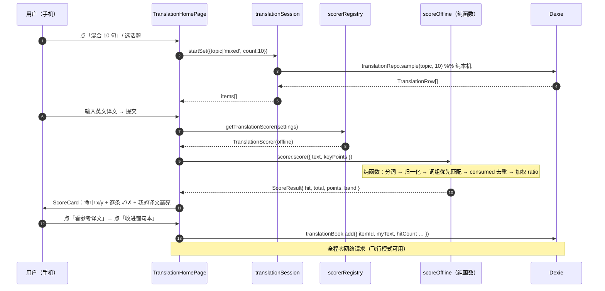
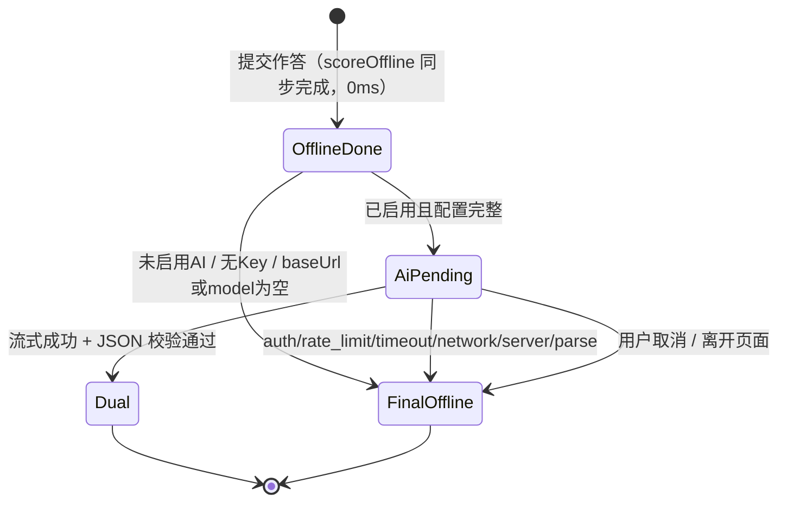
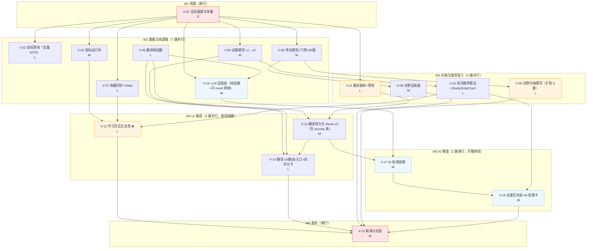

# 04b-优化项技术设计

| 项 | 内容 |
|---|---|
| 文档名 | `docs/04b-优化项技术设计.md` |
| 撰写人 | 高见远（架构师） |
| 日期 | 2026-10-05 |
| 版本 | **v2（用户拍板终版）** |
| 上游输入 | `docs/PRD-optimize-v2.md`（666 行：现状事实基线 / 竞品调研 / 四方案 / 验收标准）；**用户拍板四项（team-lead 转达）** |
| 项目 | CET-4 词汇学习 PWA（`C:\Users\13177\Desktop\yy`） |
| 线上地址 | https://1317780759.github.io/cet4-master/ |
| 技术栈 | Vite 7 + React 19 + Tailwind v4 + Dexie 4 / IndexedDB + Vitest 3，**纯前端 PWA，零后端** |
| 本文范围 | **只写文档**，不改 `src/`、不改 `scripts/`、不改 `public/`。所有引用的路径与行号均已读码核对 |

---

## 📌 v2 修订说明（用户已拍板，本版为最终方案）

> **保留 v1 已完成的 1~4 设计，按用户拍板增补/改写以下四项**（章节号见下表）：

| # | 用户拍板 | 本版处置 | 落点 |
|---|---|---|---|
| **1** | **翻译训练 = 方案 ②（A + B + C），AI 批改一期就做** | 🔄 **改写**：AI 智能批改从"二期扩展点"升为**一期交付物**。新增完整设计：设置页配置卡、`src/services/llm/` 网络层、提示词与 JSON schema、流式渲染、双评分并列 UI、密钥存储与导出剔除 | **§5.14（新增）**、§5.1（改写）、§6.3 新增 V-16/V-17/V-18 |
| **2** | **音标 = 全量 5278 词**（不是只补核心 2104） | 🔄 **改写**：`PHONETICS_LOAD_SCOPE` `'core'`→**`'full'`**；`COVERAGE_FULL_MIN` `0.70`→**`0.85`**；新增**体积与加载影响实测测算**、**sw.js 影响结论**、**全量降级策略** | **§1.5.10 / §1.5.11（新增）**、§1.5.3、§1.5.5、§1.5.7、§8.2 |
| **3** | **测试卷 = 两个都要**（6 套卷 + 测验 30→50） | ✅ **确认已覆盖**，无需新增：6 套卷 = **V-08**；题量 30→50 = **V-06**（`MAX_QUIZ_QUESTIONS`） | §4.6 / §4.7、V-06 / V-08 |
| **4** | **整卡点击翻卡 = 去掉**（只用按钮翻卡） | ✅ **确认与原设计一致**，无需改动：V-12 已写明"删除 `WordCard` 的整卡点击 / `role="button"` / `tabIndex`" | §1.3、V-12 |

> 🔴 **一条贯穿全局的底线（用户拍板原文精神 + 本文档既有铁律）**：**AI 批改是可选增强，不是依赖。** 离线评分是**默认且永不失效**的路径——断网、无 Key、Key 失效、超时、CORS 失败……**任何一种情况下，翻译训练都必须功能完整可用**。

---

## 0. 总览

### 0.1 五条需求的核心设计决策（一句话版）

| 需求 | 核心设计决策 |
|---|---|
| **1 翻卡 / 重播 / 音标** | UI 侧把底部操作区做成「**revealed 驱动的三态槽位**」并删掉整卡点击（防误触）；真正的工作量是**新建独立音标管线**——独立产物 + 独立许可块 + 运行时内存缓存，**不碰 `words` 镜像、不改 manifest 版本号**；**★ v2：音标覆盖全量 5278 词（非仅 core2104），`COVERAGE_FULL_MIN` 0.70→0.85，默认加载 `full`** |
| **2 收藏** | `starred` 状态从各页面本地 state 提升为 **`useVocabToggle` hook（由 StudyRunner 持有，下传给卡片星标与底部按钮）**，三处 UI 共用一份 hook 消除漂移，顺带修掉 `SearchPage` 单向 bug |
| **3 出词顺序** | `freqOrdering: boolean` → `studyOrder` 四档枚举 + **显式 `migrateSettings` 迁移**；「未掌握/错词优先」采用 **pull-forward（把未到期的弱项词提前拉入今日队列）**，而非只给"新词"排序 |
| **4 测试卷** | 纯数据工作。单卷按真实考纲重排题号为 **1 / 2–26(停用) / 27–56 / 57**，补齐 `banked-cloze` 与 `matching`；代码侧只需给 `ExamRunner` 加两个渲染分支 + 篇章按 `sectionId` 分组；**听力继续停用**（附理由与一键恢复位置） |
| **5 翻译训练** | **★ v2 改写**：一期 = **方案 A（离线单句 200–300 句 + 关键词评分）+ 方案 B（真卷段落逐句拆解自评对照）+ 方案 C（AI 智能批改，用户自带 Key）三合一**。评分器抽象为 `TranslationScorer` 接口，**UI 只依赖接口**；**离线是默认且永不失效的路径**，AI 为可选增强（断网/无 Key/失败一律静默回退） |

### 0.2 全局工程约定（所有任务单元共享）

| # | 约定 | 说明 |
|---|---|---|
| G1 | **纯函数可 100% 单测（铁律 A1）** | 所有新增业务算法（`selector` 排序、`scorer` 评分、`segment` 拆句、`migrateSettings`）必须放 `src/domain/**`，零 React / 零 IndexedDB / 零网络 / 零 `Date.now()`（时间由参数注入） |
| G2 | **所有开关写成导出常量** | PRD 里每个待拍板项都做成 `export const`，改一处即可切换。汇总见 §8.2 |
| G3 | 🚩**严禁本次改造中执行 `pnpm data:build`** | `manifest.version = 日期 + 内容指纹`（`scripts/build-wordbank.ts:274`）。重跑会让**老用户全库 `clearMirror` + 重灌 2.5 MB**。本次最容易踩的静默事故，见 §7.1 R-2 |
| G4 | **数据访问走 Source 接口（铁律 A3）** | 音标、翻译题库各新增 `*Source` 接口 + `StaticJson*Source` 实现；domain 层不得 import `src/data/**` |
| G5 | **镜像区 / 用户进度区 分离（铁律 A5）** | 新增表必须显式归类：`translations`→镜像区，`translationBook`→用户进度区 |
| G6 | **不改 `grader.ts` 主观题语义** | 翻译/写作继续不进客观题分母；翻译训练走**独立**评分链路 |
| G7 | **合规零妥协** | 新增语料 `provenance:'derived'` + `provenanceLabel` + `confidence`（A7）；零音频（A6）；新增数据源写进 `public/data/ATTRIBUTION.md` + `docs/依赖许可记录.md` |
| **G8** | 🆕 **密钥三分区隔离 + 永不导出** | 用户自填的 API Key **明文只存 `secrets` 表**（归入 `SECRET_STORES`），`aiConfig` 只存 `keyId`；`SECRET_STORES` 与 `PROGRESS_STORES`/`MIRROR_STORES` **两两不相交**（不变量单测）；导出备份走 `stripSecrets()` 二次剥离；`src/services/llm/**` **永不 `console` 打印 headers/body**。见 §5.14.2 / §5.14.8、R-9 |
| **G9** | 🆕 **AI 永不阻塞主流程** | 任何 AI 失败（`401/403/429/超时/CORS/解析失败`）一律**静默回退离线评分**，UI 只降级不报错；`aiEnabled=false` 时**零网络请求**；LLM 代码必须动态 `import()`，**不得进主 bundle**。见 §5.14.4 / §5.14.7、R-10 |

### 0.3 明确不做

- 不做 3D 翻卡动画、不做例句跟读录音。
- 不做「自定义词单 / 按话题背词」（话题体系只服务需求 5 的翻译题库）。
- 不改 FSRS 调度算法；需求 3 只改变**队列呈现与入选顺序**。
- 需求 5 一期**不做**：每日一练 / 计时 / 高频句型库 / 错句 FSRS / 趋势图（**AI 批改 v2 起改列为一期交付**，见 §5.14）。
- 🔴 **不做任何服务端**：AI 批改必须由**用户自带 Key 直连厂商端点**（OpenAI 兼容）。本站**不提供、不中转、不代管任何 Key，也无任何后端**（铁律 A2）。
- 不恢复听力（§4.5）。

---

# 第一部分：需求 1~4 技术设计

## 1. 需求 1：翻卡按钮 + 重播语音 + 音标

### 1.1 读码基线（已核对）

| 事实 | 证据 |
|---|---|
| 翻卡按钮已存在（`h-12`=48px、`block`、`size="lg"`），文案带「（Space）」，**与 RatingBar 同槽位互斥** | `src/features/learn/StudyRunner.tsx:241-247` |
| 翻卡后发音入口消失：操作区被 `RatingBar` 整体替换 | 同上 |
| 唯一发音入口是音标旁 🔊，`h-6 w-6` = 24px，远低于 44px | `src/ui/word/Phonetic.tsx:41-52` |
| 卡片**整块可点**（`role="button"` + `tabIndex=0` + Enter 翻卡），与例句内单词跳转手势冲突 | `src/ui/word/WordCard.tsx:41-59` |
| `WordCard.onPlay` 签名带 `accent`，`StudyRunner` 传入的回调**忽略 accent** | `WordCard.tsx:20` vs `StudyRunner.tsx:237` |
| `useTts.speak(text)` 内部只用 store 的 `accentRef`，无法按次指定口音 | `src/hooks/useTts.ts:47-53` |
| `Phonetic` 在 uk/us 皆空时 `return null` —— 这是降级显示的现成落点 | `Phonetic.tsx:19` |
| `useKeyboard` **已有 `onKey` 兜底回调**（未被专属键位消费的按键会下传），加 `R` 键**无需改该 hook** | `src/hooks/useKeyboard.ts:93-94` |
| `useTts` 已实现「首次手势解锁」，`enabled = ttsProvider !== 'off'` | `useTts.ts:38-41,60` |
| 5278 词 `phoneticUk/phoneticUs` 覆盖率实测 = 0；`build-wordbank.ts` 不产出音标 | PRD F1.7 / F1.8 |

> **结论**：UI 侧约 0.5 人日；真正工作量在**音标数据管线**（§1.5）。

### 1.2 底部操作区：状态与布局

#### 1.2.1 布局规格（手机端）

自上而下：`顶部条 → Progress → WordCard → 底部操作区`。操作区**不吸底**（避免遮挡与误触），随卡片下方自然流排布。

```
┌ WordCard ───────────────────────────────────────┐
│  [新词/复习] [档位]           词频 #123   ★44×44 │ ← 右上角收藏（需求2）
│              a b a n d o n                      │
│      英 /əˈbændən/ 🔊44  美 /əˈbændən/ 🔊44     │ ← 音标行（数据到位后自动显示）
│  【未翻卡】想一想它的意思，然后点下面的按钮       │
│  【已翻卡】释义 + 真卷词频 + 真题例句             │
└─────────────────────────────────────────────────┘
┌ 底部操作区（StudyActionDock）────────────────────┐
│ revealed=false:                                 │
│   [            翻 卡 看 释 义            ]       │ ← Button block size="lg" (h-12=48px)
│ revealed=true:                                  │
│   [   🔊 重播   ]  [   ★ 收藏 / ★ 已收藏  ]      │ ← grid-cols-2 gap-2，各 h-12
│   [ 不认识 ] [ 模糊 ] [ 认识 ]                   │ ← RatingBar（min-h-14=56px，已达标）
└─────────────────────────────────────────────────┘
```

**触控尺寸对照**：`SIZE_CLASS` 的 `lg = h-12 px-6`（`src/ui/primitives/Button.tsx:26-30`）48px ✓；`RatingBar` 已有 `min-h-14` 56px ✓；星标与音标喇叭用 `h-11 w-11` 44px ✓。

#### 1.2.2 状态机

底部操作区由**三个正交状态**驱动：`revealed`（store）、`starred`（hook）、`ttsEnabled`（hook）：

```mermaid
stateDiagram-v2
    direction TB
    [*] --> Unrevealed
    Unrevealed --> Revealed: 点「翻卡看释义」/ Space / Enter
    Revealed --> Unrevealed: 切下一个词（revealed 由 store 复位）

    state Unrevealed {
        [*] --> idle
        idle --> autoSpeaking: autoPlay 且已手势解锁
        autoSpeaking --> idle: 朗读结束
        note right of Unrevealed
            操作区 = 单枚满宽翻卡按钮
            文案「翻卡看释义」（不显示 Space）
        end note
    }

    state Revealed {
        [*] --> docked
        docked --> replaying: 点「🔊 重播」/ 按 R
        replaying --> docked: cancel() + speak() 完成
        docked --> toggleStar: 点「★ 收藏」
        toggleStar --> docked: 再点一次（可取消）
        docked --> rated: 点评级 / ← ↓ →
        note right of Revealed
            操作区 = [重播][收藏] + RatingBar
            ttsProvider='off' 时重播 disabled
        end note
    }
    rated --> [*]
```

要点：
- **单向翻卡**：`revealed` 语义不变（`useStudyStore.reveal` / 切词时 `settle` 复位），不动 store 结构。
- **自动发音与重播互不干扰**：自动发音由 `StudyRunner.tsx:90-95` 的 effect + `spokenRef` 守卫；手动重播是独立调用，**先 `tts.cancel()` 再 `speak()`**，连点不叠加。
- **`tts.enabled === false`**：重播按钮 `disabled` + 一行小字「已在设置里关闭发音」。

#### 1.2.3 未翻卡提示文案

`WordCard.tsx:101-111` 目前写死「点击 / 或按 Space」。改为：
- 默认（触屏）：`想一下它的意思，然后点下面的按钮`
- 桌面端：追加「 或按 Space」。判定用 `matchMedia('(hover: hover) and (pointer: fine)')`，**在 StudyRunner（features 层）做**，结果以 prop 传入。

> 做成 `WordCard` 的可选 prop `showKeyHint?: boolean`（默认 false），卡片保持纯展示，单测不需要 mock `matchMedia`。

### 1.3 组件契约改动

#### 1.3.1 `src/ui/word/WordCard.tsx`（改）

```ts
export interface WordCardProps {
  word: Word;
  revealed: boolean;
  isNew?: boolean;
  accent?: 'uk' | 'us';
  sentences?: readonly ExamSentence[];

  /** ★ 新增：外部注入的音标（来自 phonetics 管线；不写进 words 镜像） */
  phonetic?: PhoneticPair | null;
  /** ★ 新增：右上角收藏入口（未翻卡时也要在） */
  starred?: boolean;
  onToggleStar?: () => void;
  /** ★ 新增：是否显示桌面端键盘提示（默认 false） */
  showKeyHint?: boolean;

  /** 语义收敛：只代表「翻卡」动作，不再绑卡片本体手势 */
  onReveal?: () => void;
  onPlay?: (accent: 'uk' | 'us') => void;
  onWordClick?: (wordId: string) => void;
  className?: string;
}
```

改动点：
1. **删除** `interactive` 相关的 `role="button"` / `tabIndex` / 根节点 `onClick` / `onKeyDown`（`WordCard.tsx:41-59`），卡片根节点退化为纯容器 `<div>`。
2. **保留**子元素按钮：`ExamSentenceList` 的 `onWordClick` 跳转照旧。（`Phonetic.tsx:44` 的 `stopPropagation` 变成多余但无害，可保留以降低改动量。）
3. 右上角新增 ★/☆ 按钮（`h-11 w-11`），与「词频 #N」同排，`flex items-start justify-between`。
4. `<Phonetic>` 的数据源由 `word.phoneticUk/Us` **改为 props 注入的 `phonetic`**。

> **为什么 props 注入而不是填 `Word` 字段**：`Word` 类型虽有 `phoneticUk?/phoneticUs?`（`src/domain/word/types.ts:44-45`），但要填进去必须重写 `words/chunk-*.json` → 连锁改 `manifest.json` 的 10 个 chunk `sha256` → 全库重灌（§7.1 R-2）。props 注入让 Phonetic 数据与 words 镜像彻底解耦，代价只是多传一个 prop。

#### 1.3.2 `src/ui/word/Phonetic.tsx`（改，仅一处）

| 行 | 改动 |
|---|---|
| `:48` | `h-6 w-6` → `h-11 w-11 shrink-0`（44px 触控）+ `rounded-lg hover:bg-slate-100` |
| `:19` | **保持 `return null` 不变** —— 这就是覆盖率不足时的降级路径（不打占位、不留空白行，PRD R1-E） |

显示原则沿用现有 `.filter(Boolean)`（`:26-28`）：只有 us → 只显示美；只有 uk → 只显示英；都有 → 都显示。**不做跨方言兜底**（不拿美音冒充英音），开关 `PHONETICS_CROSS_DIALECT_FALLBACK = false`（§8.2）。

#### 1.3.3 `src/hooks/useTts.ts`（改，+1 个可选参数）

```ts
speak: (text: string, accent?: Accent) => void;

const speak = useCallback((text: string, accentOverride?: Accent): void => {
  if (!text.trim()) return;
  void provider.speak(text, { accent: accentOverride ?? accentRef.current }).catch(() => undefined);
}, [provider]);
```

> `provider.speak(text, { accent })` 本来就支持透传（`useTts.ts:50`），改动只把取值优先级改成「参数优先，ref 兜底」。**向后兼容**：所有现有 `speak(text)` 调用行为不变。

#### 1.3.4 `src/features/learn/StudyRunner.tsx`（改）

| 位置 | 改动 |
|---|---|
| `:237` | accent 透传修复：`onPlay={(accent) => tts.speak(item.word.headword, accent)}` |
| `:115-128` | `handleReveal` 语义收敛为「只翻卡」；新增 `handleReplay = () => { tts.cancel(); tts.speak(headword); }` |
| `:121-128` | `useKeyboard` 新增 `onKey: (k) => { if (k === 'r') handleReplay(); if (k === 's') toggleStar(); }`（`useKeyboard` 本身**不用改**） |
| `:241-247` | 抽取为内联子组件 `<StudyActionDock>`（§1.3.5） |
| 新增 | `const phonetic = usePhonetic(wordId)`；`const { starred, toggle } = useVocabToggle(wordId)` |

#### 1.3.5 `StudyActionDock`（内联组件，位于 `StudyRunner.tsx` 内）

```tsx
/**
 * 底部操作区 —— revealed 驱动的三态槽位。
 * 刻意做成 StudyRunner 内的私有组件而非独立文件：
 *   它与 store / tts / vocab 三个上下文紧耦合，抽文件只会增加 props 透传噪音。
 */
function StudyActionDock({ revealed, canReplay, starred, headword,
                           onReveal, onReplay, onToggleStar, onRate, hints })
```

渲染规则：

```tsx
if (!revealed) {
  return (
    <Button block size="lg" aria-label="显示释义" onClick={onReveal}>
      翻卡看释义
    </Button>
  );
}
return (
  <div className="space-y-2">
    <div className="grid grid-cols-2 gap-2">
      <Button size="lg" variant="secondary" disabled={!canReplay}
              aria-label="重播单词发音" onClick={onReplay}>🔊 重播</Button>
      <Button size="lg" variant="secondary"
              aria-label={starred ? `${headword} 已在生词本，点击移出` : `把 ${headword} 加入生词本`}
              onClick={onToggleStar}>{starred ? '★ 已收藏' : '☆ 收藏'}</Button>
    </div>
    {!canReplay ? <p className="text-xs text-slate-400">已在设置里关闭发音</p> : null}
    <RatingBar visible hints={hints} onRate={onRate} />
  </div>
);
```

### 1.4 accent 透传修复（3 行，但修的是「点英音喇叭还是美音」的功能性失效）

| 层 | 现状 | 改后 |
|---|---|---|
| `WordCard` | `onPlay?: (accent) => void` 签名正确 | 不变 |
| `Phonetic` | `onPlay(item.key)` 传值正确 | 不变 |
| `StudyRunner` | `onPlay={() => tts.speak(headword)}` **丢弃 accent** | `onPlay={(accent) => tts.speak(headword, accent)}` |
| `useTts` | `speak(text)` 只用 ref | `speak(text, accent?)` 参数优先 |

**验收**：默认口音设为「美音」，点「英」喇叭应听到英音；反之亦然。两种 ttsProvider（webspeech / youdao）各验一次。

### 1.5 音标数据管线（本需求的主要工作量）

#### 1.5.1 决策树：产物形态取舍

| 方案 | 优点 | 缺点 | 结论 |
|---|---|---|---|
| **A. 并入 `words/chunk-*.json`（填 `phoneticUk/Us`）** | 运行时零额外请求、实现最简单 | ❌ 改 10 个 chunk 的 `sha256` → manifest 变更 → **老用户全库重灌 2.5 MB**；❌ 必须重跑 `data:build`（违反 G3）；❌ 与 CC BY-NC-SA 词库**混写进同一文件**，可能被认定为「改编作品」而触发 SA 传染 | **否决** |
| **B. 独立 `public/data/phonetics/*` + 运行时内存缓存** | ✅ 不动 words 一个字节；✅ 与 NC-SA 数据构成**聚合（collection）而非改编**，各自保留原许可，合规最干净；✅ 不 bump Dexie 版本；✅ 懒加载，零首屏影响 | 卡片层多传一个 prop；一次内存 Map（<1 MB heap） | **✅ 采纳** |
| **C. 独立文件 + 新增 Dexie 表 `phonetics: 'id'`** | 支持音标索引查询 | ❌ 必须 bump `DB_VERSION` 1→2 且**版本不可逆**；音标纯展示、无查询需求，收益为负 | 否决（升级路径记于 §1.5.9） |

> 这条既是工程取舍也是**合规取舍**：独立文件 + 独立许可声明块 → 我们实际是「并列分发两个不同许可的数据集」。

#### 1.5.2 数据来源与许可合规（已联网核实）

| 角色 | 数据源 | 协议 | 提供内容 | 获取方式（构建期一次性，离线可用） |
|---|---|---|---|---|
| **主源** | [open-dict-data/ipa-dict](https://github.com/open-dict-data/ipa-dict) | 仓库声明 **MIT**；其 `en_UK`/`en_US` 词条源自 **Wiktionary（CC BY-SA 4.0 / GFDL 双许可）** | `data/en_UK.txt`（Received Pronunciation）、`data/en_US.txt`（General American），纯文本 `词条\tIPA`，**一次给齐英美双音标** | 下载两个 `.txt` 放入 `scripts/data/raw/phonetics/`（已 gitignore，不入库） |
| **补源** | [skywind3000/ECDICT](https://github.com/skywind3000/ECDICT) | **MIT**（Copyright © 2017 Linwei；仓库 LICENSE + SourceForge 镜像页 + 第三方引用三方一致） | `ecdict.csv` 的 `phonetic` 字段，**单一 IPA**（无英美之分），补 ipa-dict 未覆盖的词 | 下载 `ecdict.csv`（或精简版）同上放置；构建时只读 `word` + `phonetic` 两列 |

> 备选（不采纳但记录）：CMUdict（ARPABET，仅美音，需自行转换为 IPA，且转换会丢失韵律/重音层级）；`kaikki.org` Wiktionary 派生（体积大、清洗成本高）。

**合规落地动作（进 V-02 / V-03 的 DoD 验收清单）**：

1. `public/data/phonetics/index.json` 内写入 **`source` 块**（`sourceId / name / url / license / licenseUrl / fetchedAt / upstreamRef`），结构与现有 `AttributionInfo` 一致（`src/data/types.ts:4-20`）。
2. 同文件 `licenseNote` **同时标注两层许可**：「本文件由 ipa-dict（MIT）与 ECDICT（MIT）派生；英语词条源自 Wiktionary，按 CC BY-SA 4.0 署名。**本文件与 `public/data/words/*.json`（CC BY-NC-SA 4.0）为并列聚合，二者许可各自独立，不构成相互改编**」。
3. `scripts/LICENSE-NOTICE.ts` 追加生成条目 → `public/data/ATTRIBUTION.md`（流水线已存在，只需加数据块）。
4. `docs/依赖许可记录.md`「三、数据来源」追加两行 + 一段「为什么分开存放」的说明（PRD R1-E 要求）。
5. **许可白名单门禁**：`verify-phonetics.ts` 内置 `LICENSE_WHITELIST = ['MIT','CC0-1.0','CC-BY-4.0','CC-BY-SA-4.0']`；源许可不在白名单 → **fail，禁止产出**。

> ⚠️ **后备**：若上游许可变更，`build-phonetics.ts --source=<name>` 支持换源（只需提供同名 `headword→IPA` 映射），产物文件名不变、运行时零改动。

#### 1.5.3 产物结构

```
public/data/phonetics/
  index.json            ← ≈450 B：版本 + 两个 scope 的 sha256/count/bytes + source 许可块 + 覆盖率
  phonetics.core.json   ← core2104 词（默认档），估 90–130 KB
  phonetics.full.json   ← 5278 词，估 240–320 KB
```

```jsonc
// index.json
{
  "version": "2026.10.08.a1b2c3d4",           // 日期 + 内容指纹，口径与词库 manifest 一致
  "generatedAt": "2026-10-08T10:00:00.000Z",
  "generator": "scripts/build-phonetics.ts",
  "sourceId": "ipa-dict+ecdict",
  "scopes": {
    "core": { "file": "phonetics/phonetics.core.json", "sha256": "…", "count": 2104, "bytes": 118432 },
    "full": { "file": "phonetics/phonetics.full.json", "sha256": "…", "count": 5278, "bytes": 296104 }
  },
  "coverage": { "core": 0.962, "full": 0.881 },
  "licenseNote": "本文件独立于 words/*.json 分发，二者为并列聚合…",
  "source": [ /* AttributionInfo ×2 */ ]
}
```

```jsonc
// phonetics.core.json —— 列式紧凑数组以压体积（比对象字典省 35–40%）
{
  "version": "2026.10.08.a1b2c3d4",
  "count": 2104,
  "rows": [
    ["w_abandon", "/əˈbændən/", "/əˈbændən/", 0],   // [id, uk, us, src]
    ["w_reduce",  "/rɪˈdjuːs/", "/rɪˈduːs/", 0]
  ]
}
// uk/us 缺失用 "" 占位；src: 0=ipa-dict, 1=ecdict(单一IPA补缺), 2=人工补录
```

#### 1.5.4 构建脚本 `scripts/build-phonetics.ts`

```
1) 读 scripts/data/raw/phonetics/en_UK.txt / en_US.txt（ipa-dict，tab 分隔）
   → Map<lowerKey(headword), {uk, us}>
2) 读 scripts/data/raw/phonetics/ecdict.csv（只 word, phonetic 两列）
   → 对 Map 中不存在的 key 补 { any: phonetic, source: 1 }
3) 读词表：优先 scripts/data/generated/words.json（build-wordbank 中间产物，已 gitignore，只读不写）
   退化路径：generated 不存在时读 public/data/words.index.full.json 取 headword + id
   ★ 全程只读，不触碰 public/data/words/**（遵守 G3）
4) 匹配：word.headword 精确匹配；未命中则试 word.variants 中与 headword 编辑距离最小的一项（lemma 兜底）
   匹配键一律 lower + 去非字母数字，与 src/lib/id.ts 的 slugify 判重口径对齐
5) 切分 core(rank ≤ 2104) / full；统计覆盖率
6) 写 scope 文件 → 回填 sha256/bytes → 写 index.json
   → 写报告 scripts/data/generated/phonetics-report.json + phonetics-miss.md
7) 调用 verifyPhonetics()，有 error 则不产出（与 build-papers.ts 一致的「门禁前置」纪律）
```

#### 1.5.5 门禁 `scripts/verify-phonetics.ts`

| Code | Level | 规则 |
|---|---|---|
| `LICENSE_NOT_ALLOWED` | error | 源许可不在 `LICENSE_WHITELIST` |
| `NO_ROWS` | error | 产出条目数为 0（多半是 raw 源没放对） |
| `IPA_CHARSET` | error | IPA 必须命中白名单正则（UK/US 实际用到的符号集合），防乱码入库 |
| `IPA_TOO_LONG` | error | 单条 ≤ 40 字符（`MAX_PHONETIC_LEN`） |
| `COVERAGE_LOW` | error | core < `COVERAGE_CORE_MIN`(0.95) 或 full < `COVERAGE_FULL_MIN`(0.85) → fail |
| `BAD_SRC` | error | `src` 码不在 `[0,1,2]` |
| `DUP_ID` | error | 同 scope 内重复 wordId |
| `MISS_IN_TARGET` | warn | 目标词表里查不到 → 写进 `phonetics-miss.md` 供人工补 |
| `SIZE_LIMIT` | warn | 单 scope > 400 KB |

覆盖率口径：`有 uk 或 us 的 core 词条数 / core 总词条数`。构建输出 `-- core 96.2% (2024/2104) / full 88.1% (4651/5278)`。

#### 1.5.6 运行时侧文件

| 文件 | 职责 |
|---|---|
| `src/domain/word/phonetic.ts`（新） | 纯类型 `PhoneticPair {uk?:string; us?:string}` + 纯函数 `decodePhoneticRow(row)` + `hasAnyPhonetic(pair)`。零 IO，可 100% 单测 |
| `src/data/sources/PhoneticSource.ts`（新） | 接口：`fetchIndex()` / `fetchScope(scope)` |
| `src/data/sources/StaticJsonPhoneticSource.ts`（新） | 实现：复用 `src/data/loader/manifest.ts` 的 `fetchTextWithBytes` + `verifySha256`（与 `StaticJsonWordSource` 同一套校验纪律） |
| `src/services/phonetics.ts`（新） | **模块级内存 Map 缓存** + `ensurePhonetics(scope)` + `getPhonetic(wordId)`；内部 `loadingPromise` 去重防止并发重复拉 |
| `src/hooks/usePhonetic.ts`（新） | `usePhonetic(wordId): PhoneticPair \| null` |

#### 1.5.7 加载时机（保护首屏）

| 时机 | 行为 |
|---|---|
| App bootstrap | **不加载**（`BootstrapGate` 完全不动）——首屏 DATA 请求量增量恒为 **0** |
| 进入 `/learn` `/review` `/word/:id` | `ensurePhonetics(PHONETICS_LOAD_SCOPE)`，异步、不阻塞首渲染；拿不到就是 `null` → `Phonetic` 自动隐藏，**零 loading 态、零白屏** |
| 首屏渲染完成后 | 按 `PHONETICS_LOAD_MODE` 补齐另一档（见下），走 `requestIdleCallback`，**不参与 LCP** |
| ~~`settings.tier !== 'core2104'`~~ | ❌ **v2 删除该条件**：用户拍板要**全量 5278**，不再按学习档位区分覆盖范围 |
| 离线 | `sw.js:85-107` 已把 `/data/**` 走 stale-while-revalidate；首次联网加载后离线可读；**从没加载过就断网 → 优雅降级，无报错** |

**★ v2：全量口径下的两档加载策略（`PHONETICS_LOAD_MODE`）**

| 模式 | 行为 | 适用 | 结论 |
|---|---|---|---|
| `'progressive'`（**默认**） | 进入学习页先拉 **core**（≈139 KB raw / ≈53 KB gzip，秒出，覆盖默认档全部词）→ 首屏后 `requestIdleCallback` 补拉 **full**（≈348 KB raw / ≈132 KB gzip）覆盖剩余 3174 词 | 绝大多数用户：既保证"打开就有音标"，又保证"全量 5278 无遗漏" | ✅ **采纳** |
| `'full-only'` | 只拉 **full** 一个文件，首屏后 idle 加载 | 想省一次请求、不在意首屏后音标稍晚出现 | 备选项（改常量即可） |

> 🔴 **无论哪种模式，`getPhonetic(wordId)` 的语义不变**：先查已加载档位；**查不到就返回 `null`，UI 零渲染**——绝不阻塞、绝不抛错、绝不空白占位。这是"全量"与"不拖慢首屏"能共存的原因：**覆盖目标是数据侧的（5278 全覆盖），加载时机是体验侧的（后台补齐）**。

#### 1.5.8 覆盖率不达标的降级展示

1. 单词查不到音标 → `Phonetic` 返回 `null` → **不渲染任何节点**（现状行为，零新增逻辑）。
2. 全局覆盖率不足 → **构建期 fail**（`COVERAGE_LOW`），不会"带病上线"。
3. 人工补录通道：`scripts/data/authored/phonetics/manual.json`（`src: 2`）入库参与构建，可重复 `data:phonetics`。

#### 1.5.9 将来升级为 Dexie 表的路径（备查）

若未来做「按发音复习 / 音标检索」：① `DB_VERSION` 再 +1；② `DB_SCHEMA` 加 `phonetics: 'id'`；③ 归入 `MIRROR_STORES`；④ `getPhonetic` 改读表。**一期明确不做**，因 `DB_VERSION` 发布后不可降级（§7.1 R-3）。

#### 1.5.10 ★ 体积与加载影响 · 实测测算（用户拍板"全量 5278"后的必答题）

**（a）现状基线（2026-10-05 PowerShell 实测，非估算）**

| 对象 | 字节 | 折合 |
|---|---:|---|
| `public/data/` **全部** | **3,397,581** | **3.24 MiB** |
| `public/data/words/`（10 个 chunk） | **2,509,292** | **2.39 MiB** |
| 单个 chunk | 249,271 ~ 273,530 | ≈ 250 KB |
| `words.index.core.json` | 246,250 | 240 KB |
| `words.index.full.json` | 619,381 | 605 KB |
| `manifest.json` / `ATTRIBUTION.md` | 3,194 / 4,137 | ≈ 7 KB |

**（b）音标产物体积（列式紧凑数组 `["w_xxx","/ipa/","/ipa/",0]`）**

单行构成：`wordId ≈ 12 B` + `uk ≈ 20 B`（IPA 符号多为 2 字节 UTF-8）+ `us ≈ 20 B` + JSON 语法开销 ≈ 14 B ⇒ **≈ 66 B/词**

| 产物 | 词数 | 原始体积 | gzip（按 0.38） | brotli（按 0.32） |
|---|---:|---:|---:|---:|
| `phonetics.core.json` | 2,104 | **≈ 139 KB** | ≈ 53 KB | ≈ 44 KB |
| `phonetics.full.json` | 5,278 | **≈ 348 KB** | ≈ 132 KB | ≈ 111 KB |
| `phonetics/index.json` | — | ≈ 0.6 KB | — | — |
| **合计** | | **≈ 488 KB** | **≈ 185 KB** | ≈ 155 KB |

**（c）三个必须回答的问题**

| 问题 | 结论 | 依据 |
|---|---|---|
| **必须独立产物吗？** | ✅ **必须** | 并入 `words/chunk-*.json` 会改 10 个 chunk 的 sha256 → manifest 变更 → **老用户全库 `clearMirror` + 重灌 2.5 MB**（违反 G3/R-2）；且与 CC BY-NC-SA 词库混写，可能被认定为「改编作品」触发 **SA 传染**。独立文件 = **聚合（collection）而非改编**，许可各自独立（§1.5.1 / §1.5.2） |
| **必须运行时懒加载吗？** | ✅ **必须** | 488 KB 绝不能进主 bundle，也不能进 `BootstrapGate`。方案：进入学习类页面后 `ensurePhonetics()`，且补齐档走 `requestIdleCallback`（§1.5.7）。**首屏（FCP/LCP 之前）DATA 请求量增量 = 0** |
| **影响 `sw.js` 缓存清单吗？** | ⚠️ **不需要改一行代码**，但要知道两件事 | `public/sw.js:85` 是**路径前缀匹配**（`url.pathname.includes('/data/')`）+ stale-while-revalidate，新产物自动纳入。<br>① **无需 bump `CACHE_VERSION`**（非显式预缓存清单，新 URL 首次请求时自然入缓存）；<br>② **若将来改产物文件名/结构，必须 bump**，否则旧缓存命中旧路径 → 用户拿到过期音标 |

**（d）总量与预算**

| 项 | 值 |
|---|---|
| 站点总量 | 3.24 MiB → **3.72 MiB**（**+14.4%**） |
| CI 门禁「站点总体积 ≤ 12 MB」 | ✅ 仍有 **8.3 MB** 余量 |
| 运行时堆内存 | `Map<string,{uk,us}>` 5,278 条 ≈ **≤ 0.7 MB heap**，可接受 |
| 首屏之后的实际增量 | 仅 core：**+53 KB**；core+full：**+185 KB**（gzip 口径） |
| 对照 | 现有首屏本就需拉 `words.index.core`(240 KB) + 1~2 chunk(≈520 KB)，音标为**首屏后**加载，不与首屏争带宽 |

> 🔴 **验收口径要相应改写**（原 DoD「首屏 DATA 请求量 +5%」不适用）：
> 改为 **① FCP/LCP 之前的请求量增量 = 0（硬断言）；② 进入学习页后的 DATA 增量 ≤ 190 KB（gzip）；③ 设置项 `phoneticsEnabled`（默认 `true`）可一键关闭全部音标加载**。

#### 1.5.11 ★ 全量覆盖口径与降级策略（覆盖率不足怎么办）

| 层 | 口径 | 行为 |
|---|---|---|
| **数据侧（构建期）** | **全量 5278 词覆盖率 ≥ `COVERAGE_FULL_MIN = 0.85`（v2：0.70→0.85）** | 不达标 → `COVERAGE_LOW` **error，禁止产出**，**不带病上线** |
| **数据侧（core 档）** | core 2104 覆盖率 ≥ `COVERAGE_CORE_MIN = 0.95` | 同上（核心词更严） |
| **运行侧（个别词缺失）** | `getPhonetic` 返回 **`null`** | **`Phonetic` 组件不渲染任何节点**——零占位、零 `—`、零问号、零空括号。**这是现状行为，零新增逻辑** |
| **运行侧（只有一种方言）** | 缺 uk 就只显示 us，反之亦然 | 🔴 **严禁跨方言冒充**：`PHONETICS_CROSS_DIALECT_FALLBACK` 恒 `false`。拿美音冒充英音是**静默的错误教学**，比不显示更糟 |
| **运行侧（整体拿不到）** | 断网 / 首次加载前断网 / sha256 校验失败 | 静默吞异常，**绝不 throw**，全站功能不受影响（§1.5.7 / V-03 DoD） |
| **人工兜底** | `scripts/data/authored/phonetics/manual.json`（`src: 2`） | 覆盖率不足时按 `phonetics-miss.md` 补录，可重复 `data:phonetics` |

> **为什么"覆盖率 ≥85%"而不是 100%**：剩下 ≤15% 多为屈折变化形与极低频词，强行凑数要么引入错误音标、要么逼出人工编造——**与 M1「绝不为了凑覆盖率而伪造例句」同源**。宁可**个别词不显示**（用户零感知），也不**全体带错音标**（用户被教错）。

#### 1.5.12 数据源选型终裁（为什么仍是 ipa-dict + ECDICT 双源）

| 候选 | 覆盖 | 英美双音标 | 许可 | 结论 |
|---|---|---|---|---|
| **ipa-dict（主）** | `en_UK`/`en_US` 各约 5–6 万词条 | ✅ **一次给齐** | 仓库 MIT；词条源自 Wiktionary（CC BY-SA 4.0 / GFDL） | ✅ **采纳为主源** |
| **ECDICT（补）** | 约 7.7 万词，常见词覆盖极高 | ❌ 单一 IPA（无英美之分） | **MIT**（三方核实一致） | ✅ **采纳为补源**（兜底 ipa-dict 未覆盖词） |
| CMUdict | ARPABET，仅美音 | ❌ 需自行转 IPA，丢韵律/重音层级 | 宽松 | ❌ 否决（转换即失真） |
| kaikki.org / Wiktionary 派生 | 大 | ✅ | CC BY-SA | ❌ 不采纳（体积大、清洗成本高），**列为换源备选** |

**裁定：维持 §1.5.2 的双源方案。** 理由三条：
1. **双音标是硬需求**——`WordCard` 已有英音/美音两个喇叭（V-12 还要修 accent 透传），单音标数据源直接不满足；
2. **覆盖率互补**——ipa-dict 给质量（英美分明），ECDICT 给覆盖（兜底），叠加后冲击 85% 全量门槛最稳；
3. **许可干净**——两者均在 `LICENSE_WHITELIST` 内，且独立文件 + 独立许可块 = 与 NC-SA 词库**并列聚合**。

> ⚠️ **顺带修正一处 v1 的内部不一致**：§1.5.5 正文写 `LICENSE_WHITELIST = ['MIT','CC0-1.0','CC-BY-4.0','CC-BY-SA-4.0']`，而 §8.2 表写 `['MIT']`。**v2 统一为 `['MIT','CC-BY-SA-4.0']`**（实际在用的两个许可；ipa-dict 词条派生自 Wiktionary，必须让 CC BY-SA 在白名单内，否则门禁会误 fail）。
> 后备：`build-phonetics.ts --source=<name>` 支持换源（只需提供同名 `headword→IPA` 映射），产物文件名不变、运行时零改动。

### 1.6 需求 1 文件清单

| # | 文件 | 性质 | 说明 |
|---|---|---|---|
| 1 | `src/ui/word/WordCard.tsx` | 改 | 删整卡手势；加 `phonetic`/`starred`/`onToggleStar`/`showKeyHint`；右上角星标 |
| 2 | `src/ui/word/Phonetic.tsx` | 改 | 喇叭 `h-6 w-6` → `h-11 w-11 shrink-0` |
| 3 | `src/hooks/useTts.ts` | 改 | `speak(text, accent?)` |
| 4 | `src/features/learn/StudyRunner.tsx` | 改 | accent 透传、`StudyActionDock`、`R`/`S` 键、`usePhonetic`、`useVocabToggle` |
| 5 | `src/domain/word/phonetic.ts` | **新** | 纯类型 + 行解码 + 判空 |
| 6 | `src/domain/word/__tests__/phonetic.test.ts` | **新** | 解码 / 判空 / 脏数据 |
| 7 | `src/data/sources/PhoneticSource.ts` | **新** | 接口（铁律 A3） |
| 8 | `src/data/sources/StaticJsonPhoneticSource.ts` | **新** | 静态 JSON 实现 + sha256 校验 |
| 9 | `src/services/phonetics.ts` | **新** | 内存缓存 + ensure/get |
| 10 | `src/hooks/usePhonetic.ts` | **新** | 组件侧 hook |
| 11 | `src/data/types.ts` | 改 | 新增 `PhoneticsIndexFile` / `PhoneticsScopeFile` / `PhoneticRow` 类型 |
| 12 | `scripts/build-phonetics.ts` | **新** | 数据管线 |
| 13 | `scripts/verify-phonetics.ts` | **新** | 门禁 |
| 14 | `scripts/data/authored/phonetics/manual.json` | **新**（空数组开局） | 人工补录，`src: 2` |
| 15 | `package.json` | 改 | 新增 `data:phonetics` / `data:verify-phonetics`，追加进 `data:all`（**不触碰 `data:build`**） |
| 16 | `public/data/ATTRIBUTION.md` | 生成物 | 由 `LICENSE-NOTICE.ts` 自动追加 |
| 17 | `docs/依赖许可记录.md` | 改 | 追加 ipa-dict / ECDICT 两行 + 聚合说明 |

---

## 2. 需求 2：收藏按钮补全

### 2.1 读码基线（已核对）

| 事实 | 证据 |
|---|---|
| 数据层**已完备**：`vocabBook` 表 + `addVocab`(幂等) / `findVocab` / `removeVocab` / `listVocab` / `countVocab` / `promoteVocab` | `src/data/db/db.ts:62`、`src/data/repos/vocabRepo.ts` |
| `WordDetailPage.toggleVocab` 是**完整 toggle** | `src/features/word-detail/WordDetailPage.tsx:64-73` |
| `SearchPage.toggleStar` 是**单向的**：`if (starred.has(word.id)) return;` → 已收藏点不动 | `src/features/search/SearchPage.tsx:63-69` |
| `SearchPage` 用本地 `Set<string>` 存状态，与 true 源（DB）脱耦，切页即丢 | `SearchPage.tsx:27,44-48` |
| 背词页（`StudyRunner` / `WordCard`）**完全没有收藏入口** | 两文件无相关 props |
| `WordBooksPage` 默认 Tab = `'wrong'` | `src/features/books/WordBooksPage.tsx:26` |
| 生词本已有下游消费：`QuizPoolSource` 含 `'vocab'` | `src/services/quizPool.ts:20` |
| **收藏不影响 FSRS**：`addVocab` 只写 `vocabBook`；选词排除集来自 `cards.toCollection().primaryKeys()` | `vocabRepo.ts:18-33`、`studySession.ts:72-75` |
| 导出**覆盖 `vocabBook`**（属 `PROGRESS_STORES`，且 `AUTO_STORES` 去重键 = `wordId`） | `db.ts:81-91`、`exportImport.ts:22,39` |
| 🚩**纠正 PRD F5.7**：「导出含设置」不准。`exportProgressJson` 只导 `PROGRESS_STORES`，**`settings` 存在 `meta`（`SYSTEM_STORES`），不进备份** | `exportImport.ts:42-52`、`settingsRepo.ts:9` |

### 2.2 状态提升方案：`useVocabToggle`

**放在哪一层持有？**

- ❌ 不放 `WordCard` 内部：卡片是全站最高频组件，且三处 UI 需共享；放内部必然产生第二份 true 源。
- ❌ 不放全局 store：跨词会串状态（PRD R2-B 明确要求「切下一个词时重新 `findVocab`，不缓存到全局」）。
- ✅ **持有层 = 使用边界**：
  - 背词页 → `StudyRunner` 持有一次 `useVocabToggle(item.word.id)`，**同一份 state 同时下传给卡片右上角星标与底部收藏按钮**（天然满足「两处同步」）。
  - 查词页（列表）→ 批量版 `useVocabSet(ids)`。
  - 详情页 → `useVocabToggle(id)`。

```ts
// src/hooks/useVocabToggle.ts —— 三处共用，消除漂移（PRD R2-B）
export interface UseVocabToggleResult {
  inVocab: boolean;
  toggle: () => void;
  /** 写库进行中（乐观更新已生效，这里只是禁用防连点） */
  pending: boolean;
  /** 写库失败信息（乐观更新已回滚） */
  error: string | null;
}
export function useVocabToggle(wordId: string | null): UseVocabToggleResult;

/** 列表场景：一次查 N 个词的收藏态 */
export interface UseVocabSetResult {
  has: (wordId: string) => boolean;
  toggle: (wordId: string) => void;
  pending: ReadonlySet<string>;
}
export function useVocabSet(wordIds: readonly string[]): UseVocabSetResult;
```

实现要点：

1. **初始化**：`useEffect` 依赖 `wordId`；`wordId` 变化时**先 `setInVocab(false)`** 再 `await findVocab(wordId)`，防止上一个词的状态闪现到下一个词；用 `cancelled` 标志防竞态。
2. **乐观更新 → 写库 → 失败回滚 + `error`**：
   ```ts
   const next = !inVocab;
   setInVocab(next);                                        // 乐观
   try {
     if (next) await addVocab({ wordId, origin }, instance);
     else      await removeVocab(wordId, instance);
   } catch (e) {
     setInVocab(!next);                                     // 回滚
     setError(describeError(e));
   }
   ```
3. `addVocab` **已幂等**（`vocabRepo.ts:22-23`），本层无需再查一次去重；`removeVocab` 对不存在条目是 no-op（`:71-73`）。
4. DB 实例取 `useDb()`（`@/app/providers/DbProvider`），与全站一致，单测可注入 fake-indexeddb 实例。

### 2.3 跨页面同步

**不需要事件总线**。三个页面各自进入时重新读库（`findVocab`），天然同步，因为 true 源只有 IndexedDB 一处：

| 场景 | 行为 |
|---|---|
| 详情页收藏 → 回背词页遇到同一个词 | `useVocabToggle(wordId)` 重新 `findVocab` → 实心 ✓（PRD 验收点） |
| 背词页收藏 → 到 `/books?tab=vocab` | `VocabBook` 目前只在挂载时 `reload()` 一次 → **有刷新缺口**。✅修法：把 `VocabBook`/`WrongBook` 的数据读取换成 **`useLiveQuery`**（`dexie-react-hooks@^1.1.7` 已在依赖里，零新增依赖），天然响应式，彻底消灭手动 reload |

### 2.4 `SearchPage` 单向 bug 的修法

根因在 `SearchPage.tsx:65`（把「幂等」误实现成「只读」）。修法：

```tsx
// 删除本地 Set 与单向 toggleStar
const stars = useVocabSet(results.map((r) => r.id));   // 替换原 44-48 行的 N 次串行 await findVocab
…
<button type="button"
  className="inline-flex h-11 w-11 items-center justify-center rounded-lg text-lg"
  aria-label={stars.has(word.id)
    ? `${word.headword} 已在生词本，点击移出`
    : `把 ${word.headword} 加入生词本`}
  onClick={() => stars.toggle(word.id)}>
  {stars.has(word.id) ? '★' : '☆'}
</button>
```

`useVocabSet` 内部用一次 **`anyOf` 查询**消掉 N 次往返（`vocabBook` 索引已含 `wordId`，`db.ts:62`）：

```ts
const rows = await instance.vocabBook.where('wordId').anyOf(ids).toArray();
```

触控区同时从 `px-2 text-lg`（≈24–28px）扩到 **`h-11 w-11`**（44×44）。

### 2.5 按钮规格

| 入口 | 位置 | 尺寸 | 视觉 |
|---|---|---|---|
| 主入口 | `WordCard` 右上角，**未翻卡时也在** | `h-11 w-11`（44×44），图标 20px，`-mr-2 -mt-2` 补偿视觉边距但**保持热区** | 未收藏：空心 ☆ `text-slate-400`；已收藏：实心 ★ `text-amber-500` + `transition-transform` 回弹（`scale-110 → scale-100`，150ms） |
| 次入口 | 底部操作区右侧（revealed 时） | `h-12`（48px），与「🔊 重播」等宽 | 文案「☆ 收藏」/「★ 已收藏」 |
| 详情页 | 沿用现有位置，改用同一 hook | 补到 ≥44px | 同主入口 |
| 查词页 | 列表行右端 | `h-11 w-11` | 同主入口 |

`aria-label` 一律动态：**未收藏** `把 abandon 加入生词本` / **已收藏** `abandon 已在生词本，点击移出`。**必须可取消**（这是修复现状 bug 的关键验收点）。

### 2.6 Toast 反馈

新增 `src/ui/primitives/Toast.tsx` + `ToastHost`（primitives 已有 `Badge/Card/Progress/Segmented/Switch`，风格对齐即可）：

```tsx
const toast = useToast();     // context Provider 挂在 AppShell
toast.show({
  text: '已加入生词本',
  action: { label: '去看', to: '/books?tab=vocab' },
  durationMs: 2000,
});
```

规格：`role="status"`、`aria-live="polite"`；固定定位在**底部 Tab 栏之上 16px**（`BottomTabBar` 是 `h-14` fixed → `bottom: calc(3.5rem + env(safe-area-inset-bottom) + 1rem)`），**不遮挡 RatingBar**；2s 自动消失；带「去看」文字按钮跳 `/books?tab=vocab`。

| 操作 | 文案 |
|---|---|
| 加入 | 「已加入生词本 · 到「词本」查看」 |
| 移出 | 「已移出生词本」 |

### 2.7 词本页默认 Tab

`WordBooksPage.tsx:26` 的 `useState<BookTab>('wrong')` 改为三级优先级：

```tsx
const [params] = useSearchParams();
const remembered = useLastBooksTab();                       // 读 meta（新增 uiStateRepo）
const tab: BookTab =
  params.get('tab') === 'vocab' ? 'vocab'
  : params.get('tab') === 'wrong' ? 'wrong'
  : remembered ?? DEFAULT_BOOKS_TAB;                        // 默认常量，§8.2
```

对应 PRD Q5 选项 A「记住上次」：
- URL `?tab=` 支持 Toast 的「去看」直达；
- 记忆值放 `meta`（新增 `src/data/repos/uiStateRepo.ts`，两个函数 ~25 行）；
- 初次进入仍 `'wrong'`，避免改变老用户心智；要改成默认生词本只改 `DEFAULT_BOOKS_TAB` 一个常量。

另外补「收藏于 3 天前」：`formatRelative(row.addedAt, now)`（`src/lib/date` 已有，错词本已在用）。

### 2.8 需求 2 文件清单

| # | 文件 | 性质 | 说明 |
|---|---|---|---|
| 1 | `src/hooks/useVocabToggle.ts` | **新** | `useVocabToggle` + `useVocabSet`（乐观更新/回滚/`anyOf` 批量查询） |
| 2 | `src/hooks/__tests__/useVocabToggle.test.tsx` | **新** | 加入 / 移除 / 写库失败回滚（PRD 明确要求的 3 条单测） |
| 3 | `src/ui/primitives/Toast.tsx` | **新** | Toast + `useToast`（Provider 形态） |
| 4 | `src/ui/primitives/index.ts` | 改 | 导出 Toast / useToast |
| 5 | `src/app/layout/AppShell.tsx` | 改 | 挂 `<ToastHost />` |
| 6 | `src/ui/word/WordCard.tsx` | 改（**与需求 1 合并改动**） | 右上角 ★/☆ |
| 7 | `src/features/learn/StudyRunner.tsx` | 改（合并） | 持有 toggle 并下传两处 |
| 8 | `src/features/search/SearchPage.tsx` | 改 | 单向 bug 修复 + 44px |
| 9 | `src/features/word-detail/WordDetailPage.tsx` | 改 | 换用 hook + 44px + Toast |
| 10 | `src/features/books/WordBooksPage.tsx` | 改 | `?tab=` + 记住上次 + `useLiveQuery` + 收藏时间 |
| 11 | `src/data/repos/uiStateRepo.ts` | **新** | `getLastBooksTab` / `setLastBooksTab` |

---

## 3. 需求 3：背词顺序可调整

### 3.1 读码基线 与 **一个必须修正的 PRD 前提**

| 事实 | 证据 |
|---|---|
| `freqOrdering: boolean`，默认 `true` | `src/domain/settings/types.ts:26,55` |
| "从头开始"成因：`freqOrdering=true` → `candidates.slice(0, limit)`，候选已按 `freqRank` 升序 | `src/domain/word/selector.ts:39-52,70` |
| `freqOrdering=false` → `shuffle()`（Fisher–Yates，`random` 可注入） | `selector.ts:66-83` |
| 队列 = `dueCards`（在前）+ `newRows`（在后） | `src/services/studySession.ts:106-125` |
| **新词候选池的排除集 = 所有已有 card 的 wordId** | `studySession.ts:72-75,96` |
| 候选行来自 `instance.words` 全表 → **只有已加载的 chunk 才在内** | `studySession.ts:59-69` |
| 核心索引 `words.index.core.json`（2104 行）**bootstrap 就下载并存进 `meta['wordIndex.core']`** | `chunkLoader.ts:82-84`、`wordRepo.ts:7,107-118` |
| `freqOrdering` 被引用 7 处（6 源码 + 1 测试） | `types.ts:27,55`、`selector.ts:24-25,57,67`、`studySession.ts:54,102`、`useStudyStore.ts:97`、`SettingsPage.tsx:215-216`、`selector.test.ts:59-60` |

> 🚩**必须修正的 PRD 前提**：PRD §4.2 让「未掌握优先」依据 `cards.state / cards.lapses`、「错词优先」依据 `wrongBook.wrongCount`。但**新词候选池里没有任何已有 card 的词**（被 `existingWordIds` 全排除），所以在这批"新词"上这两个信号恒为空 —— 照 PRD 直译会得到「排完序仍是词频顺序」的退化结果，四条验收标准里两条过不了。
>
> **本设计采用 pull-forward 方案**：「未掌握/错词优先」不是给**新词**排序，而是**把尚未到期的弱项词提前拉进今日队列**。这既忠于用户意图（把时间花在没掌握的和反复错的词上），也满足 PRD 验收「该类词排在前 50%」。详见 §3.3。

### 3.2 数据模型与迁移

```ts
// src/domain/settings/types.ts
export type StudyOrder = 'random' | 'freq' | 'weak' | 'wrong';

export interface UserSettings {
  // …既有字段不变…
  /** ★ 出词顺序（替代 freqOrdering），默认 'random' */
  studyOrder: StudyOrder;
  /** ★ 会话内相邻去重窗口（0 = 关闭），默认 10 */
  randomNoRepeatWindow: number;
  /** ★ pull-forward 允许提前的天数上限（0 = 严格不提前），默认 7 */
  priorityMaxLeadDays: number;
  /** ★ 复习卡是否也随机打散（默认 false —— FSRS 要求保序） */
  shuffleDueCards: boolean;
  /** @deprecated v1 遗留。仅用于迁移输入，业务代码禁止读取 */
  freqOrdering?: boolean;
}

export const SETTINGS_SCHEMA_VERSION = 2;              // 1 → 2

export const DEFAULT_SETTINGS: UserSettings = {
  // …
  studyOrder: 'random',            // PRD R3-E + Q6 选项 A
  randomNoRepeatWindow: 10,
  priorityMaxLeadDays: 7,
  shuffleDueCards: false,
  // freqOrdering 从默认值里移除（不再有默认值），只在迁移时读取老数据
};
```

**迁移函数**（新增导出，`mergeSettings` 转为它的薄包装）：

```ts
export function migrateSettings(stored: Partial<UserSettings> | null | undefined): UserSettings {
  const draft: UserSettings = { ...DEFAULT_SETTINGS, ...(stored ?? {}) };

  if ((draft.schemaVersion ?? 1) < 2) {
    // v1 → v2：freqOrdering(boolean) 语义映射到 studyOrder(enum)
    if (!('studyOrder' in (stored ?? {}))) {
      if (stored?.freqOrdering === true) draft.studyOrder = 'freq';       // 用户原先明确要词频
      else if (stored?.freqOrdering === false) draft.studyOrder = 'random'; // 用户原先明确要随机
      // 两者都缺 → 保持新默认 'random'
    }
    if (!('randomNoRepeatWindow' in (stored ?? {}))) draft.randomNoRepeatWindow = DEFAULT_SETTINGS.randomNoRepeatWindow;
    if (!('priorityMaxLeadDays' in (stored ?? {})))  draft.priorityMaxLeadDays  = DEFAULT_SETTINGS.priorityMaxLeadDays;
    if (!('shuffleDueCards' in (stored ?? {})))      draft.shuffleDueCards      = DEFAULT_SETTINGS.shuffleDueCards;
  }

  draft.schemaVersion = SETTINGS_SCHEMA_VERSION;

  // ★ 明确保留 freqOrdering 原值、不删除：它是"回滚影子字段"（见 §7.1 R-4）。
  //   若线上需要回滚到 v1 代码，老代码仍能读到该字段并还原用户原意；
  //   v2 及以后所有读路径一律只用 studyOrder，永不再读 freqOrdering。
  return draft;
}

/** 兼容旧签名与旧行为 */
export function mergeSettings(partial: Partial<UserSettings> | null | undefined): UserSettings {
  return migrateSettings(partial);
}
```

要点：
- **`mergeSettings` 签名与行为保持兼容**，现有 4 个调用点（`useSettingsStore.hydrate/update`、`settingsRepo.getSettings/saveSettings`）零改动。
- **幂等**：`schemaVersion` 已为 2 时跳过迁移分支，反复调用结果一致。
- **脏数据安全**：任何非法值（如 `studyOrder: 'xxx'`）通过 spread 兜底后会在 `resolveOrder` 的 default 分支降级为 `freq`，不崩。
- **新用户默认值就是 `'random'`**（PRD Q6 选项 A）。

### 3.3 selector：四档排序算法

```ts
// src/domain/word/selector.ts —— 新增 / 修改
export type StudyOrder = 'random' | 'freq' | 'weak' | 'wrong';

/** 排序所需的弱项信号（由 services 从 DB 取，纯函数只消费） */
export interface PrioritySignals {
  cardState?: number;   // cards.state: 0=new / 1=learning / 2=review / 3=relearning
  lapses?: number;      // cards.lapses
  wrongCount?: number;  // wrongBook.wrongCount（resolved !== true 的行）
}

export interface SelectOptions {
  limit: number;
  tier?: TierFilter;
  exclude?: ReadonlySet<string>;
  /** ★ 主入口 */
  order?: StudyOrder;
  /** @deprecated 仅兼容旧调用 / 旧测试；order 缺省时由它推导 */
  freqOrdering?: boolean;
  random?: () => number;
  /** ★ order='weak'|'wrong' 时所需信号 */
  signals?: ReadonlyMap<string, PrioritySignals>;
  /** ★ 最近出过的 wordId（尾部最新），用于相邻去重 */
  recent?: readonly string[];
  noRepeatWindow?: number;
}

export function resolveOrder(o: Pick<SelectOptions,'order'|'freqOrdering'>): StudyOrder;
export function weaknessScore(sig: PrioritySignals | undefined): number;
export function wrongnessScore(sig: PrioritySignals | undefined): number;
export function rankByPriority(
  rows: readonly WordIndexRow[],
  scoreOf: (row: WordIndexRow) => number,
  random: () => number,
): WordIndexRow[];
export function avoidRecentRepeat<T extends { id: string }>(
  picked: readonly T[], recent: readonly string[], window: number,
): T[];
```

**各档算法**

| 档位 | 算法 |
|---|---|
| `freq` | `newWordCandidates`（已按 `freqRank` 升序）`.slice(0, limit)`。**保持现状，零漂移** |
| `random` | `shuffle(candidates, random).slice(0, limit)`（复用现有 Fisher–Yates）→ `avoidRecentRepeat` |
| `weak` | `rankByPriority(rows, weaknessScore, random).slice(0, limit)` |
| `wrong` | `rankByPriority(rows, wrongnessScore, random).slice(0, limit)` |

```
weaknessScore = (state <= 1 ? 2 : 0) + (lapses >= 1 ? 2 : 0) + min(wrongCount ?? 0, 3)
wrongnessScore = min(wrongCount ?? 0, 5) * 2 + (lapses >= 1 ? 1 : 0)
```

`rankByPriority` 实现（**为何要"分带 + 带内洗牌"**）：

```
1) 按 score 分组：score > 0 → bandA（优先带）；否则 → bandB
2) bandA 内部：score 降序；score 相同者用 shuffle 打散
   ★ 关键：不打散会重演「每天都是同一批词」的老毛病
3) bandB 内部：先按 freqRank 升序，再 shuffle 打散（避免总是一批固定的尾部词）
4) 返回 [...bandA, ...bandB]
```

> bandA 天然落在前 50%（当 `|bandA| < limit` 时 bandA 全在前），满足 PRD 验收「排在前 50%」。

`avoidRecentRepeat`（相邻去重，**不破坏整体分布**）：

```
recentWin = recent.slice(-window)                  // 环形缓冲只取尾部 window 个
for i in 0..picked.length:
  if picked[i].id ∈ recentWin:
     j = 第一个 j>i 且 picked[j].id ∉ recentWin 的下标
     if j 存在: swap(picked[i], picked[j])         // 只做局部交换
return picked
```

纯函数、`O(n·window)`、`window ≤ 20` → 毫秒级。

### 3.4 studySession：pull-forward 与候选池

```ts
export interface StartSessionOptions {
  tier?: TierFilter;
  dailyGoal?: number;
  reviewLimit?: number;
  studyOrder?: StudyOrder;          // ★ 替代 freqOrdering
  freqOrdering?: boolean;           // @deprecated 兼容
  randomNoRepeatWindow?: number;
  priorityMaxLeadDays?: number;     // 0 = 严格 FSRS，不提前
  shuffleDueCards?: boolean;
  now?: number;
}
```

```
1) dueCards = reviewLimit > 0 ? await listDue(...) : []                 ← 不变
2) dueIds   = Set(dueCards.map(c => c.wordId))                          ← 新增
3) 若 mode='learn' 且 studyOrder ∈ {weak, wrong}：
     pullRows = await pullPriorityRows(instance, studyOrder, dueIds, limit', now, leadDays)
     // 数据源（都走既有索引，不新增索引）：
     //   wrong 档：wrongBook 过滤 (resolved !== true && wrongCount > 0)  → 按 wrongCount 降序
     //   weak  档：cards.where('state').anyOf(0,1) 并集 wrongBook 未解决项
     // ★ 统一门槛：(card.due - now) <= leadDays * 86400_000
     //   —— 防止把 30 天后才到期的词拖到今天，把 FSRS 干扰压到可忽略
     limit'   = Math.ceil(limit * PRIORITY_RATIO)      // 默认 0.6：最多 60% 名额给弱项
     rest     = pickNewWords(rows, { order: studyOrder, signals, recent, limit: limit - pullRows.length })
     newRows  = [...pullRows.slice(0, limit'), ...rest]
4) 否则（random / freq）：newRows = pickNewWords(rows, { order, recent, limit })   ← 现状等价
5) items = [...dueCards（due 升序，除非 shuffleDueCards）, ...newRows]
   ★ pull-forward 行要带它**已有的 card**，不能 createEmptyCard，否则等于重新引入该词：
     items.push({ word, card: existingCard, isNew: false, pulledForward: true })
```

`StudyItem` 新增可选字段 `pulledForward?: boolean` 的用途：
- 保留 FSRS 语义：评级时 `schedule(item.card, …)` 正常推进，**不重置记忆状态**。
- UI 可显示「弱项」Badge（P2）。
- 单测可断言「due 超过 7 天的词不会被拉进来」。

**候选池完整性（PRD R3-D）**：`selectionRows` 现在读 `instance.words` 全表。改为**优先读 bootstrap 已就绪的 core 索引**：

```ts
async function selectionRows(instance, tier): Promise<WordIndexRow[]> {
  const core = await loadCoreIndex(instance);          // meta['wordIndex.core']，随时可用、零请求
  if (tier === 'core2104') return core.filter((r) => r.r <= CORE_BOUNDARY);
  if (tier === 'all') {
    // 全量依赖 chunk 进度：库内全量 + core 兜底合并，保证至少 2104 条完整
    const inDb = (await instance.words.toArray()).map(toIndexRow);
    return mergeByWordId(inDb, core);
  }
  // cet4 / extended：走 words 表的 tier 索引（已建索引），不足时由 cacheWarmer 后续补齐
  return (await instance.words.where('tier').equals(tier).sortBy('freqRank')).map(toIndexRow);
}
```

> **默认档位的候选池立即完整为 2104**，不依赖空闲预取是否跑完，也不需要用户在选词前干等 1–2s。
> 已知限制：`cet4/extended/all` 档仍受 chunk 限制。彻底解决需要 `useStudyStore.start` 在 `phase='loading'` 时先 `await ensureChunks(tier)`，但会让非默认档用户等待 —— **一期不做**，做成开关 `ENSURE_CHUNKS_BEFORE_SELECT = false`（§8.2）。

### 3.5 随机去重（会话内 + 跨会话）

| 维度 | 存储 | 行为 |
|---|---|---|
| 会话内窗口（默认 10） | `useStudyStore` 内存 `recent: string[]`（切词时 push，超过 `window*3` 截断） | 传给 `pickNewWords({ recent })` → `avoidRecentRepeat` |
| 跨会话最近 30 个（Q7 选项 A） | `meta['studyRecentWordIds']`（新增 `getRecentWordIds` / `setRecentWordIds`） | `startSession` 前读出拼到 `recent` 前面；`startSession` 结束后写回「本次实际出给的 newRows 的末 30 个」 |
| 保护段 | 候选池 < 60 时**不生效** | 防止"没词可学"（PRD R3-C-2） |

> 跨会话记录真正起作用的是「当日放弃会话、未建卡的那批词」（其余已进 `existingWordIds` 被自然排除），与 PRD 意图一致且不误伤。

### 3.6 复习卡保序（不可随机）

`items` 构造保持 `[...dueCards, ...newRows]`，`dueCards` 由 `listDue` 按 `due` 升序返回。代码里写死一条注释（防后人不小心改坏）：

```ts
// ★ 复习卡顺序 = FSRS 的 due 升序，禁止随机化。
//   随机化直接破坏间隔重复：越紧急的卡越该先出现。
//   shuffleDueCards 是给高级用户的逃生开关，**默认 false 且不在 UI 暴露**。
```

对应 PRD Q8 选项 A。

### 3.7 入口 UI

| 入口 | 优先级 | 改动 |
|---|---|---|
| 设置页「学习行为」 | **P0** | `SettingsPage.tsx:212-217` 的 `Switch` 换成 `Segmented` 四选一：`随机 / 词频 / 未掌握优先 / 错词优先`，下方一行随选项变化的说明文案（复用 `:137-146` 的排版） |
| 背词页顶部快捷切换 | P1 | 顶部条右侧 44px 图标按钮 → Bottom Sheet 四选一 → `update({ studyOrder })` → `useStudyStore` 新增 **`reorderRest(order)`**：只重排 `queue.slice(cursor+1)` 中的**新词部分**，保留已答 + 当前，不动 dueCards |
| 桌面键盘 `O` 键 | P2 | `StudyRunner` 的 `useKeyboard.onKey('o')` → 循环切换 + Toast 提示 |

### 3.8 需求 3 文件清单

| # | 文件 | 性质 | 说明 |
|---|---|---|---|
| 1 | `src/domain/settings/types.ts` | 改 | `StudyOrder`、`schemaVersion` 1→2、`migrateSettings`、默认 `random`、`freqOrdering` deprecated |
| 2 | `src/domain/settings/__tests__/settings-migration.test.ts` | **新** | v1→v2 三条映射用例 + 幂等 + 脏数据兜底 |
| 3 | `src/domain/word/selector.ts` | 改 | `order`/`signals`/`recent`；`resolveOrder`/`weaknessScore`/`wrongnessScore`/`rankByPriority`/`avoidRecentRepeat` |
| 4 | `src/domain/word/__tests__/selector.test.ts` | 改 | **保留旧 `freqOrdering:false` 用例**（回归保护）+ 新增四档断言（含 PRD 三条验收） |
| 5 | `src/services/studySession.ts` | 改 | `studyOrder` 选项、`pullPriorityRows`、`selectionRows` 改读 core index、`pulledForward`、跨会话 recent 读写 |
| 6 | `src/services/__tests__/studySession.test.ts` | 改 | 复习卡 due 升序断言、pull-forward 提前上限断言、收藏不影响新词数断言 |
| 7 | `src/store/useStudyStore.ts` | 改 | 传 `studyOrder`；会话内 `recent`；新增 `reorderRest` |
| 8 | `src/features/settings/SettingsPage.tsx` | 改 | Segmented 四选一 + 说明文案 |
| 9 | `src/features/learn/StudyRunner.tsx` | 改 | 顶部快捷切换 + Sheet + `O` 键（**与需求 1/2 同文件，须合并为同一任务单元**） |
| 10 | `src/data/repos/studyMemoryRepo.ts` | **新** | `getRecentWordIds` / `setRecentWordIds`（走 `getMeta/setMeta`） |

---

## 4. 需求 4：测试卷扩容

### 4.1 读码基线（已核对）

| 事实 | 证据 |
|---|---|
| 全站 1 套卷，12 题（`essay×1` + `choice×10`(no.27–36) + `translation×1`(no.37)），13 KB | `public/data/papers/index.json`、`derived-2026-06-set1.json` |
| `sectionMeta` reading 区间是 **27–36（10 题）**，而 `DerivedSpec` 规定 reading **30 题** | paper JSON vs `src/domain/exam/types.ts:284` |
| `DerivedSpec.readingParts` = A 选词填空 10 / B 长篇匹配 10 / C 仔细阅读 10 | `types.ts:290-292` |
| 真实题号分布（DerivedSpec）：Writing 1 / Listening 2–26 / Reading 27–56 / Translation 57 | `types.ts:283-288` |
| `banked-cloze`、`matching` 已在 `QuestionKind`，当前 0 题 | `types.ts:119-131` |
| `ExamSection.passage` 已有 `wordBank?: string[]`（15 个备选词）字段 | `types.ts:96-102` |
| 听力停用只用 1 个常量；`questionsInPlan` 按 slot 区间过滤 | `src/domain/exam/sectionPlan.ts:61,134-141` |
| 管线零改造即可加卷：authored → build → verify → 产物 | `scripts/build-papers.ts:26-110` |
| 现有 12 条门禁 | `scripts/verify-papers.ts:59-206` |
| 列表页只读 `index.json`（363 B），按套懒加载 | `PapersPage.tsx:26-46`、`src/data/loader/paperLoader.ts` |
| 主观题不进客观题分母，**刻意设计，不要改** | `src/domain/exam/grader.ts:47` |
| `ExamRunner` 当前只渲染：`stem` → `options` 按钮组 → `textarea` → `rubric` → 标记/存疑 | `src/features/mock/ExamRunner.tsx:238-322` |
| `PassageBlock` 用 `sections.find(s => s.kind === kind && s.passage)` —— **只能找到该 kind 的第一个 section** | `ExamRunner.tsx:213` |

### 4.2 单卷补齐到 32 题：题号重排方案（关键决策）

现在这套卷 **reading 占 27–36、translation 占 37**，与真实规格不符，直接往后追加会因 `RANGE_OVERLAP` 门禁失败。因此必须**一次性重排到真实规格**：

| 板块 | order | 区间 | 入库题数 | 题型 | 处理策略 |
|---|---|---|---|---|---|
| writing | 1 | 1–1 | 1 | `essay` | no.1 不变 |
| listening | 2 | 2–26 | 0（停用） | — | 保持空 section，`DEFAULT_DISABLED_SECTIONS` 仍含 `listening` |
| reading | 3 | **27–56** | 30 | `banked-cloze` 27–36<br>`matching` 37–46<br>`choice` 47–56 | 见下 |
| translation | 4 | **57–57** | 1 | `translation` | no.37 → **no.57** |

**现有 10 道 `choice` 题怎么处理？**

- `id`（`R0`…`R9`）**保持不变**（id 与 no 解耦），只把 `"no"` 从 27–36 **迁移到 47–56**（即「仔细阅读」的真实位置）。
- 27–36 新写 10 道 `banked-cloze`（Section A）；37–46 新写 10 道 `matching`（Section B）。
- 新增 2 个 reading section：`R-A`（passage + wordBank）、`R-B`（matching 长文）；现有两篇 passage（Working from home / Sleep and memory）归属 Section C（`R-C` / `R-D`）。

> ⚠️ **对已有进行中作答的影响**：`AnswerSheet.answers` 的 key 是 **questionId** 而非 no，`ExamAttempt` 也以 questionId 组织 → **题号变化不影响断点续考数据，也不会串卷**。唯一影响是用户可能觉得"第 37 题从翻译变成了匹配"，属预期。建议 release note 提示「进行中的作答建议在更新后重新开始」。

### 4.3 新增卷 JSON schema 与写作规范

沿用 `PaperBundle`（`src/data/sources/PaperSource.ts:23-27`）：

```ts
interface PaperBundle { paper: ExamPaper; sections: ExamSection[]; questions: ExamQuestion[]; }
```

#### 4.3.1 必须逐字核对的字段（对应门禁）

```jsonc
{
  "paper": {
    "id": "derived-2025-12-set1",            // 命名：derived-<年>-<月>-set<序号>
    "year": 2025, "month": 12, "setNo": 1,
    "level": "CET4", "durationMin": 125, "totalScore": 710,
    "sectionMeta": [ /* 4 段，见 §4.2 表格 */ ],
    "provenance": "derived",                 // ★ 只能 derived / user-imported；'original' 由 CI 禁止入库
    "provenanceLabel": "同源模拟卷",          // ★ NO_LABEL 要求非空
    "derivedFrom": "CET4 公开考纲与真题语料统计（2024.06-2026.06 考点分布）",
    "confidence": {                          // ★ NO_CONFIDENCE 要求存在
      "level": "medium",
      "hasTranscript": false,
      "hasAudio": false,                     // ★ A6_AUDIO_FIELD：永远 false
      "hasExplanation": true,
      "answerCrossChecked": false,           // ★ 必须 false —— 我们没有官方答案源
      "spotCheckRatio": 1,
      "doubtCount": 0,
      "note": "内容自撰，结构与考点取自公开考纲与真题语料统计，不复制任何原文；答案未经官方核对，仅供参考。"
      // ★ note 会过 FORBIDDEN_WORD（7 条正则：「官方真题」「权威真题」「425 分换算」等）
    }
  }
}
```

#### 4.3.2 题型写作模板

**① 选词填空 `banked-cloze`（reading 27–36）**

```jsonc
// 先给材料 + 15 词词池
{
  "id": "derived-2025-12-set1:R-A",
  "paperId": "derived-2025-12-set1",
  "kind": "reading", "subPart": "Section A", "order": 3,
  "passage": {
    "title": "The sharing economy",
    "paragraphs": [
      "Over the past decade, the sharing economy has (27)______ from a small experiment …"
      // 空直接用题号标记，纯属人工校对用的记号；运行时不作解析
    ],
    "wordBank": [                          // ★ 恰好 15 个（真实规格）
      "expanded","reduced","regulated","benefits","drawbacks","platforms",
      "trust","consumers","providers","income","employment","urban",
      "efficiently","gradually","widespread"
    ]
  },
  "questions": []
}
// 每个空一道题
{
  "id": "derived-2025-12-set1:R-A1",
  "paperId": "derived-2025-12-set1",
  "sectionId": "derived-2025-12-set1:R-A",
  "kind": "banked-cloze",
  "no": 27, "score": 2,
  "stem": "Over the past decade, the sharing economy has ______ from a small experiment into a part of daily life.",
  "answer": "expanded",                    // ★ 必须是 wordBank 里的词（新门禁 BANK_ANSWER_NOT_IN_BANK）
  "explanation": "此处缺谓语动词的一部分…",
  "materialRef": { "type": "passage", "range": [0, 0] },
  "keyWordHints": ["w_expand"]             // ★ 复用已有字段，交卷后可一键加入生词本
}
```

**② 长篇匹配 `matching`（reading 37–46）**

```jsonc
{
  "id": "derived-2025-12-set1:R-B",
  "kind": "reading", "subPart": "Section B", "order": 4,
  "passage": {
    "title": "How cities deal with heat",
    "paragraphs": [ "【A】…", "【B】…" /* 共 10 段 → A–J */ ]
  }
}
{
  "id": "derived-2025-12-set1:R-B1",
  "kind": "matching", "no": 37, "score": 2,
  "stem": "Some cities have planted trees mainly to lower surface temperatures.",
  "options": ["A","B","C","D","E","F","G","H","I","J"],   // ★ 字母数与段落数一致
  "answer": "C",                                          // ★ 新门禁 MATCH_ANSWER_NOT_IN_OPTIONS
  "explanation": "对应 C 段第 2 句…",
  "materialRef": { "type": "passage", "range": [2, 2] }
}
```

**③ 仔细阅读 `choice`（reading 47–56）**：沿用现有格式（4 选项 + `answer` 单字母 + `explanation` + `materialRef`）。

**④ 翻译 `translation`（no.57）**：见 §5.12（方案 B 的字段扩展）。

#### 4.3.3 门禁规则（新增）

防题材撞车（warn 级）：

| 规则 | 级别 | 内容 |
|---|---|---|
| `DUP_TOPIC` | warn | 同一 \{kind + `section.passage.topicTag`\} 在 ≤3 套卷内重复超过 2 次 |
| `DUP_KEYWORD` | warn | 同一 `keyWordHints` 的 wordId 跨卷出现 ≤3 次 |

护住成果（error 级，**本次必须加**）：

| 规则 | 级别 | 内容 |
|---|---|---|
| `BANK_ANSWER_NOT_IN_BANK` | error | `banked-cloze` 的 `answer` 必须出现在所属 section 的 `passage.wordBank` 里 |
| `MATCH_ANSWER_NOT_IN_OPTIONS` | error | `matching` 的 `answer` 必须出现在自身 `options` 里 |
| `WORDBANK_SIZE` | error | `banked-cloze` section 的 `passage.wordBank` 长度必须 = 15 且无重复 |
| `TRANSLATION_MISSING_REFERENCE` | error | `translation` 题必须带 `referenceTranslation`（需求 4 验收 + 需求 5 方案 B 依赖） |
| `KIND_QUESTION_COUNT` | error | 非听力题数 `questionCount` 必须 ≥ 32（防止后来编辑悄悄删薄） |
| `PAPER_SIZE` | warn(>50KB) / error(>80KB) | 单卷 JSON 字节数 |

### 4.4 启用 `banked-cloze` / `matching` 需要的代码改动（本需求唯一真正代码改动）

#### 4.4.1 `src/features/mock/ExamRunner.tsx`

| 位置 | 改动 |
|---|---|
| `:213` `PassageBlock` | **改为按 `sectionId` 渲染**。`sections.find(kind)` 在 reading 有 3 个 subPart 时会漏掉后两个。改法：在主渲染里**按 `question.sectionId` 对当前 slot 的题目分组**，每组前面渲染自己的 `<PassageBlock bundle sectionId={groupId}>`。这样 Section A/B/C 的材料自动跟着自己的题走，**且符合 K1（只遍历 slot 与数据，不硬编码 subPart）** |
| `:281-297` options 渲染块 | **加条件**：`(question.kind === 'choice') && options?.length`。否则 `matching` 的 10 个字母会渲染成「10 个满宽按钮 × 10 题 = 100 个按钮」的灾难布局 |
| 新增 `MatchingBlock` | `matching`：**字母 chip 网格** `grid grid-cols-5 gap-2`，每 chip `min-h-11 min-w-11`（44px），选中 `bg-brand-600 text-white` |
| 新增 `BankedClozeBlock` | `banked-cloze`：**词池 chip 网格**（`flex-wrap`），15 个备选词；选中后回填到题干的 `______` 位置（仅 UI 呈现，写入值仍是该词） |
| `:244` `isSubjective` | 不变（仍是 essay / translation） |

> 新增块都在 `QuestionBlock` 内部按 `question.kind` 分支，不新增 props 链；唯一需要透传的是 `wordBank` → 由父层按 `question.sectionId` 查 `bundle.sections` 得到 `passage?.wordBank`，作为 `QuestionBlock` 的新**可选** prop `wordBank?: string[]`。

#### 4.4.2 `src/domain/exam/grader.ts` —— **不改**

`isObjectiveQuestion(q) = q.answer !== undefined && q.kind ∉ {essay, translation}`。两种新题型都有 `answer` 且不在排除列表 → **自动进客观题分母**。答案规范化 `normalize = trim + toLowerCase`（`grader.ts:53-55`）对 `"expanded"` 与 `"C"` 均正确。

#### 4.4.3 `src/domain/exam/sectionPlan.ts` —— **不改**

题号区间由 `sectionMeta` 驱动，`questionsInPlan` 按 slot 过滤。reading 区间 27–36 → 27–56 后自动涵盖全部 30 题。**这正是 K1–K3 契约的价值：扩容零代码**。`sectionPlan.test.ts` 的往返守护继续生效。

### 4.5 「恢复听力」的结论：**不恢复**

| 理由 | 说明 |
|---|---|
| **铁律 A6（音频零入库）** | 听力的本质是音频资产。仓库禁止 `.mp3/.m4a/.wav` 等（CI 用 `git ls-files` 扫扩名，命中 fail）；`verify-papers` 的 `A6_AUDIO_FIELD` 也禁止任何 `audio*` 字段。恢复听力 = 要么违反铁律，要么卷子结构性地"没有声音" |
| **TTS 兜底会失真并误导** | 四级听力考真实语速、连读、弱读、英美混音。合成语音替代练的是另一项技能，却标注"听力"——违反项目一贯的「如实标注、不误导」取向（参见 `scoreScaleNote: 'objective-only'` 的设计） |
| **成本** | 6 套 × 25 题 = 150 题 + 15 篇 transcript + 发音标注，写作量约等于其余全部工作量之和 |
| **收益低** | 用户原话是「测试卷数量可以增加点」，指向"卷少/卷薄"，不是"缺听力" |

**结论**：`DEFAULT_DISABLED_SECTIONS` 保持 `['listening']`。保留运行时可恢复性（契约已在 `sectionPlan.ts:57-61` 写明：改这个常量即可，零代码），**本次不启用**。将来若做，正确形态是独立立项的「听力训练」，而非把真卷听力板块补上。

### 4.6 目标数量与体积估算（6 套 / 每套 32 题）

| 项 | 单卷 | 6 卷合计 | 说明 |
|---|---|---|---|
| writing 1 题 | ~0.8 KB | ~5 KB | Directions 模板 |
| banked-cloze 10 题 + 250 词篇章 + 15 词池 | ~4 KB | ~24 KB | 篇章 250 词 ≈ 1.6 KB |
| matching 10 题 + 900 词长文 | ~9 KB | ~54 KB | 长是真实题型要求 |
| choice 10 题（2 篇 × 350 词 + 解释） | ~7 KB | ~42 KB | |
| translation 1 题 + 参考译文 + 分段 keyPoints | ~2.5 KB | ~15 KB | 段落 140–160 汉字 |
| 结构性开销（ids / paper meta，2 空格缩进） | ~3 KB | ~18 KB | |
| **合计** | **≈ 26–35 KB** | **≈ 160–210 KB** | |
| `index.json` | — | **≈ 1.2 KB** | 6 条 `PaperSummary`，远小于 3 KB 门禁 |

结论：**首屏零影响**（列表页只读 ~1.2 KB 的 index，按套懒加载）；单卷 ≤ 50 KB 门禁可满足并留 40% 余量；刷完 6 套也只下载 ~210 KB，且由 SW 缓存离线可用。

### 4.7 「四选一测验题数 30 → 50」的改动点

`src/features/quiz/QuizPage.tsx:213-227` 的 `Segmented` options 增加 `{ value: '50', label: '50' }`。

**必须同时处理的副作用**（读码发现）：`src/domain/quiz/generator.ts:148,155`

```ts
for (…) {
  if (questions.length >= count) break;
  const distractors = pickDistractors(target, pool, optionsPerQuestion - 1, rand);
  if (distractors.length < optionsPerQuestion - 1) continue;   // 干扰项不足 → 跳过整题
  …
}
```

即**池不足时会静默返回少于请求量的题数**（选了 50 却只出 23 题）。30 题时不明显，50 题必须给友好提示（PRD 需求 4 最后一条验收）：

```tsx
if (questions.length < count) {
  setNotice(
    `词池只有 ${questions.length} 个词能凑出完整四选一，已为你出 ${questions.length} 题` +
    (source === 'vocab' ? '。去背词页多收藏一些词就能出满。' : '。')
  );
}
```

渲染成 Phase='running' 顶部一条 `text-xs text-amber-600` 提示条。**不抛错、不白屏**。

### 4.8 需求 4 文件清单

| # | 文件 | 性质 | 说明 |
|---|---|---|---|
| 1 | `scripts/data/authored/papers/derived-2025-06-set1.json` 等 **5 个新卷** | **新**（内容） | 按 §4.3 schema 自撰 |
| 2 | `scripts/data/authored/papers/derived-2026-06-set1.json` | 改（内容） | 题号重排（choice 27–36→47–56、translation 37→57）；新增 R-A/R-B 与 20 题；translation 补 `referenceTranslation` |
| 3 | `scripts/verify-papers.ts` | 改 | 新增 6 条规则（§4.3.3） |
| 4 | `tests/data/verify-papers.test.ts` | 改 | 新规则用例 |
| 5 | `src/features/mock/ExamRunner.tsx` | 改 | `PassageBlock` 按 sectionId 分组；options 块限定 `choice`；新增两个渲染块 |
| 6 | `src/features/quiz/QuizPage.tsx` | 改 | 题数加 50 + 池不足友好提示 |
| 7 | release note | 改 | 「进行中的作答建议重新开始」提示 |

> `grader.ts` / `sectionPlan.ts` / `build-papers.ts` / `paperLoader.ts` / `PapersPage.tsx` **全部不改** —— 既有架构（K1–K3 + Source 模式）的收益。

---

# 第二部分：需求 5 技术设计（翻译训练）

## 5. 需求 5：翻译训练（方案 A + B + C，一期）

### 5.1 范围与路径

> **★ v2（用户拍板）**：翻译训练 = **方案 ②（A + B + C）三合一，一期全部交付**。

| 方案 | 内容 | 一期 | 依赖网络 |
|---|---|:--:|:--:|
| **A** | 离线单句 200–300 句 + **关键词自动评分** + 错句本 | ✅ | ❌ **零网络** |
| **B** | **真题段落逐句拆解 · 自评对照**（真卷翻译题） | ✅ | ❌ **零网络** |
| **C** | **AI 智能批改（用户自带 Key）** | ✅ **v2 新增** | ✅ 可选 |

**二期仍不做**：每日一练 / 计时 / 高频句型库 / 错句 FSRS / 趋势图。

四条铁律级约束（**第 1 条是本需求的灵魂，不得在任何评审中被"优化"掉**）：

1. 🔴 **离线评分是默认且永不失效的路径**——断网、无 Key、Key 失效、超时、CORS 失败、模型返回垃圾……**任何一种情况下，做题 → 评分 → 存错句本都必须功能完整可用**。飞行模式下 AI 未开启时 DevTools Network 请求数 = **0**。
2. **UI 层只依赖 `TranslationScorer` 接口**，不 import 任何具体实现（`import type` 除外）。
3. 🔴 **导出备份不得含明文 API Key**——`aiConfig` 里**只放 `keyId` 引用，不放明文**；明文存独立 `secrets` 表；`exportImport` 再加一层**防御性剔除 + 单测**（§5.14.8）。
4. **零后端**：AI 请求必须由浏览器**直连用户配置的服务商端点**。本站不提供、不中转、不代管任何 Key（铁律 A2）。

### 5.2 目录结构

```
src/domain/translation/                    ← ★ 纯领域层（铁律 A1：零 React / 零 IO / 零网络）
  types.ts        // TranslationItem / KeyPoint / ScoreResult / TranslationTopic / TranslationScorer 接口
  topics.ts       // 15 个四级常考话题常量（key + 中文标签）
  scorer.ts       // ★ scoreOffline() 纯函数 + createOfflineScorer() 适配器
  normalize.ts    // 分词 / 大小写 / 标点 / 收缩 / 词形还原-lite
  segment.ts      // 段落拆句（纯函数；构建期与运行期共用同一实现）

src/data/
  db/db.ts                                // 改：DB_VERSION 1→2，新增 2 张表
  db/rows.ts                              // 改：TranslationRow / TranslationBookRow
  sources/TranslationSource.ts            // 新：接口（铁律 A3）
  sources/StaticJsonTranslationSource.ts  // 新：静态 JSON 实现 + sha256 校验
  repos/translationRepo.ts                // 新：按话题 / 随机取样；错句本 CRUD
  loader/translationLoader.ts             // 新：首次进入懒灌镜像

src/services/
  translationSession.ts                   // 新：组一组练习（话题 / 混合 10 句 / 错句重做）
  translationScorerRegistry.ts            // 新：★ 二期扩展点的唯一入口

src/features/translation/
  TranslationHomePage.tsx                 // /translation  话题选择 + 混合 + 错句本 + 段落入口
  SentenceRunner.tsx                      // 单句作答 → 评分 → 参考译文 → 收进错句本
  PassageRunner.tsx                       // /translation/passage/:paperId/:questionId  方案 B
  WrongSentenceBook.tsx                   // /translation/wrong
  components/ScoreCard.tsx                // 命中 x/y + 逐条 ✓/✗ + 档位参考（带免责声明）
  components/HighlightMyText.tsx          // 命中绿色 / 缺失红色下划线
  components/HintList.tsx                 // 三级提示

scripts/
  build-translation.ts                    // 题库构建
  verify-translation.ts                   // 门禁
  data/authored/translation/*.json        // 自撰题库源（入库）

public/data/translation/
  index.json      // 版本 + sha256 + count + topic 分布 + 许可块（自撰标注 derived-authored）
  items.json      // 200–300 句
```

### 5.3 数据模型（Dexie 版本迁移）

```ts
// src/data/db/db.ts
export const DB_VERSION = 2;                 // 1 → 2（★ 发布后不可降级，见 §7.1 R-3）

export const DB_SCHEMA_V2 = {
  translations: 'id, topic, difficulty, source',                        // 只读镜像区（语料）
  translationBook: '++id, itemId, addedAt, lastTriedAt, resolved',      // 用户进度区（错句本）
} as const;

export const MIRROR_STORES = [...,'translations'] as const;
export const PROGRESS_STORES = [...,'translationBook'] as const;

export class Cet4Database extends Dexie {
  constructor(name = DB_NAME) {
    super(name);
    this.version(1).stores(DB_SCHEMA);        // ★ 原样保留 v1 声明，不改动历史
    this.version(2).stores(DB_SCHEMA_V2);     // Dexie 只增量应用变更的表，既有数据零触碰
  }
}
```

> **Dexie 增量语义**：每个 version 只声明**变更**的表，未提及的表沿用旧 schema。**切记不要把 v1 的全部 schema 重复写进 v2**（Dexie 常见误用）。

```ts
// src/data/db/rows.ts —— 新增
export interface TranslationRow {              // 镜像区
  id: string;                 // 't_000123'
  topic: string;              // 见 §5.10.2 的 15 个 key
  difficulty: 1 | 2 | 3;      // 1 易 / 2 中 / 3 难
  zh: string;                 // 中文题干（单句，15–40 汉字）
  reference: string;          // 参考译文
  keyPoints: KeyPoint[];      // 3–6 个得分点
  hints?: string[];           // 三级提示文本（可选；缺省时由 keyPoints 自动生成 1 级）
  topicWords?: string[];      // 该句的话题词（供 UI 展示 / 一键查词）
  source: 'authored' | 'paper-derived';
  originPaperId?: string;
}

export interface TranslationBookRow {          // 用户进度区
  id?: number;
  itemId: string;             // → translations.id
  topic: string;
  myText: string;             // 我的译文
  hitCount: number;           // 最近一次命中数
  totalCount: number;
  addedAt: number;
  lastTriedAt: number;
  tryCount: number;
  resolved: boolean;          // 「已掌握」归档
}
```

### 5.4 `TranslationScorer` 抽象 —— 给方案 C 预留的扩展点

```ts
// src/domain/translation/types.ts
export interface KeyPoint {
  id: string;                  // 'kp1'（同一 item 内唯一）
  head: string;                // ★ 必须命中的英文词/词组（小写规范形式）
  zh: string;                  // 对应中文，给用户看的提示文案
  synonyms?: string[];         // 同近义词表（≤3）
  weight?: number;             // 默认 1；核心词组可给 2
  optional?: boolean;          // 软得分点（命中加分，不命中扣分打折），默认 false
}

export interface ScoreRequest {
  text: string;                       // 用户输入的英文译文
  keyPoints: readonly KeyPoint[];
}

export interface KeyPointHit {
  id: string; head: string; zh: string; hit: boolean;
  /** 命中时在原文中的字符区间（用于高亮）；未命中为 null */
  span: [number, number] | null;
  /** 命中的实际词形（可能是 head 的变形或同义词） */
  matchedAs?: string;
}

export interface ScoreResult {
  total: number;                      // 得分点总数
  hit: number;                        // 命中数
  ratio: number;                      // 0..1（按 weight 加权）
  points: KeyPointHit[];              // 逐条明细（UI 直接渲染 ✓/✗）
  /** 参考档位 4/3/2/1/0 —— ★ 仅供参考，绝不称为"四级官方评分" */
  band: 0 | 1 | 2 | 3 | 4;
  /** 评分器自述；UI 用它显示来源标签（"离线评分" / "AI 批改"） */
  scoredBy: string;
}

/** ★ UI 唯一依赖的评分器接口 */
export interface TranslationScorer {
  readonly id: 'offline' | 'llm';
  readonly label: string;
  /** 统一异步签名，让 LLM 实现可以流式 / 超时而无需改调用方 */
  score(req: ScoreRequest): Promise<ScoreResult>;
}
```

```ts
// src/domain/translation/scorer.ts
/** ★ 纯同步实现（可 100% 单测，铁律 A1） */
export function scoreOffline(req: ScoreRequest): ScoreResult;

export function createOfflineScorer(): TranslationScorer {
  return { id: 'offline', label: '离线关键词评分', async score(req) { return scoreOffline(req); } };
}
```

```ts
// src/services/translationScorerRegistry.ts —— ★ 二期唯一需要改的文件
import type { TranslationScorer } from '@/domain/translation/types';
import { createOfflineScorer } from '@/domain/translation/scorer';

export function getTranslationScorer(settings: UserSettings): TranslationScorer {
  // ── 一期：恒定返回离线实现 ────────────────────────────────
  // 二期打开这三行即可（届时 createLlmScorer 在 src/services/llm/ 下实现）：
  //   if (settings.aiEnabled && settings.aiConfig?.apiKey) {
  //     return createLlmScorer(settings.aiConfig);
  //   }
  return createOfflineScorer();
}
```

**UI 层约束（写进 Review Checklist）**：
- `SentenceRunner` / `PassageRunner` / `ScoreCard` **只能** `import type { TranslationScorer }`，禁止 import 实现模块。
- 结果必须显示 `result.scoredBy` 标签（离线 vs AI），让评分来源对用户可见。

**二期保留字段（今天定义，避免二次迁移）**：

```ts
// src/domain/translation/types.ts
/** @since v2 —— 一期不启用，仅占位以保证将来无需再改 UserSettings */
export interface LlmScorerConfig {
  baseUrl: string;      // OpenAI 兼容端点
  model: string;
  /** ★ 明文 API Key，只存本机 IndexedDB；导出备份必须剔除 */
  apiKey: string;
  timeoutMs: number;    // 默认 15000
}

// src/domain/settings/types.ts 追加**可选**字段（不触发新的 schemaVersion 迁移）
export interface UserSettings {
  // …
  aiEnabled: boolean;         // 现状恒 false，保持
  aiConfig?: LlmScorerConfig; // ★ 新增可选，默认 undefined
}
```

配套纪律：今天就在 `exportImport` 侧加一条**防御性断言单测** —— 若将来 `settings` 进入备份，`aiConfig.apiKey` 必须在序列化前被剔除（当前备份不含 settings，该测试防后人误加）。

### 5.5 `scorer.ts` 算法（关键词 + 同义词命中）

#### 5.5.1 归一化策略（`normalize.ts`）

```ts
export interface Token { text: string; start: number; end: number; }   // start/end 指向原文，供高亮
export function tokenizeEn(text: string): Token[];
export function normalizeToken(raw: string): string[];   // → 该词的「候选匹配键」集合
```

处理链（顺序固定，每步可单测）：

| 步 | 处理 | 例子 |
|---|---|---|
| 1 | Unicode NFKC + `’` → `'` | `don’t` → `don't` |
| 2 | 收缩展开（`CONTRACTIONS` 表 ~30 条） | `isn't → is not`；**只展开确定的否定收缩**，`'s`/`'ve` 不动（`it's` 不拆），最小惊讶原则 |
| 3 | 转小写 | `English → english` |
| 4 | 标点一律作分隔符；`-` 拆成两个词 | `well-known → [well, known]` |
| 5 | **词形还原-lite**：生成**候选集合**而非单一词形（宁松勿紧） | `children → {children, child}`、`studied → {studied, study, studie}` |

还原规则（保守、表驱动，禁止引入 stemmer 依赖）：

```
1) 查不规则表 IRREGULAR（~60 条）：children→child, teeth→tooth, went→go, better→good …
2) 否则按后缀生成候选，且候选集合永远包含原形：
   -ies → y        studies → {studies, study, studie}
   -es（ss/x/ch/sh/o 后）→ 去 es     boxes → {boxes, box, boxe}
   -s（非 ss）    → 去 s           books → {books, book}
   -ed            → 去 ed / 去 d   studied → {studied, study, studie}
   -ing           → 去 ing / +e    running → {running, run, runn}
3) 双写还原：running → runn + run（同时保留原形）
★ 候选集合永远包含原形本身 —— 保证「原样命中」永不丢失
```

> **归一化只用于匹配，绝不用于显示**。UI 高亮一律用 `Token.start/end` 定位**用户原文里的片段**。

#### 5.5.2 匹配算法

```
输入：Token[] tokens（来自用户译文，带原文偏移）+ KeyPoint[] keyPoints

1) 预处理：
     acceptedSet(kp) = ⋃ normalizeToken(w) for w in [kp.head, ...(kp.synonyms ?? [])]
     headTokens(kp)  = tokenizeEn(kp.head)                  // 支持多词词组
2) 处理顺序：多词 keyPoint **先于** 单词 keyPoint
   （避免长词组的组成词被单词先吃掉）
3) 逐个 keyPoint 匹配：
   a) 多词（n ≥ 2）：在 tokens 上滑长度为 n 的窗口，
      若每个位置的 normalizeToken 集合与 headTokens 对应位置有交集 → 命中
      span = [首个 token.start, 末个 token.end]；把这 n 个 token 标记 consumed
   b) 单词（n = 1）：遍历未被 consumed 的 token，
      若 normalizeToken(token.text) ∩ acceptedSet(kp) ≠ ∅ → 命中
      span = [token.start, token.end]；标记 consumed
4) ratio = Σ(hit 的 weight) / Σ(全部 weight)
   （optional=true 的未命中项按 0.5 权重计入分母）
5) band 映射（写在 BAND_TABLE 常量里，可改）：
   ratio ≥ 0.95 → 4（参考 14–15 档）
   ratio ≥ 0.80 → 3（参考 11–13 档）
   ratio ≥ 0.60 → 2（参考 8–10 档）
   ratio ≥ 0.40 → 1（参考 5–7 档）
   否则          → 0（参考 1–4 档）
```

**「consumed」机制的必要性**：防止一个词同时满足两个得分点。例如答案里只写了一个 `development`，若被 `With the development of` 和 `rapid development` 两个 keyPoint 同时判为命中，分数虚高。

**边界用例（必须写成单测）**：全大写输入、多余空格与换行、中文标点混排、乱序词序、同义词命中、复数/时态词形、`n't` 收缩、过度还原（`running` 不得命中 `rune`）、空输入、空 keyPoints（构建门禁保证非空，但函数要防御）、同一词重复两次（只算一次）、多词词组 vs 单词的竞争。

**性能**：tokens ≤ 200、keyPoints ≤ 8 → 约 1600 次集合运算，**< 2 ms**，远超「提交后 1 秒内出结果」的验收要求。

### 5.6 `segment.ts` 段落拆句（构建期 + 运行期共用）

```ts
export interface Segment { index: number; text: string; start: number; end: number; }

export interface SegmentOptions {
  /** 单句最大汉字数，超过则在「，/、」处二次切分；默认 60；0 = 不二切 */
  maxLen?: number;
  /** 作者指定的切点（字符下标数组），优先级最高 */
  cuts?: readonly number[];
}
export function segmentChinese(text: string, options?: SegmentOptions): Segment[];
```

规则：

1. 按 `[。！？；!?;]`（含全角）切分，标点**跟随前句**保留在 `text` 里。
2. 右引号/括号 `”`）』】` 紧跟标点时并入前句。
3. `cuts` 优先：给定下标处无条件切开 —— 这就是 JSON 里的**人工覆盖通道**（`"cuts": [23, 47]`）。
4. `maxLen` 二切：只在「，/、」处切，且**切后长度 ≥ 12 字**才切（避免无意义碎片）。
5. 返回的 `start/end` 是**原段落的字符区间**，供 UI 做「整段原文 + 当前句高亮」。

> ★ **关键设计**：`scripts/build-translation.ts` **直接 import** `src/domain/translation/segment.ts`（与 `build-wordbank.ts` 复用 `src/domain/word/tier.ts` 的 `tierOf` 同一纪律）。于是：构建期把段落拆好写进 JSON，运行期零计算、结果可复现、单一真源。

### 5.7 构建脚本与门禁

#### 5.7.1 `scripts/build-translation.ts`

```
1) 读 scripts/data/authored/translation/{topic}-*.json
   → 合并 → id 唯一性检查 → verifyTranslation()（有 error 则中止）
   → 产出 public/data/translation/items.json + index.json
     （含 sha256 / count / topic 分布 / 许可块「自撰，derived-authored」）
   → 报告：句数、话题分布、平均得分点数、体积
2) 读 scripts/data/authored/papers/*.json 中 kind='translation' 的题
   → 对每条用 segmentChinese() 拆句 → 产出 translationSegments 写回该 paper JSON
   ★ 若作者已手工写了 translationSegments（覆盖），跳过自动生成
```

`package.json` 追加：

```json
"data:translation": "tsx scripts/build-translation.ts",
"data:verify-translation": "tsx scripts/verify-translation.ts"
// data:all 末尾追加这两个；★ 不触碰 data:build
```

#### 5.7.2 `scripts/verify-translation.ts` 门禁

| Code | Level | 规则 |
|---|---|---|
| `NO_ID` / `DUP_ID` | error | id 缺失 / 重复 |
| `EMPTY_ZH` / `EMPTY_REFERENCE` | error | 中文题干 / 参考译文非空 |
| `ZH_TOO_LONG` | warn | 中文题干 > 60 汉字（单句训练不该是长段） |
| `EMPTY_KEYPOINTS` | error | keyPoints 为空或 length < 3 |
| `KEYPOINT_NO_HEAD` / `KEYPOINT_NO_ZH` | error | head / zh 必填 |
| `KEYPOINT_TOO_MANY_SYNONYMS` | error | `synonyms.length > 3` |
| `KEYPOINT_NOT_IN_REFERENCE` | warn | head 在参考译文里搜不到（可能得分点标错了） |
| `BAD_TOPIC` | error | topic 不在 15 个合法 key 内 |
| `TOPIC_BALANCE` | warn | 单一话题占比 > 25% |
| `DUP_STEM` | error | 中文题干与其他条目相似度 > 0.9（字符 bigram Jaccard） |
| `FORBIDDEN_WORD` | error | `zh` / `reference` / `hints` / `zh2` 等自撰字段命中 `scripts/forbidden-words.ts` 的 `firstForbiddenMatch`（**复用单一真源**） |
| `COUNT_LOW` | error | 句数 < 200（PRD 要求 200–300） |
| `SIZE_LIMIT` | warn | `items.json` > 300 KB |
| `SEGMENT_COUNT` | warn | 段落拆句结果不在 4–6 句区间 |

### 5.8 路由与入口

```tsx
// src/router.tsx —— 在 '*' 之前插入（全部 lazy，与现有 12 个页面一致）
{ path: 'translation', element: <TranslationHomePage /> },
{ path: 'translation/passage/:paperId/:questionId', element: <PassageRunner /> },
{ path: 'translation/wrong', element: <WrongSentenceBook /> },
```

**入口（PRD Q11 选项 A）：先放首页卡片，不给一级 Tab。**

- `DashboardPage.tsx` 现有卡片：今日进度 / 真题 / 掌握度分布 / 近 30 天 / 学习打卡（`:93,136,152,176,199`）。
- **新增一张 Card「输出训练」**（放在「真题」卡之后）：一个 `Button block variant="secondary"` → `/translation`，副标题「词语 → 句子，写完就有反馈」。
- **Tab 位预留**：`BottomTabBar.tsx:60-67` 的 `TABS` 数组 + `:13-53` 的 `ICONS` 已是纯声明式结构。将来要占一级 Tab（建议替换 `/review`）的改动 = `TABS` 一行 + 新增一个手写 24 栅格 SVG icon。**本文不执行该改动**，只确保今天不留障碍。

### 5.9 错句本

`/translation/wrong`：

| 能力 | 实现 |
|---|---|
| 列表 | `translationBook.orderBy('addedAt').reverse()`，默认过滤 `resolved !== true` |
| 条目展示 | 中文题干 + 我的译文 + 命中 `hit/total` + 「收藏于 N 天前」（`formatRelative`）+ 话题 Badge |
| 重做 | 进入 `SentenceRunner` 的「重做模式」（`?redo=<bookId>`），可反复提交覆盖同一条记录（`tryCount++`） |
| 删除 | `translationBook.delete(id)` |
| 归档 | `resolved = true`（「已掌握」按钮） |
| 出口 | 在 `TranslationHomePage` 顶部 Card 显示「错句 N 条 · 去复习」 |

### 5.10 题库写作规范

#### 5.10.1 JSON schema 示例（`scripts/data/authored/translation/trad-culture.json`）

```jsonc
{
  "meta": {
    "topic": "trad-culture",
    "author": "self",
    "license": "self-authored (derived-authored)",
    "note": "全部自撰，不复制任何真题原文"
  },
  "items": [
    {
      "id": "t_000001",
      "topic": "trad-culture",
      "difficulty": 2,
      "zh": "剪纸是中国最受欢迎的民间艺术之一，已有超过一千五百年的历史。",
      "reference": "Paper-cutting is one of the most popular folk arts in China, with a history of more than 1,500 years.",
      "keyPoints": [
        {
          "id": "kp1",
          "head": "one of the most popular",
          "zh": "最受欢迎的……之一",
          "weight": 2
        },
        {
          "id": "kp2",
          "head": "folk art",
          "zh": "民间艺术",
          "synonyms": ["folk arts", "traditional folk art"]
        },
        {
          "id": "kp3",
          "head": "a history of",
          "zh": "……的历史",
          "synonyms": ["has a history of", "with a history of"]
        },
        {
          "id": "kp4",
          "head": "more than",
          "zh": "超过",
          "synonyms": ["over"],
          "optional": true
        }
      ],
      "hints": [
        "得分点：最受欢迎的……之一 / 民间艺术 / ……的历史 / 超过",
        "「民间」常用 folk；「……之一」用 one of the + 最高级 + 复数名词",
        "句型：Paper-cutting is …, with a history of …"
      ],
      "topicWords": ["paper-cutting", "folk art"],
      "source": "authored"
    }
  ]
}
```

#### 5.10.2 15 个四级常考话题（key + 标签）

| key | 标签 | key | 标签 | key | 标签 |
|---|---|---|---|---|---|
| `trad-culture` | 传统文化 | `health` | 健康医疗 | `transport` | 交通出行 |
| `festival` | 节日习俗 | `travel` | 旅游观光 | `internet` | 互联网 |
| `food` | 饮食文化 | `education` | 教育考试 | `employment` | 就业创业 |
| `economy` | 经济发展 | `environment` | 环境保护 | `aging` | 人口老龄化 |
| `tech` | 科技成就 | `urbanisation` | 城市化 | `sports` | 体育运动 |

**题量建议**：200–300 句，每话题 13–20 句，单一话题占比 ≤ 25%（`TOPIC_BALANCE` 守护）。

#### 5.10.3 keyPoints 标注规范（写作人员必读）

| 规则 | 说明 |
|---|---|
| 数量 | 每句 **3–6 个**，建议 4 个 |
| `head` 内容 | **批改一定会看的核心词/搭配/句型**，不得是冠词、介词、be 动词 |
| `head` 形式 | 小写；多词词组用空格分词，如 `one of the most popular`、`play an important role in` |
| `synonyms` | ≤3 个，只列**真正会被判同等层次**的替换（如 `more than` / `over`），不列仅「差不多」的近义 |
| `weight` | 核心搭配 / 句型给 2；普通实词给 1；可选词額 `optional: true` |
| `zh` | 只写**通用表达**，如「……之一」「占有重要地位」；**禁止写真题原句** |
| 一致性 | `head` 必须能在 `reference` 里找到（`KEYPOINT_NOT_IN_REFERENCE` 会 warn） |

#### 5.10.4 合规要求（写进每一位题库撰写者的 checklist）

1. 中文题干与参考译文**全部自撰**。可以从"话题 + 常见表达"正向构造，**禁止**对着某篇范文改写。
2. `head` / `zh` / `hints` 里不得出现 `scripts/forbidden-words.ts` 拦截的形态（`FORBIDDEN_WORD` 门禁）。
3. 每题答题涉及的地名/机构/人名一律用通用表述（"专家表示""中国政府"等），避免指向具体出版物。
4. `source` 字段如实填写：`authored`（自撰）或 `paper-derived`（来自本项目已有 derived 套卷）。
5. `index.json` 的许可块标注：「本节ivalent 内容自撰（derived-authored），不含任何真题原文；参考译文为教学用途自撰，可能存在多种正确译法。」

### 5.11 UI 流程



**方案 B（段落）流程**：`PapersPage → 某套 → 翻译板块 → 「开始逐句翻译」` → `PassageRunner` 显示整段中文（当前句高亮）→ 逐句输入 → 每句即时给该句 `命中 x/y`（复用同一纯函数）→ 「完成」→ 上下对照（我的 vs 参考）+ `rubric` + 自评档位（14-15 / 11-13 / 8-10 / 5-7，对齐四级真实档位）+ 「把生词加入生词本」（复用 `ExamQuestion.keyWordHints`）。

### 5.12 `ExamQuestion` 扩展字段（方案 B 依赖）

```ts
// src/domain/exam/types.ts —— 追加**三个可选字段**，不破坏现有结构
import type { KeyPoint } from '@/domain/translation/types';

export interface ExamQuestion {
  // …既有字段全部不变…
  /** 整段参考译文（translation 题专用） */
  referenceTranslation?: string;
  /** 逐句拆分 + 每句参考译文与得分点（构建期由 segmentChinese 产出，作者可覆盖） */
  translationSegments?: Array<{
    index: number;
    zh: string;
    reference: string;
    keyPoints: KeyPoint[];
  }>;
  /** 作者手工指定的切点（原段落字符下标），覆盖自动拆句 */
  translationCuts?: number[];
}
```

> **不改 `grader.ts`**：翻译题继续不进客观题分母（`isObjectiveQuestion` 已按 kind 排除）。`PassageRunner` 的每句得分只作为**即时反馈**，不写回 `AnswerSheet.selfScore`（避免与套卷自评混为一谈）——一期选择：**段落模式同时记录整mith一句 CPR ของ highest-hit 作为辅助**，但**不展示总分**。

### 5.13 需求 5 文件清单

| # | 文件 | 性质 | 说明 |
|---|---|---|---|
| 1 | `src/domain/translation/types.ts` | **新** | 领域类型 + `TranslationScorer` 接口 + `LlmScorerConfig`（占位） |
| 2 | `src/domain/translation/topics.ts` | **新** | 15 话题常量 |
| 3 | `src/domain/translation/normalize.ts` | **新** | 分词 / 归一化 / 还原候选 |
| 4 | `src/domain/translation/scorer.ts` | **新** | `scoreOffline` 纯函数 + `createOfflineScorer` |
| 5 | `src/domain/translation/segment.ts` | **新** | `segmentChinese` 纯函数 |
| 6 | `src/domain/translation/__tests__/*.test.ts` | **新** | scorer / normalize / segment 单测（覆盖率 ≥ 90%） |
| 7 | `src/data/db/db.ts` + `rows.ts` | 改 | `DB_VERSION` 1→2，两张新表与两类 row |
| 8 | `src/data/sources/TranslationSource.ts` + `StaticJsonTranslationSource.ts` | **新** | Source 接口与实现 |
| 9 | `src/data/repos/translationRepo.ts` | **新** | 抽样 / 错句本 CRUD |
| 10 | `src/data/loader/translationLoader.ts` | **新** | 懒灌镜像（幂等 + 版本比对） |
| 11 | `src/services/translationSession.ts` | **新** | 组一组练习 |
| 12 | `src/services/translationScorerRegistry.ts` | **新** | ★ 二期扩展点唯一入口 |
| 13 | `src/features/translation/**`（4 页 + 3 组件） | **新** | UI |
| 14 | `src/router.tsx` | 改 | 3 条路由（lazy） |
| 15 | `src/features/dashboard/DashboardPage.tsx` | 改 | 新增「输出训练」Card |
| 16 | `src/domain/exam/types.ts` | 改 | `ExamQuestion` 追加 3 个可选字段 |
| 17 | `src/domain/settings/types.ts` | 改 | 追加可选 `aiConfig?`（不触发新迁移） |
| 18 | `scripts/build-translation.ts` / `verify-translation.ts` | **新** | 管线 + 门禁 |
| 19 | `scripts/data/authored/translation/*.json` | **新**（内容） | 200–300 句题库 |
| 20 | `package.json` | 改 | 新增两个 data 脚本 |
| 21 | `scripts/data/authored/papers/*.json` | 改（内容） | 每套卷的 translation 题补 `referenceTranslation` |

### 5.14 ★ AI 智能批改（方案 C）—— v2 一期交付

#### 5.14.1 定位：增强，不是依赖

```
默认路径（永不失效）:  作答 ──► scoreOffline() ──► 立即出分 ──► 存错句本
                                    │
                        （仅当 aiEnabled && 有 Key）
                                    ▼
增强路径（可失败）:            streamChat() ──► 解析 ──► 并列展示
                                    │
                              失败/超时/取消
                                    ▼
                        静默丢弃，离线结果原样保留（UI 只多一行小字）
```

🔴 **因此：AI 永远不阻塞提交。** 离线评分是**同步纯函数（0 ms）**，先落地；AI 结果后到就并列展示，不到就当没发生过。

#### 5.14.2 配置模型与密钥存储（★ 明文 Key 绝不进 `UserSettings`）

```ts
// src/domain/settings/types.ts（V-04 一次性加满；★ 注意是 keyId 不是 apiKey）
export interface AiConfig {
  enabled: boolean;          // 默认 false —— 关闭时零网络请求（铁律 A2）
  baseUrl: string;           // OpenAI 兼容端点，如 https://api.openai.com/v1
  model: string;             // 如 gpt-4o-mini
  timeoutMs: number;         // 默认 LLM_TIMEOUT_MS = 15000
  /** ★ 只是引用，不是明文。明文库在 Dexie `secrets` 表 */
  keyId?: string;            // 'llm.apiKey'
}

// src/data/db/rows.ts（V-13 随 v2 schema 一并加入）
export interface SecretRow { id: string; value: string; updatedAt: number; }
```

```ts
// src/data/db/db.ts —— ★ 由 V-13 统一在 version(2) 声明（db.ts 的唯一归属单元）
export const DB_SCHEMA_V2 = {
  translations:   'id, topic, difficulty, source',
  translationBook:'++id, itemId, addedAt, lastTriedAt, resolved',
  secrets:        'id',                       // ★ 新增：仅存本机密钥
} as const;

// ★ 新增独立分区：既不是 MIRROR（不可重建），也不是 PROGRESS（不可导出）
export const SECRET_STORES = ['secrets'] as const;
```

> 🔴 **不变量（写成单测，与铁律 A8 同构）**：
> `SECRET_STORES` 与 `PROGRESS_STORES` **交集必须为空**；`MIRROR_STORES` 亦不得含 `secrets`。
> ——把"密钥永不进备份"从"靠人记得"变成"**结构上不可能**"。

#### 5.14.3 设置页「AI 批改」配置卡 UI 规格

| 控件 | 类型 | 默认值 | 校验 | 说明 |
|---|---|---|---|---|
| **启用 AI 批改** | Switch | `false` | — | 关闭时**不发任何请求**，且翻译页不显示 AI 区 |
| **Base URL** | text input | 空（占位 `https://api.openai.com/v1`） | 必须是 `https://` 开头（**http 明文一律拒绝**，防 Key 走明文） | 支持任何 OpenAI 兼容端点 |
| **模型名** | text input | 空（占位 `gpt-4o-mini`） | 非空、≤64 字符 | 用户自填，本站不提供下拉（厂商/模型迭代快，硬编码即过期） |
| **API Key** | password input | 空 | 非空、去首尾空格 | 🔴 **提交后只写入 `secrets` 表，绝不进 `UserSettings`** |
| **已保存状态** | 文本 | — | — | 有 Key 时显示 `已保存（••••••••3f2a）· 保存于 10-05`，**不回显明文**；提供「删除 Key」按钮 |
| **测试连接** | button | — | — | 发一个极小请求（`max_tokens: 8`）；**只在用户点击时触发** |

**交互规则**

- 表单改动**即时落库**（debounce 500 ms），无需"保存"按钮。
- `enabled = true` 但无 Key / baseUrl / model → **开关自动回落 `false`** 并提示"请先完整填写"。
- 页面卸载/路由切换时**未完成**的请求一律 `abort()`。

#### 5.14.4 网络层 `src/services/llm/`（OpenAI 兼容 + 流式）

```ts
// src/services/llm/types.ts
export type LlmErrorCode =
  | 'auth'        // 401 / 403
  | 'rate_limit'  // 429
  | 'timeout'     // 首字节超时 / 整体超时
  | 'network'     // fetch reject（离线 / DNS / CORS）
  | 'server'      // 5xx
  | 'parse'       // 200 但 JSON 无法解析
  | 'aborted';    // 用户主动取消

export interface LlmError { code: LlmErrorCode; message: string; retryable: boolean; }

export interface StreamChatOptions {
  baseUrl: string; model: string; apiKey: string;
  messages: Array<{ role: 'system' | 'user'; content: string }>;
  signal?: AbortSignal;
  timeoutMs?: number;          // 整体超时，默认 LLM_TIMEOUT_MS
  firstTokenTimeoutMs?: number;// 首字节超时，默认 LLM_FIRST_TOKEN_TIMEOUT_MS
  temperature?: number;        // 默认 0.2（批改要稳，不要创造力）
  maxTokens?: number;          // 默认 1024
}

/** 逐块回调；返回累积的完整文本 */
export function streamChat(
  opts: StreamChatOptions,
  onDelta: (chunk: string) => void,
): Promise<string>;
```

**实现要点**

| 项 | 做法 |
|---|---|
| 端点 | `POST {baseUrl}/chat/completions`，`stream: true`，`Authorization: Bearer <key>` |
| 流式解析 | 按 SSE 逐行读 `data: {...}`；`data: [DONE]` 结束；**用 `TextDecoder(stream:true)`** 防止多字节 UTF-8 被切坏 |
| 超时 | **双层**：`AbortController` + 首字节 `firstTokenTimeoutMs`（默认 `LLM_FIRST_TOKEN_TIMEOUT_MS`=**15000**）+ 整体 `timeoutMs`（默认 `LLM_TOTAL_TIMEOUT_MS`=**60000**），两者任一触发即 abort |
| 取消 | 外部 `signal` 与内部超时**合并**（`AbortSignal.any`，不支持时手动转发） |
| 重试 | 仅 `retryable`（429 / network / server）**最多 1 次**，退避 1.5 s；`auth` / `parse` / `aborted` **不重试** |
| 🔴 禁止 | **绝不**把 `apiKey` 写进日志、错误信息、`localStorage`、`URL`；错误对象里只保留 `code` |

**错误分类与文案（★ 全部"回退离线"，无一阻断）**

| 现象 | code | 用户可见文案（结果页一行小字） | 重试 |
|---|---|---|:--:|
| 401 / 403 | `auth` | `AI Key 无效或没有该模型权限，已用离线评分` | ❌ |
| 429 | `rate_limit` | `AI 请求过于频繁或额度用尽，已用离线评分` | ✅ 1 次 |
| 首字节/整体超时 | `timeout` | `AI 响应超时，已用离线评分` | ✅ 1 次 |
| fetch reject / CORS | `network` | `无法连接 AI 服务（网络或跨域限制），已用离线评分` | ✅ 1 次 |
| 5xx | `server` | `AI 服务暂时不可用，已用离线评分` | ✅ 1 次 |
| 200 但解析失败 | `parse` | `AI 返回内容无法解析，已用离线评分` | ❌ |
| 用户取消 | `aborted` | （不提示，直接回到离线结果） | ❌ |

#### 5.14.5 提示词设计（纯函数，100% 可单测）

> 落在 **`src/domain/llm/prompt.ts`**（零 IO，铁律 A1），便于对 prompt 做快照测试。

**system prompt（原文）**

```
你是一名大学英语四级（CET-4）翻译阅卷助手。请按四级翻译的评分标准（满分 15 分）批改用户的汉译英。

评分档位（15 分制）：
- 14-15 分：译文准确表达了原文的意思，用词贴切，行文流畅，基本上无语言错误，仅有个别小错。
- 11-13 分：译文基本表达了原文的意思，文字通顺，但有少量语言错误。
- 8-10 分：译文勉强表达了原文的意思，语言错误相当多。
- 5-7 分：译文仅表达了一小部分原文的意思，有较多严重语言错误。
- 2-4 分：译文支离破碎，仅有个别句子正确。
- 0-1 分：未作答，或只有几个孤立的词。

严格要求：
1. 只输出一个 JSON 对象，不要输出任何解释，不要使用 Markdown 代码块。
2. score 为 0-15 的整数；band 取 0-4，对应 待加强 / 及格 / 良好 / 优秀，其中 14-15 分为 4。
3. corrections 逐条给出：original（用户原句）、suggested（你的修改建议）、
   type（从 grammar / spelling / word-choice / missing-info / word-order /
   punctuation / capitalization 中选一个）、note（一句话中文说明）。
4. 正确的句子不要放进 corrections。corrections 最多 5 条，按严重程度排序。
5. 不得编造用户没有写过的内容；不得输出与本次翻译无关的背景知识。
6. 你不是官方阅卷方，评分仅供练习参考。
```

**user prompt 模板**

```
【中文原文】
{zh}

【参考译文（仅供你理解考点，不是唯一标准答案）】
{reference}

【本题得分点】
{keyPoints}

【用户译文】
{text}

请按系统要求输出 JSON。
```

**输出 JSON schema**

```jsonc
{
  "score": 11,                       // int 0..15
  "band": 3,                         // int 0..4
  "summary": "整体达意，但存在两处语法问题",
  "corrections": [
    { "original": "...", "suggested": "...", "type": "grammar", "note": "主谓不一致" }
  ],
  "highlights": ["用词贴切：take measures"],   // 亮点，0..3 条
  "advice": ["注意可数名词复数"]               // 改进建议，0..3 条
}
```

#### 5.14.6 流式渲染方案

| 阶段 | 行为 |
|---|---|
| **A · 流式中** | AI 卡显示 `AI 批改中…` + **实时追加的纯文本预览**（去掉 ``` 围栏后原样展示），让用户确信"在动"。🔴 **这段文本绝不当作评分展示**，只是进度反馈 |
| **B · 流结束** | 取累积全文 → `parseLlmJson()`（纯函数）解析 |
| **C · 解析容错** | 三级容错：① 直接 `JSON.parse`；② 剥掉 ```` ```json ```` 围栏再试；③ 截取首个 `{` 到最后一个 `}` 再试。**三级全败 = `parse` 错误 → 回退离线** |
| **D · 校验** | 校验 `score ∈ [0,15]`、`band ∈ [0,4]`、`corrections` 为数组且每项字段齐全；**越界即按 `parse` 处理**（不接受"模型随便给的分"） |
| **E · 展示** | 渲染 `DualScoreCard`，替换掉 A 阶段的预览文本 |

> 🔴 **绝不允许**把未解析的中间态当评分展示 —— 那等于"把模型胡说的数字当成成绩"，正是本需求最该防的事。

#### 5.14.7 双评分并列展示：状态机与 UI 结构



**UI 结构（移动端上下堆叠，≥768 px 左右并列）**

```
┌─ 离线评分 ──────────────────────┐
│ 命中 4 / 6        档位：良好     │   ← 恒定存在，永不消失
│ ✓ take measures   ✗ 时态        │
│ 本地关键词匹配 · 无需网络        │
└─────────────────────────────────┘
┌─ AI 批改 ───────────────────────┐
│ 11 分 / 15       档位：良好      │   ← 三态见下
│ 逐句纠错（3 条）· 亮点 · 建议    │
│ AI 生成，仅供参考，非官方评分    │
└─────────────────────────────────┘
```

**AI 卡三态**

| 状态 | 呈现 |
|---|---|
| 未开启 | 整卡不渲染；离线卡下方一行 `开启 AI 批改可获得逐句纠错（设置页 · 需自带 Key）` |
| 进行中 | 卡内 `AI 批改中…` + 流式文本预览 |
| 成功 | 如上图（分数 + 逐句纠错 + 亮点 + 建议） |
| 失败 | 卡内一行 `AI 批改不可用：{错误文案}` + `已用离线评分`；**非模态、不阻断** |

🔴 **两张卡都必须带免责**：AI 卡固定显示 `AI 批改由第三方模型生成，仅供参考，不代表四级官方评分。`

#### 5.14.8 🔴 导出/导入必须排除密钥 —— 精确到 `exportImport.ts` 的哪一段

**要改的两处（`src/services/backup/exportImport.ts`）**

| 处 | 位置 | 改法 |
|---|---|---|
| **① 导出** | `exportProgressJson()` 内，`return JSON.stringify(makeEnvelope(dump, now), null, 2);`（**第 51 行**） | `dump` 先过 `stripSecrets()` 再封包 |
| **② 导入** | `importProgressJson()` 内，`const env = parseBackup<ProgressDump>(text);`（**第 78 行**）之后 | `env.data` 先过 `stripSecrets()` 再写库 |

```ts
// ① 导出（第 46-51 行 → 仅第 51 行改）
  const dump: ProgressDump = {};
  for (const store of PROGRESS_STORES) {
    const table = instance.table(store);
    dump[store] = await table.toArray();
  }
- return JSON.stringify(makeEnvelope(dump, now), null, 2);
+ // ★ 防御性剔除：即便将来 settings 进了备份，也绝不带出密钥
+ return JSON.stringify(makeEnvelope(stripSecrets(dump), now), null, 2);

// ② 导入（第 78 行后插入一行）
  const env = parseBackup<ProgressDump>(text);
+ const data = stripSecrets(env.data);        // ★ 别人给我的备份里若含 key，一律丢弃
  // 后续所有 env.data[store] 改读 data[store]
```

**新增纯函数（可 100% 单测，放 `src/domain/settings/secrets.ts`）**

```ts
export const SECRET_STORES = ['secrets'] as const;
/** 兜底路径：即便有人把 key 塞进了别处，也在这几条路径上删掉 */
export const SECRET_FIELD_PATHS = ['aiConfig.apiKey', 'apiKey'] as const;

/** 深拷贝后按路径删除密钥字段；不改原对象 */
export function stripSecrets<T>(dump: T): T;
/** 测试辅助：断言序列化文本中不含密钥明文 */
export function containsSecretText(text: string, secret: string): boolean;
```

**必须新增的两条单测（`src/services/backup/__tests__/exportImport.test.ts`）**

1. 造一行含 `aiConfig.apiKey = 'sk-live-REDACTED-TEST'` 的数据 → `exportProgressJson()` 的输出**不含**该字符串；
2. 导入一份含 `apiKey` 的备份 → 写库后 `secretRepo.get('llm.apiKey')` 为 `undefined`。

> **为什么"结构上已安全"还要加这层**：当前 `PROGRESS_STORES` 不含 `secrets`、也不含 `meta`（settings 所在），**本来就不会导出密钥**。但这是**靠"没人改过"维持的巧合**——与禁用词门禁那次"fixture 恰好不在扫描范围"是同一类问题。**加断言，把它变成会变红的不变量。**（PM §9.4.2 同款思路）

#### 5.14.9 🔴 必须写进 UI 的安全提示文案（原文，不得改写）

**配置卡顶部（常驻，非折叠）**

> **AI 批改需要你自己的 Key**
> API Key 只保存在**你这台设备的浏览器（IndexedDB）**里，**不会上传给本站或任何第三方**——本站是纯前端，**没有服务器，也看不到你的 Key**。

**Key 输入框下方**

> ⚠️ **风险自担**：请勿使用不限额度、不限权限的主 Key。建议单独创建一个**限模型 + 限额度**的 Key，用完可随时在下方删除。若 Key 泄露或被盗用造成损失，**由你自行承担**。

**开关下方（开启时）**

> 开启后，你的**译文原文与题目内容**会被发送到你配置的 AI 服务商（请求由你的浏览器直接发出）。如介意，请保持关闭——**离线评分功能不受任何影响**。

**「删除 Key」按钮旁**

> 删除后本地不留任何痕迹，导出备份中也不会包含。

#### 5.14.10 AI 批改文件清单

| # | 文件 | 性质 | 归属单元 | 说明 |
|---|---|---|---|---|
| 1 | `src/domain/llm/prompt.ts` | **新** | V-16 | system/user prompt 构建（纯函数） |
| 2 | `src/domain/llm/parse.ts` | **新** | V-16 | 三级容错 JSON 解析 + schema 校验（纯函数） |
| 3 | `src/domain/llm/__tests__/*.test.ts` | **新** | V-16 | prompt 快照 + 解析容错（含 3 种脏输入） |
| 4 | `src/services/llm/types.ts` | **新** | V-16 | `LlmErrorCode` / `StreamChatOptions` |
| 5 | `src/services/llm/client.ts` | **新** | V-16 | SSE 流式 + 双层超时 + 错误分类 |
| 6 | `src/services/llm/__tests__/client.test.ts` | **新** | V-16 | 用 `vi.stubGlobal('fetch')` 造 401/429/超时/CORS/脏 JSON |
| 7 | `src/services/llm/llmScorer.ts` | **新** | V-17 | `createLlmScorer(): TranslationScorer` 适配器 |
| 8 | `src/services/translationScorerRegistry.ts` | 改 | V-17 | 打开 `AI_ENABLED` 分支（**唯一接线点**） |
| 9 | `src/data/repos/secretRepo.ts` | **新** | V-17 | `get/put/delete` 密钥 |
| 10 | `src/data/db/db.ts` / `rows.ts` | 改 | **V-13** | v2 schema 加 `secrets` + `SECRET_STORES` |
| 11 | `src/services/backup/exportImport.ts` | 改 | V-17 | 第 51 / 78 行加 `stripSecrets` |
| 12 | `src/domain/settings/secrets.ts` | **新** | V-17 | 纯剔除函数 |
| 13 | `src/services/backup/__tests__/exportImport.test.ts` | 改 | V-17 | 两条密钥泄露断言 |
| 14 | `src/features/settings/AiConfigCard.tsx` | **新** | V-18 | 配置卡 UI（含全部安全文案） |
| 15 | `src/features/settings/SettingsPage.tsx` | 改 | **V-18**（原 V-10） | 挂载 `StudyOrderCard` + `AiConfigCard` |
| 16 | `src/features/translation/components/DualScoreCard.tsx` | **新** | V-14 | 双评分并列 + 三态 |
| 17 | `src/lib/tuning.ts` | 改 | **V-01** | `LLM_FIRST_TOKEN_TIMEOUT_MS` / `LLM_TOTAL_TIMEOUT_MS` / `LLM_MAX_TOKENS` / `LLM_TEMPERATURE` / `LLM_MAX_RETRY` |

#### 5.14.11 AI 批改验收（DoD）

- [ ] **离线优先**：`aiEnabled=false` 时，完整走一遍翻译训练，**Network 面板请求数 = 0**；
- [ ] **断网回退**：开启 AI + 断网 → 结果页仍有完整的离线评分，AI 卡显示"无法连接"，**无报错弹窗、无白屏**；
- [ ] **Key 无效回退**：填错 Key → 401 → 回退离线 + 文案正确，**不重试、不弹窗**；
- [ ] **超时回退**：`timeoutMs` 调到 1 ms → 必然超时 → 回退离线；
- [ ] **脏 JSON 回退**：mock 返回非 JSON → 回退离线，**不展示任何半成品分数**；
- [ ] 🔴 **密钥不泄露**：两条单测通过（§5.14.8）；且 `grep` 全仓无 `console.log(apiKey)`；
- [ ] **仅 https**：Base URL 填 `http://` → 校验拒绝，**不得发出请求**；
- [ ] **双评并列**：AI 成功时两卡同屏、来源标签（`离线评分` / `AI 批改`）均可见；
- [ ] **安全文案**：§5.14.9 四段文案逐字呈现在 UI 上。

---

# 第三部分：工程落地

## 6. 任务分解与依赖图

### 6.1 分解原则（为什么要分成「批次 / 单元」两级）

本次改造横跨 **5 条需求、约 60 个文件**，其中有 6 个文件被两条以上需求同时改动。若按「需求」切任务，`StudyRunner.tsx` 会被三个工程师反复写入；若按「文件」切任务，工程师没有任何完整语义可自测。

因此采用两级结构：

| 层级 | 作用 | 谁来读 |
|---|---|---|
| **批次 W1–W5**（5 个） | **验收与串行边界**：一个批次整体可演示、可回滚；批次之间必须串行（上一批次合入后下一批次才 rebase） | 项目负责人 / PR review |
| **任务单元 V-01–V-15**（15 个） | **真正的并行写入单元**：每个单元有独占文件集合、独立 DoD、可独立跑测试提 PR | 工程师 |

硬规则（三个工程师并行时不可违反）：

1. **一个文件只归属一个单元**（完整归属表见 §6.4）；任何单元不得修改不属于自己的文件。
2. **批次串行**：所有单元基于同一批次起点开发，本批次全部合入后统一 rebase 下一批次。
3. **公共文件全部收归 V-01**（`package.json`、`docs/依赖许可记录.md`、常量文件），后续单元只读。
4. **每个单元必须自带单测**（纯逻辑 ≥ 80% 分支覆盖）， reviewers 以 DoD 勾选为准，不看代码行数。

规模估算口径：`S` ≤ 0.5 人日；`M` ≈ 1–2 人日；`L` ≥ 3 人日（含内容撰写的单元按内容条数计，不按代码行数）。

---

### 6.2 批次总览

| 批次 | 目标 | 内含单元 | 并行度 | 出口标准（批次级 DoD） |
|---|---|---|---|---|
| **W1 地基** | 常量、脚本入口、许可记录落地 | V-01 | 串行（唯一） | `pnpm tsc --noEmit` 过；`pnpm data:all` 的四个新命令可被调用（允许 no-op） |
| **W2 数据与纯逻辑** | 所有**算法/数据/模型**先行，**不碰 UI 高危文件** | V-02 ~ V-07、**V-16** | **7 路全并行** | 七组单测全绿；音标/翻译/试卷三类产物已能由脚本生成并通过门禁（可先用小样本）；LLM 客户端在 mock fetch 下七类错误全部分类正确 |
| **W3 内容与类型准入** | 试卷内容、考试渲染器、顺序算法落地 | V-08 ~ V-11 | 3~4 路并行 | 新 6 套卷通过 `data:verify-papers`；渲染器三种题型可演示 |
| **W4 UI 集成** | 学习计划页总改 + 翻译训练上线（**离线链路**） | V-12 ~ V-14 | 2 路并行（V-12 独占三个高危文件） | 移动端 44px 触碰尺寸过审；翻译训练**离线**端到端可跑通；双评分卡三态可用（AI 侧此时恒"未开启"） |
| **W5 AI 增强** | AI 批改上线（**可整体砍掉而不影响 W1–W4**） | **V-17、V-18** | 2 路串行（V-18 依赖 V-17） | §5.14.11 的 9 条 DoD 全绿；`aiEnabled=false` 时零请求 |
| **W6 联调发布** | 端到端、离线、PWA、灰度 | V-15 | 串行 | 发布 checklist（§7.3）全勾 |

> 🔴 **W5 是"最后一段、可整体砍掉"的批次**——这正是"AI 只是增强"在排期上的体现：即便 W5 被砍，W1–W4 交付的翻译训练**功能完整、全离线可用**。

---

### 6.3 任务单元明细

#### V-01 · 全局基建与可调常量

| 项 | 内容 |
|---|---|
| **目标** | 把后续所有单元都要用到的「脚本入口 / 许可记录 / 开关常量」一次性落地，之后所有人只读不写 |
| **涉及文件** | `package.json`（改）、`docs/依赖许可记录.md`（改）、`src/lib/tuning.ts`（**新**）、`src/lib/__tests__/tuning.test.ts`（**新**） |
| **改动性质** | 配置 + 常量 + 文档 |
| **与其他单元冲突** | ★ **独占 `package.json` 与 `docs/依赖许可记录.md`**，其余单元严禁触碰（这是最容易发生无声 merge conflict 的地方） |
| **规模** | **S**（0.5 人日） |
| **依赖** | 无 |

要点：
- 新增 4 条脚本：`data:phonetics` / `data:verify-phonetics` / `data:translation` / `data:verify-translation`，并追加进 `data:all`；**严禁改动 `data:build` / `data:papers` 既有行为**（G3）。
- `src/lib/tuning.ts` 只放**跨模块**开关（`ENSURE_CHUNKS_BEFORE_SELECT`、`DEFAULT_BOOKS_TAB`、`PRIORITY_RATIO`、`MAX_QUIZ_QUESTIONS`、`RECENT_MEMORY_CAP` 等），模块内常量仍放各自模块。完整清单见 §8.2。
- `docs/依赖许可记录.md` 追加 `ipa-dict`（MIT）/ `ECDICT`（MIT）两行 + 一句「平行聚合、各自保留原许可」说明（理由见 §1.5.4）。

DoD：
- [ ] `pnpm tsc --noEmit` 通过；
- [ ] `tuning.test.ts` 断言每个常量的类型与取值域（防止有人把 `PRIORITY_RATIO` 改成 >1）；
- [ ] 许可文档 diff 只有新增行，无改写既有 CETVocabulary 段落。

回滚成本：**极低**（纯新增，删掉即可）。

---

#### V-02 · 音标数据管线（纯 Node，零 `src` 改动）

| 项 | 内容 |
|---|---|
| **目标** | 产出离线音标数据产物，并让它在门禁下可重复构建 |
| **涉及文件** | `scripts/build-phonetics.ts`（**新**）、`scripts/verify-phonetics.ts`（**新**）、`scripts/data/authored/phonetics/manual.json`（**新**，空数组开局）、生成物 `public/data/phonetics/{index,core,full}.json` + `public/data/ATTRIBUTION.md` |
| **改动性质** | 纯新增（构建脚本 + 内容） |
| **与其他单元冲突** | 无（**不碰任何 `src/` 文件**），可与本批次所有单元并行 |
| **规模** | **L**（3 人日，其中约 1.5 人日为外部数据获取与清洗；**v2 全量口径 +0.5 人日** 用于把 full 覆盖率从 0.70 推到 0.85） |
| **依赖** | V-01（脚本入口） |

要点：
- 产物结构与校验码表严格照 §1.5.5 / §1.5.6（含 `LICENSE_WHITELIST`、`COVERAGE_LOW`、`IPA_TOO_LONG`、`SCHEMA_INVALID`、`FINGERPRINT_MISSING` 五个门禁码）。
- **不写 `words` 镜像、不改 `manifest.json`**（G3 / R-2）。
- 🔴 **★ v2：覆盖目标是全量 5278，不是只补 core2104** —— `COVERAGE_FULL_MIN` 由 `0.70` 提到 **`0.85`**（§8.2），`full` 档与 `core` 档**同为硬门槛**，两条都要过。
- `LICENSE_WHITELIST` 统一为 **`['MIT','CC-BY-SA-4.0']`**（修正 §1.5.5 与 §8.2 的 v1 不一致，见 §1.5.12）。
- 首轮允许覆盖率不达标 → 门禁 fail 但不合入；用 `manual.json`（`src:2`）按 `phonetics-miss.md` 补录，先保 **full ≥0.85**、再保 **core ≥0.95** 后开 PR。
- 体积预算按 §1.5.10：full ≈ 348 KB / core ≈ 139 KB，**合计 ≈ 488 KB**，站点总量 3.24 → 3.72 MiB（≤ 12 MB 门禁）。

DoD：
- [ ] `pnpm data:phonetics && pnpm data:verify-phonetics` 双通过；
- [ ] 🔴 `coverage.full ≥ 0.85` 且 `coverage.core ≥ 0.95`（**两条都断言**，打印 `full 88.1% (4651/5278)`）；
- [ ] `public/data/phonetics/index.json` 的 sha256 与 core/full 实际内容一致（脚本自动写）；
- [ ] `ATTRIBUTION.md` 由构件自动追加，含两个数据源的许可声明与来源 URL；
- [ ] 故意注脏一行 → 五个门禁码各能被触发一次（`--dry-run` 或临时 fixture）；
- [ ] 实测产物字节数落在 §1.5.10(b) 估算的 ±20% 区间内（超出则回本文档修正测算）。

回滚成本：**低**（删除脚本与 `public/data/phonetics/`；运行时有 V-03 的空值降级，删了也不白屏）。

---

#### V-03 · 音标运行时接入（数据层 + 领域层，无 UI）

| 项 | 内容 |
|---|---|
| **目标** | 把 V-02 的产物按铁律 A3/A4 接进应用，向 UI 暴露一个 hook |
| **涉及文件** | `src/data/types.ts`（改）、`src/domain/word/phonetic.ts`（**新**）、`src/domain/word/__tests__/phonetic.test.ts`（**新**）、`src/data/sources/PhoneticSource.ts`（**新**）、`src/data/sources/StaticJsonPhoneticSource.ts`（**新**）、`src/services/phonetics.ts`（**新**）、`src/hooks/usePhonetic.ts`（**新**） |
| **改动性质** | 新增为主 + 一处类型改动 |
| **与其他单元冲突** | 无（`src/data/types.ts` 仅本单元改）；**与 V-02 可完全并行**——用 `fixtures/phonetics-sample.json` 自测，V-02 产物到位后切换 `BASE_URL` 即可 |
| **规模** | **M**（1.5 人日） |
| **依赖** | V-01（常量 `MAX_PHONETIC_LEN` / `PHONETICS_CROSS_DIALECT_FALLBACK` / `PHONETICS_LOAD_SCOPE` / `PHONETICS_LOAD_MODE`） |

要点：
- `usePhonetic` 的契约必须是 **`Phonetic | null`**，null 时上层零渲染；加载失败静默吞异常，绝不 throw。
- `getPhonetic` 的返回值先过 `decodePhoneticRow`（脏数据 → null），再进内存 Map 缓存。
- **不在 BootstrapGate 里 await**（§1.5.7 时序表），`ensurePhonetics` 由页面自行触发。
- 🔴 **★ v2 全量口径**：`PHONETICS_LOAD_SCOPE` 默认由 `'core'` 改为 **`'full'`**，并按 `PHONETICS_LOAD_MODE='progressive'` 先 core 后 full（§1.5.7）。**删除** v1 的 `settings.tier !== 'core2104'` 条件分支。
- 🔴 **禁止跨方言冒充**：`PHONETICS_CROSS_DIALECT_FALLBACK` 恒 `false`，并写单测锁死（缺英音就只显示美音）。

DoD：
- [ ] `phonetic.test.ts`：正常 / 缺 uk / 缺 us / 两者皆空 / 超长脏值 / 非字符串 → 6 条用例；
- [ ] 断网 + 空缓存环境下 learn 页无报错、无白屏、无 loading 骨架残留；
- [ ] `StaticJsonPhoneticSource` 的 sha256 校验失败时返回空集而非抛错；
- [ ] 🔴 **全量覆盖回归**：随机抽 30 个 **非 core2104** 的低频词 → 加载完成后 `getPhonetic` 均非 `null`（覆盖率达标时）；
- [ ] 单个词缺失时 `Phonetic` **不渲染任何节点**（不是渲染空括号或 `—`）。

回滚成本：**低**（V-12 之前无人消费；即使消费了，`usePhonetic` 返回 null 时 UI 自动降级为现状）。

---

#### V-04 · 设置模型演进 v1 → v2

| 项 | 内容 |
|---|---|
| **目标** | `freqOrdering: boolean` → `studyOrder` 四档枚举，并把**需求 5 二期要用的 `aiConfig` 占位类型**一并写入（避免二次写同一文件） |
| **涉及文件** | `src/domain/settings/types.ts`（改）、`src/domain/settings/__tests__/settings-migration.test.ts`（**新**）、`src/store/useSettingsStore.ts`（改，仅透传） |
| **改动性质** | 修改（模型演进） |
| **与其他单元冲突** | ★ **独占 `src/domain/settings/types.ts`** —— 需求 5 的 V-14/V-15 **禁止**再改此文件，需要的新字段在本单元一次性给到位 |
| **规模** | **M**（1.5 人日） |
| **依赖** | V-01（`RANDOM_NO_REPEAT_WINDOW_DEFAULT` 等默认值常量） |

要点：
- 严格照 §3.5 的 `migrateSettings`，**保留 `freqOrdering` 作为回滚影子字段**（见 §7.1 R-4，已修正原文中的 `delete`）。
- `SETTINGS_SCHEMA_VERSION` 1 → 2；`mergeSettings` 变成薄包装，旧调用点零改动。
- ★ v2：`aiConfig` 占位类型**必须与 §5.14.2 完全一致**（`{ enabled: boolean; baseUrl: string; model: string; timeoutMs: number; keyId?: string }`），**只加类型不动逻辑**，`enabled` 默认 `false`，保证不发任何网络请求（铁律 A2）。🔴 **注意 `keyId` 是引用、不是明文 API Key**（G8）。

DoD：
- [ ] 迁移用例：`{freqOrdering:true}→freq`、`{freqOrdering:false}→random`、`{}→random`、脏数据 `null/undefined/'true'` 兜底、二次迁移幂等 → 5 条；
- [ ] `tsc` 过；全仓无 `freqOrdering` 的**读**路径残留（grep 校验，仅允许 `@deprecated` 声明与测试）；
- [ ] 向前兼容：老版本代码读到 v2 设置不会崩（未知字段被忽略，且不覆盖已知字段）。

回滚成本：**中**（设置已持久化；但靠影子字段可无损还原，见 R-4）。

---

#### V-05 · 翻译训练领域纯函数（零 IO，最早可启动）

| 项 | 内容 |
|---|---|
| **目标** | 把翻译训练的全部"脑子"写完并测穿 —— `scorer` / `normalize` / `segment` / `topics` / 类型与 `TranslationScorer` 接口 |
| **涉及文件** | `src/domain/translation/{types,topics,normalize,scorer,segment}.ts`（**新**）、`src/domain/translation/__tests__/*.test.ts`（**新**） |
| **改动性质** | 纯新增（纯函数） |
| **与其他单元冲突** | 无，**与任何单元零耦合**（铁律 A1 的收益），建议作为"第一位开工"的长线任务 |
| **规模** | **L**（3 人日；其中调 `BAND_TABLE` 阈值与同义词库的打磨占一半） |
| **依赖** | 无 |

要点：
- `scoreOffline(input, item, deps)` 必须是纯函数：时间、随机种子、`random` 全部由参数注入；**不得出现 `Date.now()` / `Math.random()` 裸调用**。
- `TranslationScorer` 接口（§5.4）是本期的**唯一扩展契约**，V-14 的 UI 只能 `import type`。
- `BAND_TABLE`、`KEYWORD_WEIGHT` 等阈值写成导出常量（G2），便于上线后按真人反馈微调而不改代码结构。

DoD：
- [ ] 分支覆盖 ≥ 90%；
- [ ] 用例覆盖：大小写 / 单复数 / 时态还原 / 同义词命中 / **consumed token 不重复计分** / 空答案 / 超长答案 / 标点全无 / 拆分粒度；
- [ ] 一条"金标准"回归集（20 条人工标注分）固化进测试，后续调阈值必须同步更新。

回滚成本：**零**（纯新增且无人依赖）。

---

#### V-06 · 考试领域模型 + 试卷门禁 + 测验题数上限

| 项 | 内容 |
|---|---|
| **目标** | 把「类型足够表达新题型」+「内容能被机器验」+「测验能出 50 题」三件事一次做完（都集中在小文件上） |
| **涉及文件** | `src/domain/exam/types.ts`（改，**含需求 5 的 3 个可选字段**）、`scripts/verify-papers.ts`（改，新增 6 条规则）、`tests/data/verify-papers.test.ts`（改）、`scripts/data/authored/papers/README.md`（**新**，编写规范）、`src/domain/quiz/generator.ts`（改，`explainShortfall` 纯函数）、`src/domain/quiz/generator.test.ts`（改）、`src/features/quiz/QuizPage.tsx`（改，`MAX_QUIZ_QUESTIONS` 30→50 + 提示条） |
| **改动性质** | 修改为主（`exam/types.ts` 加可选字段 + `verify-papers.ts` 加 6 条门禁规则 + `QuizPage` 提上限） |
| **与其他单元冲突** | ★ 独占 `src/domain/exam/types.ts` 与 `scripts/verify-papers.ts` —— V-08/V-09 只读这两个文件的成果 |
| **规模** | **M**（2 人日） |
| **依赖** | V-01（`MAX_QUIZ_QUESTIONS`） |

要点：
- `ExamQuestion` 追加的 3 个可选字段**必须一次性加满**（§5.12），否则 V-14 会回来二次改本文件。
- 6 条新门禁码照 §4.3.3 表实现：**rules 之间不互相依赖顺序**，保证输出稳定可 diff。
- `explainShortfall` 返回纯字符串（便于单测），提示条渲染放 `QuizPage`，**不抛错、不白屏**（§4.7）。

DoD：
- [ ] 对**既有的 set1 卷**先跑一遍新规则，确认判定符合预期（旧卷只应命中「建议补字段」类提示，**不能 hard-fail**）；
- [ ] `generator.test.ts` 断言：池不足时返回实际数量且提示文案含建议去向；
- [ ] `tsc` 过，`exam/types.ts` 无破坏性改动（所有新字段 optional）。

回滚成本：**低**（门禁只增不减；类型全 optional）。

---

#### V-07 · 收藏状态提升与跨页同步（含 Toast 基建）

| 项 | 内容 |
|---|---|
| **目标** | 消灭三套各写各的收藏逻辑：`useVocabToggle` / `useVocabSet` + Toast；修 `SearchPage` 单向 bug；单词本页 Tab 与实时性；**注意：学习页两处的接入在 V-12，不在本单元** |
| **涉及文件** | `src/hooks/useVocabToggle.ts`（**新**）、`src/hooks/__tests__/useVocabToggle.test.tsx`（**新**）、`src/ui/primitives/Toast.tsx`（**新**）、`src/ui/primitives/index.ts`（改）、`src/app/layout/AppShell.tsx`（改）、`src/features/search/SearchPage.tsx`（改）、`src/features/word-detail/WordDetailPage.tsx`（改）、`src/features/books/WordBooksPage.tsx`（改）、`src/data/repos/uiStateRepo.ts`（**新**）、`src/data/repos/vocabRepo.ts`（改，`anyOf` 批量查询） |
| **改动性质** | 新增为主 + 五处页面改造 |
| **与其他单元冲突** | 与 V-12 **相邻但不相交**：本单元不碰 `StudyRunner.tsx` / `WordCard.tsx`。**但 V-12 依赖本单元的 hook 与 Toast** → 建议 **Toast + hook 先切片提 PR**（Day 1），页面改造随后 |
| **规模** | **L**（2.5 人日） |
| **依赖** | V-01（`DEFAULT_BOOKS_TAB`） |

要点：
- `toggleStar` 的单向 bug 根因是 `if (starred.has(word.id)) return;`（`SearchPage.tsx:63-69`），改为无条件 toggle；乐观更新失败必须回滚并 Toast。
- `vocabRepo` 加 `listVocabIds(ids)` 走 Dexie `anyOf`，避免 N 次查询（这是本单元唯一的数据层改动）。
- `DEFAULT_BOOKS_TAB = 'wrong'` 保持既有默认值，切换只需改常量（G2）。

DoD：
- [ ] PRD 要求的 3 条单测：加入成功 / 移除成功 / 写库失败回滚；
- [ ] 检索页点星 → 单词本页生词本 Tab 实时出现 / 消失，**无需手动刷新**；
- [ ] 所有收藏按钮命中区 ≥ 44×44px（含 `px-2 text-lg` 旧样式的整改）；
- [ ] Toast 在 iOS Safari 安全区内可见。

回滚成本：**中**（页面改造多，但都是局部 UI；hook 与 repo 为新增）。

---

#### V-08 · 试卷内容撰写（6 套卷 + 既有卷重排号）

| 项 | 内容 |
|---|---|
| **目标** | 把题库从 1 套扩到 6 套，并按真实考纲重排题号；这是**纯内容工作**，与任何 `src` 单元零冲突 |
| **涉及文件** | `scripts/data/authored/papers/derived-*.json`（**新** 5 个）、`scripts/data/authored/papers/derived-2026-06-set1.json`（改，重排号 + 补 20 题 + 补 `referenceTranslation`） |
| **改动性质** | **内容撰写**（非代码） |
| **与其他单元冲突** | ★ 独占 `scripts/data/authored/papers/*.json` —— V-06 只写门禁，不写卷面；V-09 只读 bundle 产物 |
| **规模** | **L**（4 人日 + 合规复核 1 人日。实际工期长头在这儿，建议最早启动） |
| **依赖** | V-06（schema 与门禁冻结） |

要点：
- 单卷题号统一为 **写作 1 / 听力 2–26（停用，0 题）/ 阅读 27–56（选词填空 27–36、长篇匹配 37–46、仔细阅读 47–56）/ 翻译 57**（§4.2）。
- 既有卷 R 系 choice 题 `no` 由 27–36 → 47–56，**`id` 保持不变**，因此不会打乱进行中的作答（答题主键是 `questionId`）。
- 每套卷落盘前先跑 `pnpm data:verify-papers`，**FAIL 就重写对应内容**；严禁为了让内容通过而反向削弱门禁规则。

DoD：
- [ ] 6 套卷全部通过 12 + 6 条既有/新增门禁；
- [ ] 每套卷 `provenance:'derived'` + `provenanceLabel` + `confidence.note` 齐备，且不触发禁用词；
- [ ] 每套卷 translation 题带 `referenceTranslation`（供 §5 复用）；
- [ ] 5 套新卷话题互不重复。

回滚成本：**中**（需要给进行中的作答弹「建议重新开始」提示，见 §4.8 release note）。

---

#### V-09 · 试卷渲染器与新题型

| 项 | 内容 |
|---|---|
| **目标** | 让 `ExamRunner` 能正确渲染 `banked-cloze` / `matching`，并修掉"同一 kind 只取首个 section"的隐性缺陷 |
| **涉及文件** | `src/features/mock/ExamRunner.tsx`（改）、`src/features/mock/blocks/{PassageBlock,MatchingBlock,BankedClozeBlock}.tsx`（**新**）、`src/features/mock/__tests__/ExamRunner.test.tsx`（**新**） |
| **改动性质** | 修改 + 三个新渲染块 |
| **与其他单元冲突** | ★ **独占 `ExamRunner.tsx`**；与 V-08 全并行（V-08 出数据前用 fixture bundle 开发） |
| **规模** | **M**（2 人日） |
| **依赖** | V-06（类型就位） |

要点（**三条必须同时做，漏一条就是线上事故**）：
1. `ExamRunner.tsx:213` 的 `sections.find(kind)` → 改为**按 `sectionId` 分组**的 `PassageBlock`（否则三个阅读小节共用第一篇，长篇匹配会串篇）。
2. 选项区加 `kind === 'choice'` 守卫，否则 `matching` 的 10 个选项字母会被渲染成 10 个整宽按钮。
3. 新增的两个渲染块**只能读 `plan.slots`**（契约 K1），时间只能读 `plan.totalSec`（K2），答题卡分组只能读 `slot.questionFrom/To`（K3）。

> 🎯 **`grader.ts` / `sectionPlan.ts` / `build-papers.ts` / `paperLoader.ts` / `PapersPage.tsx` 一律不改** —— 这是本文档最有说服力的结论之一：既有架构已经把扩展点留好了，谁要是回头改它们，说明绕过了契约。

DoD：
- [ ] 三种题型各跑一遍完整计时 → 交卷 → 判分，无串篇、无选项错位、无答题卡漏答；
- [ ] 单测断言：同一 kind 三个 section 时渲染出三篇文章；
- [ ] 既有 set1 卷回归通过。

回滚成本：**低**（渲染层，删渲染块回到旧开关状态即可）。

---

#### V-10 · 背词顺序算法与服务层

| 项 | 内容 |
|---|---|
| **目标** | 四档出词顺序的算法实现 + 会话装配 + 设置页 UI |
| **涉及文件** | `src/domain/word/selector.ts`（改）、`src/domain/word/__tests__/selector.test.ts`（改）、`src/services/studySession.ts`（改）、`src/services/__tests__/studySession.test.ts`（改）、`src/data/repos/studyMemoryRepo.ts`（**新**）、`src/store/useStudyStore.ts`（改）、`src/features/settings/StudyOrderCard.tsx`（**新** 🔄 v2：原为直接改 `SettingsPage.tsx`，现改为产出独立组件） |
| **改动性质** | 修改为主 + 两个新文件 |
| **与其他单元冲突** | 与 V-12 **只通过 `StudyOrder` 类型耦合**（V-04 产出），文件零重叠。🔴 **v2：`SettingsPage.tsx` 的归属移交给 V-18**（设置页是需求 3 + 需求 5 的汇聚点，必须单一归属），本单元改为产出 `StudyOrderCard` 组件供 V-18 挂载。**注意：学习页顶部快捷切换与 `O` 键在 V-12，不在本单元** |
| **规模** | **L**（3 人日） |
| **依赖** | V-04（`studyOrder` 类型与迁移）、V-01（`PRIORITY_RATIO`） |

要点：
- 「未掌握 / 错词优先」必须走 **pull-forward**（§3.4）：因为新词候选池排除了所有已有卡片的词，弱项信号在新词池里恒为空，照 PRD 字面实现会静默退化成词频序。
- 提前量受 `priorityMaxLeadDays`（默认 7）与 `PRIORITY_RATIO`（0.6）双重约束，**复用既有 card，绝不给新生词 `createEmptyCard`**，不污染 FSRS。
- `dueCards` **保持到期升序不打乱**（既有语义：`shuffleDueCards` 默认 `false`，其行为与今天完全一致）。
- 跨会话 recent 落在 `meta['studyRecentWordIds']`（`SYSTEM_STORES`），**不新建表**。

DoD：
- [ ] selector 四档各有 ≥3 条断言，含 PRD 三条验收用例；
- [ ] **保留并跑通旧的 `freqOrdering:false` 测试用例**（回归保护，不能删）；
- [ ] studySession 三条关键断言：到期卡仍是 due 升序 / pull-forward 不越过提前上限 / 收藏不影响新词数量；
- [ ] `StudyOrderCard` 四选一 Segmented 与文案齐备（**由 V-18 挂进 `SettingsPage`**）。

回滚成本：**中**（算法变化会影响用户体感，但 `studyOrder='random'` 语义与旧 `freqOrdering=false` 完全等价，可一键回落）。

---

#### V-11 · 翻译题库撰写与构建管线

| 项 | 内容 |
|---|---|
| **目标** | 200–300 句自撰题库 + `build-translation.ts` / `verify-translation.ts` |
| **涉及文件** | `scripts/build-translation.ts`（**新**）、`scripts/verify-translation.ts`（**新**）、`scripts/data/authored/translation/*.json`（**新**，话题分片）、`scripts/data/authored/translation/README.md`（**新**，编写规范） |
| **改动性质** | 内容 + 构建管线，零 `src` 改动 |
| **与其他单元冲突** | 无。与 V-02 同属"脚本侧"，但产物目录不同互不干扰 |
| **规模** | **L**（4~5 人日，**内容工期冠军**，建议与 V-08 错峰由不同人承担） |
| **依赖** | V-01（脚本入口）；schema 已在 §5.10 冻结，不必等 V-05 写完 |

要点：
- 按 15 个话题分片（每话题 15–20 句），先写 2 个话题跑通管线，**再批量铺量**，避免写完 300 句才发现门禁不通。
- 每题必带 `keyPoints[]`、`referenceTranslation`、`synonyms`；`provenance:'derived'` + `provenanceLabel` 一个都不能少（G7）。
- 门禁须含：`.filter(Boolean)` 判空、`keyPoints` 与 `referenceTranslation` 的一致性校验、禁用词扫描，详见 §5.10。

DoD：
- [ ] 门禁全绿；keyPoints 覆盖度 100%；
- [ ] 15 话题齐备且分布均衡；
- [ ] 抽出 30 句人工试答，`scoreOffline` 给分与人工判断同档 ≥ 80%（与 V-05 联合验收）。

回滚成本：**低**（新增数据 + 新增脚本）。

---

#### V-12 · 学习页交互总改 ★ 高危合并单元

| 项 | 内容 |
|---|---|
| **目标** | 把需求 1 的「翻卡/重播/三态槽位」+ 需求 2 的「学习页收藏」+ 需求 3 的「顶部顺序切换」一次性改完 |
| **涉及文件** | `src/features/learn/StudyRunner.tsx`（改）、`src/ui/word/WordCard.tsx`（改）、`src/ui/word/Phonetic.tsx`（改）、`src/ui/word/StudyActionDock.tsx`（**新**）、`src/hooks/useTts.ts`（改）、`src/ui/word/index.ts`（改，导出新组件） |
| **改动性质** | 修改为主 + 一个核心新组件 |
| **与其他单元冲突** | ★★ **本单元是全工程唯一的写冲突汇聚点**：`StudyRunner.tsx` 被需求 1/2/3 同时点到，`WordCard.tsx` 与 `Phonetic.tsx` 被需求 1/2 同时点到 —— 因此**强制合并为一个单元，由一名工程师独占完成**。任何情况下不得拆成两个 PR 同时改这三个文件 |
| **规模** | **L**（3 人日，含真机触碰尺寸调试） |
| **依赖** | V-03（`usePhonetic`）、V-07（`useVocabToggle` + Toast）、V-10（`StudyOrder` 类型与 `reorderRest`） |

要点：
- `revealed` 驱动的**三态槽位**（§1.3）：未翻转 =「显示释义（Space）」整宽；已翻转 = 左侧「重播发音」+ 右侧「收藏」+ 下方 `RatingBar`，**评级与重播同时可见**，不再互斥。
- **删除 `WordCard` 的整卡点击 / `role="button"` / `tabIndex`**（`WordCard.tsx:41-59`），这是误触根因；底部操作区承接全部手势。
- `useTts.speak(text, accent?)` 加可选覆盖参数（向后兼容），`StudyRunner.tsx:237` 的 accent 丢失由此修复。
- `Phonetic` 喇叭 `h-6 w-6` → `h-11 w-11 shrink-0`；保留 `if (!uk && !us) return null` 原样不动。
- `useKeyboard` **不改**（已有 `onKey` 兜底），只需注册 `R`（重播）/ `S`（收藏）/ `O`（切顺序）。

DoD：
- [ ] 未翻转 / 已翻转两个状态下，**所有可点元素实测命中区 ≥ 44×44px**（iPhone SE 与 Android 各一台真机）；
- [ ] 已翻转后「重播发音」「收藏」「四级评级」**三者**同屏可见且互不遮挡；
- [ ] 英音/美音分别点按并发声正确（accent 修复的验收）；
- [ ] 连续 20 次快速翻卡无误触发、无收藏状态漂移；
- [ ] 评级键 `1~4` 与新增快捷键 `R`（重播）/ `S`（收藏）/ `O`（切顺序）全部生效。

回滚成本：**高**（单文件改动密集，建议开发期间每小时一次本地 commit，便于二分）。

---

#### V-13 · 翻译训练持久化与 Source 层

| 项 | 内容 |
|---|---|
| **目标** | Dexie v1→v2 + 两张表 + Source/Repo/Loader，按铁律 A3/A5 接好数据通路 |
| **涉及文件** | `src/data/db/db.ts`（改）、`src/data/db/rows.ts`（改）、`src/data/sources/TranslationSource.ts`（**新**）、`src/data/sources/StaticJsonTranslationSource.ts`（**新**）、`src/data/repos/translationRepo.ts`（**新**）、`src/data/loader/translationLoader.ts`（**新**）、`src/data/db/__tests__/translation-migration.test.ts`（**新**） |
| **改动性质** | 修改（`db.ts` 版本演进）+ 新增六个文件 |
| **与其他单元冲突** | ★ **独占 `src/data/db/db.ts` 与 `rows.ts`** —— 全项目的 Dexie schema 只允许本单元改。**注意 V-10 的 recent 走 `meta` 表，不碰 schema**（已如此设计，正是为了避免冲突） |
| **规模** | **M**（2 人日） |
| **依赖** | V-05（类型）、V-11（产物） |

要点（**这是全案最不可逆的一步，必须照抄**）：
- `this.version(1).stores(DB_SCHEMA)` 保持原样，**只在新版本里声明变化的表**：`this.version(2).stores({ translations: '...', translationBook: '...' })`。切忌把 v1 全量 schema 抄进 v2（Dexie 常见误用）。
- `translations` → **`MIRROR_STORES`**（可重建）；`translationBook` → **`PROGRESS_STORES`**（管线绝不触碰，A5）。两个数组都要同步更新，否则数据清理逻辑会错删用户进度。
- 🔴 **v2 追加**：`this.version(2)` 里**一并声明 `secrets: 'id'`**（AI Key 存储，§5.14.2）——**这是唯一一次动 schema 的机会**，V-17 绝不再回来改 `db.ts`。
- 🔴 `secrets` **必须归入新的 `SECRET_STORES` 常量**，**不得**放进 `PROGRESS_STORES`（否则会被导出备份带走密钥）或 `MIRROR_STORES`（否则会被数据管线清空）。
- `translationLoader` 必须幂等：比对**翻译题库自己的 manifest 版本号**后再决定是否清镜像，**且清理范围严格限定 `translations` 单表**（绝不连带其他镜像表，更不能碰 `PROGRESS_STORES` / `SECRET_STORES`）。

DoD：
- [ ] **真机升级验证**：v1 老库 → 装新版 → 升级成功且历史进度（卡片/错词本/统计）零丢失（**Chrome + Firefox + iOS Safari 三端必测**）；
- [ ] 多标签页打开时的升级阻塞有友好提示（不是白屏）；
- [ ] 卸载重装 → 镜像自动重灌，且不影响 `translationBook`；
- [ ] 🔴 `SECRET_STORES ∩ PROGRESS_STORES = ∅` 且 `SECRET_STORES ∩ MIRROR_STORES = ∅`（不变量单测）；
- [ ] 🔴 清空镜像的清理函数**不得**触及 `secrets`（单测：灌镜像前后 `secrets` 行数不变）。

回滚成本：**极高且不完全可逆**（详见 R-3）。

---

#### V-14 · 翻译训练 UI / 路由 / 入口

| 项 | 内容 |
|---|---|
| **目标** | 翻译训练全部前端页面上线，且**只依赖 `TranslationScorer` 接口**，不依赖任何具体实现 |
| **涉及文件** | `src/features/translation/**`（**新**，4 页 + 3 组件 **+ `components/DualScoreCard.tsx`**）、`src/services/translationSession.ts`（**新**）、`src/services/translationScorerRegistry.ts`（**新** ★ 本单元建"离线-only"版，V-17 顺序接手加 AI 分支）、`src/router.tsx`（改，3 条 lazy 路由）、`src/features/dashboard/DashboardPage.tsx`（改，「输出训练」Card） |
| **改动性质** | 新增为主 + 两处集成 |
| **与其他单元冲突** | ★ 独占 `src/router.tsx` 与 `DashboardPage.tsx`（若 V-07 需要在这里加入口，一并交本单元代做，禁止分头改） |
| **规模** | **L**（3.5 人日；**v2 +0.5** 用于双评分卡三态） |
| **依赖** | V-05（纯函数）、V-13（持久化）、V-04（`aiEnabled` 字段） |

要点：
- 三条路由一律 `lazy()` + 独立 chunk，**绝不能进主 bundle**（否则首屏被拖垮，见 R-5）。
- UI 侧禁止 `import { scoreOffline }`，只允许 `import type { TranslationScorer }` + `getTranslationScorer(settings)` 工厂。
- `translationScorerRegistry` 里的 `AI_ENABLED` 常量默认 `false`，**本单元只建"离线-only"版本**；**★ v2：`AI_ENABLED` 的打开与 `createLlmScorer` 接线由 V-17（W5）顺序交接完成**——两个单元**不同批次、无并行写冲突**（见 §6.4）。
- 🔴 **v2 新增 `DualScoreCard`**（§5.14.7）：承载"离线 + AI"双评分并列，四态（未开启 / 进行中 / 成功 / 失败）。**离线卡恒定渲染，AI 卡可缺席**——这是"离线永不失效"在 UI 上的落点。
- 🔴 两张评分卡都必须显示来源标签与免责声明（AI 卡固定 `AI 批改由第三方模型生成，仅供参考，不代表四级官方评分。`）。

DoD：
- [ ] 首页 → 输出训练 → 选题 → 作答 → 评分 → 加入错句本 全链路通；
- [ ] 主 bundle gzip 增量 ≤ 3 KB（`pnpm build` 前后对比，超出说明路由没做 lazy）；
- [ ] 断网全流程可用（含首次加载后离线作答）；
- [ ] 错句本 CRUD（加入 / 移除 / 已掌握标记）可用，且与背词主链路状态无冲突；
- [ ] 🔴 **离线优先**：`aiEnabled=false` 时全流程 Network 请求数 = 0；
- [ ] 🔴 **双评分三态**：未开启时不渲染 AI 卡；进行中显示 `AI 批改中…`+ 流式预览；失败时显示错误文案 + `已用离线评分`，**且离线评分始终完整可见**；
- [ ] 🔴 任何 AI 失败路径下**无弹窗、无白屏、无阻断**。

回滚成本：**低**（路由与页面整体删除即可，`db.ts` 的表可保留待将来复用）。

---

#### V-15 · 集成联调与灰度发布

| 项 | 内容 |
|---|---|
| **目标** | 端到端验收、离线验证、PWA 缓存验证、release note |
| **涉及文件** | release note / `docs/依赖许可记录.md` 复核 / 真机测试报告（**不改 `src` 业务逻辑**，只修 W1–W4 暴露的问题） |
| **改动性质** | 验证 + 文档 |
| **与其他单元冲突** | 无（如有修复需求，回指对应单元） |
| **规模** | **M**（2 人日） |
| **依赖** | V-02 ~ V-14 全部完成 |

DoD：**完整执行 §7.3 发布清单**（10 项全勾），其中 ★ 三项不可跳过：
1. ★ v1 老用户升级路径三端实测（Chrome / Firefox / iOS Safari）；
2. ★ 断网冷启动（含「从未加载过音标/翻译数据就断网」场景）；
3. ★ 首屏 Performance panel：主 bundle 与 DATA 请求量对比上线前不超过 +5%。

回滚成本：不适用（发布动作本身按 §7.2 矩阵执行）。

---

#### V-16 · LLM 适配层（流式客户端 + 提示词 + 解析，零 UI）🆕

| 项 | 内容 |
|---|---|
| **目标** | 把「OpenAI 兼容端点调用」这一件有风险的事**封在没有 UI、可 mock 的地方**：SSE 流式解析、双层超时、错误分类、提示词构建、脏 JSON 容错 |
| **涉及文件** | `src/services/llm/types.ts`（**新**）、`src/services/llm/client.ts`（**新**）、`src/services/llm/__tests__/client.test.ts`（**新**）、`src/domain/llm/prompt.ts`（**新**，纯函数）、`src/domain/llm/parse.ts`（**新**，纯函数）、`src/domain/llm/__tests__/{prompt,parse}.test.ts`（**新**） |
| **改动性质** | 纯新增（**不碰任何既有文件**） |
| **与其他单元冲突** | **无**，`src/services/llm/` 与 `src/domain/llm/` 为本单元独占新建目录 |
| **规模** | **M**（2 人日；流式解析与错误分类的 mock 测试占一半） |
| **依赖** | V-01（`LLM_TIMEOUT_MS` / `LLM_FIRST_TOKEN_TIMEOUT_MS` / `LLM_MAX_TOKENS` / `LLM_TEMPERATURE`）、V-05（`KeyPoint` / `ScoreRequest` 类型） |

要点：
- `streamChat()` 是本单元唯一对外出口；**调用方只见 `Promise<string>` + `onDelta`，不见 fetch 细节**。
- 双层超时（`LLM_FIRST_TOKEN_TIMEOUT_MS`=15000 首字节 / `LLM_TOTAL_TIMEOUT_MS`=60000 整体）+ `AbortController`；外部 `signal` 必须能取消。
- 错误一律归一为 `LlmError{code, message, retryable}`，**错误对象里绝不出现 `apiKey`**。
- `prompt.ts` / `parse.ts` 必须纯函数（G1），便于**快照测试**——改 prompt 会立刻红，防止"悄悄改了评分标准"。

DoD：
- [ ] `client.test.ts` 用 `vi.stubGlobal('fetch')` 覆盖 7 类：401 / 429 / 首字节超时 / 整体超时 / CORS(network) / 5xx / 脏 JSON；
- [ ] `parse.test.ts` 三级容错各一例：裸 JSON / 带 ```json 围栏 / 前后有啰嗦文本；外加越界 `score=99` 被判 `parse`；
- [ ] `prompt.test.ts` 快照：system prompt 含 15 分制六档档位表与"你不是官方阅卷方"一句；
- [ ] **零 `console.log` 输出密钥**（`grep` 校验）。

回滚成本：**零**（纯新增，且 `AI_ENABLED=false` 时无人调用）。

---

#### V-17 · AI 评分器 + 密钥存储 + 导出安全 🆕

| 项 | 内容 |
|---|---|
| **目标** | 把 V-16 的能力接成 `TranslationScorer` 实现，并把「明文 Key」安全地存、安全地不导出 |
| **涉及文件** | `src/services/llm/llmScorer.ts`（**新**）、`src/services/translationScorerRegistry.ts`（**改**，★ 唯一接线点）、`src/data/repos/secretRepo.ts`（**新**）、`src/domain/settings/secrets.ts`（**新**，纯函数）、`src/services/backup/exportImport.ts`（**改**，第 51 / 78 行）、`src/services/backup/__tests__/exportImport.test.ts`（**改**） |
| **改动性质** | 新增为主 + 两处既有文件小改 |
| **与其他单元冲突** | ⚠️ **`db.ts` / `rows.ts` 的 `secrets` 表由 V-13 代加**（保持"Dexie schema 唯一归属"）；本单元只读 `secretRepo` 接口 |
| **规模** | **M**（2 人日） |
| **依赖** | V-05（接口类型）、V-13（`secrets` 表就位）、V-16（客户端） |

要点：
- `createLlmScorer(config)` 必须实现 `TranslationScorer`，`id:'llm'`、`label:'AI 批改'`，**失败时抛 `LlmError` 由 registry 捕获后回退**，不得把异常漏给 UI。
- registry 接线**只有三行**（§5.14.8 已给出原注释块），**UI 一行不改**。
- `exportImport.ts` 的两处改动**精确到行**（第 51 行封包前、第 78 行解析后）。
- 🔴 `UserSettings.aiConfig` **只存 `keyId`，绝不存明文**（§5.14.2）。

DoD：
- [ ] 两条密钥泄露单测通过（§5.14.8）；
- [ ] `SECRET_STORES ∩ PROGRESS_STORES = ∅` 不变量单测；
- [ ] `aiEnabled=false` → `getTranslationScorer()` 恒返回 offline；
- [ ] 断开网络 → 结果页仍有完整离线评分（与 V-14 联合验收）。

回滚成本：**低**（删三个新文件 + revert 两处小改；`AI_ENABLED` 置回 `false` 即完全旁路）。

---

#### V-18 · 设置页总装 + AI 配置卡 🆕

| 项 | 内容 |
|---|---|
| **目标** | 把设置页做成"总装位"：挂载 V-10 的 `StudyOrderCard` + 本单元的 `AiConfigCard` |
| **涉及文件** | `src/features/settings/SettingsPage.tsx`（**改**）、`src/features/settings/AiConfigCard.tsx`（**新**）、`src/features/settings/__tests__/AiConfigCard.test.tsx`（**新**） |
| **改动性质** | 一处集成 + 一个新增组件 |
| **与其他单元冲突** | ★ **本单元接管 `SettingsPage.tsx`**（原归 V-10）——因为设置页是"多需求汇聚点"，与 V-12 同理必须**单一归属**。V-10 改为产出 `StudyOrderCard.tsx` 组件 |
| **规模** | **S~M**（1 人日） |
| **依赖** | V-10（`StudyOrderCard`）、V-17（`AiConfigCard` 读写 `aiConfig` + `secretRepo`） |

要点：
- 🔴 **§5.14.9 的四段安全文案必须逐字呈现**，不得改写、不得折叠、不得只在 tooltip 里。
- Base URL 校验：**`http://` 明文一律拒绝**，且拒绝时**不发出任何请求**。
- API Key 用 `type="password"`；已保存时显示 `已保存（••••3f2a）`，**永不回显明文**。
- 「测试连接」只在用户点击时触发，`max_tokens: 8`。

DoD：
- [ ] 四段安全文案逐字比对通过；
- [ ] 填 `http://` → 校验失败且 Network 零请求；
- [ ] 保存 Key 后 `UserSettings` 里**不含**明文（Dexie 直接查 `meta` 验证）；
- [ ] 删除 Key → `secrets` 表对应行消失。

回滚成本：**低**（删组件；`SettingsPage` revert 到"只有 StudyOrderCard"）。

---

### 6.4 文件唯一归属表（反写冲突证明）

下表列出**所有被两条以上需求点到的文件**，证明每个文件在整个改造中**只有一个归属单元**：

| 文件 | 被哪些需求点到 | **唯一归属单元** |
|---|---|---|
| `package.json` | 需求 1、4、5 | **V-01** |
| `docs/依赖许可记录.md` | 需求 1 | **V-01** |
| `src/features/learn/StudyRunner.tsx` | 需求 1、2、3 | **V-12**（强制合并） |
| `src/ui/word/WordCard.tsx` | 需求 1、2 | **V-12** |
| `src/ui/word/Phonetic.tsx` | 需求 1、2 | **V-12** |
| `src/domain/settings/types.ts` | 需求 3、**需求 5（aiConfig）** | **V-04**（含二期占位字段） |
| `src/domain/exam/types.ts` | 需求 4、**需求 5（3 个可选字段）** | **V-06** |
| `src/data/types.ts` | 需求 1 | **V-03** |
| `src/router.tsx` | 需求 5 | **V-14** |
| `src/data/db/db.ts` / `rows.ts` | 需求 5 | **V-13** |
| `src/scripts/verify-papers.ts` | 需求 4 | **V-06** |
| `scripts/data/authored/papers/*.json` | 需求 4、**需求 5（referenceTranslation）** | **V-08** |
| `src/ui/primitives/index.ts` | 需求 2 | **V-07** |
| `src/features/dashboard/DashboardPage.tsx` | 需求 5（+需求 2 若需入口） | **V-14** |
| `src/hooks/useTts.ts` | 需求 1 | **V-12** |
| `src/store/useSettingsStore.ts` | 需求 3 | **V-04** |
| `src/store/useStudyStore.ts` | 需求 3 | **V-10** |
| `src/data/repos/vocabRepo.ts` | 需求 2 | **V-07** |
| `src/features/settings/SettingsPage.tsx` | 需求 3、**需求 5（AI 配置卡）** | 🔄 **V-18**（v2 从 V-10 移出：设置页是多需求汇聚点，必须单一归属） |
| `src/features/settings/StudyOrderCard.tsx` | 需求 3 | **V-10**（v2 新增：V-10 改为产出组件，由 V-18 挂载） |
| `src/features/settings/AiConfigCard.tsx` | 需求 5 | **V-18** |
| `src/services/llm/{types,client}.ts` | 需求 5 | **V-16** |
| `src/domain/llm/{prompt,parse}.ts` | 需求 5 | **V-16** |
| `src/services/llm/llmScorer.ts` | 需求 5 | **V-17** |
| `src/data/repos/secretRepo.ts` | 需求 5 | **V-17** |
| `src/domain/settings/secrets.ts` | 需求 5 | **V-17** |
| `src/services/backup/exportImport.ts` | 需求 5（密钥剔除） | **V-17** |
| `src/services/translationScorerRegistry.ts` | 需求 5 | **V-14 建 → V-17 改**（★ **顺序交接**：W4 建"离线-only"版，W5 加 AI 分支；**不同批次、非并行写冲突**） |
| `src/features/translation/components/DualScoreCard.tsx` | 需求 5 | **V-14** |

> 🎯 换句话说：**只要遵守这张表，三个工程师全速并行也不会产生一次 merge conflict。**
>
> 📌 表中唯一一条「两单元」记录是 `translationScorerRegistry.ts`，属**顺序交接**（W4 建 → W5 改），不是并行冲突；两单元分属不同批次，且 V-14 交付时该文件已可通过编译（`AI_ENABLED=false` 分支不引用 V-17 的产物）。

---

### 6.5 依赖图



图例：<span style="color:#d62728">红</span> = 不可逆 / 必须串行；<span style="color:#ff8c00">橙</span> = 内容工期长头，建议最早开工；<span style="color:#1f77b4">蓝虚线</span> = **可整体砍掉的 AI 增强链**（V-16/V-17/V-18 全部拿掉后，V-14 交付的翻译训练仍功能完整、全离线可用 —— 这就是「AI 只是增强」在依赖图上的体现）。

**关键路径（含 AI）**：`V-01 → V-16 → V-17 → V-18 → V-15`（约 15 人日）。
**关键路径（不含 AI，即 W5 被砍）**：`V-01 → V-04 → V-10 → V-12 → V-15`（13 人日）。
**次关键路径**：`V-01 → V-06 → V-08 → V-15`（内容驱动，实际容易超期，建议给 V-08 预留 2 人日缓冲）。

> 📌 **交付顺序提示**：若工期紧张，**先发布 W1–W4（13 人日，翻译训练已全功能离线可用）**，W5 作为独立小版本紧随其后。这样 AI 侧的任何延期都不会阻塞主线交付。

### 6.6 并行分组与人员排布建议

假设 **3 名工程师 + 1 名内容编辑**（若只有 2 名工程师，见下方压缩方案）：

| 时间窗 | 工程师 A | 工程师 B | 工程师 C | 内容/兼职 |
|---|---|---|---|---|
| D1 | V-01（半天）后转 V-03 | V-05 开工（长线） | V-07 的 Toast+hook 切片 | 启动 V-08 首套卷草稿 |
| D2–D4 | V-03 → V-02 支援 | V-05 持续 | V-07 页面改造 → V-04 | V-08 持续撰写 |
| D5–D7 | V-06 → V-09 | V-05 收尾 → **V-16** | V-10 | V-11 首批 2 话题跑管线 |
| D8–D11 | **V-12（独占三高危文件）** | V-16 收尾 → V-13 → V-14 | V-10 收尾 / V-09 临时支援 | V-08 余卷 + V-11 铺量 |
| **D12–D13** | V-15 联调 / 合规复核 | **V-17（AI 链路）** | **V-17 支援 / V-14 收尾** | V-15 合规复核 |
| **D14–D15** | V-18（设置页总装） | **V-18** | V-15 回归 | — |
| **D16** | V-15 最终灰度 | V-15 | V-15 | V-15 合规复核 |

> 🔵 **若 W5（AI）被砍**：D12–D15 直接并入 V-15，工期回到 **13 人日**，交付物功能完整（翻译训练离线链路全可用）。

**关键路径（含 AI）**：`V-01 → V-16 → V-17 → V-18 → V-15`（约 15–16 人日）。
**关键路径（砍 AI）**：`V-01 → V-04 → V-10 → V-12 → V-15`（13 人日）。
**次关键路径**：`V-01 → V-06 → V-08 → V-15`（内容驱动，实际容易超期，建议给 V-08 预留 2 人日缓冲）。

> ⚠ **排期反直觉提示**：V-08/V-11 是"内容任务"，代码简单但工期最长，且它们的门禁一旦返工就是整批重写。**必须先承认它不是可以最后做的"边角料"**，D1 就要有人动笔。

**并行分组（用于派活，同组内可同时开工、互不抢文件）**：

| 组 | 单元 | 互斥资源 | 可并行度 |
|---|---|---|---|
| **G-W1** | V-01 | `package.json`、`docs/依赖许可记录.md` | 1（唯一串行） |
| **G-W2** | V-02、V-03、V-04、V-05、V-06、V-07、**V-16** | 各自独占文件（见 §6.4） | **7 路全并行** |
| **G-W3** | V-08、V-09、V-10、V-11 | 各自独占文件 | 4 路并行 |
| **G-W4** | V-12、V-13、V-14 | V-12 独占三个学习页高危文件 | 3 路并行（V-12 独占） |
| **G-W5** | **V-17 → V-18**（串行） | `translationScorerRegistry.ts` 先 V-14 建、后 V-17 改 | 2 路**串行** |
| **G-W6** | V-15 | 全仓 | 1 |

> ⚠ **唯一的"同文件先后手"**：`src/services/translationScorerRegistry.ts` —— **V-14 先建（只注册 offline scorer，返回 `TranslationScorer` 接口），V-17 再改（追加注册 llm scorer）**。这不是并行冲突，是**显式串行交接**，两者绝不可同时改。

**压缩到 2 名工程师**：把 V-08 / V-11 交给内容角色（或产品）；工程师 A 走 `V-01→V-03→V-12` 主线，工程师 B 走 `V-05→V-06→V-16→V-04→V-10→V-13→V-14` 主线；V-09、V-07 由 B 在等待期穿插；W5 的 V-17/V-18 由 A 在 V-12 之后接手。工期约 20 人日（砍 AI 则 18 人日）。

---

## 7. 风险与回滚

### 7.1 风险登记表

优先级：**P0 = 会造成不可逆损失或全量用户受影响；P1 = 影响体验或工期；P2 = 可接受但需记录**。

---

#### 🚩 R-1｜P1｜内容工期是本次改造的最大不确定性

**风险**：V-08（6 套卷，约 5 套新撰）+ V-11（200–300 句 + 参考答案 + 同义词标注）合计约 8~9 人日纯内容工作，占总工期 1/3 以上。且内容要经过 `verify-papers` / `verify-translation` 的合规门禁（禁用词、`provenance`、`confidence`），**一旦规则理解有偏差就是整批返工**。

**触发征兆**：首套卷（或首批 2 话题）写完到通过门禁耗时 > 2 人日。

**缓解**：
1. **先写 1 个最小样本跑通管线再铺量**（V-08 的第 1 套 / V-11 的第 1 个话题），禁止"一口气写完 300 句再验"。
2. 门禁失败时**先看是不是 content编写规范没吃透**，不要第一时间去改规则迁就内容（迁就一次，后面全部滑坡）。
3. 分档上线：翻译一期允许先放 **60 句（3 话题）** 灰度发布，`scripts/data/authored/translation/` 天然按话题分片，补汤 content 不发版也能生效（勾 `data:translation` 重跑即可）。

**回滚**：内容性回滚（删除/revert 卷文件 → 重跑 `data:papers`）无用户数据风险。

---

#### 🚩 R-2｜P0｜误执行 `pnpm data:build` 导致全老用户重灌 2.5 MB

**风险**（这是本次改造**最容易发生的静默事故**）：
`scripts/build-wordbank.ts:274` 的 `manifest.version = 日期 + 内容指纹`。只要重跑 `data:build`，哪怕内容一字未改，日期也会变 → chunk 的 sha256 全变 → 客户端检测到 manifest 不一致 → `clearMirror()` + 全量重灌 2.5 MB。老用户在移动端会看到一次长时间的"正在同步题库"，且**在此期间离线不可用**。

**数据安全澄清**（避免恐慌）：`clearMirror` 只清 `MIRROR_STORES`，`PROGRESS_STORES`（卡片 / FSRS 状态 / 错词本 / 学习日志 / 统计）**毫发无损**。所以最坏结果是「流量 + 等待」，不是「数据丢失」。

**缓解**：
1. **G3 禁令写进 PR 模板 checklist**：本次改造的任何 PR，diff 里若出现 `manifest.json` 或 `public/data/words/**` 的变更，**一律直接打回**，不问理由。
2. V-01 不改动 `data:build`；若确实需要重建，请单独开分支、单独评审、并在 release note 里写明"本次将触发一次全量同步"。
3. 本地 guard（可选）：给 `build-wordbank.ts` 加一个 `--force` 才允许写盘的开关 —— **但这一改动本身要触碰 `scripts/`，需单独申请**。

**触发后如何确认**：对比 `public/data/manifest.json` 的 `version` 字段是否仍为 `2026.10.01.f2477692`。若为今天的日期 → 已触发，**立即 revert 该文件的 diff**。

---

#### 🚩 R-3｜P0｜Dexie `DB_VERSION` 1 → 2 不可逆

**风险**：这是本次改造唯一**技术上不可完全回滚**的动作。
- Dexie 的 `_version_` 一旦升到 2，**无法降级回 1**。若上线后发现 v2 schema 有问题、把代码回滚到 v1 版本发布，用户浏览器打开时会抛 `VersionError`，**已有数据库虽然还在，但应用读不了** → 等于所有本地进度不可用（视觉上就是"数据丢了"）。
- 次要风险：**多标签页**。用户同时在两个标签页打开旧版本 App，新版试图 upgrade 时会被旧连接阻塞（`DatabaseClosedError` / `UpgradeError`）。必须给友好提示，不能白屏。
- 次要风险：iOS Safari 的 IndexedDB 在**无痕模式 / 存储压力大**时可能直接失败。

**缓解**：
1. **v2 必须是纯 additive**：只新增 `translations` + `translationBook` 两张表，**不改名、不改索引、不删表**（本方案已如此设计）。additive 迁移是 Dexie 里最安全的一类。
2. **真机升级三端必测**：Chrome（桌面）、Firefox（桌面，它的 IDB 实现最严格）、iOS Safari（移动端最脆弱）。用**老版本 build + 写入真实进度数据**再升级。
3. **升级路径必须捕获异常并降级**：`openDatabase` 失败 → 走「只读模式 + 引导用户刷新/关闭其他标签页」，而不是崩溃。
4. **发布前留一个 hotfix 分支**：一旦 v2 有问题，正确做法是发布 **v3 修复**，而不是回退到 v1 代码。**这条要写进 release runbook**。

**回滚**：
| 场景 | 做法 |
|---|---|
| v2 上线前发现问题 | 直接不发，`DB_VERSION` 改回 1，**零损失** |
| v2 已上线、少量用户已升级 | **不可回退 schema**，发布 v2.1（仍是 v2）修 bug；老版本用户未被升级则不受影响 |
| 极端情况必须放弃 | 提供「导出进度（JSON）→ 重装 → 导入进度」路径（`exportProgressJson` 已存在，且它走 `PROGRESS_STORES`，不受 schema 影响） |

---

#### 🚩 R-4｜P1｜设置迁移丢数据 / 回滚后用户设置语义漂移

**风险**：`SETTINGS_SCHEMA_VERSION` 1→2 同样是一次持久化写入。若迁移逻辑有漏（例如 `if (!('x' in stored))` 写成 `if (!stored.x)`），**值为 `false`/`0` 的用户恰恰是最容易被默认值覆盖的人群**，而且这类 bug 只在特定用户身上复现，测试环境极难发现。

**已落地的修正**：原文 §3.5 曾建议 `delete draft.freqOrdering`（停止传播废弃字段）。**现改为保留** —— 它作为"回滚影子字段"存在：若我们将线上版本回退回 v1 代码，老代码仍能读到用户的原始选择并还原语义。**影子字段只读不写，v2 及以后所有读路径一律只用 `studyOrder`。**

**缓解**：
1. 迁移必须**幂等**（同一份数据跑两次结果一致）且对 `null` / `undefined` / 字符串 `'true'` 等脏值有兜底 → V-04 的 5 条断言。
2. 迁移函数放在 `src/domain/settings/`（纯函数，可 100% 单测），**禁止**在 repo/store 里写 if-else 式兼容逻辑。
3. `DEFAULT_SETTINGS` 只做**展开兜底** `...DEFAULT_SETTINGS, ...stored`，不用 `??` 让 falsy 被吞掉。

**回滚**：设置是单行 JSON-like 记录（`meta` 表），回滚后靠影子字段还原；即便丢失也只影响"出词顺序"等非致命偏好，**不触碰任何学习数据**。

---

#### R-5｜P1｜题库与新静态资源对首屏的影响

**实测基线**（2026 年，PowerShell 实测 `public/data` 目录，非估算）：`public/data` 合计 **3,397,581 B = 3.24 MiB**，其中 `words/` 占 2,509,292 B（≈10 个 chunk，单 chunk ≈ 250 KB）。

**新增资源（按全量 5278 词音标方案）**：

| 资源 | 体量（实测口径推算） | 加载时机 | 是否进首屏关键路径 |
|---|---|---|---|
| 音标 `phonetics-core.json`（2104 词 × ≈66 B/词，含 src 标记） | ≈ 139 KB（gzip ≈ 50 KB） | 进入 `/learn` 后异步 `ensurePhonetics('core')` | ❌ 否 |
| 音标 `phonetics-full.json`（5278 词全量） | ≈ 348 KB（gzip ≈ 135 KB） | 渐进式：core 就位后空闲期后台补拉 | ❌ 否 |
| 音标合计 | ≈ 488 KB（gzip ≈ 185 KB） | — | — |
| 试卷 6 套 | ≈ 160–210 KB | 点进「真题」页才拉 index（1.2 KB），选卷后才拉单卷（≈ 30 KB） | ❌ 否 |
| 翻译题库 200–300 句 | ≈ 150–250 KB（gzip ≈ 50–80 KB） | 懒路由 chunk + `translations` 表懒灌 | ❌ 否 |
| 新增业务代码（scorer / UI / 渲染块 / LLM 适配层） | 主 bundle 增量目标 **≤ 3 KB gzip**（LLM 客户端走动态 import，**不得进主包**） | tree-shaking 后 | 部分（受控） |

**总量结论**：`public/data` 由 **3.24 MiB → ≈ 3.72 MiB（+14.4%）**，绝对增量 ≈ 0.5 MiB。相对 CI 体积预算（12 MB）**毫无压力**；相对 iOS Safari ≈ 50 MB 缓存配额同样无压力（R-6 第 4 条）。

**结论**：**首屏不新增任何请求**。四条硬约束：
1. **BootstrapGate 完全不动**（§1.5.7）—— 谁都不许在 app 启动流程里加 `await`。音标数据一律「进入学习页后再异步补」，绝不在 app 启动时预取。
2. 翻译三条路由必须 `lazy()`，且 lazy chunk 内部**不得反向 import 主 bundle 模块**；`src/services/llm/*` 必须由 `llmScorer.ts` 动态 `import()`，否则 LLM 代码会被打回主包。
3. index 文件体积必须 < 5 KB：**只放清单元数据（版本、分片名、sha256、条数、覆盖率），不放任何正文内容**。
4. **渐进式加载是默认**（`PHONETICS_LOAD_MODE='progressive'`）：core 覆盖 2104 词 ≈ 已能覆盖绝大多数学习路径；full 分片在 idle 期补拉，用户在 core 范围内**永远无需等待 full**。

**监控与验收**：
- 发布前后用 Chrome DevTools Performance + Network（Fast 3G）对比：**首屏 FCP/LCP 增量 = 0**（硬指标，非"≤5%"）；主 bundle gzip 增量 ≤ 3 KB。
- 进入学习页后的新增传输量 **≤ 190 KB gzip**（core + full 合计口径）。超出 → 先查 lazy 是否失效、再查音标是否误入主包。
- `phoneticsEnabled`（§1.5 既有开关）保持可用：一键关掉音标后，数据 0 请求、UI 无音标区域。

---

#### R-6｜P2｜PWA 缓存与 Service Worker —— **结论：`sw.js` 不用改**

**分析**：`public/sw.js:85-107` 已有一条路径规则：**`/data/**` → stale-while-revalidate**。而本方案新增的两份数据产物都在 `public/data/` 下：
- `public/data/phonetics/{index,core,full}.json`
- `public/data/translation/*.json`

它们**自动命中既有规则**，无需改一行 `sw.js`。

**但要注意四条纪律**（写进 V-15 checklist）：
1. **不要顺手改 `CACHE_VERSION = 'cet4-v1'`**。改了会让所有既有缓存失效，等于强制全站重取 —— 叠加 R-2 就是双重流量灾难。
2. **新产物必须放在 `/data/` 下**。如果有人图省事放到 `/assets/` 或根目录，会命中错误的缓存策略（`/assets/` 是 cache-first，且内容文件名带 hash，会造成数据更新不及时 → 用户看到永远旧的音标/题库）。
3. **不要把新数据加进 `SHELL` 预缓存清单**。`SHELL` 是首屏壳资源，把数据塞进去等于让懒加载全部失效。
4. **iOS 缓存容量**：当前总占用约 2.5 MB + 新增 ≈ 0.5 MB，远低于 iOS Safari ~50 MB 配额，无压力。

**唯一需要改 `sw.js` 的情形**：将来若想把音标/翻译做成「安装即预缓存」，或要区分不同数据的更新策略 —— 那时才动人，且属于**独立优化项**，不在本次范围。

---

#### R-7｜P1｜`ExamRunner` 改动可能破坏 SectionPlan 契约（K1–K3）

**风险**：V-09 是唯一一处"没有类型系统保护"的改动 —— `plan.slots` 的语义靠人遵守。若有人在渲染 `MatchingBlock` / `BankedClozeBlock` 时图省事直接读 `question.options`、或自己硬编码 section 题号范围，会出现：漏答不提示 / 计时不准 / 答题卡分组错位，**而现有测试仍可能全绿**（因为它们只覆盖了 choice 题型）。

**缓解**：
1. V-09 的 DoD 里写死 K1–K3 三条 review 点，**PR review 时必须逐条确认**。
2. 加一条**契约测试**：对三种新题型各构造一份 fixture，断言 `plan.slots` 覆盖全部 `question.no`、且 `sum(slot.questionTo - slot.questionFrom + 1) === plan 内总题数`。这条测试的价值在于：**将来任何人绕过契约，CI 立刻红**。
3. **红线**：若 PR 里出现对 `grader.ts` / `sectionPlan.ts` 的改动，视为**设计走偏信号**，要求给出书面理由 —— 本设计的结论是这两个文件应当零改动（§4.4）。

**回滚**：删除三个渲染块 + 恢复 find 逻辑即可，纯渲染层，无数据影响。

---

#### R-8｜P2｜第三方数据源许可变更 / 覆盖率不达标

**风险**：音标数据来自 `ipa-dict`（MIT，条目源自 Wiktionary，以 CC BY-SA 4.0 分发）与 `ECDICT`（MIT）。若上游**变更许可**（例如引入了 NC 条款的来源），会直接波及本项目合规。

**缓解**：
1. `LICENSE_WHITELIST = ['MIT','CC-BY-SA-4.0']` 写进 `verify-phonetics.ts` —— **许可一变，构建直接 fail**，不会有人 miss。（★ v2 修订：v1 曾写成 `['MIT']`，会误杀 ipa-dict 的 Wiktionary 派生条目，已修正。）
2. 两个数据源以**独立产物 + 独立许可块**的形式**平行聚合**（§1.5.12），与既有的 CC BY-NC-SA 词库在形态上明确分离，避免 SA 条款的"改编"传染争议。
3. 覆盖率由 `COVERAGE_CORE_MIN`（**0.95**）/ `COVERAGE_FULL_MIN`（**0.85**，★ v2 由 0.70 上调，因为全量 5278 词已成硬需求）双档守门；不达标就是 fail，不允许"先上线再补"。
4. **逐词降级而非整批失败**：个别词没有音标时 `getPhonetic()` 返回 `null` → UI 不渲染该音标节点，**绝不是白屏、绝不是用另一种方言冒充**（`PHONETICS_CROSS_DIALECT_FALLBACK=false` 是硬默认值）。缺词可在 `scripts/data/manual/phonetics.json` 以 `src:2`（人工补录）补齐。

**回滚**：删 `public/data/phonetics/` 即可，UI 会通过 `usePhonetic` 返回 `null` 自动回到今天的外观（不显示音标区域，零白屏）。**这是本方案把音标做成"旁路数据"的核心收益之一**。

---

#### 🚩 R-9｜P0｜AI Key 泄露（本次改造唯一涉及"用户秘密"的风险）

**风险**：用户自填的 API Key 是本方案唯一引入的敏感数据。三条泄露路径：
1. **导出备份** —— `exportImport.ts` 若哪天有人把 `secrets` 加进 `PROGRESS_STORES`，Key 就会以明文进 JSON 备份文件（用户很可能会把这个文件发到微信群/网盘求助）。
2. **日志 / 错误上报** —— `console.error(err)` 打了完整 request 对象 → Key 在 `Authorization` header 里。
3. **UI 回显** —— 设置页把 Key 明文渲染进输入框（截图泄露）。

**结构性缓解（三层，缺一不可）**：
1. **存储隔离**：`aiConfig` 只存 `keyId`（不含明文）；明文存 **独立 Dexie `secrets` 表**，并归入新的 `SECRET_STORES` 分区 —— 与 `PROGRESS_STORES`、`MIRROR_STORES` **两两不相交**，且这条不相交性要有单测守着（V-13 DoD）。
   > 注：当前 `PROGRESS_STORES` 天然不含 `secrets`，所以"导出不含 Key"**今天就已经成立** —— 但这是巧合，不是设计。R-9 的目的就是把它从巧合变成契约。
2. **导出侧强过滤**：`exportImport.ts` 的 export（原 L51）与 import（原 L78）两处各加 `stripSecrets()`，按 `SECRET_FIELD_PATHS` 做深度字段剥离；**即使将来有人误把 `secrets` 加进 `PROGRESS_STORES`，导出仍然不含 Key**。两处必须有单测（§5.14.8）。
3. **永不回显 / 永不打印**：UI 只显示「已保存 · 末尾 4 位 ·•••3f9a」；`src/services/llm/` 内**禁止** `console.*` 输出 `headers` / `body` / 完整 error 对象；错误对象只带 `code`，不带 request 原文。

**触发后处置**：用户侧提供「立即删除 Key」按钮（clear `secrets` 行 + `aiConfig.keyId=null`）；一旦怀疑泄露，引导用户去服务商后台 revoke —— **这个引导文案要写进设置页**（§5.14.9 免责块之一）。

---

#### 🚩 R-10｜P1｜AI 侧的不确定性：提示词漂移 / 额度滥用 / 服务商不兼容

**风险**：
- **提示词漂移**：各家 OpenAI 兼容端对 `response_format: json_object` 支持不一；模型可能不严格返回约定 JSON → 解析失败。
- **额度/成本**：用户填了无限制 Key，一次批改几百 token，若有人脚本化刷量会产生真实费用。
- **CORS**：多数 LLM 服务商**不允许浏览器直连**（无 `Access-Control-Allow-Origin`），用户填了 Key 也一定失败。这是本方案**结构性的最大落地风险**。

**缓解**：
1. **解析失败一律降级，绝不报错阻断**：JSON 解析失败 → 记 `code='parse'` → **静默回退离线评分**并在 AI 卡显示「AI 返回无法解析，已使用离线评分」。
2. **CORS 失败给明确可执行指引**：`code='network'` 且为 CORS 特征（`TypeError: Failed to fetch` 且 `response` 为空）→ 文案明确告知「该服务商可能不允许浏览器直连，请更换支持跨域的中转服务或使用离线评分」，**不要含糊地说"网络错误"**。
3. **成本自担，UI 明写**：§5.14.9 的四段安全提示是**上线硬性要求**，不是可选文案；其中必须含「建议设置额度上限的专用 Key」。
4. **不做服务端中转**（铁律 A2）：CORS 问题不由我们架设代理解决 —— 那是引入后端，直接违反项目根本约束。
5. **`max_tokens` 硬上限** + 单句批改上限句数，防止单次请求失控。

**回滚**：`AI_ENABLED=false` 或用户在设置页关开关 → **零请求**，功能完整回退到离线评分。这是 W5 可整体砍掉的技术根据。

---

### 7.2 分批回滚矩阵

| 单元 | 回滚方式 | 数据风险 | 回滚成本 |
|---|---|---|---|
| V-01 | revert 配置与常量 | 无 | 5 min |
| V-02 | 删脚本 + `public/data/phonetics/` | 无 | 15 min |
| V-03 | 删数据层文件 + revert `data/types.ts` | 无 | 30 min |
| V-04 | revert；**靠 `freqOrdering` 影子字段还原用户设置** | 仅偏好设置 | 30 min |
| V-05 | 删除（无人依赖） | 无 | 10 min |
| V-06 | revert 门禁与可选字段 | 无 | 20 min |
| V-07 | revert 页面改造；hook/Toast 保留无害 | 无（收藏数据始终在 `vocabBook` 表，不受 UI 回滚影响） | 40 min |
| V-08 | revert 卷文件 + 重跑 `data:papers` | 无；进行中的作答会建议重开 | 20 min |
| V-09 | revert 渲染块 | 无 | 20 min |
| V-10 | `studyOrder='random'` 等价旧 `freqOrdering=false`，可一键回落 | 无（不改 FSRS、不改卡片数据） | 30 min |
| V-11 | 删脚本 + `public/data/translation/` | 无 | 20 min |
| **V-12** | revert 三个文件（**改动密集，需逐 hunk 回退**） | 无 | **60 min**（建议开发期高频本地 commit） |
| **V-13** | **不可回退 schema**（见 R-3） | ★ **高** | 只能前进到 v2.1 |
| V-14 | 删路由与页面 | 无（`translations` 表可保留） | 30 min |
| V-15 | — | — | — |
| **V-16** | 删 `src/domain/llm/**` + `src/services/llm/**` + `src/services/llm/__tests__/**`；`tuning.ts` 的 LLM 常量保留无害 | 无（**无任何持久化数据**） | **10 min**（纯新增、无人依赖） |
| **V-17** | `translationScorerRegistry` 去掉 llm 注册 + 删 `llmScorer.ts` / `secretRepo.ts` + revert `exportImport.ts` 两处 + 删 `secrets.ts` | 无（**`secrets` 表可保留空表，不清数据**） | **30 min** |
| **V-18** | 删 `AiConfigCard.tsx` 并从 `SettingsPage` 摘掉该卡片 | 无（用户已存 Key 仍留在 `secrets` 表，可后续复用） | **20 min** |

> 🔵 **W5（V-16/V-17/V-18）可整体回滚且回滚后功能完整** —— 这正是「AI 只是可选增强、离线路径永不失效」在回滚维度的证明。V-17 回滚时**不要**去改 `DB_VERSION`（仍是 2），`secrets` 表留着空表即可，避免触发 R-3 的不可逆问题。

### 7.3 发布前 checklist（10 项，★ 三项不可跳过）

- [ ] ★ **1. 老用户升级路径三端实测**：Chrome / Firefox / iOS Safari，各自"安装旧版 → 造真实进度 → 升级新版"，确认卡片、FSRS 状态、错词本、统计零丢失。
- [ ] ★ **2. 多标签页升级**：两个标签页同开旧版本 App，装新版后打开第三页 → 出现友好提示而非白屏/崩溃。
- [ ] ★ **3. 断网冷启动**：含"**从未加载过音标与翻译数据就断网**"的极端场景 → 无报错、无白屏、优雅降级。
- [ ] 4. `public/data/manifest.json` 的 `version` 仍为 `2026.10.01.f2477692`（R-2 防线）。
- [ ] 5. `CACHE_VERSION` 未被修改，`public/data/` 未被加入 `SHELL`（R-6）。
- [ ] 6. 移动端触碰尺寸实测：iPhone SE + 一台 Android，学习页所有可点元素 ≥ 44×44px。
- [ ] 7. 首屏体积对比：主 bundle gzip 增量 ≤ 3 KB，首屏请求数不增（R-5）。
- [ ] 8. `docs/依赖许可记录.md` 与 `public/data/ATTRIBUTION.md` 齐备且与实际数据源一致（G7）。
- [ ] 9. 合规抽查：随机抽 3 套卷 + 10 句翻译，人工核对无真题原文、无非授权语料。
- [ ] 10. **灰度**：先向 10% 用户放量，观察 24h 内 Dexie 升级报错率 = 0（埋点或 Sentry），再全量。
- [ ] ★ **11. AI 关闭态端到端**（仅当 W5 发布时）：`aiEnabled=false` 下走一遍翻译训练全流程 —— **Network 面板零第三方请求**，功能与离线版完全一致。
- [ ] ★ **12. 导出文件 Key 体检**（仅当 W5 发布时）：填一个测试 Key → 导出备份 → 用文本编辑器全局搜索该 Key 明文 → **必须 0 命中**（R-9）；同时 `grep -ri "authorization" dist/` 确认无硬编码。
- [ ] 13. **全量音标覆盖率与体积**：`data:verify-phonetics` 通过（`full ≥ 0.85` / `core ≥ 0.95`）；`public/data/phonetics/` 实际体积 ≤ 520 KB；学习页进入后新增传输 ≤ 190 KB gzip（R-5）。

---

## 8. 附录

### 8.1 全局工程约定索引

| # | 约定 | 首见于 | 由哪个单元落地 |
|---|---|---|---|
| **G1** | 纯函数可 100% 单测（铁律 A1）：新算法放 `src/domain/**`，零 React / 零 IO / 零网络 / 零 `Date.now()` | §0.2 | V-03 / V-05 / V-06 / V-10 |
| **G2** | 所有开关写成导出常量，改一处即可切换 | §0.2 | V-01（`tuning.ts`）+ 各单元模块内常量 |
| **G3** | 🚩 严禁本次改造执行 `pnpm data:build` | §0.2 | 全员；V-01 负责 PR 模板 checklist |
| **G4** | 数据访问走 Source 接口（铁律 A3） | §0.2 | V-03（音标）、V-13（翻译） |
| **G5** | 镜像区 / 用户进度区分离（铁律 A5） | §0.2 | V-13（`MIRROR_STORES` vs `PROGRESS_STORES` 同步更新） |
| **G6** | 不改 `grader.ts` 主观题语义，翻译走独立评分链路 | §0.2 | V-05 / V-14（不得改 `grader.ts`） |
| **G7** | 合规零妥协：`provenance` + `provenanceLabel` + `confidence` + 零音频 + 双份许可记录 | §0.2 | V-02 / V-08 / V-11 / V-14 |
| **G8** | 🆕 密钥三分区隔离 + 永不导出（`SECRET_STORES` 两两不相交 + `stripSecrets()` + 永不打印） | §0.2 / §5.14 | V-13（schema）/ V-17（剥离与存储）/ V-18（UI 不回显） |
| **G9** | 🆕 AI 永不阻塞主流程（失败静默回退、关闭时零请求、LLM 代码动态 import 不进主包） | §0.2 / §5.14 | V-16（客户端）/ V-17（回退）/ V-14（双评分三态） |

### 8.2 可切换常量一览表（G2 的完整清单）

改一个常量 = 切换一种产品行为，**不需要改任何逻辑代码**。

| 常量 | 默认值 | 所在文件 | 控制什么 | 切换成本 |
|---|---|---|---|---|
| `ENSURE_CHUNKS_BEFORE_SELECT` | `false` | `src/lib/tuning.ts` | 是否在选词前先把全档 chunk 灌满（解决"非 core 档仍有 chunk 限制"） | O(1) |
| `DEFAULT_BOOKS_TAB` | `'wrong'` | `src/lib/tuning.ts` | 单词本页默认落在哪个 Tab | O(1) |
| `PRIORITY_RATIO` | `0.6` | `src/lib/tuning.ts` | 「弱项/错词优先」时 pull-forward 占当日队列的最大比例 | O(1) |
| `RECENT_MEMORY_CAP` | `200` | `src/lib/tuning.ts` | 随机模式的近期去重记录上限（跨会话，存 `meta`） | O(1) |
| `MAX_QUIZ_QUESTIONS` | `50` | `src/lib/tuning.ts` | 四选一测验题数上限（原 30） | O(1) |
| `PHONETICS_CROSS_DIALECT_FALLBACK` | `false` | `src/domain/word/phonetic.ts` | 缺一种音标时是否用另一种冒充（**强烈建议保持 false**） | O(1) |
| `MAX_PHONETIC_LEN` | `32` | `src/domain/word/phonetic.ts` | 脏数据防御：超长音标串直接丢弃 | O(1) |
| `PHONETICS_LOAD_SCOPE` | **`'full'`** ★v2 | `src/services/phonetics.ts` | 音标数据的**覆盖目标档位**（全量 5278 词，不再是仅 core） | O(1) |
| `PHONETICS_LOAD_MODE` | **`'progressive'`** ★v2 | `src/services/phonetics.ts` | 加载方式：`'progressive'` = 先 core 后 idle 补 full（默认）；`'full-only'` = 一次拉全量 | O(1) |
| `COVERAGE_CORE_MIN` | `0.95` | `scripts/verify-phonetics.ts` | core 2104 词的音标覆盖率门禁 | 重跑 `data:phonetics` |
| `COVERAGE_FULL_MIN` | **`0.85`** ★v2（原 0.70） | `scripts/verify-phonetics.ts` | 全部 5278 词的音标覆盖率门禁 | 重跑 `data:phonetics` |
| `LICENSE_WHITELIST` | **`['MIT','CC-BY-SA-4.0']`** ★v2 | `scripts/verify-phonetics.ts` | 上游数据源许可白名单，变更即 fail（R-8） | 重跑 `data:phonetics` |
| `LLM_FIRST_TOKEN_TIMEOUT_MS` | `15000` | `src/lib/tuning.ts` | AI 首字超时（超时即判定失败 → 静默回退离线评分） | O(1) |
| `LLM_TOTAL_TIMEOUT_MS` | `60000` | `src/lib/tuning.ts` | AI 整体超时（含流式全过程） | O(1) |
| `LLM_MAX_TOKENS` | `1200` | `src/lib/tuning.ts` | 单次批改的 token 上限（成本护栏） | O(1) |
| `LLM_TEMPERATURE` | `0.2` | `src/lib/tuning.ts` | 批改稳定性优先，温度取低值 | O(1) |
| `LLM_MAX_RETRY` | `1` | `src/lib/tuning.ts` | 仅对 `429`/`5xx`/`timeout` 重试一次；`401`/`403`/`parse` **不重试** | O(1) |
| `PRIORITY_MAX_LEAD_DAYS_DEFAULT` | `7` | `src/domain/settings/types.ts` | 弱项词最多提前几天进入今日队列 | O(1)（或用户在设置页改） |
| `RANDOM_NO_REPEAT_WINDOW_DEFAULT` | `50` | `src/domain/settings/types.ts` | 随机模式去重窗口大小 | O(1) |
| `SHUFFLE_DUE_CARDS_DEFAULT` | `false` | `src/domain/settings/types.ts` | 是否打乱到期复习卡（**保持 false 才能守住既有 due 升序语义**） | O(1) |
| `TRANSLATION_BAND_TABLE` | 见 §5.5.2 | `src/domain/translation/scorer.ts` | 分数 → 档次（优秀/良好/及格/待加强）映射 | O(1) |
| `TRANSLATION_KEYWORD_WEIGHT` | 见 §5.5.2 | `src/domain/translation/scorer.ts` | 关键词命中 vs 语义相近的分值配比 | O(1) + 跑一遍回归集 |
| `AI_ENABLED` | `false` | `src/services/translationScorerRegistry.ts` | ★ 兜底开关（V-17 落地）：`false` = 永远走离线评分、**零网络请求**；`true` = 用户可在设置页自行开启。**注意：生效与否最终由用户设置 `aiConfig.enabled` 决定，本常量只做全局熔断** | O(1)（可一键熔断整个 AI 能力） |
| `DEFAULT_DISABLED_SECTIONS` | `['listening']` | `src/domain/exam/sectionPlan.ts`（**既有，不动**） | 听力停用的唯一开关，改这里即可零代码恢复 | O(1) |

> 🎯 一句话总结：**产品还没拍板的 PRD Q1–Q15，一半以上的答案最终只是改这张表里的一行。**

### 8.3 新增 npm 脚本清单（V-01 落地）

| 脚本 | 命令 | 是否进 `data:all` |
|---|---|---|
| `data:phonetics` | `tsx scripts/build-phonetics.ts` | ✅ |
| `data:verify-phonetics` | `tsx scripts/verify-phonetics.ts` | ✅ |
| `data:translation` | `tsx scripts/build-translation.ts` | ✅ |
| `data:verify-translation` | `tsx scripts/verify-translation.ts` | ✅ |

**严禁改动**：`data:build`、`data:verify`、`data:papers`、`data:verify-papers` 的命令本身（V-06 只改 `verify-papers.ts` 的文件内容，不改命令）。

### 8.4 待用户拍板项 → 本设计采用的默认值

PRD 中尚未拍板的部分，本设计**已按推荐项实现，并全部做成可切换常量**。以下为对照表，便于产品逐条确认：

| PRD 待议项 | **状态** | 本设计默认取值 | 改哪一处即可切换 |
|---|---|---|---|
| **音标覆盖范围** | ✅ **用户已拍板** | **全量 5278 词**（非仅核心 2104）；渐进式加载，覆盖率门禁 full ≥ 0.85 / core ≥ 0.95 | `PHONETICS_LOAD_SCOPE` / `PHONETICS_LOAD_MODE` / `COVERAGE_*_MIN` |
| **翻译训练是否上 AI 批改** | ✅ **用户已拍板** | **一期就上**（方案 ② = A 离线评分 + B 题库 + C AI 智能批改）；AI 为**可选增强**，离线评分是默认且永不失效的路径 | 用户侧 `aiConfig.enabled`；全局熔断 `AI_ENABLED` |
| **测试卷** | ✅ **用户已拍板** | **两个都要**：套卷扩到 6 套（含 `banked-cloze` / `matching`），**且**四选一测验题量上限 30→50 | V-08（套卷）/ `MAX_QUIZ_QUESTIONS`（50） |
| **整卡点击翻卡** | ✅ **用户已拍板** | **去掉整卡点击**，只保留按钮翻卡（与原设计一致） | V-12 删除 `WordCard` 整卡 `onClick` / `role="button"` / `tabIndex` |
| 音标数据来源与形态 | 待确认（设计已定） | 独立产物 + 运行时内存缓存（方案 B）；`ipa-dict` 主 + `ECDICT` 补 | 改 `PhoneticSource` 实现（不动 UI） |
| 缺音标是否跨方言兜底 | 待确认（设计已定） | 否（逐词降级为不渲染） | `PHONETICS_CROSS_DIALECT_FALLBACK` |
| 单词本默认 Tab | 待确认（设计已定） | 保持「错词本」 | `DEFAULT_BOOKS_TAB` |
| 随机模式去重窗口 | 待确认（设计已定） | 50 | `RANDOM_NO_REPEAT_WINDOW_DEFAULT` |
| 弱项优先提前天数 | 待确认（设计已定） | 7 | `PRIORITY_MAX_LEAD_DAYS_DEFAULT` |
| 到期复习卡是否打乱 | 待确认（设计已定） | 否（保持 due 升序） | `SHUFFLE_DUE_CARDS_DEFAULT` |
| 是否恢复听力 | 待确认（设计已定） | 否（保留一键恢复位） | `DEFAULT_DISABLED_SECTIONS` |

> 🔴 **四项已拍板项的落地单元**：音标全量 → **V-02 / V-03**；AI 批改 → **V-16 / V-17 / V-18**；测试卷两条 → **V-08**（6 套）与 **V-06**（`MAX_QUIZ_QUESTIONS=50`）；整卡点击 → **V-12**。四项**全部已有对应单元**，无需新增单元。

---

> 本文档为需求 1~5 的**唯一技术设计来源**。实现过程中若发现与本文冲突之处，**先改文档再改代码**，并在 PR 描述里附上本文档的章节号，以便回溯决策依据。


